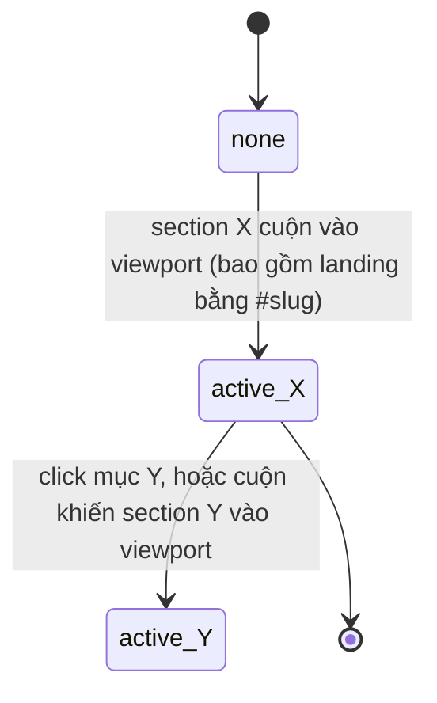

# Technical Spec — F012_AwardSystemPage

**Priority**: P1
**Type**: mixed
**Generated**: 2026-08-20

## Overview

Route `/awards` — điền nội dung thật vào placeholder đang tồn tại (`app/awards/page.tsx`), theo
frame MoMorph `zFYDgyj_pD`: header dùng chung, hero keyvisual thu nhỏ (không đếm ngược/CTA như
trang chủ), khối tiêu đề, một nav danh mục dính bên trái với 6 mục, 6 khối chi tiết giải thưởng
xen kẽ ảnh/nội dung, khối quảng bá Sun* Kudos dùng lại nguyên trạng, và footer. Đây là feature
đầu tiên trong 3 lượt gần nhất có tương tác hành vi thật cần strict E2E (`e2e-red-first`): click
một mục nav cuộn tới đúng section và đổi mục đang sáng; mục sáng cũng tự theo dõi khi người dùng
cuộn tay hoặc đi vào bằng `#<slug>` (scrollspy — quyết định trong `clarifications.md`). Không có
backend — toàn bộ dữ liệu 6 giải thưởng là hằng số mở rộng thêm trong `lib/awards.ts` (file đã tồn
tại, dùng chung với lưới giải thưởng trang chủ). Route bảo vệ vẫn hoãn (quyết định 2) — trang mở
công khai đúng như hiện nay.

## Polymorphic Behavior

N/A — no discriminator fields in Key Entities. Không entity nào ở `## Key Entities` bên dưới có
field kiểu enum ≥2 giá trị đặt tên riêng biệt ảnh hưởng hành vi/render khác nhau; số dòng giá trị
giải thưởng (1 hay 2 dòng) là khác biệt dữ liệu tĩnh giữa các bản ghi, không phải một field
discriminator điều khiển nhánh code. Mục nào đang được tô sáng là UI state (xem SM-001), không
phải discriminator dữ liệu.

## Cross-Cutting Logic

### Requirements

None. — mọi FR-### đặt dưới `**Requirements fulfilled:**` của đúng một US bên dưới (không FR nào
áp dụng ngang hàng cho ≥2 US).

### Business Rules

#### BR-001_ThuTuNavKhopThuTuAward
**Linked FR:** FR-006
**Applies to:** Nav danh mục bên trái (6 mục)
**Rule:** Thứ tự 6 mục nav luôn khớp đúng thứ tự mảng `AWARDS` trong `lib/awards.ts` — không có
danh sách thứ tự riêng cho nav, để tránh 2 nguồn dữ liệu lệch nhau (DRY).
**Nguồn:** TBD (draft) — chưa viết code; dự kiến `components/awards/award-category-nav.tsx` đọc
trực tiếp từ `lib/awards.ts`.

**Pseudocode:**
```text
navItems = AWARDS.map(a => ({ slug: a.slug, title: a.title }))
render navItems in order  # no separate ordering source
```

#### BR-002_ChiMotMucActiveTaiMotThoiDiem
**Linked FR:** FR-007, FR-008
**Applies to:** Trạng thái tô sáng của nav
**Rule:** Tại mọi thời điểm, tối đa một mục nav mang trạng thái active (vàng + gạch chân); mục cũ
luôn bị gỡ trạng thái trước hoặc cùng lúc mục mới được gán, dù nguồn kích hoạt là click, cuộn tay,
hay landing bằng `#<slug>`.
**Nguồn:** TBD (draft) — chưa viết code.

#### BR-003_KhongGhiLaiHashKhiCuon
**Linked FR:** FR-008
**Applies to:** URL của trang trong lúc cuộn
**Rule:** Việc cuộn (tự nhiên hay do click nav) không được ghi `#<slug>` mới vào URL/history —
tránh làm rác lịch sử trình duyệt và không phá vỡ hành vi auto-scroll-theo-hash sẵn có khi tải
trang (quyết định 3, `clarifications.md`).
**Nguồn:** TBD (draft) — chưa viết code.

#### BR-004_AnhGiaiThuongCoDinh336
**Linked FR:** FR-005
**Applies to:** Ảnh mỗi khối chi tiết giải thưởng
**Rule:** Ảnh giải thưởng luôn cố định 336×336, tái dùng đúng asset đã có ở lưới trang chủ
(`public/saa/Award_BG.png` dùng chung + wordmark riêng từng giải) — không tải/tạo asset mới.
**Nguồn:** `public/saa/Award_BG.png` (asset đã tồn tại, tái dùng nguyên trạng).

#### BR-005_ThuTuXenKeCoDinh
**Linked FR:** FR-005
**Applies to:** Bố cục 6 khối chi tiết giải thưởng
**Rule:** Vị trí ảnh/nội dung xen kẽ theo một trình tự cố định đọc từ frame — Top Talent, Top
Project Leader, Signature 2025 ảnh bên trái; Top Project, Best Manager, MVP ảnh bên phải — không
phải suy ra từ một field dữ liệu nào, mà là thứ tự trình bày cố định theo vị trí trong danh sách.
**Nguồn:** TBD (draft) — chưa viết code; dự kiến `components/awards/award-detail-card.tsx` nhận
`index` để quyết định phía ảnh.

**Pseudocode:**
```text
imageOnLeft = (index % 2 === 0)  # 0-based: Top Talent(0), Top Project Leader(2), Signature(4) trái
```

### Decision Logic

N/A — no user-facing decision logic beyond DISC-context above. Cú click một mục nav là ánh xạ
1-1 sang đúng section của nó (không có nhánh đa-predicate); việc mục nào đang sáng là một state
machine đơn giản (SM-001), không phải quyết định rẽ nhánh theo ≥2 điều kiện hay theo tương tác có
ý nghĩa nghiệp vụ riêng.

### State Machines

#### SM-001_MucNavDangSang
**kind:** ui
**Linked FR:** FR-007, FR-008
**Nguồn:** TBD (draft) — chưa viết code; dự kiến state cục bộ (hoặc derived từ `IntersectionObserver`)
trong `components/awards/award-category-nav.tsx` hoặc `award-detail-list.tsx`.
**States:** none, active(top-talent), active(top-project), active(top-project-leader),
active(best-manager), active(signature-2025-creator), active(mvp) — 7 trạng thái loại trừ lẫn nhau



**Transition rules:**
- `none → active_X`: guard = section X là section đầu tiên cắt ngưỡng viewport (mount, cuộn tay,
  hoặc deep-link `#slug` khi tải trang); side effect = tô mục X (vàng + gạch chân), không ghi hash
  (BR-003).
- `active_X → active_Y`: guard = click mục Y (cuộn mượt tới section Y) HOẶC cuộn tay khiến section
  Y trở thành section đang hiển thị chính; side effect = gỡ trạng thái X, gán trạng thái Y
  (BR-002) — cùng cơ chế bất kể nguồn kích hoạt là click hay cuộn tay.

### Algorithms

None.

### External Integrations

None — không gọi dịch vụ bên thứ ba nào; chỉ có `Link` nội bộ (`/kudos`) và cuộn trong-trang.

### Verification

- **SC-001** — `/awards` render đủ 8 khối theo đúng thứ tự tài liệu: header, hero, tiêu đề, nav,
  6 section giải thưởng, khối Kudos, footer, không lỗi console (covers FR-001)
- **SC-002** — 6 section hiển thị đúng nội dung frame-verbatim (tiêu đề, mô tả dài, số lượng, giá
  trị) (covers FR-004)
- **SC-003** — Click mục nav cuộn đúng section + đổi mục sáng + gỡ mục cũ; mục sáng cũng theo dõi
  cuộn tay/deep-link, hash không bị ghi lại (covers FR-006, FR-007, FR-008, BR-001, BR-002, BR-003,
  SM-001)
- **SC-004** — Hash không tồn tại (`#khong-ton-tai`) không gây lỗi console, không giật cuộn, và
  không có mục nav nào bị coi là active sai (covers FR-009)
- **SC-005** — CTA "Chi tiết" của khối Kudos điều hướng `/kudos` (covers FR-010, FR-011)

---

**Client behavior:** see
[`behavior-logic.md`](../../generated/behavior-logic.md) (client-side patterns —
scrollspy của trang này là polling/observer-driven UI state, chưa có pattern nào khác phát sinh),
[`permissions.md`](../../../../docs/vi/system/permissions.md) (route vẫn công khai — không thêm
gate nào ở lượt này),
[`screen-flow.md`](../../generated/screen-flow.md) (không có guard mới; deep-link
`#<slug>` là hành vi trình duyệt gốc, không phải state restoration tự viết).

## User Stories

### US001_XemNoiDungTrangGiaiThuong — Xem nội dung trang hệ thống giải thưởng (Priority: P1)

**What happens:** Người dùng (đã đăng nhập hoặc khách, vì route vẫn công khai) mở `/awards` và
thấy đầy đủ header (mục "Award Information" đang ở trạng thái chọn), hero thu nhỏ, khối tiêu đề,
và lần lượt 6 khối chi tiết giải thưởng với ảnh 336×336 + mô tả dài + số lượng + giá trị giải,
đúng nguyên văn frame.
**Why this priority:** Đây là toàn bộ nội dung lý do trang tồn tại — không hiển thị đúng thì nav
và Kudos phía dưới vô nghĩa.
**Independent Test:** Mở `/awards` trực tiếp, xác nhận đủ 6 khối giải thưởng đúng nội dung
`design/award-copy.md` và ảnh 336×336 mỗi khối.

**Acceptance Scenarios:**

1. **Given** người dùng mở `/awards` (đã đăng nhập hoặc khách), **When** trang tải xong, **Then**
   thấy header với "Award Information" mang trạng thái đang-chọn, hero, khối tiêu đề, và 6 section
   giải thưởng theo đúng thứ tự Top Talent → Top Project → Top Project Leader → Best Manager →
   Signature 2025 - Creator → MVP.
2. **Given** trang đã tải, **When** xem khối tiêu đề, **Then** thấy phụ đề mờ "Sun* Annual Awards
   2025" phía trên tiêu đề vàng "Hệ thống giải thưởng SAA 2025".
3. **Given** trang đã tải, **When** xem từng khối giải thưởng, **Then** ảnh 336×336, mô tả dài, số
   lượng (nhãn "Số lượng giải thưởng:" + giá trị + đơn vị), và giá trị giải (nhãn "Giá trị giải
   thưởng:" + số tiền + ghi chú nếu có) đều đúng nguyên văn từng giải.

**Requirements fulfilled:**
- **FR-001** Render `/awards` đủ 8 khối theo đúng thứ tự tài liệu — dự kiến sửa
  `app/awards/page.tsx` (hiện là placeholder, chưa viết phần còn lại)
- **FR-002** Header "Award Information" mang `aria-current="page"` + style đang-chọn khi ở
  `/awards` (thay vì "About SAA 2025" như trang chủ) — dự kiến sửa
  `components/layout/site-header.tsx` (đã tồn tại, logic active hiện đang hard-code cho `/`)
- **FR-003** Render khối tiêu đề 2 dòng (phụ đề mờ + tiêu đề vàng) — dự kiến tạo mới, khóa
  dictionary `awardsPage.*` trong `lib/i18n/dictionaries/vi.ts` + `en.ts` (2 file đã tồn tại)
- **FR-004** Render 6 section nội dung frame-verbatim (tiêu đề, mô tả dài, số lượng, giá trị) — dự
  kiến `components/awards/award-detail-card.tsx` (mới), dữ liệu mở rộng trong `lib/awards.ts` (đã
  tồn tại)
- **FR-005** Render ảnh 336×336 mỗi khối, xen kẽ trái/phải theo BR-005 — dự kiến
  `components/awards/award-detail-card.tsx` (mới)

**Rules enforced:** BR-004, BR-005.

**Verification:**
- **SC-001**, **SC-002** (covers FR-001, FR-002, FR-003, FR-004, FR-005, BR-004, BR-005)

---

### US002_DieuHuongQuaMucNavDanhMuc — Điều hướng qua nav danh mục bên trái (Priority: P1)

**What happens:** Người dùng thấy một nav dính (sticky) bên trái với đúng 6 mục theo thứ tự các
giải thưởng; click một mục cuộn mượt tới đúng section và tô sáng mục đó (gỡ mục cũ); mục sáng
cũng tự đổi theo khi người dùng cuộn tay qua các section, hoặc khi trang được mở bằng một
`#<slug>` cụ thể; hover một mục hiện hiệu ứng nổi bật; một hash không tồn tại không gây lỗi hay
giật cuộn.
**Why this priority:** Là cơ chế điều hướng chính trong nội bộ một trang dài ~6400px — không có
nó, người dùng phải cuộn tay toàn bộ để tìm một giải thưởng cụ thể.
**Independent Test:** Click từng mục trong 6 mục nav, xác nhận cuộn đúng section + tô sáng đúng
mục; sau đó cuộn tay thủ công qua các section, xác nhận mục sáng tự đổi theo mà không cần click.

**Acceptance Scenarios:**

1. **Given** trang đã tải, **When** xem nav bên trái, **Then** thấy đúng 6 mục theo thứ tự Top
   Talent, Top Project, Top Project Leader, Best Manager, Signature 2025 - Creator, MVP, mỗi mục
   có icon 24×24.
2. **Given** đang ở đầu trang, **When** click mục "Best Manager", **Then** trang cuộn mượt tới
   section Best Manager và mục đó chuyển vàng + có gạch chân, mục đang sáng trước đó (nếu có) mất
   trạng thái.
3. **Given** đã click qua vài mục, **When** người dùng tự cuộn tay (không click nav), **Then** mục
   đang sáng tự đổi theo section đang hiển thị chính trên màn hình — không cần click để đồng bộ
   lại.
4. **Given** người dùng mở thẳng `/awards#mvp` (deep link), **When** trang tải xong, **Then** mục
   "MVP" đã sáng sẵn mà không cần thao tác gì thêm.
5. **Given** người dùng hover một mục nav bất kỳ, **When** rê chuột qua, **Then** thấy hiệu ứng nổi
   bật (hover highlight) trên mục đó.
6. **Given** URL mang một hash không tồn tại trong 6 slug (ví dụ `#khong-ton-tai`), **When** trang
   tải, **Then** không có lỗi console, không có cuộn giật, và không mục nav nào bị tô sáng sai.

**Requirements fulfilled:**
- **FR-006** Render nav 6 mục đúng thứ tự `AWARDS` + hover highlight — dự kiến tạo mới
  `components/awards/award-category-nav.tsx`
- **FR-007** Click mục → cuộn mượt tới section + đổi mục active (gỡ mục cũ) — cùng file trên
- **FR-008** Mục active theo dõi cuộn tay/deep-link (scrollspy), không ghi lại hash — cùng file
  trên
- **FR-009** Hash không hợp lệ không gây lỗi/giật cuộn — cùng file trên (nav luôn render từ
  `AWARDS`, hash lạ đơn giản không khớp mục nào)

**Rules enforced:** BR-001, BR-002, BR-003.

**State transitions:** SM-001 (`none → active_X → active_Y → ...`)

**Verification:**
- **SC-003**, **SC-004** (covers FR-006, FR-007, FR-008, FR-009, BR-001, BR-002, BR-003, SM-001)

---

### US003_KhamPhaSunKudosTuTrangGiaiThuong — Khám phá Sun* Kudos từ trang giải thưởng (Priority: P2)

**What happens:** Người dùng cuộn hết 6 khối giải thưởng, gặp khối quảng bá Sun* Kudos giống hệt
trang chủ (nhãn, tiêu đề, nội dung, nút "Chi tiết"), click "Chi tiết" điều hướng sang `/kudos`.
**Why this priority:** Nội dung phụ trợ tái dùng nguyên component đã có — rủi ro thấp hơn nội dung
chính của trang, tương tự mức ưu tiên khối Kudos ở trang chủ.
**Independent Test:** Cuộn tới cuối trang, xác nhận khối Kudos hiện đủ nhãn/tiêu đề/nội dung/CTA,
click "Chi tiết" xác nhận điều hướng `/kudos`.

**Acceptance Scenarios:**

1. **Given** người dùng cuộn hết trang, **When** xem khối cuối trước footer, **Then** thấy nhãn
   "Phong trào ghi nhận", tiêu đề "Sun* Kudos", nội dung "ĐIỂM MỚI CỦA SAA 2025" + đoạn mô tả, và
   nút "Chi tiết".
2. **Given** khối Kudos hiển thị, **When** click "Chi tiết", **Then** điều hướng tới `/kudos`.

**Requirements fulfilled:**
- **FR-010** Render khối Kudos dùng lại `KudosSection` không đổi — không cần sửa
  `components/home/kudos-section.tsx` (đã tồn tại)
- **FR-011** CTA "Chi tiết" điều hướng `/kudos` — hành vi có sẵn của `KudosSection`, không có logic
  mới

**Verification:**
- **SC-005** (covers FR-010, FR-011)

---

### Edge Cases

See [edge-cases.md](edge-cases.md).

## Key Entities

Greenfield — không có bảng CSDL; toàn bộ dữ liệu là hằng số mở rộng trong `lib/awards.ts` (file đã
tồn tại, dùng chung với lưới giải thưởng trang chủ).

| Entity | Table | Key Columns | Purpose |
|--------|-------|-------------|---------|
| Award (mở rộng) | N/A (hằng số hard-code, `lib/awards.ts` — dự kiến sửa, thêm field) | slug, title, description (giữ nguyên cho trang chủ), longDescription, quantity (value + unit), prizeLines (1–2 dòng: amount + note tùy chọn) | Nguồn dữ liệu duy nhất cho cả lưới trang chủ (mô tả ngắn) và trang này (mô tả dài + số lượng + giá trị) |
| CategoryNavItem (dẫn xuất từ Award, không phải entity riêng) | N/A (derive render-time từ `AWARDS`, không lưu riêng) | slug, title | 6 mục nav bên trái, cùng thứ tự và cùng nguồn dữ liệu với các section (BR-001) |
| ActiveSectionState (UI, không persist) | N/A (state cục bộ hoặc derived từ observer, dự kiến trong `award-category-nav.tsx`/`award-detail-list.tsx`, chưa viết) | activeSlug (một trong 6 slug hoặc none) | Điều khiển mục nav nào đang tô sáng (SM-001) |

## Artifact References

| Artifact | File | Codes Used | Reviewed |
|----------|------|------------|----------|
| System Overview | [overview.md](../../../../docs/vi/system/overview.md) | — | [ ] |
| Architecture | [architecture.md](../../../../docs/vi/system/architecture.md) | — | [ ] |
| Feature List | [feature-list.md](../../generated/feature-list.md) | F012_AwardSystemPage | [x] |
| API Map | [api-map.md](../../generated/api-map.md) | N/A — không có route API mới (site tĩnh) | [ ] |
| Entities | [entities.md](../../generated/entities.md) | N/A — không có model mới | [x] |
| Screens | [screens.md](screens.md) | SCR002_Awards | [x] |
| Behavior Logic | [behavior-logic.md](../../generated/behavior-logic.md) | N/A — không có background job | [x] |
| Permissions Matrix | [permissions-matrix.md](../../generated/permissions-matrix.md) | N/A — route vẫn công khai, không thêm PERM### | [ ] |
| User Stories | (local, tài liệu này) | US001–US003 | [x] |

## Assumptions

- `lib/awards.ts` được mở rộng thêm field (không tách file/model mới) — `description` ngắn hiện có
  giữ nguyên cho lưới trang chủ; `longDescription`/`quantity`/`prizeLines` là field mới chỉ dùng ở
  trang này (DRY — một nguồn dữ liệu, hai cách hiển thị).
- Route bảo vệ vẫn hoãn (quyết định 2, `clarifications.md`) — `/awards` mở công khai y như hiện
  tại; ID-1 không được assert ở lượt này.
- Kỹ thuật scrollspy cụ thể (IntersectionObserver, scroll-listener có throttle, hay thư viện có
  sẵn) chưa chốt — chỉ hợp đồng hành vi (BR-002, BR-003, SM-001) là bắt buộc, lựa chọn kỹ thuật để
  lại cho lúc triển khai.
- Chỉ có frame desktop 1440×6410 — hành vi responsive (nav sticky trái → thanh ngang cuộn được
  dưới 1440px) là suy diễn, cùng dạng khiếm khuyết đã ghi nhận ở 2 lượt trước
  (`countdown-prelaunch`, `login-supabase-auth`).
- 6 asset ảnh giải thưởng (`Award_BG.png` + 6 wordmark) và artwork Kudos đã tồn tại trong
  `public/saa/` — không cần tải mới cho lượt này.

## Source Code References

Chưa có dòng code nào được viết thêm cho phần nội dung chính của feature này — file dưới đây phân
theo trạng thái thật.

Dự kiến tạo mới: `components/awards/awards-hero.tsx`, `components/awards/award-category-nav.tsx`,
`components/awards/award-detail-card.tsx`, `components/awards/award-detail-list.tsx`,
`e2e/awards-page.spec.ts`.

Dự kiến sửa: `app/awards/page.tsx` (hiện là placeholder — xem nội dung đã đọc bên dưới),
`lib/awards.ts` (mở rộng `Award` interface + dữ liệu, giữ nguyên `EXPECTED_AWARD_SLUGS` và
`awardHref()`), `lib/awards.test.ts` (thêm assertion cho field mới),
`components/layout/site-header.tsx` (chuyển `aria-current="page"` theo route thay vì hard-code
`/`), `lib/i18n/dictionaries/vi.ts` + `.../en.ts` (thêm khóa `awardsPage.*`, phải thêm đồng thời cả
2 file vì `DictionaryKey` suy ra từ `vi`).

Tái dùng nguyên trạng, không sửa: `components/home/kudos-section.tsx`,
`components/layout/site-footer.tsx`, `public/saa/Award_BG.png` + 6 wordmark, `public/saa/Kudos_*`.

## Unresolved Questions

1. **Kỹ thuật scrollspy cụ thể chưa chọn** — IntersectionObserver là lựa chọn phổ biến nhất cho
   hợp đồng hành vi này nhưng chưa được quyết định tường minh; để lại cho lúc triển khai.
2. **Route canonical `/he-thong-giai` vs `/awards`** — đã quyết định ship `/awards`
   (`clarifications.md`), nhưng URL dự định thật của design owner vẫn cần xác nhận cho hồ sơ.
3. **Route protection (ID-1) vẫn hoãn** — chưa có mốc thời gian cho lượt gate 5 route
   (`/`, `/awards`, `/kudos`, `/profile`, `/admin`) như `login-supabase-auth` đã ghi nhận.

## Source Walkthrough

Thứ tự đọc đề xuất khi triển khai — file đã tồn tại đọc trước để hiểu đúng hợp đồng cần giữ, rồi
tới file dự kiến viết mới:

1. **File:** `lib/awards.ts:1-74` — nguồn dữ liệu duy nhất cần mở rộng; đọc trước để không phá vỡ
   `EXPECTED_AWARD_SLUGS`/`awardHref()` mà lưới trang chủ đang phụ thuộc.
2. **File:** `app/awards/page.tsx:1-19` — placeholder hiện tại cần thay thế, đã có sẵn 6 section
   `id="<slug>"` — giữ nguyên id để 6 deep-link cũ không hỏng.
3. **File:** `components/layout/site-header.tsx:1-64` — nơi cần sửa `aria-current` theo route
   (FR-002), ảnh hưởng mọi trang nên đọc kỹ trước khi sửa.
4. **File:** `components/home/kudos-section.tsx:1-60` — component tái dùng nguyên trạng cho US003,
   đọc để biết đúng props/copy đã có, không viết lại.
5. **File:** `components/home/award-card.tsx:1-82` — tham khảo cách `awardHref`/ảnh đã dùng ở lưới
   trang chủ, để `award-detail-card.tsx` (mới) nhất quán về convention.

### Call Hierarchy

```text
app/awards/page.tsx (sửa)
  -> SiteHeader (components/layout/site-header.tsx, sửa aria-current)
  -> AwardsHero (mới, thu nhỏ, không đếm ngược)
  -> tiêu đề khối (mới, dictionary awardsPage.*)
  -> AwardCategoryNav (mới) <-> AwardDetailList (mới, 6x AwardDetailCard, mới)
       # SM-001 đồng bộ 2 chiều: click nav -> cuộn tới card; cuộn card -> đổi nav active
  -> KudosSection (components/home/kudos-section.tsx, tái dùng nguyên trạng)
  -> SiteFooter (components/layout/site-footer.tsx, tái dùng nguyên trạng)
```

**Related files:** xem `## Source Code References` ở trên (đã liệt kê theo trạng thái mới/sửa/tái
dùng — F15 DRY, một danh sách không phải hai).

## DB Impact per Event

N/A — read-only feature, no DB writes. Toàn bộ dữ liệu là hằng số client-side trong
`lib/awards.ts`; trạng thái mục nav đang sáng là UI state không persist (SM-001). Không có
API route hay bảng CSDL nào bị ghi ở feature này.
