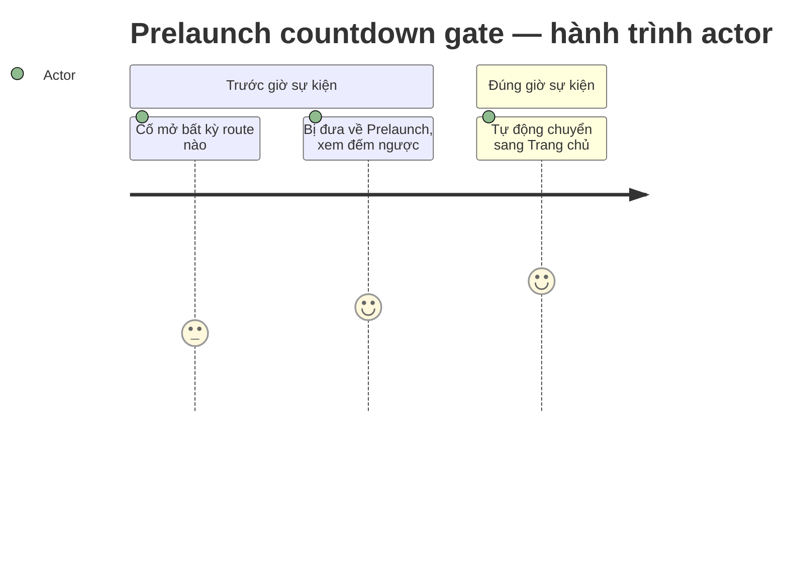

## Screen List

| Screen Name | SCR### | What User Sees | What User Can Do |
|-------------|--------|-----------------|-------------------|
| Prelaunch | `SCR006_Prelaunch` (`docs/vi/generated/screen-list.md`) | Toàn màn hình nền ảnh sự kiện (`public/saa/Prelaunch_BG.png`) + gradient overlay, tiêu đề "Sự kiện sẽ bắt đầu sau", và 3 ô DAYS/HOURS/MINUTES dạng số LED tự cập nhật mỗi giây — không có nút hay form nào | Không có thao tác nào ngoài chờ — đếm ngược tự chạy, và khi về 0 trang tự rời đi mà không cần bấm gì |

**Ghi chú promote**: mã tạm `SCR-Prelaunch (draft)` của bản nháp nay là `SCR006_Prelaunch`
thật, tiếp nối `SCR001`–`SCR005` đã có (`docs/vi/generated/screen-list.md`). Màn hình được
phân loại `atomic` — không có vùng (region) con nào, cùng lý do 5 màn hình cũ: không có
tín hiệu độc lập thật (API riêng, loading state riêng…) để tách REG###.

## User Journey

1. Actor mở bất kỳ URL nào của site trong lúc sự kiện chưa tới giờ và bị đưa ngay tới màn
   Prelaunch — không có route nào khác lộ ra trước (`proxy.ts` chặn ở tầng request, trước
   khi route đích kịp render).
2. Actor thấy Prelaunch với đếm ngược tự cập nhật mỗi giây; không có hành động nào để bỏ
   qua hay xem trước nội dung site.
3. Khi đếm ngược về 0, actor đang xem Prelaunch được tự động chuyển sang Trang chủ mà
   không cần thao tác gì; actor gõ URL khác sau mốc này vào thẳng route đó bình thường, vì
   gate đã mở.

