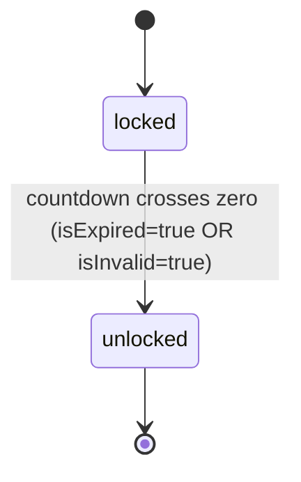

# Technical Spec — F010_PrelaunchCountdownGate

**Priority**: P0
**Type**: ui
**Generated**: 2026-08-19

## Overview

Cổng chặn điều hướng toàn ứng dụng cho tới thời điểm sự kiện SAA 2025 bắt đầu, hiện ra
dưới dạng route mới `/prelaunch` (`app/prelaunch/page.tsx`) — full-viewport, chỉ có nền
ảnh sự kiện + đếm ngược DAYS/HOURS/MINUTES. Áp dụng cho mọi actor (guest/user/admin không
phân biệt — đây là gate theo thời gian, không phải gate theo quyền): trong lúc đếm ngược
còn > 0, mọi route khác bị chặn ở `proxy.ts` và đưa về `/prelaunch`; khi về 0, chiều
ngược lại mở khóa và `/prelaunch` tự đưa actor về `/`. Dùng lại nguyên trạng hàm tính
`lib/countdown.ts` đã có (không đổi một dòng), chỉ thêm tick 1 giây (thay vì 60 giây của
trang chủ, `lib/prelaunch/use-prelaunch-countdown.ts`) vì gate cần mở khóa trong vòng 1
giây kể từ mốc 0 — không phải chờ tới 59 giây như tick cũ.

**Next 16 deprecated quy ước `middleware.ts`** — file thực thi thật của gate là
`proxy.ts` ở project root, không phải `middleware.ts` (xác nhận tại
`node_modules/next/dist/docs/01-app/03-api-reference/03-file-conventions/proxy.md`; bản
nháp trước khi implement dùng tên `middleware.ts` vì đó là tên quy ước tại thời điểm
viết spec — đã sửa ở đây theo đúng những gì được build).

## Polymorphic Behavior

N/A — no discriminator fields in Key Entities. Cả 3 entity ở `## Key Entities` bên dưới
đều không có field kiểu enum ≥2 giá trị đặt tên riêng biệt; trạng thái khóa/mở suy ra từ
một cờ boolean (`isExpired`/`isInvalid` của `CountdownResult`, đã có sẵn), nên xếp vào
Business Rules, không phải DISC.

## Cross-Cutting Logic

### Requirements

| Code | Description | Endpoint/Handler | Verifiable |
|------|-------------|------------------|------------|
| FR-002 | Cổng điều hướng phía server: khi gate còn khóa, mọi route khác `/prelaunch` bị chặn và đưa về `/prelaunch`; khi gate đã mở, chính `/prelaunch` bị đưa về `/` | `proxy.ts:16-28` (adapter) + `lib/prelaunch/gate.ts:26-44` (`resolveGateRedirect`, hàm thuần) | yes |
| FR-003 | Chuyển hướng phía client (`router.replace('/')`) trong tick mà `computeCountdown` lần đầu trả `isExpired: true` hoặc `isInvalid: true`, để actor đang xem `/prelaunch` không kẹt tới khi tự tải lại | `lib/prelaunch/use-prelaunch-countdown.ts:65-102` (`usePrelaunchCountdown`) | yes |

**Source:** FR-002 → `proxy.ts` (adapter đọc `NEXT_PUBLIC_EVENT_START_AT` + `pathname`,
gọi `resolveGateRedirect`, trả `NextResponse.redirect`/`NextResponse.next()`) và
`lib/prelaunch/gate.ts` (logic thuần, unit-test tại `lib/prelaunch/gate.test.ts`). FR-003 →
`lib/prelaunch/use-prelaunch-countdown.ts` (tick 1s + guard `hasRedirected` + throttle
`sessionStorage`, xem BR-010).

### Business Rules

#### BR-001_LamTronDemNguoc
**Áp dụng cho:** 3 ô DAYS/HOURS/MINUTES trên màn Prelaunch
**Quy tắc:** Mỗi giá trị luôn hiển thị đủ 2 chữ số (thêm số 0 phía trước khi < 10).
**Nguồn:** dùng lại nguyên trạng `pad2`/`computeCountdown` đã có sẵn (`lib/countdown.ts:20-22,50-59`,
đã có unit test) — không viết logic tính toán mới cho quy tắc này.

**Pseudocode:**
```text
render pad2(days), pad2(hours), pad2(minutes)
```

#### BR-002_TrangThaiZeroKhiVeMoc
**Áp dụng cho:** 3 ô đếm ngược khi thời điểm hiện tại >= thời điểm sự kiện
**Quy tắc:** Cả 3 ô hiển thị `00` khi đã tới hoặc qua giờ sự kiện.
**Nguồn:** cùng hành vi `zeroState`/`isExpired` đã có sẵn trong `lib/countdown.ts:24-26,46-48`
— tái dùng, không phải logic mới.

#### BR-003_FallbackKhiEnvKhongHopLe
**Áp dụng cho:** Toàn màn Prelaunch khi `NEXT_PUBLIC_EVENT_START_AT` rỗng/không parse được
**Quy tắc:** Không throw lỗi — coi như trạng thái zero-state (giống BR-002), tái dùng hành
vi có sẵn của `computeCountdown` (`lib/countdown.ts:36-43`).

#### BR-004_KhoaDieuHuongToanUngDung
**Áp dụng cho:** Mọi route ngoài `/prelaunch` trong toàn ứng dụng
**Quy tắc:** Khi gate còn khóa (đếm ngược chưa hết), bất kỳ request nào tới route khác
`/prelaunch` đều bị chặn và đưa về `/prelaunch` trước khi trang đó kịp render — không có
"flash" nội dung bị khóa.
**Nguồn:** `proxy.ts:16-28`, `lib/prelaunch/gate.ts:39-40` (`locked && pathname !==
'/prelaunch' → PRELAUNCH_PATH`). Rationale kiến trúc đầy đủ (vì sao ở `proxy.ts` chứ
không phải từng page) → [ADR-002](../../../decisions/ADR-002-prelaunch-launch-timing-gate.md).

#### BR-005_MoKhoaVaChuyenHuongVeHome
**Áp dụng cho:** Route `/prelaunch`, sau khi gate đã mở
**Quy tắc:** Một khi đếm ngược đã về 0 (không còn khóa), truy cập `/prelaunch` bị đưa về
`/` thay vì hiển thị lại màn đếm ngược.
**Nguồn:** `lib/prelaunch/gate.ts:43` (`!locked && pathname === PRELAUNCH_PATH →
HOME_PATH`).

#### BR-006_ChuyenHuongPhiaClientKhiDangXem
**Áp dụng cho:** Actor đang mở sẵn `/prelaunch` đúng lúc đếm ngược chạm mốc 0
**Quy tắc:** Ngoài cổng phía server (BR-004/BR-005, chỉ chặn ở lần request mới), màn
Prelaunch tự theo dõi tick và chuyển hướng actor sang `/` ngay trong tick đó — không cần
actor tải lại trang.
**Lý do bắt buộc cả hai:** chỉ có cổng phía server thì actor đang xem sẽ bị "kẹt" ở
`00 00 00` cho tới khi tự tải lại — đúng lúc trang này tồn tại để phục vụ.
**Nguồn:** `lib/prelaunch/use-prelaunch-countdown.ts:83-91`.

#### BR-007_TocDoCapNhat1Giay
**Áp dụng cho:** Riêng màn Prelaunch (không áp dụng cho đếm ngược trang chủ, vẫn giữ 60
giây)
**Quy tắc:** Tick mỗi 1 giây, không phải 60 giây như `components/home/countdown-timer.tsx`.
Lý do: phút phải lăn đúng ranh giới, và mở khóa điều hướng phải xảy ra trong vòng 1 giây
thay vì trễ tới 59 giây.
**Nguồn:** `lib/prelaunch/use-prelaunch-countdown.ts:25` (`TICK_MS = 1000`).

#### BR-008_HoursMinutesKhongTheVuotBien
**Áp dụng cho:** Giá trị giờ (00–23) và phút (00–59) hiển thị
**Quy tắc:** Giờ/phút không bao giờ vượt biên (`-1`, `25`, `60`, …) vì được suy ra bằng
phép chia lấy dư (`modulo`) từ một khoảng dương — các test case đòi hỏi input ngoài
khoảng đọc như thể viết cho một ô nhập tay, không áp dụng được cho một bộ đếm tính toán.
Đã ghi nhận trong `clarifications.md` mục "Design defects" #4; không cần logic clamp
riêng.
**Nguồn:** `lib/countdown.ts:50-52`.

#### BR-009_GioiHanHienThiSoNgay
**Áp dụng cho:** Ô DAYS trên màn Prelaunch
**Quy tắc:** Số ngày còn lại hiển thị tối đa `99` — giá trị thật do `computeCountdown` trả
về không bị chặn trần (`.env.example` mặc định ~122 ngày), nhưng frame chỉ vẽ đúng 2 ô số
nên bất kỳ giá trị nào >99 đều hiển thị cố định `"99"` thay vì số ngày thật.
**Ghi chú:** trước khi có rule này, `CountdownUnit` destructure 2 ký tự đầu của chuỗi
(`const [tens, ones] = "122"`) khiến `"122"` hiển thị thành `"12"` — sai lệch 110 ngày mà
không có dấu hiệu nào cảnh báo. `capDisplayDays()` chặn giá trị tại nguồn (trong
`usePrelaunchCountdown`, trước khi tới UI), và `CountdownUnit` nay map một box cho mỗi ký
tự thay vì destructure — nếu ràng buộc "đúng 2 ký tự" từng bị phá vỡ lần nữa, chữ số thừa
sẽ hiện thành một box thứ ba nhìn thấy được thay vì biến mất âm thầm.
**Nguồn:** `lib/prelaunch/display.ts` (`capDisplayDays`, `MAX_DISPLAY_DAYS = 99`), gọi tại
`lib/prelaunch/use-prelaunch-countdown.ts:78`; `components/prelaunch/countdown-unit.tsx:22`
(`value.split('')`, map theo ký tự).

#### BR-010_GioiHanSoLanThuMoKhoaPhiaClient
**Áp dụng cho:** Việc gọi `router.replace('/')` phía client khi đếm ngược chạm 0
**Quy tắc:** Chỉ được thử redirect tối đa 1 lần mỗi 30 giây, ghi nhận qua
`sessionStorage`, không phải một lần duy nhất cho cả vòng đời trang.
**Lý do**: nếu đồng hồ máy actor chạy nhanh hơn server, `router.replace('/')` sẽ bị
`proxy.ts` bounce về lại `/prelaunch` (server chưa đồng ý gate đã mở) — component
remount, và một guard chỉ scope trong một lần mount (`useRef`) sẽ reset rồi bắn lại ngay
lập tức, gây nhấp nháy `/` ↔ `/prelaunch` liên tục suốt thời gian lệch đồng hồ. Throttle
qua `sessionStorage` (sống sót qua remount) giảm việc này xuống tối đa 1 lần/30 giây thay
vì mỗi giây. Không chọn one-shot (chỉ 1 lần cho cả phiên) vì điều đó sẽ kẹt actor ở
`00:00:00` nếu lần thử đầu tiên bị bounce.
**Giới hạn đã biết:** không loại bỏ hoàn toàn nhấp nháy khi độ lệch đồng hồ lớn — xem
[ADR-002](../../../decisions/ADR-002-prelaunch-launch-timing-gate.md) và
`plans/reports/reviewer-260819-1040-prelaunch.md` mục High #1.
**Nguồn:** `lib/prelaunch/use-prelaunch-countdown.ts:37-63` (`claimUnlockAttempt`,
`UNLOCK_RETRY_MS = 30_000`).

### Decision Logic

**Subtypes:** flow

---

#### DEC-001_DieuHuongTheoTrangThaiCong
**subtype:** flow
**Triggers in:** mọi route của ứng dụng, tại thời điểm request tới `proxy.ts` — không
riêng một SCR nào vì đây là gate toàn ứng dụng
**Involved entities:** `CountdownResult.isExpired`, `CountdownResult.isInvalid`, đường dẫn
request hiện tại (`pathname`)
**user_visible_outcome:** quyết định actor có được xem route họ vừa gõ/click hay bị đưa
thẳng về `/prelaunch` (hoặc ngược lại, về `/`)
**Source:** `proxy.ts:16-28`, `lib/prelaunch/gate.ts:26-44` (`resolveGateRedirect`)

```pseudo
locked = !countdown.isExpired AND !countdown.isInvalid
if locked AND pathname !== '/prelaunch':
  redirect to '/prelaunch'
else if NOT locked AND pathname === '/prelaunch':
  redirect to '/'
else:
  pass through unchanged
```

(Không có DEC-### thứ hai — mọi rẽ nhánh khác của feature này đã nằm trong khối trên hoặc
là BR-006 phía client, vốn chỉ là cùng một điều kiện `locked` áp dụng lại trên client.)

### State Machines

#### SM-001_TrangThaiCong
**kind:** ui
**States:** locked, unlocked



**Transition rules:**
- `locked → unlocked`: một chiều, không có đường quay lại (thời gian không chạy ngược).
  Guard = `countdown.isExpired OR countdown.isInvalid`; side effect = mọi route mở ra bình
  thường, `/prelaunch` tự chuyển sang `/`.
- Không có state thứ 3 — không có "tạm khóa"/"bảo trì" nào khác được đặc tả.

### Algorithms

None ở tầng gate/countdown — phép tính đếm ngược tái dùng nguyên trạng
(`lib/countdown.ts`). `capDisplayDays()` (BR-009, `lib/prelaunch/display.ts`) là một hàm
thuần một dòng điều kiện, không đủ phức tạp để cần một khối ALG riêng.

### External Integrations

None.

### Verification

- **SC-001** — Mọi route ngoài `/prelaunch` trả về nội dung `/prelaunch` (qua redirect)
  trong lúc đếm ngược còn > 0 (covers FR-002, BR-004) — `lib/prelaunch/gate.test.ts` mục
  "locked (countdown still running)"
- **SC-002** — `/prelaunch` tự chuyển sang `/` trong vòng 1 giây kể từ mốc đếm ngược về 0,
  kể cả khi actor đang mở sẵn trang (covers BR-005, BR-006, BR-007) —
  `e2e/prelaunch-countdown-unlock.spec.ts`, `e2e/prelaunch-countdown-unlocked.spec.ts`
- **SC-003** — Digit box hiển thị đúng giá trị design values (`clarifications.md` §
  Extracted design values), zero-padded, capped ở 99 ngày (covers FR-001, BR-001, BR-009)
  — `e2e/prelaunch-countdown-gui.spec.ts`
- **SC-004** — Biến môi trường không hợp lệ không khóa site (fail-open), không throw
  (covers BR-003, DEC-001) — `lib/prelaunch/gate.test.ts` mục "fail-open on invalid
  config"

---

**Client behavior:** see
[`architecture.md`](../../system/architecture.md) § Request-Interception Layer (Prelaunch
Gate), [`clarifications.md`](../../../../plans/260819-0913-countdown-prelaunch/clarifications.md)
(design values, resolved decisions), [`ADR-002`](../../../decisions/ADR-002-prelaunch-launch-timing-gate.md)
(rationale kiến trúc đầy đủ) — chưa có `behavior-logic.md`/`permissions.md` entry riêng
cho feature này ngoài mục ghi chú đã thêm vào 2 tài liệu generated đó (xem Artifact
References bên dưới).

## User Stories

### US017_XemManHinhDemNguoc — Xem màn hình đếm ngược khi trang bị khóa (Priority: P0)

**What happens:** Actor cố truy cập site trước giờ sự kiện, bị đưa tới `/prelaunch` và
thấy nền ảnh sự kiện + tiêu đề "Sự kiện sẽ bắt đầu sau" + 3 ô DAYS/HOURS/MINUTES tự cập
nhật mỗi giây, zero-padded 2 chữ số (tối đa 99 với DAYS).
**Why this priority:** Đây là màn hình duy nhất actor thấy được trong suốt thời gian
trước sự kiện — không có nó, gate chỉ là một trang trắng.
**Independent Test:** Mở `/prelaunch` trực tiếp với `NEXT_PUBLIC_EVENT_START_AT` ở tương
lai; xác nhận cả 3 ô hiển thị giá trị 2 chữ số và tự giảm sau 1 giây.

**Acceptance Scenarios:**

1. **Given** đếm ngược còn 5 ngày 3 giờ 9 phút, **When** actor mở `/prelaunch`, **Then**
   3 ô hiện `05`, `03`, `09`.
2. **Given** actor đang xem `/prelaunch`, **When** 1 giây trôi qua và phút chưa lăn,
   **Then** ô phút không đổi cho tới đúng ranh giới phút kế tiếp.
3. **Given** đếm ngược còn hơn 99 ngày, **When** actor mở `/prelaunch`, **Then** ô DAYS
   hiện `99` (BR-009).

**Requirements fulfilled:**
- **FR-001** Render `/prelaunch` full-viewport: nền ảnh sự kiện + overlay gradient +
  tiêu đề + 3 ô đếm ngược, giá trị lấy từ `NEXT_PUBLIC_EVENT_START_AT` qua hàm tính có
  sẵn.
  **Source:** `app/prelaunch/page.tsx`, `components/prelaunch/prelaunch-countdown.tsx`

**Rules enforced:** BR-001, BR-002, BR-003, BR-007, BR-008, BR-009

**Verification:**
- **SC-003** (covers FR-001, BR-001, BR-009)

---

### US018_ChanDieuHuongKhiConDemNguoc — Bị chặn điều hướng trong lúc đếm ngược còn > 0 (Priority: P0)

**What happens:** Actor gõ thẳng URL hoặc click liên kết bất kỳ (`/`, `/awards`, `/kudos`,
`/profile`, `/admin`) trong lúc gate còn khóa; request bị chặn và actor thấy `/prelaunch`
thay vì route họ nhắm tới, không có khoảnh khắc nào nội dung route kia lộ ra.
**Why this priority:** Đây chính là điều khoản "khóa toàn bộ điều hướng" — không có nó,
`/prelaunch` chỉ là một trang phụ, không phải một gate thật.
**Independent Test:** Với env đặt tương lai, gọi trực tiếp `/awards` (không qua UI) và
xác nhận response cuối cùng là nội dung `/prelaunch`, không phải `/awards`.

**Acceptance Scenarios:**

1. **Given** đếm ngược còn > 0, **When** actor mở `/awards`, **Then** actor thấy
   `/prelaunch`.
2. **Given** đếm ngược còn > 0, **When** actor mở `/prelaunch` trực tiếp, **Then** actor
   thấy đúng `/prelaunch` (không bị redirect vòng lặp).

**Requirements fulfilled:** FR-002 (see Cross-Cutting Logic)

**Rules enforced:** BR-004 (nguồn), DEC-001 (cơ chế rẽ nhánh)

**Verification:**
- **SC-001** — Gọi lần lượt cả 5 route không phải `/prelaunch` trong lúc còn khóa, tất cả
  đều kết thúc tại `/prelaunch` (covers FR-002, BR-004)

---

### US019_TuDongMoKhoaKhiVeMoc — Tự động mở khóa và điều hướng khi đếm ngược về 0 (Priority: P0)

**What happens:** Ngay khi đếm ngược chạm mốc 0 (hoặc env không hợp lệ), gate mở: request
mới tới bất kỳ route nào đi thẳng tới đích, còn `/prelaunch` tự đưa về `/`; đồng thời
actor đang mở sẵn `/prelaunch` được đưa về `/` ngay trong tick đó mà không cần tải lại
(trừ khi vừa bị throttle bởi BR-010, tối đa chờ thêm 30 giây nếu đồng hồ máy lệch server).
**Why this priority:** Không có nhánh mở khóa, actor xem trước sự kiện sẽ kẹt vĩnh viễn ở
`/prelaunch` — hỏng chính mục đích của trang.
**Independent Test:** Dùng Playwright Clock API đẩy thời gian qua mốc sự kiện trong khi
actor đang mở sẵn `/prelaunch`; xác nhận actor được đưa về `/` mà không cần `reload()`.

**Acceptance Scenarios:**

1. **Given** actor đang mở `/prelaunch`, **When** đồng hồ chạm mốc sự kiện, **Then**
   actor được đưa về `/` trong vòng 1 giây, không cần thao tác gì.
2. **Given** đếm ngược đã về 0, **When** actor mở `/prelaunch` (request mới), **Then**
   actor được đưa thẳng về `/`.

**Requirements fulfilled:**
- **FR-003** Chuyển hướng phía client (`router.replace('/')`) trong tick mà
  `computeCountdown` lần đầu trả `isExpired: true` (hoặc `isInvalid: true`)
  **Source:** `lib/prelaunch/use-prelaunch-countdown.ts:65-102`

**Rules enforced:** BR-005 (nguồn), BR-006 (client redirect), BR-010 (throttle), DEC-001

**State transitions:** SM-001 (`locked → unlocked`)

**Verification:**
- **SC-002** (see Cross-Cutting Logic)

---

### Edge Cases

See [edge-cases.md](edge-cases.md).

## Key Entities

Greenfield — không có bảng CSDL thật (site tĩnh, không backend, kế thừa từ kiến trúc hiện
có).

| Entity | Table | Key Columns | Purpose |
|--------|-------|-------------|---------|
| CountdownResult (non-entity, computed, tái dùng) | N/A (`lib/countdown.ts`, không đổi) | days, hours, minutes, isExpired, isInvalid | Nguồn số liệu duy nhất cho cả hiển thị đếm ngược lẫn quyết định khóa/mở gate |
| NavigationGateState (non-entity, derived) | N/A (không lưu trữ — tính lại mỗi request từ `CountdownResult.isExpired`/`isInvalid`, xem DEC-001) | locked (boolean, suy ra) | Cơ sở để `proxy.ts` quyết định redirect |
| EventStartAt (config value, tái dùng) | N/A (biến môi trường build-time `.env.example`, không phải bảng CSDL) | `NEXT_PUBLIC_EVENT_START_AT` (chuỗi ISO-8601) | Nguồn target instant duy nhất, dùng chung với đếm ngược trang chủ (không được phép lệch nhau) |

## Artifact References

| Artifact | File | Codes Used | Reviewed |
|----------|------|------------|----------|
| System Overview | [overview.md](../../system/overview.md) | — | [x] |
| Architecture | [architecture.md](../../system/architecture.md) | — | [x] |
| Feature List | [feature-list.md](../../generated/feature-list.md) | F010 | [x] |
| API Map | [api-map.md](../../generated/api-map.md) | N/A — 0 API route | [x] |
| Entities | [entities.md](../../generated/entities.md) | N/A — không có model mới | [x] |
| Screens | [screens.md](screens.md) | SCR006_Prelaunch | [x] |
| Screen Flow | [screen-flow.md](../../generated/screen-flow.md) | SCR006_Prelaunch, Guard Logic | [x] |
| Behavior Logic | [behavior-logic.md](../../generated/behavior-logic.md) | BL001_PrelaunchLaunchGate | [x] |
| Permissions Matrix | [permissions-matrix.md](../../generated/permissions-matrix.md) | N/A — công khai cho mọi actor, gate theo thời gian không phải theo quyền | [x] |
| User Stories | (local, tài liệu này) | US017–US019 | [x] |
| ADR | [ADR-002](../../../decisions/ADR-002-prelaunch-launch-timing-gate.md) | — | [x] |

## Assumptions

- `lib/countdown.ts` tái dùng nguyên trạng, không sửa — cả hiển thị đếm ngược lẫn quyết
  định khóa/mở gate đều đọc cùng một `CountdownResult` để trang chủ và Prelaunch không bao
  giờ lệch giá trị nhau.
- Gate suy ra "khóa" từ đúng 2 cờ đã có sẵn (`isExpired`, `isInvalid`) — không cần thêm
  state hay cấu hình mới nào để biết lúc nào mở khóa.
- `proxy.ts` loại trừ tài nguyên tĩnh nội bộ của Next.js (`_next/static`, `_next/image`,
  favicon) và mọi path có dấu chấm (`.*\..*`) khỏi việc redirect — nếu không, chính
  `/prelaunch` cũng vỡ vì CSS/JS/ảnh/font của nó bị chặn theo.
- Tick 1 giây chỉ áp dụng cho `/prelaunch`; đếm ngược trang chủ giữ nguyên 60 giây — hai
  nơi đọc cùng một `CountdownResult` nên không lệch giá trị, chỉ lệch độ trễ hiển thị.

## Source Code References

Code đã hoàn tất và tồn tại trên branch `feat/countdown-prelaunch`:

- `proxy.ts` — điểm vào request-interception layer (Next 16 rename của `middleware.ts`)
- `lib/prelaunch/gate.ts`, `lib/prelaunch/gate.test.ts` — logic thuần quyết định
  redirect + unit test
- `lib/prelaunch/display.ts`, `lib/prelaunch/display.test.ts` — `capDisplayDays` (BR-009)
- `lib/prelaunch/use-prelaunch-countdown.ts` — hook tick 1s + unlock phía client (BR-006,
  BR-010)
- `app/prelaunch/page.tsx` — điểm vào route `/prelaunch`
- `components/prelaunch/prelaunch-countdown.tsx`, `components/prelaunch/countdown-unit.tsx`,
  `components/prelaunch/digit-box.tsx` — UI trình bày
- `app/globals.css` — `@font-face` "Digital Numbers" (file font chưa có, fallback
  monospace)
- `.env.example` — ghi chú `NEXT_PUBLIC_EVENT_START_AT` nay cũng lái cả gate, không chỉ
  đếm ngược trang chủ
- `e2e/prelaunch-countdown-gui.spec.ts`, `e2e/prelaunch-countdown-unlock.spec.ts`,
  `e2e/prelaunch-countdown-unlocked.spec.ts` — E2E

## Source Walkthrough

1. **File:** `lib/prelaunch/gate.ts` — logic thuần DEC-001, chia sẻ `computeCountdown`
   với đếm ngược hiển thị.
2. **File:** `proxy.ts` — adapter mỏng gọi `resolveGateRedirect`, biến kết quả thành
   `NextResponse`.
3. **File:** `lib/prelaunch/use-prelaunch-countdown.ts` — nửa client của gate (BR-006,
   BR-010) + nguồn hiển thị (BR-001/002/003/009).
4. **File:** `app/prelaunch/page.tsx` + `components/prelaunch/*` — UI trình bày, tiêu
   thụ `usePrelaunchCountdown()`.

### Call Hierarchy

```text
proxy.ts (mọi request)
  -> resolveGateRedirect() (lib/prelaunch/gate.ts)
    -> computeCountdown() (lib/countdown.ts, tái dùng)

app/prelaunch/page.tsx
  -> PrelaunchCountdown (components/prelaunch/prelaunch-countdown.tsx)
    -> usePrelaunchCountdown() (lib/prelaunch/use-prelaunch-countdown.ts)
      -> computeCountdown() (lib/countdown.ts, tái dùng)
      -> capDisplayDays() (lib/prelaunch/display.ts)
    -> CountdownUnit x3 (components/prelaunch/countdown-unit.tsx)
      -> DigitBox (components/prelaunch/digit-box.tsx)
```

## DB Impact per Event

N/A — read-only feature, no DB writes. Toàn bộ state (đếm ngược, quyết định gate) là
server-side stateless (tính lại mỗi request từ env + đồng hồ) hoặc client-side
(`sessionStorage` cho throttle BR-010) — không có backend/CSDL nào được ghi.

## Unresolved Questions

1. **Font "Digital Numbers"** cho digit glyph vẫn chưa được cung cấp — `app/globals.css`
   đã có `@font-face` trỏ `public/fonts/digital-numbers.woff2`, digit hiện fallback sang
   monospace cho tới khi file được bổ sung (swap tự động, không cần đổi code).
2. **Responsive dưới 1512px là suy diễn**, không phải được đặc tả — scale tuyến tính qua
   `clamp()` xuống floor ~375px, xác nhận không tràn ở 3 độ rộng đã capture
   (`plans/260819-0913-countdown-prelaunch/design/prelaunch-{375,768,1512}px.png`), nhưng
   chưa được design owner xác nhận tường minh.
3. **Nhấp nháy điều hướng khi đồng hồ máy actor lệch server đáng kể** (BR-010) — throttle
   giảm tần suất, không loại bỏ hoàn toàn; ghi nhận là trade-off có chủ đích, xem
   [ADR-002](../../../decisions/ADR-002-prelaunch-launch-timing-gate.md).
4. **Xem trước cho đội vận hành / đổi giờ sự kiện không cần redeploy** — vẫn ngoài phạm
   vi, xem [business-context.md](business-context.md) § Unresolved Questions.
