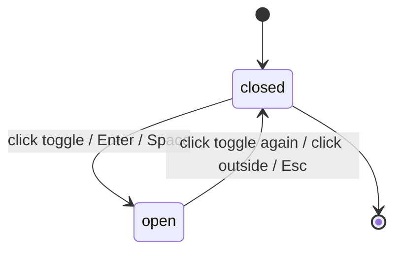

# Trang chủ SAA 2025 (SCR001_Home)

**Priority**: P0–P3 (xem bảng feature con)
**Type**: ui
**Generated**: 2026-08-18

## Overview

Trang chủ công khai SAA 2025 tại route `/` (`app/page.tsx`). Khách truy cập (chưa đăng nhập) hoặc người dùng đã đăng nhập (role `user`/`admin`) xem hero "ROOT FURTHER" kèm đếm ngược sự kiện, đọc nội dung chủ đề Root Further, lướt lưới 6 hạng mục giải thưởng, và điều hướng sang `/awards` hoặc `/kudos`. Không có backend thật — phiên đăng nhập là mock client-side (`lib/session/session-provider.tsx`), dữ liệu đếm ngược lấy từ biến môi trường `NEXT_PUBLIC_EVENT_START_AT`, và toàn bộ nội dung là tĩnh (không gọi API). Test policy đã áp dụng: `e2e-red-first` — 38 test E2E (`e2e/homepage-*.spec.ts`, 7 file) + 16 unit test (`lib/awards.test.ts`, `lib/countdown.test.ts`) đều xanh; `tsc`/`lint`/`build` sạch.

**Ghi chú mapping feature**: bản nháp ban đầu gom toàn bộ màn hình vào một feature tạm `F000_HomepageSaa`. Khi promote, `feature-list.md` đã tách thành 9 feature thật theo intent — `F001_EventOverview`, `F002_EventCountdown`, `F003_AwardDiscovery`, `F004_KudosPromotion`, `F005_LanguageSwitching`, `F006_QuickActionWidget`, `F007_AccountMenuAccess`, `F008_NotificationPanelAccess`, `F009_ReturnToHomeTop` — tất cả cùng thuộc màn hình `SCR001_Home`. Tài liệu này giữ nguyên cấu trúc kỹ thuật gộp (behavior/BR/SM/ALG dùng chung nhiều feature), và chú thích F### cụ thể ở từng User Story bên dưới.

## Polymorphic Behavior

### DISC-001 — SessionContext.role

| Value | Render | Validation | Persistence |
|-------|--------|------------|-------------|
| `guest` | Ẩn chuông thông báo và menu tài khoản; chỉ hiện nút ngôn ngữ + logo/nav công khai | Không có hành động nào bị chặn (nội dung công khai luôn xem được) | Không có state được lưu — session mặc định `guest` trước khi client mount xong |
| `user` | Hiện chuông thông báo (kèm badge nếu có unread) + menu tài khoản với "Profile" và "Sign out" | Menu tài khoản không hiện "Admin Dashboard" | Session field `role` giữ nguyên trong suốt phiên trình duyệt (đọc từ `localStorage`, mock — không có đăng nhập thật) |
| `admin` | Giống `user`, cộng thêm mục "Admin Dashboard" trong menu tài khoản | Route `/admin` (`app/admin/page.tsx`) KHÔNG có guard thật — chỉ MỤC MENU bị ẩn, gõ thẳng URL vẫn vào được với mọi role | Giống `user` |

**Source:** `lib/session/session-provider.tsx:14` (kiểu `SessionRole`), `lib/session/session-provider.tsx:39-58` (`resolveSession` — thứ tự ưu tiên `localStorage` → `NEXT_PUBLIC_MOCK_ROLE` → mặc định `guest`), `lib/session/session-provider.tsx:62-77` (`SessionProvider`, reconcile sau mount để tránh hydration mismatch). Enforcement điểm hiển thị: `components/ui/account-menu.tsx:16` (ẩn toàn bộ khi `guest`), `components/ui/account-menu.tsx:51-59` (mục Admin chỉ khi `admin`), `components/ui/notification-bell.tsx:16` (ẩn chuông khi `guest`). Cảnh báo bảo mật tường minh ngay trong source: `lib/session/session-provider.tsx:3-10` — đây không phải authorization boundary.

### Edge Cases

| Variant | Behavior |
|---------|----------|
| `role` chưa hydrate (SSR/first paint) | Coi như `guest` cho đến khi client component mount xong — `lib/session/session-provider.tsx:65` khởi tạo `useState(DEFAULT_SESSION)` (`{ role: 'guest', unreadCount: 0 }`), chỉ `resolveSession()` thật ở dòng 73 bên trong `useEffect` |

## Cross-Cutting Logic

### Requirements

| Code | Description | Endpoint/Handler | Verifiable |
|------|-------------|------------------|------------|
| FR-001 | Dropdown/menu primitive dùng chung: click để mở, click lại để đóng, click ra ngoài để đóng, Enter/Space để mở, Esc để đóng. Áp dụng cho ngôn ngữ, menu tài khoản, panel thông báo, menu widget | Client component `components/ui/dropdown-menu.tsx` | yes |
| FR-002 | Cơ chế chuyển ngôn ngữ VN/EN bằng 2 từ điển tĩnh (`vi`, `en`), lựa chọn lưu vào `localStorage`, áp dụng lại toàn bộ copy trang | Client provider `lib/i18n/locale-provider.tsx` | yes |
| FR-003 | Session mock client-side phân giải role `guest \| user \| admin` từ `localStorage`/env, không có backend auth thật | Client provider `lib/session/session-provider.tsx` | yes |

**Source:** FR-001 → `components/ui/dropdown-menu.tsx:41-115` (toggle mở/đóng dòng 52-53, click-outside dòng 58-62, Esc + refocus dòng 64-71, Enter/Space dòng 81-86, `role="menu"` dòng 102-112). FR-002 → `lib/i18n/locale-provider.tsx:47-75` (`LocaleProvider`, persist `localStorage` dòng 63-66). FR-003 → `lib/session/session-provider.tsx:62-77`.

### Business Rules

#### BR-001_LamTronDemNguoc
**Linked FR:** FR-006
**Source:** `lib/countdown.ts:20-22` (`pad2`), dùng ở `lib/countdown.ts:54-57` (`computeCountdown`)
**Applies to:** Countdown timer (3 ô DAYS/HOURS/MINUTES)
**Rule:** Mỗi giá trị luôn hiển thị 2 chữ số (thêm số 0 phía trước khi < 10), cập nhật mỗi phút.

**Pseudocode:**
```text
days = floor(diffMs / 86400000)
hours = floor((diffMs % 86400000) / 3600000)
minutes = floor((diffMs % 3600000) / 60000)
render pad2(days), pad2(hours), pad2(minutes)
```

#### BR-002_TrangThaiZeroKhiHetHan
**Linked FR:** FR-007
**Source:** `lib/countdown.ts:24-26` (`zeroState`), `lib/countdown.ts:46-48` (kiểm tra `diffMs <= 0`); consumer: `components/home/countdown-timer.tsx:39` (`showComingSoon = !mounted || (!result.isExpired && !result.isInvalid)`)
**Applies to:** Countdown timer + nhãn "Coming soon"
**Rule:** Khi thời điểm hiện tại >= `NEXT_PUBLIC_EVENT_START_AT`, cả 3 ô hiển thị `00`, và nhãn "Coming soon" bị ẩn.

**Pseudocode:**
```text
if now >= eventStartAt:
  days = hours = minutes = "00"
  showComingSoon = false
else:
  showComingSoon = true
```

#### BR-003_FallbackKhiEnvKhongHopLe
**Linked FR:** FR-008
**Source:** `lib/countdown.ts:36-43` (`targetIso` rỗng hoặc `Date.parse` trả `NaN` → `zeroState(false, true)`, không throw)
**Applies to:** Countdown timer khi biến môi trường không hợp lệ
**Rule:** Nếu `NEXT_PUBLIC_EVENT_START_AT` rỗng/không parse được thành ngày hợp lệ, hệ thống hiển thị trạng thái zero-state (như đã hết hạn) mà không throw lỗi hay crash trang.

**Pseudocode:**
```text
parsed = tryParseISO(envValue)
if parsed is invalid:
  treat as BR-002 zero-state (no throw)
```

#### BR-004_LuoiGiaiThuongResponsive
**Linked FR:** FR-012
**Source:** `components/home/awards-section.tsx:21` (`grid grid-cols-2 ... lg:grid-cols-3` — 2 cột là mặc định, áp dụng tablet lẫn mobile; 3 cột chỉ từ breakpoint `lg`)
**Applies to:** Lưới 6 thẻ giải thưởng
**Rule:** Desktop hiển thị 3 cột, tablet 2 cột, mobile 2 cột (nguồn: frame + TC ID-16 thắng; dòng CSV tiếng Anh "3/2/1" là bản dịch lỗi thời, không áp dụng — xem `plans/260818-0936-homepage-saa/reports/design-defects-260818-homepage-saa.md` mục B2).

**Pseudocode:**
```text
columns = viewport >= desktopBreakpoint ? 3
        : 2  # tablet and mobile both 2
```

#### BR-005_DieuHuongKhiThieuSlug
**Linked FR:** FR-013
**Source:** `lib/awards.ts:138-143` (`awardHref` — trả `/awards` khi `slug` falsy, `/awards#${slug}` khi có)
**Applies to:** Điều hướng thẻ giải thưởng
**Rule:** Nếu thẻ giải thưởng không có slug hợp lệ, điều hướng đến `/awards` không kèm hash và không tự cuộn.
**Ghi chú promote:** cả 6 phần tử trong `AWARDS` (`lib/awards.ts:59-131`) đều có slug hợp lệ — nhánh fallback này **không thể trigger được từ UI thật** trong bản build hiện tại; coverage thật nằm ở unit test `lib/awards.test.ts:107-108` (`awardHref(undefined)` / `awardHref('')`). Không phải lỗi — chỉ là nhánh phòng thủ chưa có dữ liệu nào kích hoạt nó qua trình duyệt.

**Pseudocode:**
```text
if card.slug:
  navigate(`/awards#${card.slug}`)
else:
  navigate(`/awards`)  # no scroll
```

#### BR-006_ChiVNvaEN
**Linked FR:** FR-002
**Source:** `components/ui/language-switcher.tsx:14-17` (mảng `options` hard-code đúng 2 phần tử `vi`/`en`)
**Applies to:** Menu chọn ngôn ngữ
**Rule:** Chỉ có đúng 2 lựa chọn VN và EN, không thêm ngôn ngữ khác cho đến khi có yêu cầu mở rộng (YAGNI — xem clarifications).

#### BR-007_AnBellVaAccountChoKhach
**Linked FR:** FR-003
**Source:** `components/ui/notification-bell.tsx:16` (`if (role === 'guest') return null;`), `components/ui/account-menu.tsx:16` (cùng pattern)
**Applies to:** Header — chuông thông báo + menu tài khoản
**Rule:** Khách (`role: guest`) không thấy chuông thông báo và không thấy menu tài khoản.

#### BR-008_BadgeKhiCoThongBaoChuaDoc
**Linked FR:** FR-016
**Source:** `components/ui/notification-bell.tsx:30-37` (`{unreadCount > 0 && (<span role="status">...)`)
**Applies to:** Badge trên chuông thông báo
**Rule:** Badge chỉ hiện khi số thông báo chưa đọc > 0; ẩn khi bằng 0.

### Decision Logic

N/A — no user-facing decision logic beyond DISC-001 Polymorphic Behavior. Các nhánh khác trong tính năng này là toggle dropdown đơn giản (SM-001) hoặc điều kiện một trường (BR-002, BR-005, BR-007) — không đạt ngưỡng đa-predicate/interaction/flow của DEC.

### State Machines

#### SM-001_TrangThaiDropdown
**kind:** ui
**Linked FR:** FR-001
**Source:** `components/ui/dropdown-menu.tsx:41-115` (`DropdownMenu` — toàn bộ primitive)
**States:** closed, open



**Transition rules:**
- `closed → open`: trigger = click nút, hoặc focus + Enter, hoặc focus + Space (`components/ui/dropdown-menu.tsx:81-86` `handleTriggerKeyDown`); side effect = render nội dung menu/panel (dòng 101-113)
- `open → closed`: trigger = click lại nút (dòng 53 `toggle`), click ra ngoài vùng menu (dòng 58-62 `onPointerDown`), hoặc Esc (dòng 64-71 `onKeyDown`, trả focus về nút trigger qua `data-dropdown-trigger`)

Áp dụng cho: menu ngôn ngữ (US005, `components/ui/language-switcher.tsx`), menu tài khoản (US006, `components/ui/account-menu.tsx`), panel thông báo (US006, `components/ui/notification-bell.tsx`), menu widget thao tác nhanh (US008, `components/layout/quick-action-widget.tsx`) — một primitive dùng chung theo quyết định trong `clarifications.md`.

### Algorithms

#### ALG-001_TinhDemNguocSuKien
**Linked FR:** FR-006
**Source:** `lib/countdown.ts:35-61` (`computeCountdown`)
**Input:** `NEXT_PUBLIC_EVENT_START_AT` (chuỗi ISO-8601), thời điểm hiện tại (client clock, tham số `now` — hàm thuần, không đọc `Date.now()` trực tiếp bên trong)
**Output:** `{ days: string(2), hours: string(2), minutes: string(2), isExpired: boolean, isInvalid: boolean }`
**Complexity:** O(1) mỗi lần tick (chạy lại mỗi 60s qua `setInterval`, `components/home/countdown-timer.tsx:35`)
**Description:** Parse biến môi trường thành `Date` (`Date.parse`, dòng 40); nếu parse lỗi/rỗng hoặc `now >= eventStart` → trả zero-state (BR-002/BR-003); ngược lại tính days/hours/minutes còn lại và pad 2 chữ số (BR-001).

**Pseudocode:**
```text
function computeCountdown(envValue, now):
  eventStart = tryParseISO(envValue)
  if eventStart is invalid or now >= eventStart:
    return { days: "00", hours: "00", minutes: "00", isZeroState: true }
  diffMs = eventStart - now
  return {
    days: pad2(floor(diffMs / 86400000)),
    hours: pad2(floor((diffMs % 86400000) / 3600000)),
    minutes: pad2(floor((diffMs % 3600000) / 60000)),
    isZeroState: false
  }
```

### External Integrations

None — không có dịch vụ bên thứ ba nào được gọi ở tính năng này (chỉ có `Link` nội bộ tới `/awards`, `/kudos`, `/profile`, `/admin`). Xác nhận: `docs/vi/generated/screen-list.md` § Service-coverage note — 0 network call trong toàn bộ `app/`, `components/`, `lib/`.

### Verification

- **SC-001** — Trang `/` render đầy đủ header/hero/countdown/root-further/awards/kudos/widget/footer, không lỗi console (covers FR-001 đến FR-019) — xác nhận `e2e/homepage-structure-and-copy.spec.ts`
- **SC-002** — Đếm ngược tự cập nhật mỗi phút, pad 2 chữ số, về `00/00/00` đúng thời điểm sự kiện, ẩn "Coming soon" (covers FR-006, FR-007, BR-001, BR-002) — `e2e/homepage-countdown.spec.ts`
- **SC-003** — Biến môi trường không hợp lệ không làm crash trang, hiển thị zero-state (covers FR-008, BR-003) — `e2e/homepage-invalid-env.spec.ts`
- **SC-004** — Cả 6 thẻ giải thưởng điều hướng đúng `/awards#<slug>`; fallback không-slug chỉ có coverage ở unit test, không khả đạt từ UI (covers FR-013, FR-014, BR-005) — `e2e/homepage-awards-grid.spec.ts` + `lib/awards.test.ts`
- **SC-005** — Dropdown ngôn ngữ/tài khoản/panel/widget đều tuân theo SM-001 (toggle, click-outside, Enter, Space, Esc) (covers FR-001, SM-001) — `e2e/homepage-dropdown-menus.spec.ts`

---

**Client behavior:** see
[`behavior-logic.md`](../../generated/behavior-logic.md) (0 background-logic item — hệ thống không có job/hook/observer nào),
[`permissions.md`](../../system/permissions.md) (permission model tổng quan),
[`architecture.md`](../../system/architecture.md) (kiến trúc tổng thể).

Ghi chú promote: `behavior-logic.md` đã tồn tại thật (Wave sinh tài liệu generated) với kết luận 0 hit trên toàn bộ 10 category — khớp đúng dự đoán "greenfield, chưa có background logic" của bản nháp. Countdown dùng `setInterval` mỗi 60s (không phải debounce/polling API), locale-gate là so sánh `localStorage` value (không phải `process.env`), không có deep-link state restoration hay unsaved-changes guard trên trang này — xác nhận tại `docs/vi/generated/screen-flow.md` § Deep-Link State Restoration / § Unsaved-Changes Protection.

## User Stories

### US001_XemTongQuanTrangChu — Xem tổng quan trang chủ SAA 2025 (Priority: P1)

**Feature:** F001_EventOverview
**What happens:** Khách/người dùng mở `/` và thấy header sticky, hero "ROOT FURTHER" với countdown + thông tin sự kiện + 2 nút CTA, và phần nội dung Root Further (2 khối văn bản + trích dẫn tục ngữ) khi cuộn xuống.
**Why this priority:** Đây là màn hình đầu tiên và duy nhất của feature — không hiển thị đúng thì mọi US khác vô nghĩa.
**Independent Test:** Mở `/`, xác nhận hero + countdown + event info + 2 CTA + nội dung Root Further đều render đúng copy từ frame.

**Acceptance Scenarios:**

1. **Given** khách chưa đăng nhập mở `/`, **When** trang tải xong, **Then** thấy đầy đủ nội dung công khai: hero, countdown, event info ("Thời gian: 26/12/2025 · Địa điểm: Âu Cơ Art Center · Tường thuật trực tiếp qua sóng Livestream" — `lib/i18n/dictionaries/vi.ts:17`), 2 CTA, nội dung Root Further.
2. **Given** trang đã tải, **When** cuộn xuống hết trang, **Then** thấy đủ awards grid, Kudos section, footer — không có phần nào bị thiếu.

**Requirements fulfilled:**
- **FR-004** Render hero/keyvisual với tiêu đề "ROOT FURTHER" (outline type) + nhãn "Coming soon" (điều kiện — xem BR-002)
  **Source:** `components/home/hero-keyvisual.tsx:17-47`
- **FR-005** Render nội dung Root Further (2 khối văn bản + trích dẫn "A tree with deep roots fears no storm" / "Cây sâu bén rễ, bão giông chẳng nề — Ngạn ngữ Anh"), copy đọc từ i18n dictionary (`rootFurther.*`) nên đổi theo language switcher
  **Source:** `components/home/root-further-content.tsx:17-56` (trích dẫn dòng 45-48), khóa dictionary tại `lib/i18n/dictionaries/vi.ts:125-138` (`rootFurther.*`)

**Rules enforced:** BR-002 (see Cross-Cutting) — nhãn "Coming soon" ẩn/hiện theo trạng thái countdown ngay trên hero này.

**Verification:**
- **SC-001** (covers FR-004, FR-005)

---

### US002_DemNguocSuKien — Theo dõi đếm ngược sự kiện (Priority: P1)

**Feature:** F002_EventCountdown
**What happens:** Người dùng thấy 3 ô DAYS/HOURS/MINUTES đếm ngược tới `NEXT_PUBLIC_EVENT_START_AT`, tự cập nhật mỗi phút, về `00/00/00` khi tới/qua thời điểm sự kiện, và không bị crash nếu biến môi trường sai định dạng.
**Why this priority:** Là nội dung trung tâm của hero, rủi ro cao nếu sai — là feature duy nhất có logic/trạng thái thật trên trang.
**Independent Test:** Set `NEXT_PUBLIC_EVENT_START_AT` hợp lệ ~90 ngày sau, mở `/`, xác nhận countdown đếm đúng; đổi thành giá trị không hợp lệ, xác nhận về zero-state không lỗi.

**Acceptance Scenarios:**

1. **Given** `NEXT_PUBLIC_EVENT_START_AT` hợp lệ và còn hạn, **When** trang tải, **Then** 3 ô hiện số 2 chữ số đúng số ngày/giờ/phút còn lại, "Coming soon" hiển thị.
2. **Given** trang đang mở, **When** chờ 1 phút, **Then** giá trị MINUTES giảm 1 (hoặc HOURS/DAYS điều chỉnh theo) — xác nhận bằng `page.clock` trong `e2e/homepage-countdown.spec.ts` (cài `clock.install()` trước `goto` vì interval đăng ký trong mount effect).
3. **Given** thời điểm hiện tại đã qua `NEXT_PUBLIC_EVENT_START_AT`, **When** trang tải/tick, **Then** cả 3 ô hiện `00`, "Coming soon" bị ẩn.
4. **Given** `NEXT_PUBLIC_EVENT_START_AT` không parse được, **When** trang tải, **Then** countdown hiện zero-state, không crash, không lỗi console.

**Requirements fulfilled:**
- **FR-006** Tính và render countdown mỗi phút từ ALG-001
  **Source:** `components/home/countdown-timer.tsx:20-53`, `lib/countdown.ts:35-61`
- **FR-007** Zero-state khi tới/qua hạn, ẩn "Coming soon"
  **Source:** `components/home/countdown-timer.tsx:39`
- **FR-008** Fallback an toàn khi env không hợp lệ, không throw
  **Source:** `lib/countdown.ts:36-43`

**Rules enforced:** BR-001, BR-002, BR-003 (khai báo ở Cross-Cutting Logic, áp dụng chính cho US này).

**Verification:**
- **SC-002**, **SC-003** (covers FR-006, FR-007, FR-008, BR-001, BR-002, BR-003)

---

### US003_DieuHuongHeaderFooterCTA — Điều hướng qua header, footer, CTA (Priority: P1)

**Feature:** F009_ReturnToHomeTop (logo/About) + F003_AwardDiscovery, F004_KudosPromotion (link Awards/Kudos)
**What happens:** Người dùng click logo (về `/` + cuộn lên đầu), các link nav header ("About SAA 2025" đang chọn, "Award Information" → `/awards`, "Sun* Kudos" → `/kudos`), 2 nút CTA hero ("ABOUT AWARDS" → `/awards`, "ABOUT KUDOS" → `/kudos`), và các link footer tương ứng.
**Why this priority:** Là lối ra duy nhất khỏi trang chủ tới 2 route khác — bắt buộc hoạt động đúng để không có link hỏng.
**Independent Test:** Từ trang bất kỳ, click logo → về `/` cuộn top; click từng link header/footer/CTA → đúng đích.

**Acceptance Scenarios:**

1. **Given** người dùng đang ở trang khác, **When** click logo header hoặc footer, **Then** điều hướng về `/` và cuộn lên đầu trang.
2. **Given** người dùng ở `/`, **When** click "Award Information" (header hoặc footer) hoặc nút "ABOUT AWARDS", **Then** điều hướng tới `/awards`.
3. **Given** người dùng ở `/`, **When** click "Sun* Kudos" (header hoặc footer) hoặc nút "ABOUT KUDOS", **Then** điều hướng tới `/kudos`.
4. **Given** người dùng hover "Award Information", **When** rê chuột qua, **Then** thấy nền sáng nổi bật (`components/layout/site-header.tsx:45` `hover:bg-secondary-button-bg`).

**Requirements fulfilled:**
- **FR-009** Logo header/footer điều hướng `/` + scroll-to-top
  **Source:** `components/layout/site-header.tsx:18-20,25,36-38`, `components/layout/site-footer.tsx:14-16,21,33-34`
- **FR-010** Link nav header/footer điều hướng `/awards`, `/kudos`
  **Source:** `components/layout/site-header.tsx:43-54`, `components/layout/site-footer.tsx:39-50`
- **FR-011** 2 nút CTA hero điều hướng `/awards`, `/kudos`
  **Source:** `components/home/hero-cta.tsx:16-33`

**Note đã sửa trong build:** `SiteHeader`/`SiteFooter` chỉ tồn tại trong `app/page.tsx:12,20` — `app/layout.tsx` KHÔNG render chrome dùng chung, chỉ bọc `SessionProvider`/`LocaleProvider` (`app/layout.tsx:37-39`). Hệ quả: `/awards`, `/kudos`, `/profile`, `/admin` không có header/footer, không có đường quay lại trong-app ngoài nút Back trình duyệt — ghi nhận là design defect mục E chưa sửa, xem `plans/260818-0936-homepage-saa/reports/design-defects-260818-homepage-saa.md`.

**Verification:**
- **SC-001** (covers FR-009, FR-010, FR-011)

---

### US004_KhamPhaGiaiThuong — Khám phá hệ thống giải thưởng (Priority: P1)

**Feature:** F003_AwardDiscovery
**What happens:** Người dùng cuộn tới lưới 6 thẻ giải thưởng (Top Talent, Top Project, Top Project Leader, Best Manager, Signature 2025 - Creator, MVP), đọc mô tả rút gọn tối đa 2 dòng, và click ảnh/tiêu đề/"Chi tiết" của thẻ bất kỳ để điều hướng tới `/awards#<slug>` với auto-scroll.
**Why this priority:** Là nội dung chính thứ hai của trang sau hero, gồm cả BR về responsive lẫn điều hướng.
**Independent Test:** Trên desktop xác nhận lưới 3 cột; trên tablet/mobile xác nhận 2 cột; click từng thẻ xác nhận điều hướng đúng slug + auto-scroll.

**Acceptance Scenarios:**

1. **Given** viewport desktop, **When** xem phần giải thưởng, **Then** 6 thẻ hiển thị lưới 3 cột, mỗi thẻ có thumbnail + tiêu đề (không dịch, proper noun) + mô tả tối đa 2 dòng đọc từ i18n dictionary (`components/home/award-card.tsx:73` `line-clamp-2`, khóa `awards.*.description` — xem FR-013) + link "Chi tiết".
2. **Given** viewport tablet hoặc mobile, **When** xem phần giải thưởng, **Then** lưới hiển thị 2 cột (BR-004 — 3/2/2 thắng theo frame + TC, không theo dòng CSV tiếng Anh "3/2/1" đã lỗi thời).
3. **Given** thẻ "Top Talent" có slug `top-talent`, **When** click ảnh, tiêu đề, hoặc "Chi tiết" của thẻ, **Then** điều hướng `/awards#top-talent` và tự cuộn tới đúng section (`app/awards/page.tsx:12` `scroll-mt-24`, hành vi cuộn gốc của trình duyệt theo hash anchor, không phải app tự code).
4. **Given** hover một thẻ bất kỳ, **When** rê chuột qua, **Then** thẻ nổi nhẹ với hiệu ứng viền/ánh sáng tăng cường (`components/home/award-card.tsx:48` class `saa-glow`).

**Requirements fulfilled:**
- **FR-012** Lưới giải thưởng responsive 3/2/2 cột
  **Source:** `components/home/awards-section.tsx:21`
- **FR-013** Điều hướng thẻ (ảnh/tiêu đề/Chi tiết) → `/awards#<slug>` với auto-scroll
  **Source:** `components/home/award-card.tsx:46-48,71,74-75`, `lib/awards.ts:138-143`
- **FR-014** Fallback khi thẻ thiếu slug → `/awards` không auto-scroll
  **Source:** `lib/awards.ts:138-143` (nhánh không có thẻ nào trong `AWARDS` kích hoạt được từ UI — xem ghi chú tại BR-005 ở trên; coverage thật là `lib/awards.test.ts:107-108`)

**Design defect đã biết (không phải bug code):** 3/6 thẻ (Best Manager, Signature 2025 - Creator, MVP) dùng chung một mô tả placeholder trong chính frame thiết kế — trước đây tái tạo nguyên văn tại `lib/awards.ts`, nay text đã chuyển vào i18n dictionary (`lib/i18n/dictionaries/vi.ts:151-155`, khóa `awards.bestManager.description`/`awards.signatureCreator.description`/`awards.mvp.description`), giá trị vẫn giống hệt nhau đúng theo frame. Xem mục C1 của `design-defects-260818-homepage-saa.md` — được đánh dấu **chặn public**.

**Rules enforced:** BR-004, BR-005 (Cross-Cutting Logic).

**Verification:**
- **SC-004** (covers FR-012, FR-013, FR-014, BR-004, BR-005)

---

### US005_ChuyenDoiNgonNgu — Chuyển đổi ngôn ngữ VN/EN (Priority: P2)

**Feature:** F005_LanguageSwitching
**What happens:** Người dùng click nút ngôn ngữ "VN" ở header, thấy menu mở với 2 lựa chọn VN/EN, chọn EN thì toàn bộ copy trang chuyển sang tiếng Anh và lựa chọn được lưu lại cho lần sau.
**Why this priority:** Quan trọng nhưng không chặn luồng xem nội dung chính — P2 vì trang mặc định đã đúng ngôn ngữ (vi) cho đa số người dùng mục tiêu.
**Independent Test:** Click nút ngôn ngữ, chọn EN, xác nhận copy đổi sang tiếng Anh; tải lại trang, xác nhận lựa chọn vẫn giữ EN (persist qua `localStorage`).

**Acceptance Scenarios:**

1. **Given** trang đang ở VN, **When** click nút ngôn ngữ rồi chọn EN, **Then** toàn bộ copy chuyển tiếng Anh.
2. **Given** trang đang ở EN, **When** chọn VN, **Then** copy chuyển lại tiếng Việt.
3. **Given** menu ngôn ngữ đang mở, **When** xem danh sách lựa chọn, **Then** chỉ thấy đúng 2 mục VN và EN (BR-006).

**Requirements fulfilled:**
- **FR-015** Menu ngôn ngữ chỉ có 2 lựa chọn VN/EN, áp dụng FR-002 (Cross-Cutting) để đổi dictionary
  **Source:** `components/ui/language-switcher.tsx:14-17,58-67`, `lib/i18n/locale-provider.tsx:47-75`

**Rules enforced:** BR-006 (Cross-Cutting Logic); SM-001 (see Cross-Cutting) — menu ngôn ngữ dùng chung dropdown primitive (toggle, click-outside, Enter, Space, Esc).

**Verification:**
- **SC-005** (covers FR-001, FR-002, FR-015, SM-001)

---

### US006_XemTheoVaiTro — Xem chuông thông báo & menu tài khoản theo vai trò (Priority: P2)

**Feature:** F007_AccountMenuAccess (account menu), F008_NotificationPanelAccess (chuông)
**What happens:** Người dùng đã đăng nhập thấy chuông thông báo (có badge nếu có thông báo chưa đọc) và menu tài khoản; khách vãng lai không thấy 2 phần tử này; admin thấy thêm mục "Admin Dashboard" trong menu tài khoản.
**Why this priority:** Ảnh hưởng trải nghiệm cá nhân hoá nhưng không chặn nội dung công khai chính — P2.
**Independent Test:** Đăng nhập role `admin`, xác nhận thấy "Admin Dashboard"; đăng nhập role `user`, xác nhận không thấy mục đó; guest, xác nhận không thấy chuông/menu tài khoản.

**Acceptance Scenarios:**

1. **Given** khách chưa đăng nhập, **When** mở `/`, **Then** không thấy chuông thông báo và không thấy nút tài khoản (BR-007).
2. **Given** người dùng đã đăng nhập role `user`, **When** click nút tài khoản, **Then** menu mở với "Profile" và "Sign out" (`components/ui/account-menu.tsx:35-50`).
3. **Given** người dùng role `admin`, **When** click nút tài khoản, **Then** menu mở với "Profile", "Sign out", và "Admin Dashboard" (`components/ui/account-menu.tsx:51-59`).
4. **Given** người dùng đã đăng nhập có thông báo chưa đọc, **When** xem chuông, **Then** thấy badge đỏ (BR-008); nếu không có thông báo chưa đọc, không thấy badge.
5. **Given** người dùng click chuông thông báo, **When** panel mở, **Then** thấy tiêu đề panel + trạng thái rỗng "Không có thông báo mới" (`components/ui/notification-bell.tsx:41-46`; clarifications — không có dữ liệu thông báo thật).

**Requirements fulfilled:**
- **FR-016** Chuông thông báo hiện badge có điều kiện + mở panel rỗng
  **Source:** `components/ui/notification-bell.tsx:13-49`
- **FR-017** Menu tài khoản hiện mục theo role (DISC-001)
  **Source:** `components/ui/account-menu.tsx:13-65`

**Rules enforced:** BR-007, BR-008 (Cross-Cutting Logic); SM-001 (see US005) — panel thông báo và menu tài khoản dùng chung dropdown primitive.

**Verification:**
- **SC-001**, **SC-005** (covers FR-003, FR-016, FR-017, BR-007, BR-008, DISC-001)

---

### US007_KhamPhaSunKudos — Khám phá Sun* Kudos (Priority: P2)

**Feature:** F004_KudosPromotion
**What happens:** Người dùng cuộn tới khối quảng bá "Sun* Kudos" (nhãn "Phong trào ghi nhận", tiêu đề, nội dung, nút "Chi tiết"), click "Chi tiết" điều hướng tới `/kudos`.
**Why this priority:** Nội dung phụ trợ, một hành động điều hướng — P2, tương tự mức độ awards nhưng phạm vi nhỏ hơn (1 CTA thay vì 6 thẻ).
**Independent Test:** Cuộn tới section Kudos, click "Chi tiết", xác nhận điều hướng `/kudos`.

**Acceptance Scenarios:**

1. **Given** người dùng cuộn tới section Kudos, **When** xem nội dung, **Then** thấy nhãn, tiêu đề "Sun* Kudos", nội dung mô tả, nút "Chi tiết", và artwork KUDOS.
2. **Given** section Kudos hiển thị, **When** click "Chi tiết", **Then** điều hướng tới `/kudos`.

**Requirements fulfilled:**
- **FR-018** Nút "Chi tiết" Kudos điều hướng `/kudos`; nhãn/tiêu đề/badge/nội dung đều đọc từ i18n dictionary (`kudos.*`) nên đổi theo language switcher
  **Source:** `components/home/kudos-section.tsx:14-56` (Link dòng 38-44), khóa dictionary `kudos.badge`/`kudos.body` tại `lib/i18n/dictionaries/vi.ts:139-143` (`kudos.label`/`kudos.title`/`kudos.detailLink` đã có sẵn từ trước, tại dòng 39-41)

**Verification:**
- **SC-001** (covers FR-018)

---

### US008_MoRongThaoTacNhanh — Sử dụng nút widget thao tác nhanh (Priority: P3)

**Feature:** F006_QuickActionWidget
**What happens:** Người dùng click nút widget nổi (góc phải), menu thao tác nhanh mở với 2 lựa chọn "Viết Kudos" (→ `/kudos`) và "Về SAA 2025" (→ `/awards`), theo đúng 2 icon design thể hiện (bút chì + logo SAA).
**Why this priority:** Tiện ích phụ, không phải luồng chính — P3.
**Independent Test:** Click nút widget, xác nhận menu mở đúng 2 mục, click từng mục xác nhận điều hướng đúng.

**Acceptance Scenarios:**

1. **Given** người dùng ở bất kỳ vị trí cuộn nào trên `/`, **When** click nút widget góc phải, **Then** menu mở với 2 mục "Viết Kudos" và "Về SAA 2025".
2. **Given** menu widget đang mở, **When** click "Viết Kudos", **Then** điều hướng `/kudos`; **When** click "Về SAA 2025", **Then** điều hướng `/awards`.

**Requirements fulfilled:**
- **FR-019** Menu widget thao tác nhanh với 2 mục cố định
  **Source:** `components/layout/quick-action-widget.tsx:14-64`

**Rules enforced:** SM-001 (see Cross-Cutting Logic) — widget dùng chung dropdown primitive.

**Verification:**
- **SC-001** (covers FR-019, SM-001)

---

### Edge Cases

See edge-cases.md.

## Key Entities

Greenfield — không có bảng CSDL thật; xác nhận tại `docs/vi/generated/entities.md` (0 relationship, 1 entity duy nhất).

| Entity | Table | Key Columns | Purpose |
|--------|-------|-------------|---------|
| MODEL001_Award | N/A (hằng số hard-code, `lib/awards.ts:59-131`) | slug, title, descriptionKey (trỏ vào i18n dictionary), image | 6 thẻ giải thưởng hiển thị + điều hướng hash-anchor (FR-013) |
| SessionState (non-entity, DISC-001) | N/A (client-side mock, `lib/session/session-provider.tsx:16-19`) | role (`guest\|user\|admin`), unreadCount | Điều khiển hiển thị chuông thông báo + menu tài khoản theo vai trò |
| I18nState/Locale (non-entity, DISC-002) | N/A (lưu `localStorage`, `lib/i18n/locale-provider.tsx:11-17`) | locale (`vi\|en`) | Điều khiển từ điển copy hiển thị toàn trang (FR-002) |
| CountdownResult (non-entity, computed) | N/A (`lib/countdown.ts:5-14`) | days, hours, minutes, isExpired, isInvalid | Nguồn tính đếm ngược (ALG-001) |

## Artifact References

| Artifact | File | Codes Used | Reviewed |
|----------|------|------------|----------|
| System Overview | [overview.md](../../system/overview.md) | — | [x] |
| Architecture | [architecture.md](../../system/architecture.md) | — | [x] |
| Feature List | [feature-list.md](../../generated/feature-list.md) | F001–F009 | [x] |
| API Map | [api-map.md](../../generated/api-map.md) | N/A — 0 API route (site tĩnh, xác nhận `api-map.md`) | [x] |
| Entities | [entities.md](../../generated/entities.md) | MODEL001 | [x] |
| Screens | [screens.md](screens.md) | SCR001_Home | [x] |
| Behavior Logic | [behavior-logic.md](../../generated/behavior-logic.md) | N/A — 0 BL item | [x] |
| Permissions Matrix | [permissions-matrix.md](../../generated/permissions-matrix.md) | PERM001, PERM002, PERM003 | [x] |
| User Stories | [user-stories.md](../../generated/user-stories.md) | US001–US016 | [x] |

**Rule promote:** feature-list.md thật đã tách 9 feature (F001–F009) từ 16 user story thật (US001–US016) trên 1 màn hình atomic (SCR001_Home). Mã US###_TenSlug ở tài liệu này (đặt tên theo Takumi trước khi Wave 5 chạy) là bản dịch 1-1 khái niệm sang mã US thật — không phải mã trùng, xem bảng feature con ở mỗi US để đối chiếu.

## Assumptions

- Session đăng nhập là mock client-side (không có backend auth thật) — role `guest|user|admin` lấy từ `localStorage`/env, có thể thay bằng auth thật sau này mà không đổi hợp đồng UI. Cảnh báo bảo mật nằm trực tiếp trong `lib/session/session-provider.tsx:3-10`.
- i18n dùng 2 từ điển tĩnh viết tay (`vi`, `en`, `lib/i18n/dictionaries/`) thay vì thư viện `next-intl` — chỉ nâng cấp khi có thêm ngôn ngữ (YAGNI, clarifications).
- `/awards`, `/kudos`, `/profile`, `/admin` chỉ là route placeholder trong lần chạy này — nội dung thật ngoài phạm vi feature homepage. Cả 4 đều KHÔNG có header/footer dùng chung (design defect mục E, chưa sửa).
- Copy và layout lấy từ frame đã render; hành vi/logic lấy từ 62 test case + các dòng CSV spec — theo đúng nguyên tắc ưu tiên đã thống nhất trong `clarifications.md`.
- Dữ liệu 6 thẻ giải thưởng, hero keyvisual, và các icon là nội dung tĩnh nhúng trong code (không có API/CMS) — lấy từ 35 media node MoMorph.
- Panel thông báo không có dữ liệu thông báo thật ở lần build này — chỉ có trạng thái rỗng cố định.

## Source Code References

Code đã hoàn tất và merge trên branch `feat/homepage-saa`. Vị trí file thật (thay cho "planned" ở bản nháp):

- `app/page.tsx` — điểm vào route `/`
- `app/layout.tsx` — bọc `SessionProvider` + `LocaleProvider` (KHÔNG có header/footer dùng chung)
- `app/awards/page.tsx`, `app/kudos/page.tsx`, `app/profile/page.tsx`, `app/admin/page.tsx` — placeholder route
- `lib/session/session-provider.tsx`, `lib/i18n/locale-provider.tsx` — 2 provider mock
- `lib/awards.ts`, `lib/countdown.ts` — dữ liệu tĩnh + hàm thuần
- `lib/i18n/dictionaries/vi.ts`, `lib/i18n/dictionaries/en.ts` — 2 từ điển
- `components/home/*` — hero, countdown, event info, CTA, root-further, awards, award-card, kudos
- `components/layout/*` — site-header, site-footer, quick-action-widget
- `components/ui/*` — dropdown-menu (primitive), account-menu, notification-bell, language-switcher

## Source Walkthrough

Thứ tự đọc thật đã dùng để implement (không còn "planned" — code tồn tại tại các đường dẫn dưới):

1. **File:** `lib/session/session-provider.tsx` — role (DISC-001) chi phối phần lớn render có điều kiện của header.
2. **File:** `lib/i18n/locale-provider.tsx` — cơ chế đổi dictionary bọc toàn bộ cây component.
3. **File:** `app/page.tsx` — điểm vào route `/`, ráp 7 section theo `## Screen Layout` trong screen spec.
4. **File:** `lib/countdown.ts` + `components/home/countdown-timer.tsx` — hiện thực ALG-001 + BR-001/002/003.
5. **File:** `lib/awards.ts` + `components/home/awards-section.tsx` + `components/home/award-card.tsx` — hiện thực BR-004/005 + FR-012/013/014.
6. **File:** `components/ui/dropdown-menu.tsx` — primitive dùng chung SM-001 cho ngôn ngữ/tài khoản/thông báo/widget.

### Call Hierarchy

```text
app/layout.tsx
  -> SessionProvider (lib/session/session-provider.tsx)
  -> LocaleProvider (lib/i18n/locale-provider.tsx)
    -> app/page.tsx
      -> SiteHeader (logo, nav, LanguageSwitcher, NotificationBell, AccountMenu — mỗi dropdown dùng DropdownMenu)
      -> HeroKeyvisual (CountdownTimer, EventInfo, HeroCta)
      -> RootFurtherContent (client component, copy từ i18n dictionary — theo language switcher)
      -> AwardsSection (6x AwardCard)
      -> KudosSection
      -> QuickActionWidget (DropdownMenu, ngoài <main>)
      -> SiteFooter
```

**Related files:** xem `## Source Code References` ở trên — mọi đường dẫn ở đó tồn tại thật trong repo (đã đọc và xác nhận cho tài liệu này).

## DB Impact per Event

N/A — read-only feature, no DB writes. Toàn bộ state (session mock, locale, countdown) là client-side (React state + `localStorage`), không có backend/CSDL nào được ghi ở tính năng này. Xác nhận: `docs/vi/generated/entities.md` § Ghi chú phạm vi.
