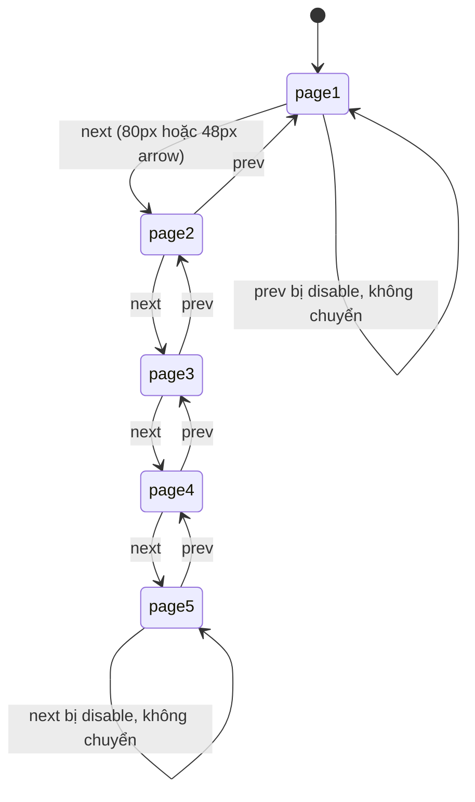
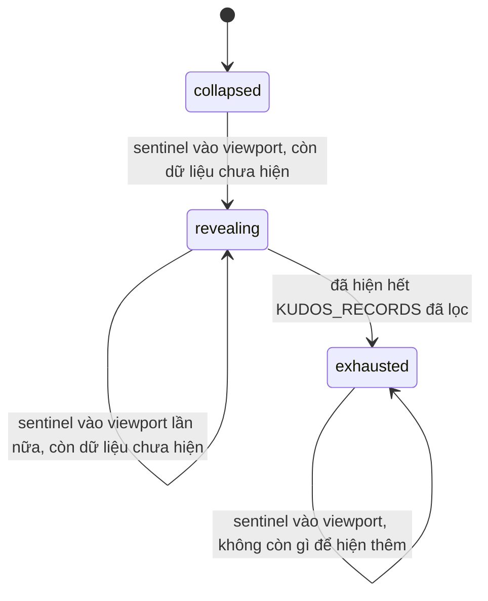

# F013_KudosLiveBoard

**Priority**: P1
**Type**: ui
**Generated**: 2026-08-21

## Overview

Route `/kudos` — điền nội dung thật vào placeholder cũ (`app/kudos/page.tsx`), theo frame MoMorph
`MaZUn5xHXZ`: banner + pill nhập kudos, khối HIGHLIGHT KUDOS (carousel tối đa 5 thẻ nhiều tim nhất,
3 hiển thị cùng lúc, 2 dropdown lọc), khối SPOTLIGHT BOARD (word cloud 106 tên, tìm kiếm, tooltip chỉ
tên), khối ALL KUDOS (feed thẻ với progressive reveal, lô 4 thẻ), và sidebar thống kê cá nhân + bảng
xếp hạng. Toàn bộ dữ liệu là module tĩnh `lib/kudos/` (10 file gồm 3 test, mỗi file dưới 200 dòng,
cùng tiền lệ `lib/awards.ts`) — không có bảng CSDL, không có API route. Bốn đích điều hướng được frame
tham chiếu nhưng không có frame riêng (dialog gửi kudos, trang chi tiết kudos, trang hồ sơ, dialog
Secret Box) đều dừng ở mức trigger render + focusable, không xây đích. Đây là feature dày đặc chuyển trạng thái
nhất trong 5 lượt gần đây nên dùng strict E2E (`e2e-red-first`): carousel next/prev disable ở hai
đầu, dropdown lọc mở/chọn/xoá làm mới đồng thời 2 khối, tim thả/gỡ đổi màu và đếm, Copy Link ghi
clipboard + toast, ô tìm kiếm Sunner giới hạn 100 ký tự. `lib/session/session-provider.tsx` (mock,
không phải auth) được mở rộng thêm danh tính người xem để tim tự-loại-trừ và sidebar có chủ.

## Polymorphic Behavior

N/A — no discriminator fields in Key Entities. Không entity nào ở `## Key Entities` bên dưới có một
field kiểu enum/boolean ≥2 giá trị đặt tên riêng biệt điều khiển nhánh render/validate/persist khác
nhau. Trạng thái trang carousel (1..5) và tiến trình progressive-reveal của All Kudos là UI state
(xem `SM-001`, `SM-002`), không phải discriminator dữ liệu; heart on/off là một boolean hai trạng
thái đơn giản, xử lý bằng Business Rule (`BR-001`, `BR-002`) chứ không đủ ngưỡng để thành DISC hay SM
riêng.

## Cross-Cutting Logic

### Requirements

None. — mọi FR-### đặt dưới `**Requirements fulfilled:**` của đúng một US bên dưới; không FR nào áp
dụng ngang hàng cho ≥2 US (khối lọc dùng chung do US006 sở hữu; US001/US003 chỉ hiển thị kết quả đã
lọc, không có FR riêng cho việc đó).

### Business Rules

#### BR-001_MotTimMotNguoiMotKudos
**Linked FR:** FR-006
**Applies to:** Nút tim trên mọi thẻ kudos (Highlight lẫn All Kudos)
**Rule:** Mỗi người xem chỉ thả được một tim cho một kudos; thả lần hai không tăng thêm đếm, gỡ tim
đưa đếm về đúng trạng thái trước khi thả. Trạng thái "đã thả tim" là state cục bộ theo mock-user
hiện tại, không đồng bộ nhiều tab (giới hạn của dữ liệu tĩnh, ghi ở `## Assumptions`).
**Source:** `components/kudos/kudos-card-actions.tsx:32,35` (state `liked`, `displayedCount = record.heartCount + (liked ? 1 : 0)`), toggle tại `components/kudos/kudos-card-actions.tsx:72` (`onClick={() => setLiked((current) => !current)}`). Đếm hiển thị qua `formatHeartCount()` — `lib/kudos/kudos-records.ts:100-102` (`count.toLocaleString('vi-VN')`, tạo dấu `.` ngăn cách nghìn).

**Pseudocode:**
```text
if hasLiked(kudosId, viewerId) → clicking heart removes like, heartCount -= 1
else → clicking heart adds like, heartCount += 1
# second click from same viewer never double-counts
```

#### BR-002_KhongTuThaTimChoKudosCuaMinh
**Linked FR:** FR-006
**Applies to:** Nút tim trên thẻ mà `senderId === viewerId`
**Rule:** Người gửi một kudos không thả tim được cho chính kudos đó — nút tim hiển thị ở trạng thái
vô hiệu (disabled), không click được, không có tooltip giải thích riêng vì đây là trạng thái hiển
nhiên từ dữ liệu sender/receiver.
**Source:** `components/kudos/kudos-card-actions.tsx:34` (`const isOwnKudos = record.senderId === viewerId;`), `components/kudos/kudos-card-actions.tsx:71` (`disabled={isOwnKudos}`). `viewerId` đến từ `components/kudos/kudos-board.tsx:36-39` (`useSession().userId`, fallback `MOCK_VIEWER_ID`); danh tính mock mở rộng ở `lib/session/session-provider.tsx:20-27,35-41` (xem `docs/vi/system/permissions.md`).

**Pseudocode:**
```text
isOwnKudos = kudos.senderId === viewer.id
render HeartButton(disabled = isOwnKudos)
```

#### BR-003_LocResetTrangCarousel
**Linked FR:** FR-008, FR-009
**Applies to:** Trạng thái trang carousel Highlight Kudos (`SM-001`)
**Rule:** Bất kỳ thay đổi bộ lọc nào — chọn/xoá Hashtag, chọn/xoá Phòng ban, hoặc click một hashtag
trong thẻ — đưa carousel Highlight về trang 1, vì tập 5 thẻ nhiều tim nhất có thể đổi hoàn toàn sau
khi lọc.
**Source:** `components/kudos/highlight-carousel.tsx:62-66` (`useEffect` reset `page` về 1 khi `filter.hashtag`/`filter.department` đổi). Filter dùng chung sở hữu bởi `components/kudos/kudos-board.tsx:36-37` (`useState<KudosFilter>`), truyền xuống cả `KudosFilterBar`, `HighlightCarousel` và `AllKudosFeed`.

**Pseudocode:**
```text
onFilterChange(newFilter):
  sharedFilter = newFilter
  carouselPage = 1  # always reset, regardless of which filter changed
```

#### BR-004_NguongKyTuTimKiemSpotlight
**Linked FR:** FR-011
**Applies to:** Ô tìm kiếm Sunner trên SPOTLIGHT BOARD (`B.7.3`)
**Rule:** Ô tìm kiếm chấp nhận tối đa 100 ký tự (TC `9e689933`); ký tự thứ 101 trở đi không được
nhập thêm, không có thông báo lỗi vì đây là giới hạn `maxLength` chặn ở tầng input, không phải một
lỗi validate riêng.
**Source:** `components/kudos/spotlight-search.tsx:66` (`maxLength={100}`).

#### BR-005_TangHangSaoTheoSoKudosNhanDuoc
**Linked FR:** FR-002
**Applies to:** Chỉ báo hoa thị (star) cạnh tên sender/receiver
**Rule:** Số sao hiển thị theo tổng số Kudos một Sunner đã *nhận được*: 1 sao ở mốc 10, 2 sao ở mốc
20, 3 sao ở mốc 50; hover vào hoa thị hiện đúng câu tooltip cố định theo tầng tương ứng (spec
B.3.2/B.3.6), nguyên văn:
- 1 hoa thị: `Sunner đã nhận được 10 Kudos và bắt đầu lan tỏa năng lượng ấm áp đến mọi người xung
  quanh.`
- 2 hoa thị: `Sunner đã nhận được 20 Kudos và chứng minh sức ảnh hưởng của mình qua những hành động
  lan tỏa tích cực mỗi ngày.`
- 3 hoa thị: `Sunner đã nhận được 50 Kudos và trở thành hình mẫu của sự công nhận, sẻ chia và lan
  tỏa tinh thần Sun*.`
**Source:** `lib/kudos/star-tiers.ts:25-31` (`starTierFor`). Tiêu thụ tại `components/kudos/star-tier-tooltip.tsx:20-51` và `components/kudos/kudos-card-people.tsx:65` (`<StarTierTooltip kudosReceived={...} />`).

**Pseudocode:**
```text
if kudosReceived >= 50 → 3 stars, tier3 tooltip
else if kudosReceived >= 20 → 2 stars, tier2 tooltip
else if kudosReceived >= 10 → 1 star, tier1 tooltip
else → no star, no tooltip
```

#### BR-006_HeSoTimNgayDacBietChuaCoCauHinh
**Linked FR:** FR-006
**Applies to:** Số tim cộng cho người gửi khi kudos được thả tim (`C.4.1`, TC `31936b72`)
**Rule:** Spec mô tả "ngày đặc biệt" do admin cấu hình cộng +2 tim thay vì +1, kèm hoàn tác đúng khi
gỡ tim. **Không có mặt bằng cấu hình admin, không có entity lưu ngày đặc biệt, không có nguồn ngày
tháng nào được đặc tả** — quy tắc này KHÔNG buildable ở lượt này và bị loại khỏi phạm vi (dữ liệu
tĩnh không có khái niệm "ngày"); mọi lượt thả tim trong bản dựng này luôn cộng đúng +1, không có
nhánh ngày đặc biệt nào được viết.
**Source:** N/A — đã xây xong toàn bộ feature, xác nhận `kudos-card-actions.tsx` chỉ có `+1`/`-1`, không có nhánh ngày đặc biệt (design defect #9, `clarifications.md`), không buildable vì thiếu mặt bằng cấu hình admin.

#### BR-007_SaoChepLinkKhongDuocVoLoi
**Linked FR:** FR-007
**Applies to:** Nút "Copy Link" trên mọi thẻ kudos
**Rule:** Click "Copy Link" gọi `navigator.clipboard.writeText` và hiện toast
"Link copied — ready to share!" khi thành công; nếu trình duyệt từ chối quyền clipboard, lỗi phải
được bắt (guarded) — không được văng unhandled rejection ra console, và không hiện toast thành công
giả.
**Source:** `components/kudos/kudos-card-actions.tsx:43-60` (`handleCopy` — guard `!navigator.clipboard` trước `try/catch`, absence lẫn denial đều im lặng); toast qua `kudos-toast.tsx`, mount theo từng thẻ.

### Decision Logic

User-facing decisions với outcome nghiệp vụ thấy được của người dùng cuối.

#### DEC-001_LocLamMoiCaHaiKhoiVaResetTrang
**subtype:** interaction
**Triggers in:** SCR008_KudosLiveBoard — chọn/xoá giá trị ở dropdown Hashtag hoặc Phòng ban
(`B.1.1`/`B.1.2`), hoặc click một hashtag bên trong bất kỳ thẻ kudos nào (`B.4.3`/`C.3.7`)
**Involved entities:** `FilterState.hashtag`, `FilterState.department`, `KudosRecord.hashtags`
**user_visible_outcome:** Danh sách thẻ hiển thị ở CẢ hai khối HIGHLIGHT KUDOS và ALL KUDOS đổi
đồng thời theo cùng một bộ lọc, và carousel Highlight quay về thẻ đầu tiên (trang 1) — không phải
hai bộ lọc độc lập cho hai khối.
**Source:** `components/kudos/kudos-board.tsx:35-58` (state `filter` dùng chung, `handleHashtagClick`
dòng 42-44), `lib/kudos/kudos-queries.ts:16-36` (`matchesFilter`, `filterRecords`, `highlightTop5`).

```pseudo
onFilterOrHashtagClick(value):
  sharedFilter = applyFilter(sharedFilter, value)
  highlightList = KUDOS_RECORDS.filter(matchesFilter(sharedFilter)).sortByHeartDesc().take(5)
  allKudosList = KUDOS_RECORDS.filter(matchesFilter(sharedFilter))
  carouselPage = 1
```

(Không có DEC-### thứ hai — tìm kiếm Spotlight Board là một điều kiện lọc/tô sáng đơn-field trên một
khối độc lập, không rẽ nhánh đa-predicate và không ảnh hưởng khối khác, nên xử lý ở mức FR/BR
(`FR-011`), không cần mã DEC riêng.)

### State Machines

**`kind` values:**
- `entity` — theo dõi vòng đời một domain object, được persist.
- `ui` — theo dõi trạng thái view-layer, không persist ngoài phiên hiện tại.

#### SM-001_TrangCarouselHighlight
**kind:** ui
**Linked FR:** FR-003
**Source:** `components/kudos/highlight-carousel.tsx:59,76-79` (`useState(1)`, `canPrev`/`canNext`/`goPrev`/`goNext`).
**States:** page1..pageN, N = `records.length` (dòng 60, ≤ 5 sau `highlightTop5()`) — không phải
luôn đúng 5 trạng thái cố định như mô tả ban đầu; N nhỏ hơn 5 khi bộ lọc thu hẹp kết quả.



Diagram trên vẽ trường hợp tối đa (N = 5); khi lọc còn dưới 5 kết quả, chuỗi ngắn lại (`page1..pageN`).

**Transition rules:**
- `pageK → pageK+1`: guard = `K < N` (N = tổng số thẻ sau lọc, dòng 60) VÀ click một trong hai cặp
  mũi tên `B.2.1/B.2.2` hoặc `B.5.1/B.5.3` (cả hai cặp điều khiển cùng state — design defect #5);
  side effect = đổi 3 thẻ hiển thị, cập nhật chỉ báo "n/N".
- `pageK → pageK-1`: guard = `K > 1` VÀ click mũi tên lùi (cặp nào cũng được); side effect tương tự
  chiều ngược lại.
- Tại `page1`, mũi tên lùi disable; tại `pageN`, mũi tên tiến disable — cả hai cặp mũi tên đồng bộ
  trạng thái disable theo cùng `SM-001`.
- Bất kỳ thay đổi bộ lọc nào reset về `page1` (`BR-003`), bất kể đang ở trang nào.

#### SM-002_TienTrinhHienThiAllKudos
**kind:** ui
**Linked FR:** FR-004
**Source:** `components/kudos/all-kudos-feed.tsx:21,36,44-47,51-70` (`REVEAL_BATCH = 4` — số cụ thể
chưa chốt lúc viết spec; `IntersectionObserver` tăng `revealedCount`; reset khi filter đổi).
**States:** collapsed (chỉ hiện lô đầu), revealing (sentinel vào viewport, hiện thêm lô kế tiếp),
exhausted (đã hiện hết dữ liệu tĩnh, sentinel không còn tác dụng) — 3 trạng thái.



**Transition rules:**
- `collapsed → revealing` / `revealing → revealing`: guard = sentinel cuối feed cắt ngưỡng viewport
  VÀ `revealedCount < filteredList.length`; side effect = tăng `revealedCount` thêm một lô cố định,
  KHÔNG có độ trễ loading giả (`clarifications.md` — "infinite scroll trên danh sách tĩnh, trung
  thực").
- `revealing → exhausted`: guard = `revealedCount === filteredList.length`; side effect = ẩn/vô hiệu
  sentinel, không còn request/tính toán thêm.
- Thay đổi bộ lọc (`DEC-001`) đưa `revealedCount` về lô đầu tiên của danh sách đã lọc mới, quay lại
  `collapsed` hoặc `revealing` tuỳ độ dài danh sách mới.

### Algorithms

None. — tầng sao (`BR-005`) là tra bảng ngưỡng đơn giản, không đủ phức tạp để tách thành thuật toán
riêng; layout word cloud lấy nguyên toạ độ node Figma gốc (không tự tính vị trí mới).

### External Integrations

None. — không có dịch vụ bên thứ ba nào được gọi; `navigator.clipboard` là Web API trình duyệt,
không phải một tích hợp bên ngoài theo nghĩa BL types.

### Verification

- **SC-001** — `/kudos` render đủ 5 khối chính theo đúng thứ tự tài liệu (Banner+pill, HIGHLIGHT
  KUDOS, SPOTLIGHT BOARD, ALL KUDOS, Sidebar), không lỗi console (covers FR-001, FR-004, FR-010,
  FR-013)
- **SC-002** — Carousel Highlight hiển thị đúng 3/5 thẻ tại một thời điểm, hai cặp mũi tên disable
  đúng ở hai đầu (page1/page5), chỉ báo "n/5" đồng bộ (covers FR-001, FR-003, SM-001)
- **SC-003** — Chọn Hashtag hoặc Phòng ban (hoặc click hashtag trong thẻ) lọc lại đồng thời cả
  Highlight lẫn All Kudos, carousel quay về trang 1 (covers FR-008, FR-009, BR-003, DEC-001)
- **SC-004** — Cuộn xuống All Kudos hiện thêm thẻ theo tiến trình tới khi hết dữ liệu tĩnh, không có
  trang giả hay độ trễ loading giả (covers FR-004, SM-002)
- **SC-005** — Thả tim đổi màu (`#999999` ↔ `--badge-danger` `#D4271D`) + tăng đếm đúng một lần mỗi
  người xem; thẻ do chính mock-user gửi có nút tim disable (covers FR-006, BR-001, BR-002)
- **SC-006** — Copy Link ghi clipboard, hiện đúng toast "Link copied — ready to share!"; quyền
  clipboard bị từ chối không văng lỗi console (covers FR-007, BR-007)
- **SC-007** — Ô tìm kiếm Spotlight Board chặn ở 100 ký tự, hover một tên hiện tooltip, và không có
  control Pan/Zoom nào được render ở bất kỳ đâu trong khối (covers FR-010, FR-011, FR-012, BR-004)
- **SC-008** — Sidebar hiện đủ 5 dòng thống kê và bảng xếp hạng 5 dòng, hoặc đúng câu trạng thái rỗng
  khi danh sách trống (covers FR-013, FR-014)
- **SC-009** — Bốn nhóm trigger đích-hoãn (pill gửi kudos, "Xem chi tiết", avatar/tên, "Mở Secret
  Box") đều render, nhận được focus bàn phím, không điều hướng sang một route không tồn tại
  (covers FR-015, FR-016, FR-017, FR-018)

---

**Client behavior:** see
[`behavior-logic.md`](../../generated/behavior-logic.md) (client-side patterns — debounce, optimistic
UI, polling, upload, realtime; word cloud + progressive reveal ở feature này chưa khớp pattern nào
trong danh sách, ghi ở `## Unresolved Questions`),
[`permissions.md`](../../../../docs/vi/system/permissions.md) (danh tính mock-user mới chỉ gate hiển
thị nút tim, không phải một access boundary — xem bản nháp
`plans/260821-1029-kudos-live-board/spec/system/permissions.md`),
[`screen-flow.md`](../../generated/screen-flow.md) (không có guard mới; bốn trigger đích-hoãn không
tạo điều hướng thật nên không có deep-link/unsaved-changes nào phát sinh).

## User Stories

### US001_XemVaLocHighlightKudos — Xem và lọc HIGHLIGHT KUDOS (Priority: P1)

**What happens:** Người dùng mở `/kudos` và thấy khối HIGHLIGHT KUDOS: phụ đề "Sun* Annual Awards
2025", tiêu đề "HIGHLIGHT KUDOS", hai dropdown lọc (Hashtag, Phòng ban), và một carousel hiển thị 3
trong 5 thẻ kudos nhiều tim nhất — thẻ giữa nổi bật, hai thẻ bên mờ và không tương tác được. Mỗi thẻ
đủ thông tin sender (avatar, tên, phòng ban, hoa thị), mũi tên hướng gửi-nhận, receiver, thời gian,
nội dung lời cảm ơn (tối đa 3 dòng), tối đa 5 hashtag một dòng, và action bar (tim, Copy Link,
Xem chi tiết).
**Why this priority:** Đây là khối nổi bật nhất ngay dưới banner, thể hiện tinh thần "được vinh danh
nhiều nhất" của phong trào Kudos — sai nội dung hoặc sai layout ở đây ảnh hưởng ấn tượng đầu tiên của
cả trang.
**Independent Test:** Mở `/kudos`, xác nhận carousel hiển thị 3 thẻ với đủ 6 nhóm thông tin trên mỗi
thẻ, và hai dropdown lọc hiển thị đúng nhãn "Hashtag"/"Phòng ban".

**Acceptance Scenarios:**

1. **Given** người dùng mở `/kudos`, **When** trang tải xong, **Then** thấy khối HIGHLIGHT KUDOS với
   phụ đề, tiêu đề, hai dropdown lọc, và carousel 3 thẻ (giữa nổi bật, hai bên mờ).
2. **Given** carousel đang hiển thị, **When** xem một thẻ ở vị trí trung tâm, **Then** thấy đủ sender
   (avatar/tên/phòng ban/hoa thị), mũi tên hướng, receiver, thời gian, nội dung clamp 3 dòng, tối đa
   5 hashtag, và action bar (tim + đếm, Copy Link, Xem chi tiết).
3. **Given** một sender đã nhận đủ 20 Kudos, **When** hover vào hoa thị cạnh tên sender, **Then**
   thấy tooltip đúng tầng 2 sao theo `BR-005`.

**Requirements fulfilled:**
- **FR-001** Render carousel 5 thẻ kudos nhiều tim nhất, hiển thị 3 tại một thời điểm (giữa active,
  hai bên mờ không tương tác) — `components/kudos/highlight-carousel.tsx:57-168`
- **FR-002** Mỗi thẻ hiển thị đủ sender/mũi tên hướng/receiver/thời gian/nội dung clamp 3 dòng/tối đa
  5 hashtag/action bar — `components/kudos/kudos-card.tsx:24-108` (dùng chung với All Kudos qua
  prop `variant: 'highlight' | 'post'`)

**Rules enforced:** BR-005.

**Verification:**
- **SC-001**, **SC-002**

---

### US002_DieuHuongCarouselHighlightKudos — Điều hướng carousel HIGHLIGHT KUDOS (Priority: P2)

**What happens:** Người dùng dùng một trong hai cặp mũi tên (cặp 80px flanking carousel, hoặc cặp
48px cạnh chỉ báo "n/5") để chuyển carousel sang thẻ trước/tiếp theo trong tập 5 thẻ; cả hai cặp mũi
tên điều khiển cùng một trạng thái trang, disable đồng bộ ở hai đầu (trang 1 và trang 5).
**Why this priority:** Là cơ chế bổ trợ cho US001 — người dùng vẫn xem được thẻ đang active mà không
cần điều hướng, nên độ ưu tiên thấp hơn nội dung chính của khối.
**Independent Test:** Click mũi tên tiến 5 lần từ trang 1, xác nhận dừng ở trang 5 và mũi tên tiến bị
disable; click mũi tên lùi xác nhận quay lại đúng thứ tự, disable ở trang 1.

**Acceptance Scenarios:**

1. **Given** carousel đang ở trang 1, **When** click mũi tên lùi (cặp 80px hoặc 48px), **Then** không
   có gì thay đổi vì mũi tên lùi đang bị disable.
2. **Given** carousel đang ở trang 3, **When** click mũi tên tiến, **Then** carousel chuyển sang
   trang 4, chỉ báo đổi thành "4/5".
3. **Given** carousel đang ở trang 5, **When** click mũi tên tiến, **Then** không có gì thay đổi vì
   mũi tên tiến đang bị disable.

**Requirements fulfilled:**
- **FR-003** Hai cặp mũi tên (80px flanking + 48px cạnh chỉ báo) cùng điều khiển một trạng thái
  trang, disable đồng bộ ở hai đầu — cùng file `components/kudos/highlight-carousel.tsx:106-165`

**State transitions:** SM-001 (`page1 ↔ page2 ↔ ... ↔ page5`)

**Verification:**
- **SC-002**

---

### US003_XemVaCuonAllKudos — Xem và cuộn ALL KUDOS (Priority: P1)

**What happens:** Người dùng cuộn xuống khối ALL KUDOS: phụ đề, tiêu đề "ALL KUDOS", và một feed thẻ
kudos hiện dần khi cuộn tới cuối danh sách đang hiển thị (mô phỏng trung thực "infinity scroll" trên
một tập dữ liệu tĩnh — không có trang giả, không có độ trễ loading giả). Mỗi thẻ có sender, icon
"sent", receiver, thời gian định dạng `HH:mm - MM/DD/YYYY`, nội dung clamp 5 dòng, tối đa 5 thumbnail
đính kèm 88×88, hashtag row, và action bar (tim + đếm, Copy Link). Danh sách rỗng hiện đúng câu
"Hiện tại chưa có Kudos nào.".
**Why this priority:** Là nội dung chính chiếm phần lớn chiều cao trang (~5862px frame) — nơi người
dùng thực sự duyệt toàn bộ hoạt động Kudos, không chỉ 5 thẻ nổi bật.
**Independent Test:** Cuộn tới cuối feed đang hiển thị, xác nhận thẻ mới hiện thêm mà không cần thao
tác nào khác; lọc theo một hashtag không có kudos nào khớp, xác nhận hiện đúng câu rỗng.

**Acceptance Scenarios:**

1. **Given** người dùng cuộn xuống khối ALL KUDOS, **When** feed đang hiển thị lô đầu, **Then** mỗi
   thẻ đủ sender/icon "sent"/receiver/thời gian đúng định dạng/nội dung clamp 5 dòng/tối đa 5
   thumbnail/hashtag/action bar.
2. **Given** người dùng cuộn tới cuối lô đang hiển thị, **When** sentinel cuối feed vào viewport và
   còn dữ liệu chưa hiện, **Then** feed hiện thêm một lô kế tiếp mà không cần thao tác nào khác.
3. **Given** bộ lọc hiện tại không khớp kudos nào, **When** feed render, **Then** hiện đúng câu
   "Hiện tại chưa có Kudos nào." thay vì danh sách trống không giải thích.

**Requirements fulfilled:**
- **FR-004** Progressive reveal thẻ tĩnh khi sentinel vào viewport, dừng khi hết dữ liệu đã lọc —
  `components/kudos/all-kudos-feed.tsx:34-110` (`REVEAL_BATCH = 4`, dòng 21)
- **FR-005** Mỗi thẻ hiển thị đủ sender/icon sent/receiver/thời gian/nội dung clamp 5 dòng/tối đa 5
  thumbnail/hashtag/action bar — dùng chung `kudos-card.tsx` với US001, biến thể "list" thay vì
  "carousel"

**State transitions:** SM-002 (`collapsed → revealing → exhausted`)

**Verification:**
- **SC-001**, **SC-004**

---

### US004_ThaTimKudos — Thả tim (like) một kudos (Priority: P1)

**What happens:** Người dùng click nút tim trên một thẻ kudos (Highlight hoặc All Kudos) để thả hoặc
gỡ tim; đếm tim tăng/giảm đúng một đơn vị mỗi lần, và màu nút đổi giữa `#999999` (chưa thả — màu xám
mờ có sẵn trên frame) và `--badge-danger` `#D4271D` (đã thả — đúng màu đỏ frame đang dùng cho dòng
hashtag; không thêm token mới). Nút tim trên chính thẻ mà người dùng đó là sender bị vô hiệu hoàn
toàn.
**Why this priority:** Là hành động tương tác chính của cả trang — nếu sai, toàn bộ ý nghĩa "ghi nhận
và cảm ơn" của tính năng Kudos không còn đúng.
**Independent Test:** Thả tim một kudos không phải của mình, xác nhận đếm +1 và màu đổi; thả lại lần
hai xác nhận đếm quay về giá trị ban đầu; thử thả tim thẻ do chính mình gửi, xác nhận nút disable.

**Acceptance Scenarios:**

1. **Given** một kudos chưa được người xem thả tim, **When** click nút tim, **Then** đếm tăng đúng 1
   và màu nút đổi sang `--badge-danger` (`#D4271D`).
2. **Given** một kudos người xem đã thả tim, **When** click lại nút tim, **Then** đếm giảm đúng 1 và
   màu nút quay về `#999999`.
3. **Given** một kudos do chính mock-user hiện tại gửi, **When** xem action bar, **Then** nút tim ở
   trạng thái disable, không nhận click.

**Requirements fulfilled:**
- **FR-006** Toggle tim tăng/giảm đúng một đơn vị mỗi người xem, disable trên kudos tự gửi —
  `components/kudos/kudos-card-actions.tsx:31-118`

**Rules enforced:** BR-001, BR-002, BR-006 (ghi nhận không buildable ở lượt này).

**Verification:**
- **SC-005**

---

### US005_SaoChepLinkKudos — Sao chép link một kudos (Priority: P2)

**What happens:** Người dùng click "Copy Link" trên action bar của một thẻ kudos; hệ thống ghi một
đường dẫn vào clipboard và hiện toast xác nhận "Link copied — ready to share!". Nếu trình duyệt từ
chối quyền clipboard, thao tác thất bại êm — không có lỗi console, không có toast thành công giả.
**Why this priority:** Là tiện ích chia sẻ phụ trợ, không phải luồng chính của trang.
**Independent Test:** Click "Copy Link" trên một thẻ bất kỳ, xác nhận clipboard nhận đúng nội dung và
toast hiện đúng câu.

**Acceptance Scenarios:**

1. **Given** người dùng xem một thẻ kudos, **When** click "Copy Link", **Then** clipboard nhận nội
   dung liên kết và toast "Link copied — ready to share!" xuất hiện.
2. **Given** trình duyệt từ chối quyền clipboard, **When** click "Copy Link", **Then** không có lỗi
   console không được bắt và không có toast thành công hiện ra.

**Requirements fulfilled:**
- **FR-007** Copy Link ghi clipboard qua `navigator.clipboard.writeText`, hiện toast cố định, guard
  lỗi quyền — cùng file `components/kudos/kudos-card-actions.tsx:43-60`

**Rules enforced:** BR-007.

**Verification:**
- **SC-006**

---

### US006_LocTheoHashtagPhongBan — Lọc HIGHLIGHT và ALL KUDOS theo Hashtag/Phòng ban (Priority: P1)

**What happens:** Người dùng mở dropdown "Hashtag" hoặc "Phòng ban", chọn một giá trị (hoặc xoá lựa
chọn); cả khối HIGHLIGHT KUDOS lẫn ALL KUDOS lọc lại đồng thời theo cùng bộ lọc, và carousel Highlight
quay về trang 1. Click một hashtag hiển thị bên trong bất kỳ thẻ nào có tác dụng tương đương chọn
đúng hashtag đó ở dropdown.
**Why this priority:** Là cơ chế khám phá chính của trang khi danh sách Kudos lớn dần — không có nó,
người dùng phải cuộn tay toàn bộ ALL KUDOS để tìm nội dung liên quan tới mình.
**Independent Test:** Chọn một hashtag ở dropdown, xác nhận cả hai khối chỉ còn kudos khớp hashtag đó
và carousel về trang 1; xoá lựa chọn, xác nhận cả hai khối trở lại đầy đủ.

**Acceptance Scenarios:**

1. **Given** trang đã tải với đầy đủ dữ liệu, **When** chọn một giá trị ở dropdown "Hashtag", **Then**
   cả HIGHLIGHT KUDOS lẫn ALL KUDOS chỉ còn kudos có hashtag đó, carousel về trang "1/5" (hoặc ít hơn
   nếu tập lọc còn dưới 5 thẻ).
2. **Given** một filter đang áp dụng, **When** click một hashtag hiển thị trong một thẻ bất kỳ,
   **Then** dropdown "Hashtag" cập nhật theo giá trị vừa click và cả hai khối lọc lại tương ứng.
3. **Given** một filter đang áp dụng, **When** xoá lựa chọn ở dropdown, **Then** cả hai khối trở lại
   hiển thị đầy đủ dữ liệu chưa lọc.

**Requirements fulfilled:**
- **FR-008** Hai dropdown filter (Hashtag, Phòng ban) mở/chọn/xoá, áp dụng chung cho cả hai khối —
  `components/kudos/kudos-filter-bar.tsx:78-114`
- **FR-009** Click hashtag trong thẻ áp dụng cùng bộ lọc như chọn ở dropdown —
  `components/kudos/kudos-hashtag-row.tsx:1-32`, callback `onHashtagClick` truyền từ
  `components/kudos/kudos-board.tsx:42-44` qua `kudos-card.tsx`

**Rules enforced:** BR-003.

**Decision Logic:** DEC-001 (`onFilterOrHashtagClick`)

**Verification:**
- **SC-003**

---

### US007_XemVaTimKiemSpotlightBoard — Xem và tìm kiếm SPOTLIGHT BOARD (Priority: P2)

**What happens:** Người dùng cuộn tới khối SPOTLIGHT BOARD: phụ đề, tiêu đề "SPOTLIGHT BOARD", tổng
"388 KUDOS" cố định, ô tìm kiếm Sunner (tối đa 100 ký tự), và một word cloud tĩnh 106 tên lấy từ toạ
độ node gốc của frame. Hover vào một tên hiện tooltip **chỉ tên** — dữ liệu node gốc (`SpotlightNode`,
`lib/kudos/spotlight-names.ts:7-14`) không có field thời gian nào, nên tooltip không hiện "thời gian"
như mô tả ban đầu; gõ vào ô tìm kiếm lọc/tô sáng tên khớp. **Không có control Pan/Zoom nào được
render** — node thiết kế tương ứng (`3007:17479`) là một frame 30×30 rỗng, không icon, không fill,
không text, nên không có gì trung thực để dựng lên.
**Why this priority:** Là nội dung khám phá phụ trợ — thú vị nhưng không phải luồng chính người dùng
tới trang để làm (thả tim, đọc lời cảm ơn).
**Independent Test:** Hover vào một tên bất kỳ trong word cloud, xác nhận tooltip hiện ra; gõ một
chuỗi khớp một phần tên, xác nhận tên đó được tô sáng và các tên khác mờ đi hoặc ẩn.

**Acceptance Scenarios:**

1. **Given** người dùng cuộn tới SPOTLIGHT BOARD, **When** khối render, **Then** thấy tổng
   "388 KUDOS", ô tìm kiếm, và một word cloud tên Sunner tĩnh — không có control Pan/Zoom nào xuất
   hiện ở bất kỳ đâu trong khối.
2. **Given** word cloud đang hiển thị, **When** hover vào một tên, **Then** tooltip hiện đúng tên đó
   tại đúng vị trí (không có thời gian — xem `## What happens`).
3. **Given** người dùng gõ một chuỗi vào ô tìm kiếm, **When** chuỗi khớp một phần tên trong cloud,
   **Then** tên khớp được tô sáng/nổi bật, các tên không khớp mờ đi.

**Requirements fulfilled:**
- **FR-010** Render word cloud 106 tên từ toạ độ node gốc + tổng "388 KUDOS" cố định —
  `components/kudos/spotlight-board.tsx:38-86`, dữ liệu `lib/kudos/spotlight-names.ts:30-137`
  (`SPOTLIGHT_NODES`)
- **FR-011** Hover hiện tooltip **chỉ tên** (không có thời gian — dữ liệu node không mang field này);
  ô tìm kiếm lọc/tô sáng, giới hạn 100 ký tự — `components/kudos/spotlight-name-cloud.tsx:36-97`,
  `components/kudos/spotlight-search.tsx:31-73`
- **FR-012** KHÔNG render control Pan/Zoom — node thiết kế (`3007:17479`) rỗng, không có nội dung nào
  trung thực để dựng; đây là lược bỏ hoàn toàn, không phải hoãn hành vi trên một nút đã hiện diện —
  xác nhận bằng cách đọc toàn bộ `components/kudos/spotlight-board.tsx` (không có control Pan/Zoom
  nào được viết)

**Rules enforced:** BR-004.

**Verification:**
- **SC-007**

---

### US008_XemThongKeCaNhanVaBangXepHang — Xem thống kê cá nhân và bảng xếp hạng ở sidebar (Priority: P2)

**What happens:** Người dùng xem sidebar bên phải: 5 dòng thống kê cá nhân (Kudos nhận được, Kudos đã
gửi, tim nhận được, Secret Box đã mở, Secret Box chưa mở — cả 5 đều hiển thị `25` theo đúng frame,
xem `## Assumptions`), một divider, nút "Mở Secret Box" (trigger, xem US009), và bảng xếp hạng
"10 SUNNER NHẬN QUÀ MỚI NHẤT" với 5 dòng tên + mô tả phần quà. Danh sách rỗng hiện đúng câu
"Chưa có dữ liệu".
**Why this priority:** Cung cấp ngữ cảnh cá nhân hoá cho một trang chủ yếu đọc nội dung của người
khác — không phải luồng chính nhưng là lý do quay lại trang nhiều lần.
**Independent Test:** Mở `/kudos`, xác nhận sidebar hiện đủ 5 dòng thống kê và 5 dòng bảng xếp hạng
đúng nội dung frame.

**Acceptance Scenarios:**

1. **Given** người dùng mở `/kudos`, **When** xem sidebar, **Then** thấy đủ 5 dòng thống kê với nhãn
   đúng frame và giá trị `25` mỗi dòng.
2. **Given** sidebar đang hiển thị, **When** xem bảng xếp hạng, **Then** thấy tiêu đề
   "10 SUNNER NHẬN QUÀ MỚI NHẤT" và 5 dòng tên + mô tả phần quà.
3. **Given** dữ liệu bảng xếp hạng trống (kịch bản kiểm thử), **When** bảng render, **Then** hiện
   đúng câu "Chưa có dữ liệu" thay vì bảng rỗng không giải thích.

**Requirements fulfilled:**
- **FR-013** Render 5 dòng thống kê cá nhân gắn với danh tính mock-user —
  `components/kudos/kudos-sidebar-stats.tsx:1-63`, dữ liệu `lib/kudos/viewer-stats.ts:1-32`
  (`STAT_ROWS`, cả 5 giá trị đều `25` — đúng như frame)
- **FR-014** Render bảng xếp hạng 5 dòng, empty-state cố định —
  `components/kudos/kudos-leaderboard.tsx:1-59`, dữ liệu `lib/kudos/leaderboard.ts:1-33`
  (`leaderboardOrEmpty`)

**Verification:**
- **SC-008**

---

### US009_TruyCapCacDichChuaXayDung — Truy cập các đích điều hướng chưa được xây (Priority: P3)

**What happens:** Bốn nhóm điều khiển tham chiếu tới một đích không có frame riêng — pill nhập kudos
(mở dialog gửi kudos), "Xem chi tiết" trên mỗi thẻ (mở trang chi tiết kudos), avatar/tên sender hoặc
receiver ở bất kỳ đâu (Highlight, All Kudos, bảng xếp hạng — mở trang hồ sơ), và "Mở Secret Box" ở
sidebar (mở dialog Secret Box) — đều render đúng vị trí, nhận được focus bàn phím theo đúng thứ tự
DOM, nhưng không điều hướng sang bất kỳ đâu khi được kích hoạt, vì không có frame nào định nghĩa các
đích đó.
**Why this priority:** Là hành vi placeholder có chủ đích (quyết định `clarifications.md`) — ưu tiên
thấp vì không phải nội dung chính của lượt này, nhưng vẫn cần assert để tránh trông như control bị
hỏng.
**Independent Test:** Tab qua toàn trang bằng bàn phím, xác nhận cả 4 nhóm control nhận được focus
visible; kích hoạt từng nhóm, xác nhận không có điều hướng hay lỗi console nào xảy ra.

**Acceptance Scenarios:**

1. **Given** người dùng focus vào pill nhập kudos ở banner, **When** nhấn Enter hoặc click, **Then**
   control phản hồi (ví dụ đổi trạng thái focus/hover) nhưng không có dialog gửi kudos nào được xây
   để mở ra.
2. **Given** người dùng focus vào "Xem chi tiết" trên một thẻ, **When** kích hoạt, **Then** không có
   điều hướng sang trang chi tiết kudos nào xảy ra (route đó không tồn tại ở lượt này).
3. **Given** người dùng focus vào một avatar hoặc tên (sender/receiver/bảng xếp hạng), **When** kích
   hoạt, **Then** không có điều hướng sang trang hồ sơ nào xảy ra.
4. **Given** người dùng focus vào "Mở Secret Box", **When** kích hoạt, **Then** không có dialog
   Secret Box nào được xây để mở ra.

**Requirements fulfilled:**
- **FR-015** Pill nhập kudos render + focusable, không mở dialog gửi kudos thật —
  `components/kudos/kudos-action-bar.tsx:14-44` (input `readOnly` + `aria-haspopup="dialog"`, dòng
  25-30). **Không có file `kudos-submit-pill.tsx` riêng như dự kiến ban đầu** — pill sống chung file
  với ô tìm Sunner trong `kudos-action-bar.tsx`
- **FR-016** "Xem chi tiết" render + focusable trên mỗi thẻ, không điều hướng trang chi tiết —
  `components/kudos/kudos-card-actions.tsx:98-112`
- **FR-017** Avatar/tên (sender, receiver, bảng xếp hạng) render + focusable, không điều hướng trang
  hồ sơ — `components/kudos/kudos-card-people.tsx:49-61` + `components/kudos/kudos-leaderboard.tsx:29-51`
- **FR-018** "Mở Secret Box" render + focusable, không mở dialog Secret Box —
  `components/kudos/kudos-sidebar-stats.tsx:53-60`

**Verification:**
- **SC-009**

---

### Edge Cases

See [edge-cases.md](edge-cases.md).

## Key Entities

Không có bảng CSDL; toàn bộ dữ liệu là hằng số tĩnh trong `lib/kudos/` (10 file bao gồm 3 file test,
mỗi file dưới 200 dòng, cùng tiền lệ `lib/awards.ts`).

| Entity | Table | Key Columns | Purpose |
|--------|-------|-------------|---------|
| KudosRecord | N/A (hằng số, `lib/kudos/kudos-records.ts:29-91`) | id, senderId, senderName, senderDept, senderBadge, senderKudosReceived, receiverId, receiverName, receiverDept, receiverBadge, receiverKudosReceived, category, message, highlightMessage, hashtags[], attachments[], heartCount, timestamp, variant | Nguồn dữ liệu duy nhất cho cả HIGHLIGHT KUDOS (top-5 nhiều tim) và ALL KUDOS feed. **Đúng 9 bản ghi** (không phải khoảng 8–10 như ước tính ban đầu) tái tổ hợp từ đúng từ vựng thật của frame (7 tên word cloud, 4 hạng huy hiệu New/Rising/Super/Legend Hero, phòng ban/hashtag/category có trong dữ liệu) — không transcribe verbatim vì frame chỉ vẽ một kudos lặp lại 7 lần (xem `## Assumptions`). `variant` chỉ ghi nhận thẻ nguồn transcribe từ đâu (`'post'`/`'highlight'`), không điều khiển render nào — nội dung hiển thị lấy theo prop `variant` của `KudosCard`, không theo field này của record |
| SpotlightNode | N/A (hằng số, `lib/kudos/spotlight-names.ts:7-14,30-137`) | id, name, relX, relY, fontSize, highlighted | 106 tên cho word cloud SPOTLIGHT BOARD (không phải ~100 như ước tính ban đầu) — không có field thời gian, nên tooltip hover chỉ hiện tên (xem US007) |
| LeaderboardEntry | N/A (hằng số, `lib/kudos/leaderboard.ts:5-22`) | rank, name, prizeDescription | 5 dòng "10 SUNNER NHẬN QUÀ MỚI NHẤT" ở sidebar |
| FilterVocabulary | N/A (hằng số, `lib/kudos/filters.ts:8,11`) | hashtags[], departments[] | Danh sách giá trị cho 2 dropdown lọc dùng chung 2 khối (`HASHTAG_OPTIONS`, `DEPARTMENT_OPTIONS`) |
| ViewerStats | N/A (hằng số, `lib/kudos/viewer-stats.ts:12-18`) | kudosReceived, kudosSent, heartsReceived, secretBoxesOpened, secretBoxesUnopened | 5 dòng thống kê sidebar — cả 5 giá trị đều `25` (design defect #3, đúng như frame), không gắn động với danh tính mock-user |
| SessionUser (mở rộng) | N/A (`lib/session/session-provider.tsx:20-27,35-41` — đã tồn tại, đã sửa thêm field) | id, displayName (2 field mới) | Danh tính mock để "tim tự-loại-trừ" (BR-002) và sidebar (FR-013) biết "bạn" là ai |

## Artifact References

| Artifact | File | Codes Used | Reviewed |
|----------|------|------------|----------|
| System Overview | [overview.md](../../../../docs/vi/system/overview.md) | — | [ ] |
| Architecture | [architecture.md](../../../../docs/vi/system/architecture.md) | — | [ ] |
| Feature List | [feature-list.md](../../generated/feature-list.md) | F013_KudosLiveBoard | [x] |
| API Map | [api-map.md](../../generated/api-map.md) | TBD (draft) — không có route API mới (dữ liệu tĩnh client-side), xác nhận lại sau khi code đã xong | [x] |
| Entities | [entities.md](../../generated/entities.md) | TBD (draft) — không có model CSDL mới, xác nhận lại sau khi code đã xong | [x] |
| Screens | [screens.md](screens.md) | SCR008_KudosLiveBoard | [x] |
| Behavior Logic | [behavior-logic.md](../../generated/behavior-logic.md) | TBD (draft) — không có background job mới, xác nhận lại sau khi code đã xong | [x] |
| Permissions Matrix | [permissions-matrix.md](../../generated/permissions-matrix.md) | TBD (draft) — chưa có PERM### mới được cấp, xác nhận lại sau khi code đã xong | [x] |
| User Stories | (local, tài liệu này) | US001–US009 | [x] |

**Rule:** Mọi mã trong cột Codes Used PHẢI tồn tại trong artifact nguồn của nó khi được cấp thật ở lúc
promote. Các dòng `TBD (draft)` ở trên vẫn đúng thực trạng sau khi code đã xong (xác nhận lại bằng
`git status`/`ls lib/kudos/`) — feature đọc dữ liệu tĩnh, không thêm API/model/BL/PERM### nào mới.

## Assumptions

- `lib/kudos/` tách nhiều module theo concern (kudos records, spotlight, leaderboard, filters, viewer
  stats), mỗi file dưới 200 dòng, cùng tiền lệ `lib/awards.ts` — không component nào chứa literal inline.
- Carousel "5 thẻ" là hợp đồng dữ liệu thật dù frame chỉ crop 3 vị trí hiển thị cùng lúc — thẻ thứ 4
  và 5 vẫn tồn tại trong dữ liệu, chỉ không hiển thị đồng thời (design defect #6, `clarifications.md`).
  `highlightTop5()` lấy tối đa 5, nhưng khi bộ lọc thu hẹp dưới 5 kết quả, carousel có ít trang hơn
  tương ứng (`SM-001`) — 5 không phải số cố định tuyệt đối trong mọi trạng thái lọc.
- Toạ độ mỗi tên trong SPOTLIGHT BOARD lấy trực tiếp từ node TEXT gốc của frame — không tự tính lại
  layout mới (không có thư viện word-cloud nào được thêm).
- Kỹ thuật cụ thể cho "infinite scroll" (IntersectionObserver hay scroll-listener throttle) chưa
  chốt — chỉ hành vi (`SM-002`: hiện dần, dừng khi hết dữ liệu, không trang giả) là bắt buộc.
- Danh tính mock-user mới (`id`, `displayName`) tuân theo đúng cảnh báo bảo mật đã có ở
  `lib/session/session-provider.tsx` — không phải một access boundary, chỉ gate hiển thị UI.
- Route `/kudos` vẫn mở công khai — không có gate mới ở lượt này (quyết định 2, `clarifications.md`).
- **Frame vẽ đúng MỘT kudos lặp lại 7 lần** — cả 3 thẻ Highlight và cả 4 thẻ ALL KUDOS chia sẻ cùng
  sender, receiver, phòng ban, category, dòng hashtag và số tim (`1.000`, không phải `10` như spec
  CSV). Seed trong `lib/kudos/kudos-records.ts` **tái tổ hợp** giá trị thật đã có trên frame (7 tên
  word cloud, 4 hạng huy hiệu, phòng ban/hashtag/category thật) thành **đúng 9 bản ghi** biến thiên
  (`lib/kudos/kudos-records.ts:79-91`, không phải ~8–10 như ước tính ban đầu) — không bịa giá trị mới
  (`clarifications.md`, second pass). Bắt buộc: ít nhất một bản ghi có sender
  trùng danh tính mock-user để `BR-002` có kịch bản thật để assert (TC `63645b03`); và tổ hợp
  hashtag+phòng ban phải có ít nhất một combo không khớp bản ghi nào để trạng thái rỗng lọc được
  assert qua UI (TC `926d92a5`).
- **Hai lỗi chính tả phòng ban là verbatim, không chuẩn hoá:** thẻ Highlight ghi `CECV10`, thẻ ALL
  KUDOS ghi `CEVC10` — cả hai đều đúng nguyên văn frame (không phải cùng một giá trị bị gõ khác
  nhau do lỗi implementation); seed giữ nguyên cả hai tuỳ theo loại thẻ nguồn.
- **Khoảng trắng verbatim được giữ nguyên, không trim:** một dấu cách dẫn đầu + ba dấu cách cuối trên
  placeholder pill nhập kudos, một dấu cách cuối trên placeholder "Tìm kiếm " và trên mỗi tên
  leaderboard, dấu cách đôi trong dòng hashtag trước `#Inspring` cuối cùng, và một ký tự xuống dòng
  thật trong tiêu đề leaderboard ("10 SUNNER NHẬN QUÀ\nMỚI NHẤT").
- Ba câu tooltip đầy đủ theo 3 tầng hoa thị (`BR-005`) là dữ liệu cố định — nguyên văn lấy từ
  `design/kudos-content.md` (spec B.3.2/B.3.6), không còn cần đọc CSV lúc triển khai.
- Màu tim tái dùng token có sẵn của dự án — `--badge-danger` (`#D4271D`, đúng màu hashtag frame đang
  dùng) khi đã thả, `#999999` (màu xám mờ có sẵn trên frame) khi chưa thả — không thêm token mới, vì
  bản thân icon tim (`MM_MEDIA_Heart`) không mang màu nào trong dữ liệu thiết kế.

## Source Code References

Toàn bộ 5 khối của `/kudos` đã được viết. Danh sách dưới đây đối chiếu trực tiếp với cây thư mục
thật (`ls components/kudos/ lib/kudos/`), thay cho danh sách "dự kiến" viết trước khi có code —
khác biệt so với dự kiến ban đầu đánh dấu **in đậm**. Kết quả kiểm thử ở `### E2E` cuối mục này.

### Mới — `lib/kudos/` (10 file: 7 module dữ liệu/hàm thuần + 3 file test)

| File | Nội dung |
|------|----------|
| `lib/kudos/kudos-records.ts:29-102` | `KudosRecord`, **đúng 9 bản ghi** (không phải 8–10), `MOCK_VIEWER_ID`/`MOCK_VIEWER_DISPLAY_NAME`, `formatHeartCount()` (`.toLocaleString('vi-VN')`) |
| `lib/kudos/kudos-queries.ts:1-36` | `KudosFilter`, `matchesFilter`, `filterRecords`, `highlightTop5` — nguồn thật của BR-003/DEC-001 |
| `lib/kudos/star-tiers.ts:1-31` | `starTierFor()` — nguồn thật của BR-005 |
| `lib/kudos/filters.ts:1-14` | `HASHTAG_OPTIONS`, `DEPARTMENT_OPTIONS`, `CLEAR_OPTION_LABEL` |
| `lib/kudos/viewer-stats.ts:1-32` | `VIEWER_STATS` (5 giá trị tĩnh `25`), `STAT_ROWS` — nguồn thật của FR-013 |
| `lib/kudos/leaderboard.ts:1-33` | `LEADERBOARD`, `LEADERBOARD_TITLE`, `leaderboardOrEmpty()` — nguồn thật của FR-014 |
| `lib/kudos/spotlight-names.ts:1-137` | `SPOTLIGHT_NODES` (**106 tên, không phải ~100**), `SPOTLIGHT_TOTAL_LABEL`, `SPOTLIGHT_TICKER_LINE`; `SpotlightNode` không có field thời gian |
| `lib/kudos/kudos-records.test.ts`, `lib/kudos/leaderboard.test.ts`, `lib/kudos/star-tiers.test.ts` | Unit test cho 3 file trên |

### Mới — `components/kudos/` (19 component)

| File | Nội dung |
|------|----------|
| `components/kudos/kudos-board.tsx:35-69` | Client shell — sở hữu state `filter` dùng chung (DEC-001), render 5 khối sibling |
| `components/kudos/kudos-banner.tsx` | Banner tĩnh (KV background + wordmark), không tương tác |
| `components/kudos/kudos-action-bar.tsx:14-44` | Pill mời gửi kudos (FR-015) + ô tìm Sunner. **Thay cho `kudos-submit-pill.tsx` — file đó chưa từng được tạo**, cả hai control sống chung trong file này |
| `components/kudos/kudos-filter-bar.tsx:78-114` | Hai dropdown lọc (FR-008), dùng chung `DropdownMenu` |
| `components/kudos/highlight-carousel.tsx:57-168` | Carousel 3-of-N (SM-001, reset filter tại dòng 62-66) |
| `components/kudos/kudos-card.tsx:24-108` | Shell thẻ dùng chung 2 biến thể `'highlight'`/`'post'` (union thật, không phải `'carousel'`/`'list'` như mô tả ở US001/US003 — đó chỉ là tên hiển thị khái niệm); post-card dùng `min-h-[749px]`, không phải chiều cao cố định |
| `components/kudos/kudos-card-people.tsx:1-105` | Khối sender/receiver, badge, gọi `StarTierTooltip` |
| `components/kudos/kudos-card-actions.tsx:31-118` | Tim (BR-001/BR-002), Copy Link (BR-007), "Xem chi tiết" (FR-016) — **mount `KudosToast` theo từng thẻ**, không phải một instance cấp trang như một shell dùng chung thường làm |
| `components/kudos/kudos-hashtag-row.tsx:1-32` | Nút hashtag trong thẻ (FR-009) |
| `components/kudos/kudos-toast.tsx:1-41` | Toast auto-hide 3s (BR-007) |
| `components/kudos/all-kudos-feed.tsx:34-110` | Feed hiện dần (SM-002), `REVEAL_BATCH = 4` (dòng 21 — số cụ thể chưa chốt lúc viết spec) |
| `components/kudos/kudos-sidebar.tsx:1-18` | Bọc `KudosSidebarStats` + `KudosLeaderboard` |
| `components/kudos/kudos-sidebar-stats.tsx:1-63` | 5 dòng thống kê (FR-013) + nút "Mở Secret Box" (FR-018) |
| `components/kudos/kudos-leaderboard.tsx:1-59` | Bảng xếp hạng 5 dòng + empty-state (FR-014) |
| `components/kudos/spotlight-board.tsx:1-86` | Khung SPOTLIGHT BOARD; xác nhận không có control Pan/Zoom nào được viết (FR-012) |
| `components/kudos/spotlight-search.tsx:31-73` | Ô tìm kiếm, `maxLength={100}` dòng 66 (BR-004) |
| `components/kudos/spotlight-name-cloud.tsx:1-97` | Word cloud 106 tên; tooltip hover **chỉ hiện tên, không có thời gian** (khác mô tả FR-011/US007 ban đầu — `SpotlightNode` không có field timestamp) |
| `components/kudos/spotlight-ticker.tsx:1-48` | 6 dòng ticker tĩnh trang trí. **Không có trong danh sách dự kiến ban đầu**, không gắn FR nào, tái tạo đúng như frame |
| `components/kudos/star-tier-tooltip.tsx:1-51` | Chấm hoa thị + tooltip hover (BR-005) |

### Sửa

| File | Thay đổi |
|------|----------|
| `app/kudos/page.tsx:1-20` | Thay placeholder bằng `SiteHeader` + `KudosBoard` + `SiteFooter` |
| `lib/session/session-provider.tsx:20-41` | Thêm `userId`/`displayName` vào `SessionState` + `DEFAULT_SESSION`, mở rộng SECURITY NOTE (BR-002) |
| `components/layout/site-header.tsx:60-66` | Mục "Sun* Kudos" chuyển sang derive `aria-current` từ `usePathname()`, cùng cơ chế 2 mục còn lại |

### Tái dùng nguyên trạng, không sửa

`components/layout/site-footer.tsx`, `public/saa/Pen.svg`, `public/saa/Down.svg`, icon Search/Logo
đã có trong `public/saa/`. `components/home/kudos-section.tsx` KHÔNG xuất hiện trên frame này và
không được thêm vào.

### E2E — thay cho `e2e/kudos-live-board.spec.ts` dự kiến ban đầu

Ba file dưới **thay thế** file đơn lẻ dự kiến ban đầu — không có `e2e/kudos-live-board.spec.ts` nào
được tạo:

| File | Phạm vi |
|------|---------|
| `e2e/kudos-board-layout.spec.ts` | Bố cục 5 khối, thứ tự DOM, carousel 3-of-N, empty state (SC-001, SC-002, SC-008) |
| `e2e/kudos-board-interactions.spec.ts` | Tim toggle, Copy Link, dropdown lọc, carousel next/prev (SC-003, SC-005, SC-006) |
| `e2e/kudos-board-feed-interactions.spec.ts` | Progressive reveal, spotlight search/tooltip (SC-004, SC-007) |

**Kết quả kiểm thử:** e2e 18/18; suite dự án 96/97 (1 fail có từ trước ở `login-auth-redirect`,
không liên quan Kudos); unit 93/93; `tsc --noEmit` sạch; responsive 375/768/1440 đạt ngưỡng.

## Unresolved Questions

1. **Kỹ thuật infinite-scroll cụ thể chưa chọn** — IntersectionObserver là lựa chọn phổ biến nhất cho
   hợp đồng `SM-002` nhưng chưa được quyết định tường minh; để lại cho lúc triển khai.
2. **Route protection vẫn hoãn** (kế thừa từ lượt Login) — TC `71b3ef43` không được assert cho tới
   khi `/`, `/awards`, `/kudos`, `/profile`, `/admin` được gate thật sau `proxy.ts`.
3. **Pan/Zoom cần một đặc tả thiết kế thật (icon, hành vi, zoom range) trước khi có thể xây bất kỳ
   hình thức nào** — node thiết kế hiện tại (`3007:17479`) rỗng nên lượt này lược bỏ hoàn toàn control
   thay vì render một nút không có gì bấm được; TC `cac4b7a3` stays unasserted.
4. **Bảng "10 SUNNER CÓ SỰ THĂNG HẠNG MỚI NHẤT" cần một frame riêng hoặc bị bỏ khỏi spec** — spec CSV
   mô tả 2 bảng xếp hạng, frame chỉ vẽ 1 (`D.3`), và chỉ 5/10 dòng.
5. **Hệ số tim ngày đặc biệt (+2) cần một mặt bằng cấu hình admin** trước khi `BR-006` có thể
   buildable ở bất kỳ hình thức nào.

## Source Walkthrough

Thứ tự đọc để hiểu hợp đồng đã giữ trong lượt này:

1. `lib/awards.ts:1-30` — tiền lệ data-module tĩnh mà `lib/kudos/` đi theo convention.
2. `lib/session/session-provider.tsx:20-41` — mock session đã mở rộng `userId`/`displayName`; đọc
   SECURITY NOTE (dòng 3-14) trước khi đụng role check.
3. `app/kudos/page.tsx:1-20` — placeholder cũ đã thay bằng `SiteHeader` -> `KudosBoard` -> `SiteFooter`.
4. `components/layout/site-header.tsx:44-66` — cả 3 mục nav derive `aria-current` từ `usePathname()`.
5. `components/home/kudos-section.tsx:1-20` — tham khảo convention đọc dictionary; component này
   KHÔNG xuất hiện trên frame `/kudos`.

### Call Hierarchy

```text
app/kudos/page.tsx
  -> SiteHeader (site-header.tsx, mục "Sun* Kudos" derive aria-current từ usePathname())
  -> KudosBoard (kudos-board.tsx — sở hữu state `filter` dùng chung, DEC-001)
       -> KudosBanner (tĩnh, không tương tác)
       -> KudosActionBar (pill mời gửi kudos US009 + ô tìm Sunner — KHÔNG có KudosSubmitPill riêng)
       -> KudosFilterBar (2 dropdown) <-> HighlightCarousel (SM-001)
            -> KudosCard variant="highlight" -> KudosCardActions -> KudosToast (mount theo thẻ)
       -> SpotlightBoard -> SpotlightSearch + SpotlightNameCloud + SpotlightTicker
       -> AllKudosFeed (SM-002, REVEAL_BATCH=4)
            -> KudosCard variant="post" -> KudosCardActions -> KudosToast (mount theo thẻ)
            -> KudosSidebar -> KudosSidebarStats + KudosLeaderboard
  -> SiteFooter (site-footer.tsx, tái dùng nguyên trạng)
```

**Related files:** xem `## Source Code References` ở trên (đã liệt kê theo trạng thái mới/sửa/tái
dùng — F15 DRY, một danh sách không phải hai).

## DB Impact per Event

N/A — read-only feature, no DB writes. Toàn bộ dữ liệu là hằng số client-side trong `lib/kudos/`;
trạng thái trang carousel (`SM-001`), tiến trình hiện dần của All Kudos (`SM-002`), lượt thả tim
(`BR-001`/`BR-002`), và bộ lọc dùng chung (`DEC-001`) đều là UI state không persist qua reload. Không
có API route hay bảng CSDL nào bị ghi ở feature này.
