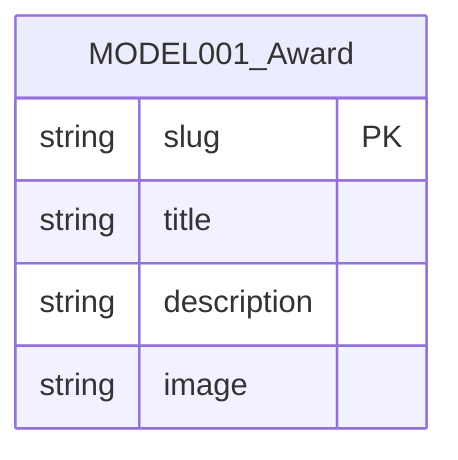

<!-- layout-exempt: rebuild-spec owns all docs/system|features|generated|flows paths — all references here are output targets or internal definitions -->
<!-- Output path: docs/generated/entities.md -->

# Entities

**Project**: SAA 2025 Homepage (Sun* Annual Awards — "Root Further")
**Generated**: 2026-08-18

## Ghi chú phạm vi (đọc trước ERD)

Codebase này **không có database, không ORM, không schema, không migration, không entity
nào được app tự viết để persist ở phía server**. (**Cập nhật 2026-08-19**: Supabase Auth
local nay quản lý một schema `auth.users` riêng của nó cho đăng nhập — app không viết
migration/model nào cho nó; xem § Supabase Session ở cuối tài liệu. Kết luận "0 entity của
app" dưới đây không đổi.) Toàn bộ cây nguồn (`app/`, `components/`, `lib/`, `e2e/`)
chỉ có đúng **1 file được scout-report.md gắn nhãn `model`**: `lib/awards.ts`. Đây là một
static dataset hard-code trong code, không phải runtime schema.

Ngoài `MODEL001_Award`, hệ thống có 3 "hình dạng dữ liệu" khác đáng ghi lại vì chúng mang
discriminator field ảnh hưởng hành vi UI — nhưng đây là **computed value object** hoặc
**client-side state**, không phải entity, nên được tách riêng ở mục "Non-Entity Data
Shapes" thay vì nhét gượng vào ERD. Không suy diễn thêm bảng, cột, khóa chính/ngoại, quan hệ
nào ngoài những gì liệt kê dưới đây — mức tối giản này là chính xác cho một app static/
client-only, khớp với kết luận "No backend confirmed" của scout-report.md.

## Entity Relationship Diagram

Chỉ 1 entity, không có quan hệ (no FK, no association) — ERD chỉ có một node đơn lẻ vì
không có entity thứ hai nào để nối tới.

## Entities

### MODEL001_Award

**Description**: Danh sách 6 hạng mục giải thưởng tĩnh của SAA 2025, hard-code trong
`lib/awards.ts` dưới hằng số `AWARDS: Award[]`. Không có API, không có nguồn dữ liệu động
nào nạp mảng này — nó là toàn bộ "dataset" của tính năng Awards.

| Attribute | Type | Constraints | Description |
|-----------|------|-------------|-------------|
| slug | string | PK (logical, không unique-enforced ở runtime) | Định danh hạng mục, dùng làm anchor `/awards#<slug>` (BR-005) |
| title | string | NOT NULL | Tên hiển thị của hạng mục giải thưởng |
| description | string | NOT NULL | Mô tả ngắn hiển thị trên award card |
| image | string | NOT NULL | Đường dẫn ảnh thumbnail dưới `public/`, do Track A tải về |

**Relationships**: None — không có entity thứ hai trong hệ thống để liên kết tới.

**Discriminator Fields**: None. `slug` là một tập giá trị cố định trên thực tế
(`EXPECTED_AWARD_SLUGS`, 6 giá trị) nhưng không có branching hành vi khác nhau theo từng
giá trị slug — mỗi award card render cùng một layout, chỉ khác nội dung text/ảnh. Không đạt
tiêu chí discriminator (behavioral branching) theo `code-formats.md`.

**Data Source Note**: Đây là compile-time constant, không phải dữ liệu runtime/DB. Field
`slug` đóng vai trò khóa logic (dùng trong `awardHref()` để build URL) nhưng không có ràng
buộc uniqueness được enforce bởi code — 6 giá trị trong mảng hiện tại là distinct do người
viết đảm bảo thủ công, không có validation.

---

## Non-Entity Data Shapes

**Đây KHÔNG phải entity.** Ba shape dưới đây là computed value object hoặc client-side
React state — không được persist, không có ID, không nằm trong ERD trên. Được ghi lại ở đây
vì mỗi shape mang ít nhất một discriminator field mà feature-spec sẽ cần tham chiếu bằng mã
DISC-###.

### SessionState (`lib/session/session-provider.tsx`)

Client-side mock session — **không phải authorization boundary**. `role` đọc từ
`localStorage` (`saa.mock-role`) hoặc `NEXT_PUBLIC_MOCK_ROLE`, không có server-side check
nào phía sau. Downstream permissions artifact phải ghi nhận đây là UI-only gating.

| Field | Type | Description |
|-------|------|--------------|
| role | SessionRole (`'guest' \| 'user' \| 'admin'`) | Điều khiển hiển thị account menu / admin dashboard link — xem bảng discriminator bên dưới |
| unreadCount | number | Số badge thông báo chưa đọc, không có branching hành vi riêng — không phải discriminator |

**Discriminator Fields**:

| Field | DISC-### | Values | Description |
|-------|----------|--------|-------------|
| role | DISC-001 | guest, user, admin | Vai trò mock quyết định UI nào render: `guest` ẩn account menu (BR-007); `user`/`admin` hiện account menu; chỉ `admin` thấy link Admin Dashboard. Mã này đã tồn tại sẵn trong source code (`components/ui/account-menu.tsx:3`, `lib/session/session-provider.tsx:8,64`) — giữ nguyên số hiệu, không renumber. |

### CountdownResult (`lib/countdown.ts`)

Kết quả thuần túy (pure function output) của `computeCountdown()`, không phải state được
lưu trữ — tính lại mỗi lần gọi từ `targetIso` + `now`.

| Field | Type | Description |
|-------|------|--------------|
| days / hours / minutes | string (zero-padded) | Giá trị hiển thị, không phải discriminator (dữ liệu số tự do) |
| isExpired | boolean | True khi đã qua thời điểm sự kiện (BR-002) |
| isInvalid | boolean | True khi `targetIso` thiếu hoặc không parse được (BR-003) |

**Discriminator Fields**: _(none)_ — `isExpired` và `isInvalid` là boolean flag chứ không
phải enum discriminator, nên theo quy tắc phạm vi DISC-### chúng thuộc Business Rules
(BR-002, BR-003), không được cấp mã DISC.

### I18nState / Locale (`lib/i18n/locale-provider.tsx`)

Client-side state cho việc chọn ngôn ngữ, persist ở `localStorage` (`saa.locale`), không
liên quan gì tới `SessionState`.

| Field | Type | Description |
|-------|------|--------------|
| locale | Locale (`'vi' \| 'en'`) | Chọn dictionary nào (`lib/i18n/dictionaries/{vi,en}.ts`) cho `t()` |

**Discriminator Fields**:

| Field | DISC-### | Values | Description |
|-------|----------|--------|-------------|
| locale | DISC-002 | vi, en | Chọn `DICTIONARIES[locale]` — mỗi giá trị trỏ tới một dictionary object khác nhau, đổi toàn bộ text hiển thị trên trang (FR-002, BR-006) |

> **Ghi chú đánh số DISC**: mã của `role` đã cố định theo comment có sẵn trong source
> (`components/ui/account-menu.tsx:3`, `lib/session/session-provider.tsx:8,64`) và được giữ
> nguyên, không renumber. `locale` nhận mã tiếp theo. `isExpired`/`isInvalid` từng được gán mã
> trong bản nháp đầu nhưng đã rút lại — boolean flag không phải discriminator; hành vi của
> chúng nằm ở BR-002/BR-003. Không có DISC nào khác trong source.

### Supabase Session (`lib/supabase/{client,server,proxy-session}.ts`) — thêm 2026-08-19

**KHÔNG phải MODEL### của app** — Supabase Auth (GoTrue) tự quản lý schema `auth.users`
của nó trong Postgres local; app không viết migration, không có ORM/query nào chạm vào bảng
đó. Ghi lại ở đây (không phải ERD) vì nó là "hình dạng dữ liệu" thứ 4 mang ý nghĩa hành vi
quan trọng: đây là **ranh giới xác thực THẬT duy nhất** trong toàn hệ thống, tương phản trực
tiếp với `SessionState` (mock, phía trên) — nhưng phạm vi tác dụng của nó, ở lượt này, chỉ
có đúng một nơi: `PERM004_LoginRouteAuthGate` (`permissions-matrix.md`), quyết định `/login`
có redirect actor đi hay không. Nó **không đọc/ghi `SessionState.role`** — hai shape này
không nối với nhau.

| Field (qua `supabase.auth.getUser()`) | Type | Description |
|-------|------|--------------|
| user | `User \| null` (từ `@supabase/supabase-js`) | `null` nếu chưa đăng nhập hoặc token hết hạn/không hợp lệ; `getUser()` round-trip xác minh thật với Supabase Auth — khác `getSession()` (chỉ đọc cookie tại chỗ, không dùng ở phía server trong codebase này) |

**Discriminator Fields**: _(none)_ — sự hiện diện của `user` (có/`null`) là một boolean
condition (dùng trong `if (user) redirect('/')`), không phải một enum nhiều giá trị, nên
không cấp mã DISC theo cùng quy tắc đã áp dụng cho `isExpired`/`isInvalid`.

**Persistence**: cookie do `@supabase/ssr` quản lý (adapter `getAll`/`setAll` trong
`lib/supabase/{server,proxy-session}.ts`), refresh trên mọi request qua `proxy.ts`
(BL001, xem `behavior-logic.md`) — KHÔNG phải `localStorage` như `SessionState`/`Locale`.

---

## Client-Side Persisted State (localStorage)

Không phải data model theo nghĩa entity — liệt kê riêng vì đây là toàn bộ "persistence
tier" thực tế của app (không có server-side storage nào khác).

| Key | Shape it hydrates | Written by | Fallback order |
|-----|--------------------|------------|-----------------|
| `saa.locale` | Locale | `LocaleProvider.setLocale()` | localStorage → hard default `'vi'` |
| `saa.mock-role` | SessionState.role | Không có UI ghi vào key này trong app (chỉ đọc); giá trị được set thủ công qua DevTools để mock role | localStorage → `NEXT_PUBLIC_MOCK_ROLE` → hard default `'guest'` |
| `saa.mock-unread` | SessionState.unreadCount | Không có UI ghi vào key này trong app (chỉ đọc); set thủ công qua DevTools | localStorage → `NEXT_PUBLIC_MOCK_UNREAD_COUNT` → hard default `0` |

---

## Validation Rules

### Award

| Rule | Field | Constraint | Error Message |
|------|-------|------------|---------------|
| None | — | — | Không có validation framework nào áp dụng lên `AWARDS`; đây là compile-time literal, TypeScript structural typing (`Award` interface) là ràng buộc duy nhất — không có runtime check, không throw. |

Không có entity thứ hai nên không có mục Validation Rules bổ sung.

---

## Pending: bảng do app tự viết — F014_SendKudosWishes (2026-08-24, chưa cấp mã MODEL###)

`plans/260824-0912-send-kudos-wishes/` là lượt ĐẦU TIÊN app tự viết migration Postgres —
trước đó bảng duy nhất trong hệ thống (`auth.users`) thuộc Supabase Auth, không do app định
nghĩa (xem § Supabase Session ở trên). 5 đối tượng dưới đây **tồn tại thật**, đã build và chạy
được (`supabase/migrations/20260824031123_kudos_send_tables.sql`,
`20260824031159_kudos_images_bucket.sql`) — nhưng KHÔNG có `MODEL###` nào được cấp ở lượt
promote này (surgical-edit không tự đánh số mã mới, xem `docs-canonical-mapping.md`). Ghi lại
bằng `TBD (draft)` để "Total Entities: 1" bên dưới không bị đọc thành "chỉ có đúng 1 bảng".

| Đối tượng | Loại | PK / FK | Mã |
|---|---|---|---|
| `profiles` | Bảng, seed sẵn | PK `id text` | TBD (draft) |
| `hashtags` | Bảng, seed sẵn (8 giá trị cố định) | PK `id text` | TBD (draft) |
| `kudos` | Bảng | PK `id uuid`; FK `sender_id → auth.users.id`, `recipient_id → profiles.id` | TBD (draft) |
| `kudos_hashtags` | Bảng nối | PK ghép `(kudos_id, hashtag_id)`; FK → `kudos.id`, `hashtags.id` | TBD (draft) |
| `kudos_images` | Bảng | PK `id uuid`; FK `kudos_id → kudos.id` | TBD (draft) |
| Bucket `kudos-images` | Supabase Storage, **private** | path quy ước `{auth.uid()}/{filename}` | TBD (draft) |

**Khác biệt cốt lõi so với `MODEL001_Award`**: `kudos.sender_id` BẮT BUỘC bằng `auth.uid()` —
ép bởi RLS `with check (sender_id = auth.uid())` trên chính bảng, không nhận từ input client
(đối chiếu trực tiếp migration). Ràng buộc min-1/max-5 hashtag và tối đa 5 ảnh nằm ở tầng ứng
dụng (`lib/kudos/send/validation.ts`), không phải constraint/trigger DB. `/kudos` (board,
F013) KHÔNG đọc 5 đối tượng này — board vẫn 100% đọc `lib/kudos/` tĩnh; một kudos gửi từ
`/kudos/send` sẽ KHÔNG xuất hiện trên board (quyết định 1, `clarifications.md` của F014).

Cấp mã `MODEL###` thật cho 5 đối tượng trên: khuyến nghị `/tkm:rebuild-spec --features F014`.

---

## Summary

- **Total Entities**: 1 (`MODEL001_Award`) — **chưa gồm 5 đối tượng của F014 ở § Pending trên**, đang giữ `TBD (draft)`
- **Total Relationships**: 0 (không tính FK của 5 bảng `TBD (draft)` ở trên — chưa có mã để vẽ ERD)
- **Non-Entity Data Shapes documented**: 4 (`SessionState`, `CountdownResult`, `I18nState`/`Locale`, `Supabase Session` — thêm 2026-08-19)
- **Total Discriminator Fields (DISC-###)**: 2 (`role`, `locale`) — cả hai nằm trong Non-Entity Data Shapes; không entity nào có discriminator. `isExpired`/`isInvalid` và Supabase `user` presence là boolean condition → không phải DISC.
- **Persistence tier**: Không có server-side storage do app tự định nghĩa; **thêm 2026-08-19** — Postgres nội bộ của Supabase local (`auth.users`, app không viết migration) là persistence tier ĐẦU TIÊN app không tự sở hữu. **Thêm 2026-08-24** — `profiles`/`hashtags`/`kudos`/`kudos_hashtags`/`kudos_images` + bucket `kudos-images` là persistence tier THỨ HAI, và LẦN ĐẦU app tự viết migration (xem § Pending ở trên). 3 `localStorage` keys vẫn là toàn bộ client-side persisted state không đổi.
