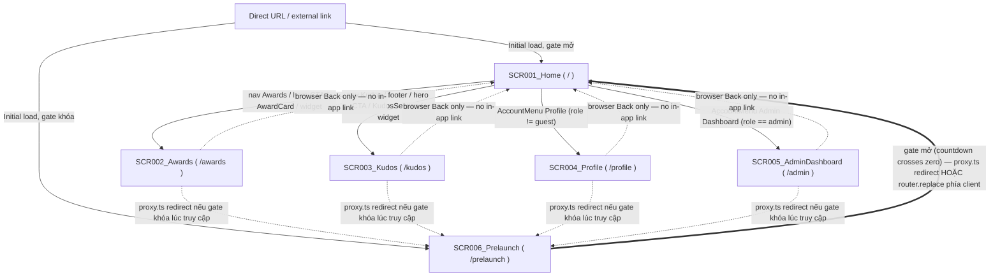
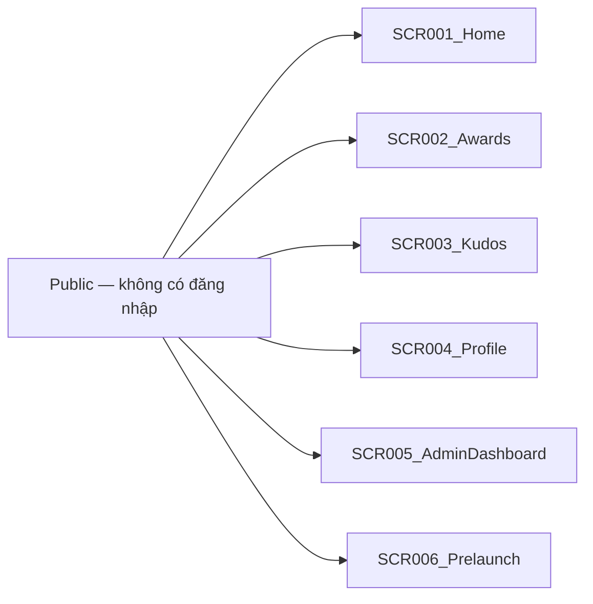

# Screen Flow

**Project**: Sun* Annual Awards 2025 (SAA 2025) — Homepage sự kiện
**Generated**: 2026-08-18
**Analysis Scope**: 5 screens (SCR001–SCR005) từ `screen-list.md`, route-view (web), Next.js App Router static.

**Code Format**: `SCR###_NameSlug`.

## Navigation Map

**Đọc sơ đồ:** Mọi cạnh đi ra từ SCR001 là link thật (`next/link` `href`). 4 cạnh nét đứt quay về SCR001 là **giả định browser Back**, không phải link trong app — SCR002–SCR005 tự render `<main>` trần (không có `SiteHeader`/`SiteFooter`, vì layout gốc `app/layout.tsx` chỉ bọc `SessionProvider`/`LocaleProvider`, không có chrome dùng chung). Cạnh nét đứt từ SCR002–SCR005 vào SCR006 và cạnh đậm SCR006 → SCR001 là **thêm 2026-08-19**: không phải link người dùng bấm, mà là redirect do `proxy.ts` (server) hoặc `router.replace()` (client) thực hiện — xem § Guard Logic bên dưới và `docs/vi/system/architecture.md` § Request-Interception Layer. Xem chi tiết ở § Screen Transitions.

## Feature Entry Points

<!-- Feature Entry Points: run /tkm:rebuild-spec --feature-specs to populate -->

## Screen Access Paths

| From Screen | To Screen | Action/Trigger | Conditions | Region |
|-------------|-----------|----------------|------------|--------|
| START | SCR001_Home | Initial load / direct URL `/` | None | |
| SCR001_Home | SCR002_Awards | Click nav "Awards", hero CTA, bất kỳ AwardCard "Chi tiết" link, hoặc QuickActionWidget "Về SAA" | None | |
| SCR001_Home | SCR003_Kudos | Click nav "Kudos", footer "Kudos" link, hero CTA, KudosSection "Chi tiết" link, hoặc QuickActionWidget "Viết Kudos" | None | |
| SCR001_Home | SCR004_Profile | Click AccountMenu "Profile" | `role !== 'guest'` (AccountMenu ẩn hoàn toàn khi `role === 'guest'`) | |
| SCR001_Home | SCR005_AdminDashboard | Click AccountMenu "Admin Dashboard" | `role === 'admin'` (mục menu chỉ hiện khi role này; **route `/admin` vẫn truy cập trực tiếp được với mọi role** — xem § Guard Logic) | |
| SCR002_Awards | SCR001_Home | Browser Back | Không có link trong-app — `app/awards/page.tsx` không render header/footer | |
| SCR003_Kudos | SCR001_Home | Browser Back | Không có link trong-app | |
| SCR004_Profile | SCR001_Home | Browser Back | Không có link trong-app | |
| SCR005_AdminDashboard | SCR001_Home | Browser Back | Không có link trong-app | |
| START | SCR006_Prelaunch | Initial load / direct URL bất kỳ (kể cả `/`, `/awards`, `/kudos`, `/profile`, `/admin`) | Gate khóa (`!isExpired && !isInvalid`) — `proxy.ts` redirect trước khi route đích render | |
| SCR001_Home / SCR002–SCR005 | SCR006_Prelaunch | `proxy.ts` redirect (request mới) | Gate khóa | |
| SCR006_Prelaunch | SCR001_Home | `proxy.ts` redirect (request mới tới `/prelaunch`) HOẶC `router.replace('/')` phía client (actor đang mở sẵn trang) | Gate mở (`isExpired \|\| isInvalid`) | |

> Region column: bỏ trống ở mọi dòng — không có REG### nào (0 composite screen, xem `screen-list.md`).

## Screen Transitions

### SCR001_Home (Home)

**Entry Points**:
- Direct URL access `/`
- External link (bookmark, search engine, chia sẻ)

**Exit Points**:
- To SCR002_Awards: nav link / hero CTA / AwardCard "Chi tiết" / widget "Về SAA"
- To SCR003_Kudos: nav link / footer link / hero CTA / KudosSection "Chi tiết" / widget "Viết Kudos"
- To SCR004_Profile: AccountMenu "Profile" (chỉ hiện khi `role !== 'guest'`)
- To SCR005_AdminDashboard: AccountMenu "Admin Dashboard" (chỉ hiện khi `role === 'admin'`)

**Decision Points**:
- Hiển thị AccountMenu/NotificationBell: nếu `role === 'guest'` → cả hai ẩn hoàn toàn, không render gì; ngược lại → hiện
- Mục "Admin Dashboard" trong AccountMenu: nếu `role === 'admin'` → hiện; ngược lại → ẩn
- Badge NotificationBell: nếu `unreadCount > 0` → hiện số; ngược lại → ẩn badge (panel dropdown luôn hiện empty-state cố định bất kể badge)

---

### SCR002_Awards (Awards)

**Entry Points**:
- From SCR001_Home: nav "Awards" / hero CTA / AwardCard "Chi tiết" (mang theo hash `#<slug>` — trình duyệt tự cuộn tới `<section id={slug}>`) / widget "Về SAA"
- Direct URL access `/awards` hoặc `/awards#<slug>`

**Exit Points**:
- To SCR001_Home: **chỉ qua browser Back** — trang không có `SiteHeader`/`SiteFooter`/link nào quay lại trong-app

**Decision Points**:
- None (route tĩnh, không rẽ nhánh)

---

### SCR003_Kudos (Kudos)

**Entry Points**:
- From SCR001_Home: nav "Kudos" / footer link / hero CTA / KudosSection "Chi tiết" / widget "Viết Kudos"
- Direct URL access `/kudos`

**Exit Points**:
- To SCR001_Home: **chỉ qua browser Back** — không có link trong-app

**Decision Points**:
- None

---

### SCR004_Profile (Profile)

**Entry Points**:
- From SCR001_Home: AccountMenu "Profile" (khi `role !== 'guest'`)
- Direct URL access `/profile` (không bị chặn bởi bất kỳ role nào)

**Exit Points**:
- To SCR001_Home: **chỉ qua browser Back**

**Decision Points**:
- None

---

### SCR005_AdminDashboard (AdminDashboard)

**Entry Points**:
- From SCR001_Home: AccountMenu "Admin Dashboard" (mục menu chỉ hiện khi `role === 'admin'`)
- Direct URL access `/admin` — **truy cập được với MỌI role, kể cả `guest`** (không có route guard thật, xem § Guard Logic)

**Exit Points**:
- To SCR001_Home: **chỉ qua browser Back**

**Decision Points**:
- None

---

### SCR006_Prelaunch (Prelaunch) — thêm 2026-08-19

**Entry Points**:
- Direct URL / external link tới BẤT KỲ route nào (`/`, `/awards`, `/kudos`, `/profile`,
  `/admin`, hoặc `/prelaunch` trực tiếp) trong khi gate còn khóa — `proxy.ts` redirect
  trước khi route đích kịp render
- Direct URL access `/prelaunch` khi gate đã mở cũng load được bình thường trong khoảnh
  khắc request, nhưng redirect `/` xảy ra ngay tại `proxy.ts` trước khi trang render (xem
  § Guard Logic)

**Exit Points**:
- To SCR001_Home: khi gate mở — `proxy.ts` redirect request mới, HOẶC
  `router.replace('/')` phía client nếu actor đang mở sẵn trang lúc đếm ngược chạm 0
  (trong vòng 1 giây, không cần tải lại)

**Decision Points**:
- Gate khóa/mở: suy từ `CountdownResult.isExpired`/`isInvalid` (`lib/countdown.ts`, tái
  dùng với đếm ngược SCR001) — khóa thì mọi route khác bị đưa về đây; mở thì chính màn
  này bị đưa về SCR001_Home
- Không có branch nào khác trên chính màn hình này — không có nút, không có form

---

## Region Transitions

`N/A — không có REG### nào trong screen-list.md (0 composite screen).`

---

## Authentication Flow

**Không có hệ thống authentication nào trong codebase** (khớp `system-overview.md` § Security Overview: "Không có — không tồn tại luồng đăng nhập/đăng xuất nào"). `role` (`guest|user|admin`) là **mock phía client** đọc từ `localStorage`/`NEXT_PUBLIC_*` (`lib/session/session-provider.tsx`), có cảnh báo tường minh ngay trong source rằng giá trị này sửa được từ DevTools và không có kiểm tra server nào tồn tại. Nó chỉ điều khiển **hiển thị UI** (ẩn/hiện AccountMenu, NotificationBell, mục "Admin Dashboard"), không phải một ranh giới bảo mật.

| Screen | Authentication Required | Authorization Level |
|--------|-------------------------|----------------------|
| SCR001_Home | No | Public |
| SCR002_Awards | No | Public |
| SCR003_Kudos | No | Public |
| SCR004_Profile | No | Public (route không kiểm tra role; chỉ mục menu dẫn tới bị ẩn theo mock role) |
| SCR005_AdminDashboard | No | Public (route KHÔNG được bảo vệ — comment nguồn `app/admin/page.tsx` cảnh báo tường minh; chỉ mục menu bị ẩn theo mock role, ai gõ thẳng URL vẫn xem được) |
| SCR006_Prelaunch | No | Public (mọi actor, không phân biệt role — nhưng KHÁC 5 dòng trên: có một request-interception layer thật (`proxy.ts`) chặn theo THỜI GIAN, không phải theo role; xem § Guard Logic ngay bên dưới) |

---

## Error Handling Flows

| Screen | Error | Handling | Scope |
|--------|-------|----------|-------|
| SCR001_Home | `NEXT_PUBLIC_EVENT_START_AT` thiếu hoặc không parse được (ISO date không hợp lệ) | `computeCountdown()` (`lib/countdown.ts`) trả `isInvalid: true`, CountdownTimer giữ nguyên zero-state ("00/00/00" + text "Coming soon") — không throw, không crash | screen |
| Toàn ứng dụng (`proxy.ts`, thêm 2026-08-19) | Cùng biến `NEXT_PUBLIC_EVENT_START_AT` thiếu/không hợp lệ, nhưng ở tầng gate chứ không phải hiển thị | `resolveGateRedirect()` (`lib/prelaunch/gate.ts:33-35`) trả `null` bất kể pathname — **fail-open**: gate coi như đã mở, không route nào bị khóa vì lỗi cấu hình | app-wide |

> Không có network/API error nào khác để document — hệ thống không gọi API nào (0 backend route, xác nhận `route-list.md` + `scout-report.md`). SCR002–SCR005 là nội dung tĩnh thuần, không có logic nào có thể lỗi. SCR006_Prelaunch không gọi API nào (đếm ngược là hàm thuần) — dòng lỗi duy nhất liên quan tới nó là dòng "Toàn ứng dụng" ở trên, vì gate ảnh hưởng tới việc nó có được hiển thị hay không, không phải lỗi xảy ra trên chính nó.

---

## Circular Dependencies Check

- [x] No circular dependencies detected (mọi cạnh đi ra từ SCR001; cạnh quay về là browser Back, không phải app-level navigation)
- [x] All screens have valid entry/exit points
- [x] All navigation paths terminate

---

## Guard Logic

**Cập nhật 2026-08-19**: dòng dưới đây từng ghi "Codebase không có `middleware.ts`" — điều
đó không còn đúng. Vẫn N/A cho **role-based route guard** (không có gì chặn theo
`role`/session — kết luận cũ về AccountMenu/`/admin` vẫn giữ nguyên, xem đoạn dưới), nhưng
giờ CÓ một request-interception layer thật, chỉ là nó gate theo **thời gian**, không phải
theo quyền.

`proxy.ts` (tên mới của `middleware.ts` từ Next 16) chặn MỌI route (bao gồm cả `/admin`,
`/profile`) và đưa về `/prelaunch` cho tới khi `NEXT_PUBLIC_EVENT_START_AT` tới/qua hạn —
xem `docs/vi/system/architecture.md` § Request-Interception Layer,
`docs/vi/generated/behavior-logic.md` BL001. Guard này áp dụng như nhau cho mọi actor
(guest/user/admin) — nó không đọc `role`, không phải một cơ chế phân quyền, và không thay
đổi bất kỳ kết luận nào về `/admin` bên dưới.

**Role-based guard: vẫn N/A — no route guards detected theo role.**

Mục "Admin Dashboard" trong AccountMenu chỉ là **hiển thị/ẩn UI** theo mock role
(`lib/session/session-provider.tsx`) — nó không chặn navigation. Điều hướng thẳng URL
`/admin` (gõ tay, bookmark, chia sẻ link) render trang bình thường bất kể `role`, kể cả
`guest` — **miễn là gate đếm-ngược đã mở**; nếu gate còn khóa, `/admin` (cùng `/`,
`/awards`, `/kudos`, `/profile`) bị `proxy.ts` chặn về `/prelaunch` cho MỌI role như
nhau, không phải một ngoại lệ cho `admin`. Comment nguồn trong `app/admin/page.tsx` xác
nhận tường minh: "this page is NOT access-controlled and must not be treated as
protected". Đây là gap bảo mật đã biết và được document có chủ đích (ADR-001), không phải
bug bỏ sót — và launch-timing gate (ADR-002) không thay đổi kết luận này theo bất kỳ
hướng nào.

---

## Deep-Link State Restoration

`N/A — no URL-driven state restoration detected.`

SCR002_Awards dùng hash anchor (`/awards#<slug>`) để trình duyệt tự cuộn tới `<section id={slug}>` — đây là hành vi cuộn gốc của trình duyệt (CSS `scroll-mt-24`), KHÔNG phải app đọc `useSearchParams`/`router.query` để dựng lại state. Không có state nào được "restore" — trang render y hệt nhau dù có hash hay không, chỉ khác vị trí cuộn ban đầu.

---

## Unsaved-Changes Protection

`N/A — no unsaved-changes guards detected.`

Không có form nhập liệu nào trong 5 screen — không có gì để mất khi rời trang.

---

## Extraction Signatures

### Guard Logic
Grep `beforeEnter|canActivate|middleware|loader|before_action` trên `app/**/page.tsx` — không có kết quả khớp (không guard nào gắn trực tiếp vào route config theo role). **Cập nhật 2026-08-19**: `proxy.ts` (root, không phải `app/**`) là request-interception layer thật — grep phạm vi ban đầu (`app/**/page.tsx`) không bắt được nó vì nó nằm ngoài `app/`; xác nhận trực tiếp bằng cách đọc `proxy.ts` + `lib/prelaunch/gate.ts`. Guard này gate theo thời gian (`NEXT_PUBLIC_EVENT_START_AT`), không đọc `role`/session nào — không mâu thuẫn với kết luận "no role-based guard" ở trên.

### Deep-Link State Restoration
Grep `useSearchParams|useQuery|router\.query|URLSearchParams|params\[` trên `app/**/page.tsx` và các component import trực tiếp — không có kết quả khớp.

### Unsaved-Changes Protection
Grep `beforeunload|onbeforeunload|usePrompt|useBeforeUnload|leaveGuard|isDirty|formState\.isDirty` — không có kết quả khớp (không có form nào trong repo).
