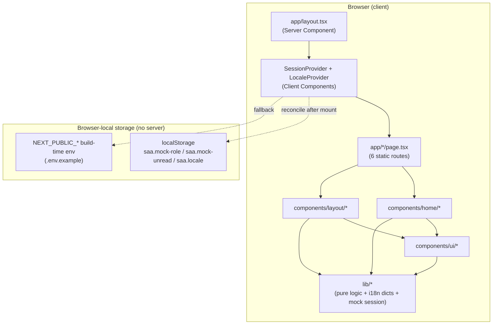
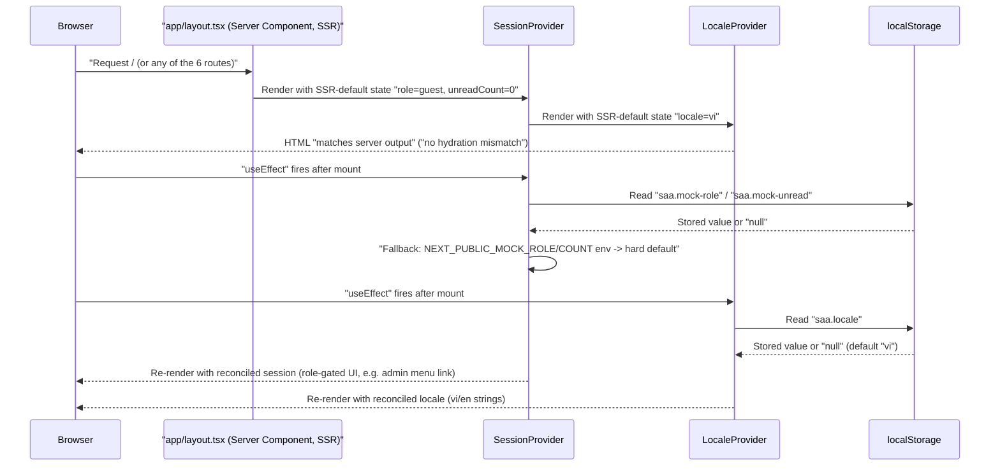
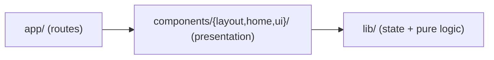
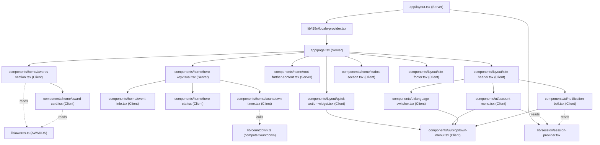

# Architecture

## System Architecture

Ứng dụng là một trang tĩnh Next.js App Router, không có tầng backend. Toàn bộ 6 route
(`/`, `/awards`, `/kudos`, `/profile`, `/admin`, và `_not-found` do Next tự sinh) được
prerender ở build time; không có `app/api/**/route.ts`, không có `middleware.ts`, không có
database/ORM/queue nào trong cây nguồn (xác nhận tại `scout-report.md` § Background Logic
Source Inventory — mọi hạng mục đều `_(none found)_`).

Không có "API Gateway", "Services", hay "Data Layer" phía sau — bỏ hẳn 3 subgraph đó khỏi
sơ đồ gốc của template vì hệ thống này không có backend tier nào tồn tại.

## Tech Stack

| Layer | Technology | Version |
|-------|------------|---------|
| Framework | Next.js (App Router) | 16.3.1 |
| UI library | React / react-dom | 19.2.8 |
| Language | TypeScript | ^5 |
| Styling | Tailwind CSS (CSS-first, `@import "tailwindcss"` + `@theme inline` trong `app/globals.css`; không có `tailwind.config.ts`) | ^4 (`@tailwindcss/postcss` ^4) |
| Lint | ESLint (flat config, `eslint-config-next`) | ^9 / 16.3.1 |
| E2E test runner | Playwright (`@playwright/test`, `playwright.config.ts`) | ^1.62.1 |
| Unit test runner | Playwright (`playwright.unit.config.ts`, chạy `lib/*.test.ts`) | ^1.62.1 (dùng chung install) |
| Package manager | npm (`package-lock.json`) | — |
| Backend | none | not-applicable |
| Database | none | not-applicable |
| Cache | none | not-applicable |
| Queue | none | not-applicable |

## Data Flow

Không có request/response qua network layer nào ngoài lần Next.js phục vụ HTML/JS tĩnh đã
prerender. "Data flow" thực chất là luồng state phía client: mount → đọc localStorage/env →
reconcile → render lại UI. Sequence dưới đây thay cho client→API→service→store gốc của
template (không áp dụng được vì thiếu 3 tầng đó):

## Layering

Chiều phụ thuộc là một chiều: `lib/` không import bất cứ gì từ `components/` (xác nhận qua
grep toàn bộ import trong `lib/*.ts(x)` — chỉ import `react` và các dictionary nội bộ của
chính `lib/i18n/`). Ranh giới component/route ngược lại đọc `lib/` thoải mái
(`useI18n`, `useSession`, `computeCountdown`, `AWARDS`/`awardHref`).

## Component composition (module graph, xác nhận qua Grep import)

**Đính chính so với giả định trong task brief**: không phải toàn bộ `components/` đều là
Client Component. Grep trực tiếp `'use client'` trên từng file trong `components/` (15 file
`.tsx` tổng cộng) cho thấy đúng 2 ngoại lệ giữ nguyên Server Component:
`components/home/hero-keyvisual.tsx` và `components/home/root-further-content.tsx` — cả hai
chỉ compose các component con và không gọi hook/state, nên không cần opt-in client. 13 file
`.tsx` còn lại trong `components/` đều khai `'use client'` ở dòng đầu.

Lý do chia 3 lớp `app/` → `components/` → `lib/` không chỉ để tách trình bày khỏi logic: nó
còn cho phép `lib/countdown.ts` test độc lập bằng input `now` do caller truyền vào (không gọi
`Date.now()` bên trong — xác nhận `lib/countdown.ts:35`), và trong giai đoạn build ban đầu nó
tách quyền sở hữu file — `components/**` do Track A (UI trình bày) giữ, `lib/**` do Track B
(hành vi + logic) giữ — để hai track chạy song song không đụng file nhau (xem
`clarifications.md`, mục "Ownership of components/ui/dropdown-menu.tsx").

## Cross-cutting concerns

- **Hai React Context Provider**, cả hai cùng một pattern SSR-default → `useEffect`
  reconcile (đã đọc trực tiếp source, không suy đoán):
  - `lib/session/session-provider.tsx` — mock role (`guest|user|admin`) + unread count,
    thứ tự ưu tiên `localStorage` → `NEXT_PUBLIC_MOCK_ROLE`/`NEXT_PUBLIC_MOCK_UNREAD_COUNT`
    → default cứng (`resolveSession()`, dòng 43-58). File có cảnh báo bảo mật ngay trong
    comment (dòng 3-10): đây **không** phải ranh giới auth, chỉ gate UI, không có kiểm tra
    phía server.
  - `lib/i18n/locale-provider.tsx` — locale `vi|en`, thứ tự ưu tiên `localStorage` →
    default `vi` (`resolvePersistedLocale()`, dòng 29-32). Comment (dòng 3-5) ghi rõ chọn
    hand-rolled thay vì thêm dependency `next-intl` (YAGNI, deferred tới khi có locale thứ 3).
  - **Ranh giới trách nhiệm**: `SessionProvider` không biết gì về ngôn ngữ; `LocaleProvider`
    không biết gì về role — component tiêu thụ qua hai hook riêng (`useSession()` tại
    `lib/session/session-provider.tsx:79-81`, `useI18n()` tại
    `lib/i18n/locale-provider.tsx:77-79`), không đọc context trực tiếp.
  - Lý do đầy đủ hai quyết định này (vì sao mock session, vì sao hand-rolled i18n, điều kiện
    nâng cấp) → [ADR-001](../../decisions/ADR-001-mock-session-and-hand-rolled-i18n.md).
- **Testing kép trên cùng một Playwright install**:
  - `playwright.config.ts` (E2E) — 2 project, 2 `webServer` tách biệt cổng 3000/3100, mỗi
    server set một giá trị `NEXT_PUBLIC_EVENT_START_AT` khác nhau (một hợp lệ, một
    `'not-a-date'`) để bài test `homepage-invalid-env.spec.ts` có môi trường build riêng —
    không tái dùng dev server đang chạy sẵn (`reuseExistingServer: false` cả hai, dòng
    31/38-39 — comment trong file giải thích lý do: tránh race điều kiện làm bài test
    countdown "xanh giả"). Hai server chạy hai lệnh khác nhau, không đối xứng: cổng 3000
    dùng `next dev` (vòng lặp RED→GREEN nhanh), cổng 3100 dùng `next build && next start`
    (bản production thật cho case invalid-env, tránh HMR can thiệp vào giá trị env đã đóng
    băng).
  - `playwright.unit.config.ts` — chạy như một unit runner thuần (`testDir: './lib'`,
    match `*.test.ts`), không mở `webServer`, dùng cho `lib/awards.test.ts` và
    `lib/countdown.test.ts`.

## Configuration

| Biến | Nguồn | Vì sao `NEXT_PUBLIC_` |
|---|---|---|
| `NEXT_PUBLIC_EVENT_START_AT` | `.env.example` — ISO-8601, mặc định `2026-12-19T18:30:00+07:00` (~90 ngày, để dev thấy "Coming soon" với DAYS/HOURS/MINUTES khác 0) | Countdown chạy trên client (`setInterval`/`useEffect` trong `components/home/countdown-timer.tsx`), cần đọc giá trị này trong browser mỗi giây — bắt buộc prefix `NEXT_PUBLIC_` để Next inline lúc build |
| `NEXT_PUBLIC_MOCK_ROLE` | `.env.example`, mặc định `guest` — chỉ dùng khi `localStorage` (`saa.mock-role`) chưa có giá trị | Fallback seed cho `SessionProvider`, không phải security boundary |
| `NEXT_PUBLIC_MOCK_UNREAD_COUNT` | `.env.example`, mặc định `0` — cùng cơ chế fallback | Fallback seed số thông báo chưa đọc |

Giá trị `NEXT_PUBLIC_*` đóng băng lúc `next build`/lúc server process khởi động, không đổi
được giữa chừng — lý do bộ E2E cần 2 `webServer` trên 2 port thay vì 1 server đổi env giữa
các test (xem mục Testing ở trên).

`targetIso` không parse được (rỗng hoặc sai định dạng) không được crash: `computeCountdown`
(`lib/countdown.ts:35-43`) bắt lỗi bằng `Date.parse` + `Number.isNaN` và trả về trạng thái
zero (`isInvalid: true`, `00d 00h 00m`) — cùng hình dạng dữ liệu với trạng thái "sự kiện đã
bắt đầu" (`isExpired: true`), UI không phân biệt hai case này (giữ component đơn giản).

## Routing

| Route | File | Nội dung |
|---|---|---|
| `/` | `app/page.tsx` | Trang chủ Homepage SAA đầy đủ (Header, Hero+Countdown, Awards, Kudos, Widget, Footer) |
| `/awards` | `app/awards/page.tsx` (19 dòng) | Placeholder có chủ đích — render 6 `<section id={slug}>` theo `AWARDS` (`lib/awards.ts`) làm đích hash-anchor thật; không có nội dung Awards Information đầy đủ |
| `/kudos` | `app/kudos/page.tsx` (10 dòng) | Placeholder có chủ đích — chỉ tiêu đề, chưa có nội dung Sun* Kudos |
| `/profile` | `app/profile/page.tsx` (16 dòng) | Placeholder — đích của mục "Profile" trong account menu, tồn tại để không 404 (TC ID-59) |
| `/admin` | `app/admin/page.tsx` (16 dòng) | Placeholder — đích của mục "Admin Dashboard"; comment dòng 1-4 nói rõ trang KHÔNG có access control (xem `permissions.md`) |

Hash-anchor scroll (`/awards#top-talent` từ card/CTA/nav) hoạt động nhờ
`data-scroll-behavior="smooth"` trên thẻ `<html>` (`app/layout.tsx:33`) — Next 16 bỏ việc tự
động ép `scroll-behavior: smooth` khi chuyển trang SPA so với 15; thiếu attribute này thì
`Link` vẫn nhảy đúng section nhưng không smooth.

## Asset Strategy

Ảnh MoMorph (hero keyvisual, ROOT/FURTHER logo, 6 thumbnail award, icon) phục vụ qua
`next/image` từ `public/`, tham chiếu bằng root-relative path (vd `/saa/Keyvisual_BG.png`,
`/images/awards/*.png` — `lib/awards.ts:30` v.v.). Prop `priority` (Next 15) đã deprecated
trong Next 16 — 2 ảnh LCP của hero dùng `preload` thay thế, xác nhận
`components/home/hero-keyvisual.tsx:23,35`. `next.config.ts` không khai báo
`images.qualities` hay `images.localPatterns` — không ảnh nào trong build này cần quality
khác mặc định (`75`) hay query-string cache-busting, nên không cần cấu hình thêm.

## Unresolved / out of scope for this artifact

- `app/_not-found` không có file tùy biến trong cây nguồn — đây là route auto-generate của
  Next.js App Router, không phải file thiếu; không vẽ riêng trong sơ đồ vì không có source
  file tương ứng. Cờ này đã có trong `scout-report.md` § Unresolved Questions, để nguyên
  cho pha tổng hợp feature/screen quyết định có cần một dòng ghi chú riêng hay không.
- Không xác minh runtime thực tế (không chạy `next dev`/Playwright trong tác vụ này) — toàn
  bộ sơ đồ dựa trên đọc source tĩnh (`grep`/`Read`), phù hợp phạm vi Wave 1 (architecture
  synthesis), không phải một lần kiểm thử hành vi.
