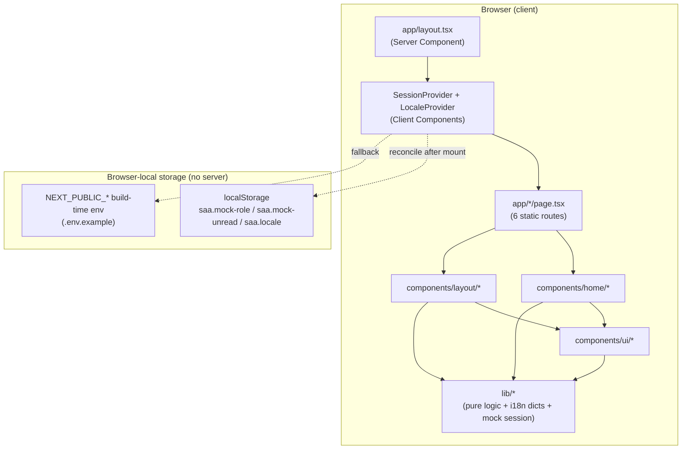
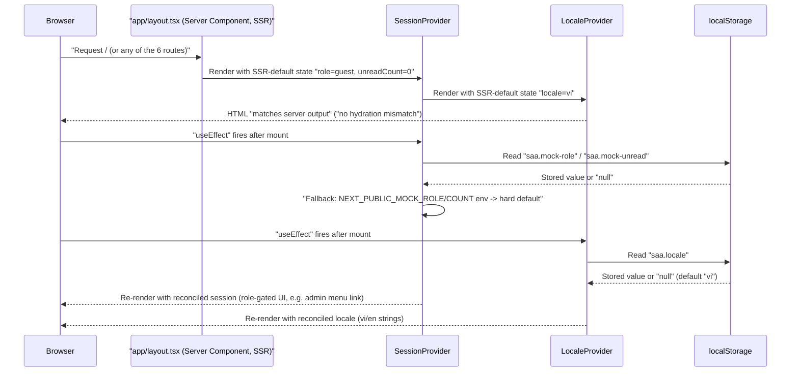
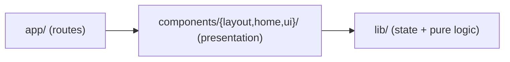
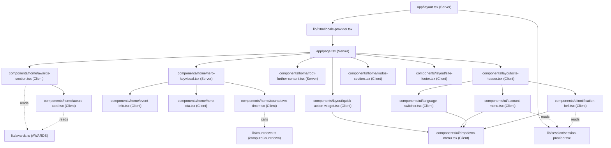
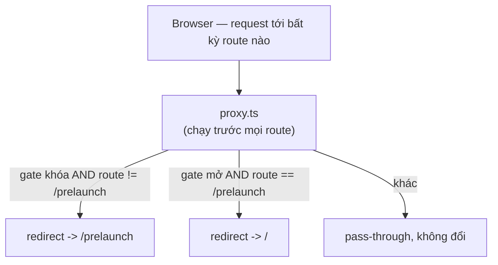
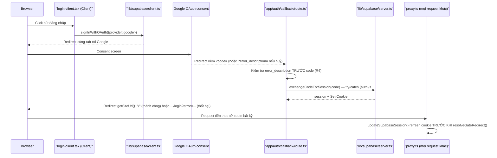
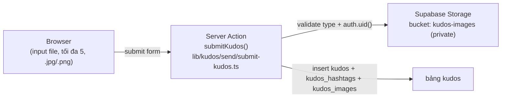

# Architecture

## System Architecture

Ứng dụng là một trang tĩnh Next.js App Router, không có tầng backend: không có
`app/api/**/route.ts`, không có database/ORM/queue nào trong cây nguồn (xác nhận tại
`scout-report.md` § Background Logic Source Inventory — mọi hạng mục đều `_(none found)_`,
ngoại trừ một request-interception layer thêm sau đó — xem § Request-Interception Layer
bên dưới). Toàn bộ 7 route (`/`, `/prelaunch`, `/awards`, `/kudos`, `/profile`, `/admin`,
và `_not-found` do Next tự sinh) được prerender ở build time.

**Đính chính so với bản trước của tài liệu này**: dòng trên từng ghi "không có
`middleware.ts`" — điều đó không còn đúng. `proxy.ts` (tên mới của quy ước `middleware.ts`
kể từ Next 16 — quy ước cũ đã deprecated, xem
`node_modules/next/dist/docs/01-app/03-api-reference/03-file-conventions/proxy.md`) nay
chặn MỌI request tới bất kỳ route nào trước khi route đó render, để thực hiện gate đếm-ngược
trước-khi-mở-site cho trang `/prelaunch`. Đây là **gate theo THỜI GIAN (launch-timing),
không phải một ranh giới ủy quyền (authorization boundary)** — nó không đọc
`role`/`SessionState` của `lib/session/session-provider.tsx` (đã tự ghi rõ là mock, không
phải access control — xem § Cross-cutting concerns bên dưới) hay bất kỳ state phía client
nào khác; mọi actor (guest/user/admin) đều nhận cùng một quyết định khóa/mở, không phân
biệt vai trò. Đừng nhầm layer này với PERM001–PERM003
(`docs/vi/generated/permissions-matrix.md`) — 3 mã đó vẫn là toàn bộ role-gating tồn tại
trong hệ thống; gate này nằm trên một trục hoàn toàn khác. Chi tiết cơ chế, quyết định
kiến trúc, và rationale đầy đủ nằm ở § Request-Interception Layer (Prelaunch Gate) bên
dưới và [ADR-002](../../decisions/ADR-002-prelaunch-launch-timing-gate.md).

**Cập nhật (lượt Login, 2026-08-19)**: dòng mở đầu ở trên ("không có tầng backend... không
có `app/api/**/route.ts`") không còn đúng theo nghĩa tuyệt đối. `app/auth/callback/route.ts`
là route handler thật ĐẦU TIÊN của codebase này (xử lý redirect OAuth từ Google/Supabase),
và `proxy.ts` (cùng file gate ở trên — Next 16 chỉ nạp đúng MỘT proxy) nay đảm nhiệm THÊM một
việc: refresh session cookie Supabase trên mọi request. Hệ thống vẫn không có database/ORM
riêng của app (Supabase tự quản lý schema `auth.users` của nó, app không viết migration nào).
Chi tiết đầy đủ ở § Authentication Layer (Supabase + Google OAuth) bên dưới.



Không có "API Gateway", "Services", hay "Data Layer" phía sau — bỏ hẳn 3 subgraph đó khỏi
sơ đồ gốc của template vì hệ thống này không có backend tier nào tồn tại.

## Tech Stack

| Layer | Technology | Version |
|-------|------------|---------|
| Framework | Next.js (App Router) | 16.3.1 |
| UI library | React / react-dom | 19.2.8 |
| Language | TypeScript | ^5 |
| Styling | Tailwind CSS (CSS-first, `@import "tailwindcss"` + `@theme inline` trong `app/globals.css`; không có `tailwind.config.ts`) | ^4 (`@tailwindcss/postcss` ^4) |
| Lint | ESLint (flat config, `eslint-config-next`) | ^9 / 16.3.1 |
| E2E test runner | Playwright (`@playwright/test`, `playwright.config.ts`) | ^1.62.1 |
| Unit test runner | Playwright (`playwright.unit.config.ts`, chạy `lib/*.test.ts`) | ^1.62.1 (dùng chung install) |
| Package manager | npm (`package-lock.json`) | — |
| Backend | none cho phần còn lại của app; **thêm 2026-08-19** — 1 route handler thật (`app/auth/callback/route.ts`) cho OAuth callback | not-applicable (ngoại trừ route handler trên) |
| Database | none do app tự định nghĩa; **thêm 2026-08-19** — Postgres nội bộ của Supabase local (`auth.users`, app không viết migration) | Supabase CLI local (Docker) |
| Auth | **thêm 2026-08-19** — Supabase Auth (GoTrue) + Google OAuth provider, qua `@supabase/supabase-js` + `@supabase/ssr` (`lib/supabase/{client,server,proxy-session,env}.ts`) | `@supabase/ssr` (xem `package.json`) |
| Cache | none | not-applicable |
| Queue | none | not-applicable |

## Data Flow

Không có request/response qua network layer nào ngoài lần Next.js phục vụ HTML/JS tĩnh đã
prerender. "Data flow" thực chất là luồng state phía client: mount → đọc localStorage/env →
reconcile → render lại UI. Sequence dưới đây thay cho client→API→service→store gốc của
template (không áp dụng được vì thiếu 3 tầng đó):



## Layering



Chiều phụ thuộc là một chiều: `lib/` không import bất cứ gì từ `components/` (xác nhận qua
grep toàn bộ import trong `lib/*.ts(x)` — chỉ import `react` và các dictionary nội bộ của
chính `lib/i18n/`). Ranh giới component/route ngược lại đọc `lib/` thoải mái
(`useI18n`, `useSession`, `computeCountdown`, `AWARDS`/`awardHref`).

## Component composition (module graph, xác nhận qua Grep import)



**Đính chính so với giả định trong task brief**: không phải toàn bộ `components/` đều là
Client Component. Grep trực tiếp `'use client'` trên từng file trong `components/` (15 file
`.tsx` tổng cộng) cho thấy đúng 2 ngoại lệ giữ nguyên Server Component:
`components/home/hero-keyvisual.tsx` và `components/home/root-further-content.tsx` — cả hai
chỉ compose các component con và không gọi hook/state, nên không cần opt-in client. 13 file
`.tsx` còn lại trong `components/` đều khai `'use client'` ở dòng đầu.

Lý do chia 3 lớp `app/` → `components/` → `lib/` không chỉ để tách trình bày khỏi logic: nó
còn cho phép `lib/countdown.ts` test độc lập bằng input `now` do caller truyền vào (không gọi
`Date.now()` bên trong — xác nhận `lib/countdown.ts:35`), và trong giai đoạn build ban đầu nó
tách quyền sở hữu file — `components/**` do Track A (UI trình bày) giữ, `lib/**` do Track B
(hành vi + logic) giữ — để hai track chạy song song không đụng file nhau (xem
`clarifications.md`, mục "Ownership of components/ui/dropdown-menu.tsx").

## Cross-cutting concerns

- **Hai React Context Provider**, cả hai cùng một pattern SSR-default → `useEffect`
  reconcile (đã đọc trực tiếp source, không suy đoán):
  - `lib/session/session-provider.tsx` — mock role (`guest|user|admin`) + unread count,
    thứ tự ưu tiên `localStorage` → `NEXT_PUBLIC_MOCK_ROLE`/`NEXT_PUBLIC_MOCK_UNREAD_COUNT`
    → default cứng (`resolveSession()`, dòng 43-58). File có cảnh báo bảo mật ngay trong
    comment (dòng 3-10): đây **không** phải ranh giới auth, chỉ gate UI, không có kiểm tra
    phía server.
  - `lib/i18n/locale-provider.tsx` — locale `vi|en`, thứ tự ưu tiên `localStorage` →
    default `vi` (`resolvePersistedLocale()`, dòng 29-32). Comment (dòng 3-5) ghi rõ chọn
    hand-rolled thay vì thêm dependency `next-intl` (YAGNI, deferred tới khi có locale thứ 3).
  - **Ranh giới trách nhiệm**: `SessionProvider` không biết gì về ngôn ngữ; `LocaleProvider`
    không biết gì về role — component tiêu thụ qua hai hook riêng (`useSession()` tại
    `lib/session/session-provider.tsx:79-81`, `useI18n()` tại
    `lib/i18n/locale-provider.tsx:77-79`), không đọc context trực tiếp.
  - Lý do đầy đủ hai quyết định này (vì sao mock session, vì sao hand-rolled i18n, điều kiện
    nâng cấp) → [ADR-001](../../decisions/ADR-001-mock-session-and-hand-rolled-i18n.md).
  - **Cập nhật (lượt Login, 2026-08-19) — hai ranh giới "trạng thái người dùng" tồn tại song
    song, KHÔNG hợp nhất ở lượt này**: `SessionProvider` ở trên vẫn y nguyên — mock, đọc
    `localStorage`, vẫn KHÔNG phải security boundary. Đứng cạnh nó, giờ có một phiên
    Supabase THẬT (cookie do `@supabase/ssr` quản lý, xác thực qua Google) — không ai giả
    mạo được từ DevTools như mock role. Hai cái **không đọc lẫn nhau**: `role` hiển thị UI
    (account menu, notification bell, mục Admin Dashboard) vẫn hoàn toàn do mock session
    quyết định; phiên Supabase chỉ quyết định đúng một việc — có được xem `/login` hay bị
    đưa về `/` (xem § Authentication Layer bên dưới, và
    [permissions.md](permissions.md) đã cập nhật). Đừng đọc nhầm: sự tồn tại của phiên
    Supabase KHÔNG có nghĩa là các route khác (`/`, `/awards`, `/kudos`, `/profile`,
    `/admin`) đã được bảo vệ — chúng vẫn y nguyên như mô tả ở trên, không kiểm tra session
    nào. Việc hợp nhất hai ranh giới này (dùng phiên Supabase để xác định `role` thật, bảo
    vệ route khác) nằm ngoài phạm vi lượt này.
- **Testing kép trên cùng một Playwright install**:
  - `playwright.config.ts` (E2E) — 2 project, 2 `webServer` tách biệt cổng 3000/3100, mỗi
    server set một giá trị `NEXT_PUBLIC_EVENT_START_AT` khác nhau (một hợp lệ, một
    `'not-a-date'`) để bài test `homepage-invalid-env.spec.ts` có môi trường build riêng —
    không tái dùng dev server đang chạy sẵn (`reuseExistingServer: false` cả hai, dòng
    31/38-39 — comment trong file giải thích lý do: tránh race điều kiện làm bài test
    countdown "xanh giả"). Hai server chạy hai lệnh khác nhau, không đối xứng: cổng 3000
    dùng `next dev` (vòng lặp RED→GREEN nhanh), cổng 3100 dùng `next build && next start`
    (bản production thật cho case invalid-env, tránh HMR can thiệp vào giá trị env đã đóng
    băng).
  - `playwright.unit.config.ts` — chạy như một unit runner thuần (`testDir: './lib'`,
    match `*.test.ts`), không mở `webServer`, dùng cho `lib/awards.test.ts` và
    `lib/countdown.test.ts`.

## Request-Interception Layer (Prelaunch Gate)

`proxy.ts` ở project root chạy trước mọi route, kể cả `/`. Nó không thêm state mới, không
thêm bảng CSDL mới — chỉ đọc lại `NEXT_PUBLIC_EVENT_START_AT` (biến đã có sẵn cho đếm
ngược trang chủ) qua cùng hàm thuần `computeCountdown` (`lib/countdown.ts`), gói trong
`resolveGateRedirect()` (`lib/prelaunch/gate.ts`) để quyết định redirect. Vì `proxy.ts`
chạy trên runtime server của Next.js (không có `localStorage`, không có DOM), quyết định
này KHÔNG đọc `saa.mock-role`/`saa.locale` hay bất kỳ state phía client nào.



**Quy tắc rẽ nhánh** (`resolveGateRedirect`, `lib/prelaunch/gate.ts:26-44`):
- Khóa (`!isExpired`) và route khác `/prelaunch` → redirect `/prelaunch`.
- Khóa và đã ở `/prelaunch` → `null` (không tự redirect vào chính nó, tránh vòng lặp).
- Mở (`isExpired`) và đang ở `/prelaunch` → redirect `/`.
- `isInvalid` (biến env thiếu/sai định dạng) → luôn `null`, bất kể pathname — **fail-open**:
  một lỗi cấu hình không bao giờ khóa cứng toàn site. Lý do chọn hướng này thay vì
  fail-closed nằm ở [ADR-002](../../decisions/ADR-002-prelaunch-launch-timing-gate.md).

**Matcher loại trừ** (`export const config.matcher` trong `proxy.ts`):
`'/((?!_next/static|_next/image|favicon.ico|.*\\..*).*)'` — loại mọi path chứa dấu chấm
sau dấu `/` đầu tiên (không chỉ 3 alternative liệt kê tên trong biểu thức), nên bảo vệ
được `/saa/Prelaunch_BG.png`, `/fonts/digital-numbers.woff2`, và bất kỳ static asset có
phần mở rộng nào khác — thiếu bước loại trừ này, `/prelaunch` sẽ tự redirect ảnh
nền/font/CSS của chính nó vào chính nó và render trần trụi.

**Nửa còn lại — client-side unlock**: `proxy.ts` chỉ chặn ở request MỚI. Một actor đang
mở sẵn `/prelaunch` đúng lúc đếm ngược chạm 0 sẽ không tự nhận request mới nào để proxy
can thiệp — nếu chỉ có nửa server, actor đó bị "kẹt" ở `00 00 00` cho tới khi tự tải lại.
`lib/prelaunch/use-prelaunch-countdown.ts` bù lại bằng cách tick mỗi 1 giây và gọi
`router.replace('/')` ngay khi client thấy `isExpired`/`isInvalid`, có throttle qua
`sessionStorage` (tối đa 1 lần mỗi 30 giây) để tránh vòng lặp nhấp nháy khi đồng hồ
client/server lệch nhau. Rationale đầy đủ và giới hạn đã biết của cơ chế throttle này nằm
ở [ADR-002](../../decisions/ADR-002-prelaunch-launch-timing-gate.md).

## Authentication Layer (Supabase + Google OAuth) — thêm 2026-08-19

Lần đầu tiên hệ thống có một ranh giới xác thực THẬT, cho đúng một mục đích: màn `/login`.
4 module `lib/supabase/{client,server,proxy-session,env}.ts` đều dùng factory của
`@supabase/ssr` (không phải `@supabase/auth-helpers-nextjs` đã deprecated) với adapter cookie
`getAll`/`setAll` — `cookies()` từ `next/headers` là async trong Next 16 nên phải `await`
trước khi đưa vào adapter.



**3 quyết định đáng ghi lại nhất của lớp này:**

1. **`getUser()`, không bao giờ `getSession()`, ở phía server** (`app/login/page.tsx`,
   `lib/supabase/proxy-session.ts`) — cookie là input không đáng tin trên server; `getUser()`
   round-trip thật tới Supabase Auth, `getSession()` chỉ đọc cookie tại chỗ mà không xác
   minh lại.
2. **Redirect của `app/auth/callback/route.ts` luôn dựng từ `getSiteUrl()`
   (`lib/supabase/env.ts`), KHÔNG BAO GIỜ từ `request.nextUrl.origin`** — phát hiện từ
   security review (mức High): route này không xác thực và internet-reachable; `nextUrl.origin`
   suy ra từ header `Host`/`X-Forwarded-Host` do client gửi, nên phía sau hạ tầng không pin
   `Host`, một header giả mạo có thể biến route thành open-redirect tới origin của kẻ tấn
   công. `getSiteUrl()` là config tĩnh (`NEXT_PUBLIC_SITE_URL`, mặc định
   `http://localhost:3000`), không bao giờ suy ra từ request.
3. **`proxy.ts` — rủi ro cao nhất của lượt này**: `@supabase/ssr` ghi cookie refresh lên
   object response nó được giao qua `setAll`. Next 16 chỉ nạp đúng MỘT `proxy.ts`, nên gate
   đếm-ngược (BL001, xem § Request-Interception Layer ở trên) và việc refresh session
   Supabase bắt buộc sống chung một file. Nếu gate sau đó trả về một `NextResponse.redirect`
   KHÁC với response đã có cookie refresh, cookie đó biến mất — actor bị đăng xuất âm thầm
   trên mọi request có gate can thiệp. Cách xử lý: `updateSupabaseSession()`
   (`lib/supabase/proxy-session.ts`) trả về cả `response` LẪN danh sách `supabaseCookies` nó
   đã ghi; `proxy.ts` copy thủ công từng cookie đó lên bất kỳ response nào cuối cùng thật sự
   được gửi đi (pass-through hoặc redirect của gate) — xem `proxy.ts` dòng 38-41.

**Exemption của gate đếm-ngược**: `/login` và `/auth/callback` được thêm vào
`ALWAYS_ALLOWED` của `lib/prelaunch/gate.ts`, miễn trừ theo CẢ HAI chiều (khóa và mở) — khác
với `/prelaunch` chỉ miễn trừ một chiều. Đây vẫn là quyết định launch-timing (cùng trục với
`/prelaunch`), KHÔNG phải nới lỏng authorization.

**Chưa xác minh bằng round-trip thật**: chưa có Google OAuth client ID/secret thật được cấp
(`SUPABASE_AUTH_EXTERNAL_GOOGLE_CLIENT_ID/SECRET` trong `.env.example` là placeholder) — stack
local (`supabase start`) khởi động và redirect `authorize` bắn ra bình thường, nhưng vòng
quay lại từ Google chưa được exercise với tài khoản thật. Xem § Local Supabase Development
Setup ngay dưới đây để cấu hình khi có credentials.

### Local Supabase Development Setup

Yêu cầu Docker chạy được (`colima start` trên máy không có Docker Desktop), sau đó:

```bash
supabase start   # đọc supabase/config.toml, in ra API URL + anon/publishable key thật
```

| Việc | Chi tiết |
|---|---|
| **Port đã dịch +100** | API `54421` (không phải mặc định `54321`), DB `54422`, Studio `54423`, Inbucket `54424` — một project Supabase local khác (`meeting-translation`) đã chiếm dải `54321-54324` trên máy dev này (`supabase/config.toml` dòng 10-12, R6). Copy đúng port `supabase start` in ra, đừng dùng mặc định CLI. |
| `.env.local` | `NEXT_PUBLIC_SUPABASE_URL` + `NEXT_PUBLIC_SUPABASE_PUBLISHABLE_KEY` — lấy từ output `supabase start`, KHÔNG phải giá trị placeholder trong `.env.example`. |
| Root `.env` (không phải `.env.local`) | `SUPABASE_AUTH_EXTERNAL_GOOGLE_CLIENT_ID` + `SUPABASE_AUTH_EXTERNAL_GOOGLE_CLIENT_SECRET` — Supabase CLI đọc file `.env` ở root qua cú pháp `env(...)` trong `supabase/config.toml`, không đọc `.env.local` của Next.js. Cả hai file đã trong `.gitignore`. |
| Google Cloud Console — Authorized redirect URI | `http://127.0.0.1:54421/auth/v1/callback` — trỏ vào **Supabase local** (GoTrue), KHÔNG PHẢI `app/auth/callback` của Next.js. Next.js chỉ nhận redirect từ Supabase sau khi Supabase đã tự xử lý xong với Google. |
| E2E fixture user | `supabase/seed.sql` seed sẵn `e2e-login@example.com` (idempotent, an toàn khi `supabase db reset`) — chỉ hợp lệ với Postgres local này. |

## Configuration

| Biến | Nguồn | Vì sao `NEXT_PUBLIC_` |
|---|---|---|
| `NEXT_PUBLIC_EVENT_START_AT` | `.env.example` — ISO-8601, mặc định `2026-12-19T18:30:00+07:00` (~90 ngày, để dev thấy "Coming soon" với DAYS/HOURS/MINUTES khác 0) | Countdown chạy trên client (`setInterval`/`useEffect` trong `components/home/countdown-timer.tsx`), cần đọc giá trị này trong browser mỗi giây — bắt buộc prefix `NEXT_PUBLIC_` để Next inline lúc build |
| `NEXT_PUBLIC_MOCK_ROLE` | `.env.example`, mặc định `guest` — chỉ dùng khi `localStorage` (`saa.mock-role`) chưa có giá trị | Fallback seed cho `SessionProvider`, không phải security boundary |
| `NEXT_PUBLIC_MOCK_UNREAD_COUNT` | `.env.example`, mặc định `0` — cùng cơ chế fallback | Fallback seed số thông báo chưa đọc |
| `NEXT_PUBLIC_SUPABASE_URL` | **Thêm 2026-08-19** — output thật của `supabase start`, mặc định placeholder `http://127.0.0.1:54321` (chưa dịch port, xem cảnh báo port +100 ở trên) | Supabase browser/server client cần biết endpoint để gọi `/auth/v1/*` |
| `NEXT_PUBLIC_SUPABASE_PUBLISHABLE_KEY` | **Thêm 2026-08-19** — output thật của `supabase start` | Key công khai cho browser client (`lib/supabase/client.ts`) |
| `NEXT_PUBLIC_SITE_URL` | **Thêm 2026-08-19** — mặc định `http://localhost:3000` nếu unset | Origin tin cậy mà `getSiteUrl()` dùng để dựng MỌI redirect trong `app/auth/callback/route.ts` — phải khớp `site_url`/`additional_redirect_urls` trong `supabase/config.toml` (Supabase so khớp exact string) |
| `SUPABASE_AUTH_EXTERNAL_GOOGLE_CLIENT_ID` / `_CLIENT_SECRET` | **Thêm 2026-08-19** — người dùng cung cấp, đặt trong `.env` ở root (không phải `.env.local`) | `supabase/config.toml` đọc qua cú pháp `env(...)` để bật provider Google; secret không có prefix `NEXT_PUBLIC_`, không commit |

Giá trị `NEXT_PUBLIC_*` đóng băng lúc `next build`/lúc server process khởi động, không đổi
được giữa chừng — lý do bộ E2E cần 2 `webServer` trên 2 port thay vì 1 server đổi env giữa
các test (xem mục Testing ở trên).

`targetIso` không parse được (rỗng hoặc sai định dạng) không được crash: `computeCountdown`
(`lib/countdown.ts:35-43`) bắt lỗi bằng `Date.parse` + `Number.isNaN` và trả về trạng thái
zero (`isInvalid: true`, `00d 00h 00m`) — cùng hình dạng dữ liệu với trạng thái "sự kiện đã
bắt đầu" (`isExpired: true`), UI không phân biệt hai case này (giữ component đơn giản).

## Routing

| Route | File | Nội dung |
|---|---|---|
| `/` | `app/page.tsx` | Trang chủ Homepage SAA đầy đủ (Header, Hero+Countdown, Awards, Kudos, Widget, Footer) |
| `/awards` | `app/awards/page.tsx` (**thêm 2026-08-20**: nội dung thật, xem F012_AwardSystemPage) | Trang Hệ thống giải thưởng đầy đủ — nay compose `SiteHeader`/`SiteFooter` (trước lượt này route không render chrome), hero thu nhỏ, khối tiêu đề, nav danh mục dính bên trái (scrollspy qua `IntersectionObserver`), và 6 khối chi tiết giải thưởng (`AwardDetailCard`, ảnh 336×336 + mô tả dài + số lượng + giá trị) tại đúng 6 `<section id={slug}>` cũ theo `AWARDS` (`lib/awards.ts`) — giữ nguyên hợp đồng hash-anchor với trang chủ |
| `/kudos` | `app/kudos/page.tsx` (**thêm 2026-08-21**: nội dung thật, xem F013_KudosLiveBoard) | Trang Sun* Kudos - Live board đầy đủ — compose `SiteHeader`/`SiteFooter` + `KudosBoard` (client shell): banner, pill mời gửi kudos, HIGHLIGHT KUDOS (carousel tối đa 5 thẻ), SPOTLIGHT BOARD (word cloud 106 tên), ALL KUDOS (feed hiện dần), sidebar thống kê + bảng xếp hạng. Dữ liệu tĩnh trong `lib/kudos/`, không có API route hay bảng CSDL mới |
| `/profile` | `app/profile/page.tsx` (16 dòng) | Placeholder — đích của mục "Profile" trong account menu, tồn tại để không 404 (TC ID-59) |
| `/admin` | `app/admin/page.tsx` (16 dòng) | Placeholder — đích của mục "Admin Dashboard"; comment dòng 1-4 nói rõ trang KHÔNG có access control (xem `permissions.md`) |
| `/prelaunch` | `app/prelaunch/page.tsx` | Màn đếm ngược full-viewport (DAYS/HOURS/MINUTES, tick 1s) — chặn mọi route khác cho tới khi `NEXT_PUBLIC_EVENT_START_AT` tới/qua hạn (xem § Request-Interception Layer ở trên) |
| `/login` | `app/login/page.tsx` | **Thêm 2026-08-19** — Server Component; `getUser()` guard redirect `/` nếu đã có phiên hợp lệ; render `LoginClient` (click → loading → `signInWithOAuth`) nếu chưa. Miễn trừ gate đếm-ngược cả 2 chiều (xem § Authentication Layer). |
| `/auth/callback` | `app/auth/callback/route.ts` | **Thêm 2026-08-19** — Route handler THẬT đầu tiên của app (`GET`). Đổi `code` OAuth lấy session, redirect `/` hoặc `/login?error=...`. Xem § Authentication Layer. |

Khi gate này ra đời (2026-08-19), cả 5 route cũ (`/`, `/awards`, `/kudos`, `/profile`,
`/admin`) không đổi file nguồn — chỉ đổi điều kiện khi nào chúng được phép render, qua
`proxy.ts` ở trên. **Cập nhật 2026-08-20**: riêng `/awards` sau đó có nội dung thật thay
placeholder (F012_AwardSystemPage, `app/awards/page.tsx` viết lại hoàn toàn cộng
`components/awards/*` mới) — thay đổi này độc lập với `proxy.ts`/gate, không liên quan tới
cơ chế chặn theo thời gian. **Cập nhật 2026-08-21**: `/kudos` cũng có nội dung thật thay
placeholder (F013_KudosLiveBoard, `app/kudos/page.tsx` viết lại cộng `components/kudos/*` và
`lib/kudos/*` mới, 19 + 10 file) — cùng tính chất độc lập với gate. 3 route còn lại (`/`,
`/profile`, `/admin`) vẫn giữ nguyên file nguồn kể từ khi gate ra đời.

Hash-anchor scroll (`/awards#top-talent` từ card/CTA/nav) hoạt động nhờ
`data-scroll-behavior="smooth"` trên thẻ `<html>` (`app/layout.tsx:33`) — Next 16 bỏ việc tự
động ép `scroll-behavior: smooth` khi chuyển trang SPA so với 15; thiếu attribute này thì
`Link` vẫn nhảy đúng section nhưng không smooth.

## Asset Strategy

Ảnh MoMorph (hero keyvisual, ROOT/FURTHER logo, 6 thumbnail award, icon) phục vụ qua
`next/image` từ `public/`, tham chiếu bằng root-relative path (vd `/saa/Keyvisual_BG.png`,
`/images/awards/*.png` — `lib/awards.ts:30` v.v.). Prop `priority` (Next 15) đã deprecated
trong Next 16 — 2 ảnh LCP của hero dùng `preload` thay thế, xác nhận
`components/home/hero-keyvisual.tsx:23,35`. `next.config.ts` không khai báo
`images.qualities` hay `images.localPatterns` — không ảnh nào trong build này cần quality
khác mặc định (`75`) hay query-string cache-busting, nên không cần cấu hình thêm.

## Unresolved / out of scope for this artifact

- `app/_not-found` không có file tùy biến trong cây nguồn — đây là route auto-generate của
  Next.js App Router, không phải file thiếu; không vẽ riêng trong sơ đồ vì không có source
  file tương ứng. Cờ này đã có trong `scout-report.md` § Unresolved Questions, để nguyên
  cho pha tổng hợp feature/screen quyết định có cần một dòng ghi chú riêng hay không.
- Không xác minh runtime thực tế (không chạy `next dev`/Playwright trong tác vụ này) — toàn
  bộ sơ đồ dựa trên đọc source tĩnh (`grep`/`Read`), phù hợp phạm vi Wave 1 (architecture
  synthesis), không phải một lần kiểm thử hành vi.
- **Thêm 2026-08-19**: vòng quay Google OAuth thật (Google Console → Supabase → Next.js)
  chưa được exercise với credentials thật — xem § Authentication Layer, "Chưa xác minh bằng
  round-trip thật". Bảo vệ các route còn lại (`/`, `/awards`, `/kudos`, `/profile`, `/admin`)
  bằng phiên Supabase, và thay `lib/session/session-provider.tsx` bằng session thật, đều nằm
  ngoài phạm vi lượt này.


---

<!-- Forward-drafted at F014_SendKudosWishes implement-start (2026-08-24).
     MERGED as a delta section, NOT copied over this file: the draft is explicitly a
     delta and a literal copy would have destroyed the preceding sections.
     Reconciled to as-built by the next Core rebuild-spec pass. -->

# Architecture — Delta: Gửi lời chúc Kudos (`/kudos/send`)

> **Bản nháp forward-author (Stage 1.5, takumi).** Đây là DELTA nối vào
> `docs/vi/system/architecture.md` hiện có — không phải bản viết lại toàn bộ tài liệu đó.
> Được promote khi implement bắt đầu, rồi RECONCILE về as-built bởi pha Core hậu-forge.
> Trigger: tính năng này thêm service/layer/data-store mới (persistence + storage) —
> theo Trigger Mapping của `subagent-patterns.md` § Documentation.

**Nguồn**: `plans/260824-0912-send-kudos-wishes/clarifications.md` (8 quyết định, Session
2026-08-24) + `evidence/study-context.json`. MoMorph: fileKey `9ypp4enmFmdK3YAFJLIu6C`,
screenId `JsTvi8KVQA` (hành vi thật lấy từ component `ihQ26W78P2`, xem clarifications.md).

## 1. Tầng persistence mới — LẦN ĐẦU TIÊN app có bảng riêng

`docs/vi/generated/entities.md` hiện ghi "Total Entities: 1 (`MODEL001_Award`)" và mô tả
đúng một persistence tier không do app sở hữu: `auth.users` của Supabase Auth (Supabase tự
quản schema đó, app không viết migration nào cho nó — xem file đó § Supabase Session).
Tính năng này thêm tier THỨ HAI, lần đầu do chính app định nghĩa:

| Đối tượng | Loại | Vai trò | Mã |
|---|---|---|---|
| `profiles` | Bảng Postgres (migration mới) | Danh sách Sunner hợp lệ để chọn làm người nhận; seed từ tên đã transcribe sẵn trong `lib/kudos/` | TBD (draft) — mã `MODEL###` chưa được cấp |
| `hashtags` | Bảng Postgres (migration mới) | 8 giá trị hashtag cố định (bao gồm `#High-perorming` seed verbatim, giữ nguyên lỗi chính tả theo clarifications.md), FK từ `kudos` | TBD (draft) |
| `kudos` | Bảng Postgres (migration mới) | Một hàng mỗi lần gửi thành công; `sender` suy từ `auth.uid()` (không nhận từ input client), FK tới `profiles` (recipient) và `hashtags` (1–5 hàng liên kết) | TBD (draft) |
| Bucket ảnh kudos | Supabase Storage bucket mới | Lưu file `.jpg`/`.png` đính kèm; `kudos` row lưu path, không lưu binary | TBD (draft) |

Việc cấp mã `MODEL###` thật (và ghi vào `docs/generated/entities.md`/`data-model.md`) diễn
ra ở bước reconcile của pha Core hậu-forge — không phải ở bản nháp này. Không mã nào ở trên
là số bịa; tất cả giữ nguyên `TBD (draft)` theo đúng quy tắc "NEVER fabricate codes".

## 2. Hai tầng dữ liệu song song — một seam có chủ đích, không phải khiếm khuyết

Quyết định 1 trong clarifications.md dựng nên trạng thái sau, ghi lại ở đây làm hệ quả kiến
trúc thay vì để nó ẩn trong lịch sử quyết định:

- Toàn bộ mặt đọc hiện có của app (`/`, `/awards`, `/kudos`, `/profile`, `/admin`) tiếp tục
  đọc y nguyên các static module trong `lib/` — không đổi file, không đổi hành vi.
- `/kudos/send` là đường ghi DUY NHẤT vào 3 bảng Supabase mới ở lượt này.
  **Cập nhật khi reconcile (2026-08-24, as-built)**: trạng thái thành công KHÔNG đọc lại bản
  ghi vừa tạo — Server Action `submitKudos` (`lib/kudos/send/submit-kudos.ts`) trả về
  `{ ok: true, kudosId }` nhưng `kudosId` không được hiển thị ở đâu; client
  (`components/kudos/kudos-send-page-client.tsx`) chỉ ghi một cờ vào `sessionStorage` rồi
  `router.push('/kudos')`, nơi `KudosSentToast` đọc cờ đó để hiện toast. Lý do: `redirect()`
  phía server sẽ phải mang query string để báo hiệu thành công, nhưng assertion test
  `toHaveURL(/\/kudos$/)` neo cứng URL không query (`clarifications.md`, quyết định phiên
  thứ hai).
- `/kudos` (board) KHÔNG được rewire sang đọc bảng mới ở lượt này — nó vẫn 100% static data.
  **Hệ quả trực tiếp, đã biết trước**: một kudos gửi từ `/kudos/send` sẽ KHÔNG xuất hiện ở
  highlight carousel, spotlight cloud, leaderboard, hay feed "ALL KUDOS" của `/kudos`. Kiểm
  chứng một submission chỉ làm được qua truy vấn DB trực tiếp (`psql`/Supabase Studio) hoặc
  qua chính response/redirect của lần submit đó.
- Rewire `/kudos` sang đọc bảng mới là "Next Steps" đã ghi rõ trong clarifications.md —
  KHÔNG thuộc phạm vi lượt này, và không nên bị coi là một việc "quên làm".

## 3. Migrations trở thành mối quan tâm thật — lần đầu tiên

`supabase/config.toml` đã sẵn `[db.migrations] enabled = true` và
`[db.seed] sql_paths = ["./seed.sql"]` từ trước lượt này — nhưng thư mục
`supabase/migrations/` **chưa tồn tại** (xác nhận trực tiếp bằng `ls`, không suy đoán).
`supabase/seed.sql` hiện tại chỉ seed một user cho fixture e2e đăng nhập
(`e2e-login@example.com`), idempotent qua `on conflict (id) do nothing`.

Lượt này là lần đầu:
- `supabase/migrations/*.sql` được tạo — DDL cho `profiles`, `hashtags`, `kudos`, RLS
  policies (chi tiết ở `permissions.md`), và bucket + bucket policies.
- `supabase/seed.sql` mở rộng — thêm seed `profiles` (tên Sunner thật, đã có sẵn trong
  `lib/kudos/`) và 8 hàng `hashtags` cố định. Phải giữ tính idempotent như dòng seed hiện
  có, vì file này chạy lại ở mỗi `supabase db reset` và được `[db.seed] enabled = true`
  nạp lại tự động.

Không có mã `BL###` nào được cấp cho DDL/seed tĩnh này — đây không phải business logic
runtime theo định nghĩa hiện có trong `docs/vi/generated/behavior-logic.md`.

## 4. Đường tải ảnh lên (browser → server → Storage)

**Cập nhật khi reconcile (2026-08-24, as-built)** — tên thật đã biết:



- Kiểu file chấp nhận: `.jpg`/`.png` (test case ID-21, ID-22). Từ chối `.pdf`/`.mp4`/`.txt`
  với lỗi định dạng (ID-23, ID-24, ID-55). Validate cả ở client (UX tức thời) LẪN server
  (an toàn thật — validate client luôn vượt qua được bằng DevTools hoặc gọi thẳng API).
- Không byte-size cap nào được spec hoá (clarifications.md § Unresolved #4) — một giới hạn
  thực dụng, nếu có, là quyết định ở bước implement, không phải một fact rút ra từ design.
- Ảnh upload tại thời điểm Gửi (không có luồng upload-nháp trước khi bấm nút) — khớp với
  việc nút Gửi bị disable cho tới khi toàn bộ trường bắt buộc hợp lệ (H.2), nên không tồn
  tại trạng thái "đã upload ảnh nhưng submit dở dang".
- **Cập nhật khi reconcile (2026-08-24, as-built)**: tên đã biết — bucket `kudos-images`
  (private, `file_size_limit = 5242880` bytes = 5 MiB, `allowed_mime_types` =
  `image/jpeg, image/png`), migration `supabase/migrations/20260824031123_kudos_send_tables.sql`
  + `20260824031159_kudos_images_bucket.sql`, Server Action `submitKudos`
  (`lib/kudos/send/submit-kudos.ts`). Mã `MODEL###`/`PERM###` cho các đối tượng này vẫn
  `TBD (draft)` — xem `docs/vi/generated/entities.md` § Pending và
  `docs/vi/generated/permissions-matrix.md` § Pending.

## Tech Stack — bổ sung so với bảng hiện có trong `docs/vi/system/architecture.md`

| Layer | Technology | Version | Ghi chú |
|---|---|---|---|
| Database (app-owned) | Postgres qua Supabase migrations | Supabase CLI local (Docker), `major_version = 17` (`supabase/config.toml`) | LẦN ĐẦU app viết migration — trước lượt này chỉ Supabase Auth tự quản `auth.users`, app không đụng vào |
| Object storage | Supabase Storage | Bucket `kudos-images`, `public = false`, `file_size_limit = 5242880` (5 MiB, đặt CỨNG trên chính bucket, khác giới hạn mặc định `50MiB` của server ở `storage.enabled` cấp global) | LẦN ĐẦU dùng; bucket + 2 policy insert/select (theo `auth.uid()` qua `storage.foldername`) — `supabase/migrations/20260824031159_kudos_images_bucket.sql` |

## Unresolved / out of scope cho delta này

- **Cập nhật khi reconcile (2026-08-24)**: tên bucket/migration/Server Action nay đã biết
  (xem § 4 ở trên) — mục TBD (draft) trước đây chỉ còn áp dụng cho mã `MODEL###`/`PERM###`.
- Rewire `/kudos` board sang đọc bảng mới: ngoài phạm vi lượt này (clarifications.md
  § Next Steps) — xem § 2 ở trên.
- Rationale đầy đủ cho các quyết định kiến trúc trên (vì sao write-only thay vì rewire ngay,
  vì sao seed cố định thay vì free-text/dynamic) thuộc về một ADR — bản nháp này KHÔNG chứa
  rationale, chỉ chứa quyết định + hệ quả, theo đúng contract "Design RATIONALE goes in
  `docs/decisions/ADR-*.md`, NOT the draft". Chưa có ADR nào được viết cho tính năng này ở
  thời điểm forward-draft; một ADR có thể được thêm ở bước implement hoặc reconcile.
