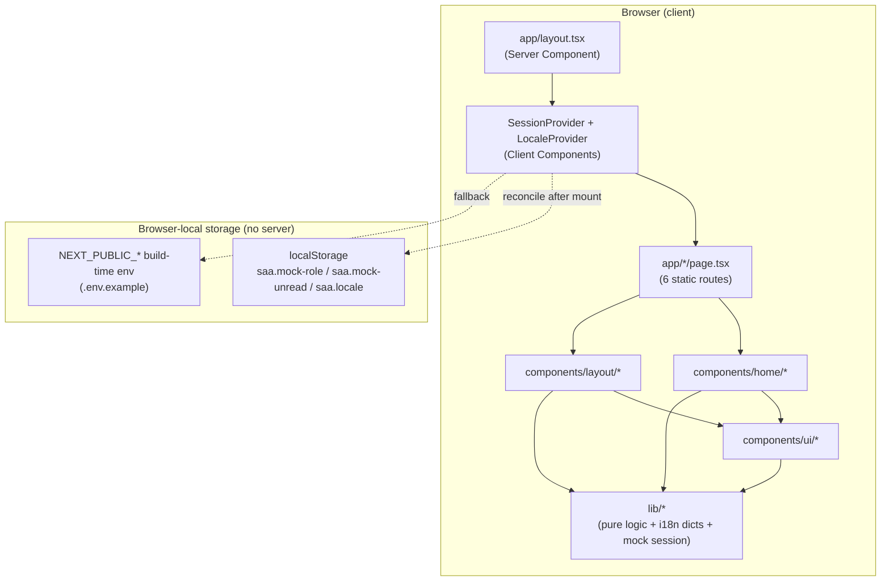
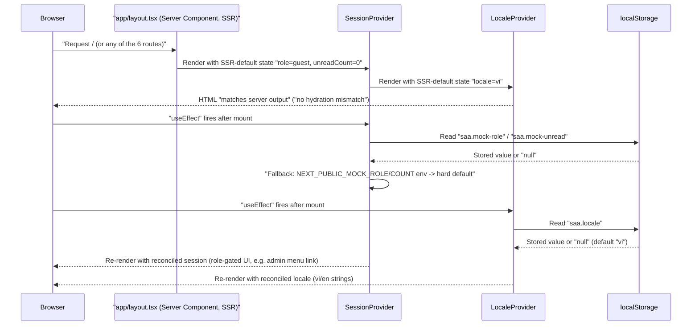
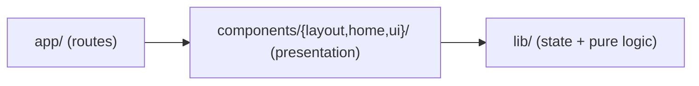
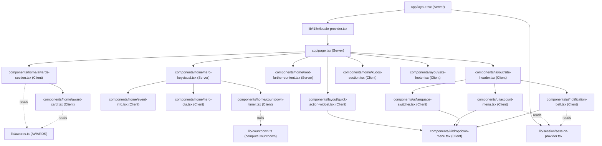

# Architecture

## System Architecture

Ứng dụng là một trang tĩnh Next.js App Router, không có tầng backend. Toàn bộ 6 route
(`/`, `/awards`, `/kudos`, `/profile`, `/admin`, và `_not-found` do Next tự sinh) được
prerender ở build time; không có `app/api/**/route.ts`, không có `middleware.ts`, không có
database/ORM/queue nào trong cây nguồn (xác nhận tại `scout-report.md` § Background Logic
Source Inventory — mọi hạng mục đều `_(none found)_`).

Không có "API Gateway", "Services", hay "Data Layer" phía sau — bỏ hẳn 3 subgraph đó khỏi
sơ đồ gốc của template vì hệ thống này không có backend tier nào tồn tại.

## Tech Stack

| Layer | Technology | Version |
|-------|------------|---------|
| Framework | Next.js (App Router) | 16.3.1 |
| UI library | React / react-dom | 19.2.8 |
| Language | TypeScript | ^5 |
| Styling | Tailwind CSS (CSS-first, `@import "tailwindcss"` + `@theme inline` trong `app/globals.css`; không có `tailwind.config.ts`) | ^4 (`@tailwindcss/postcss` ^4) |
| Lint | ESLint (flat config, `eslint-config-next`) | ^9 / 16.3.1 |
| E2E test runner | Playwright (`@playwright/test`, `playwright.config.ts`) | ^1.62.1 |
| Unit test runner | Playwright (`playwright.unit.config.ts`, chạy `lib/*.test.ts`) | ^1.62.1 (dùng chung install) |
| Package manager | npm (`package-lock.json`) | — |
| Backend | none | not-applicable |
| Database | none | not-applicable |
| Cache | none | not-applicable |
| Queue | none | not-applicable |

## Data Flow

Không có request/response qua network layer nào ngoài lần Next.js phục vụ HTML/JS tĩnh đã
prerender. "Data flow" thực chất là luồng state phía client: mount → đọc localStorage/env →
reconcile → render lại UI. Sequence dưới đây thay cho client→API→service→store gốc của
template (không áp dụng được vì thiếu 3 tầng đó):

## Layering

Chiều phụ thuộc là một chiều: `lib/` không import bất cứ gì từ `components/` (xác nhận qua
grep toàn bộ import trong `lib/*.ts(x)` — chỉ import `react` và các dictionary nội bộ của
chính `lib/i18n/`). Ranh giới component/route ngược lại đọc `lib/` thoải mái
(`useI18n`, `useSession`, `computeCountdown`, `AWARDS`/`awardHref`).

## Component composition (module graph, xác nhận qua Grep import)

**Đính chính so với giả định trong task brief**: không phải toàn bộ `components/` đều là
Client Component. Grep trực tiếp `'use client'` trên từng file trong `components/` cho thấy
đúng 2 ngoại lệ giữ nguyên Server Component: `components/home/hero-keyvisual.tsx` và
`components/home/root-further-content.tsx` — cả hai chỉ compose các component con và không
gọi hook/state, nên không cần opt-in client. Toàn bộ 12 file `.tsx` còn lại trong
`components/` đều khai `'use client'` ở dòng đầu.

## Cross-cutting concerns

- **Hai React Context Provider**, cả hai cùng một pattern SSR-default → `useEffect`
  reconcile (đã đọc trực tiếp source, không suy đoán):
  - `lib/session/session-provider.tsx` — mock role (`guest|user|admin`) + unread count,
    thứ tự ưu tiên `localStorage` → `NEXT_PUBLIC_MOCK_ROLE`/`NEXT_PUBLIC_MOCK_UNREAD_COUNT`
    → default cứng. File có cảnh báo bảo mật ngay trong comment: đây **không** phải ranh
    giới auth, chỉ gate UI, không có kiểm tra phía server.
  - `lib/i18n/locale-provider.tsx` — locale `vi|en`, thứ tự ưu tiên `localStorage` →
    default `vi`. Comment ghi rõ chọn hand-rolled thay vì thêm dependency `next-intl`
    (YAGNI, deferred tới khi có locale thứ 3).
- **Testing kép trên cùng một Playwright install**:
  - `playwright.config.ts` (E2E) — 2 project, 2 `webServer` tách biệt cổng 3000/3100, mỗi
    server set một giá trị `NEXT_PUBLIC_EVENT_START_AT` khác nhau (một hợp lệ, một
    `'not-a-date'`) để bài test `homepage-invalid-env.spec.ts` có môi trường build riêng —
    không tái dùng dev server đang chạy sẵn (comment trong file giải thích lý do: tránh
    race điều kiện làm bài test countdown "xanh giả").
  - `playwright.unit.config.ts` — chạy như một unit runner thuần (`testDir: './lib'`,
    match `*.test.ts`), không mở `webServer`, dùng cho `lib/awards.test.ts` và
    `lib/countdown.test.ts`.

## Unresolved / out of scope for this artifact

- `app/_not-found` không có file tùy biến trong cây nguồn — đây là route auto-generate của
  Next.js App Router, không phải file thiếu; không vẽ riêng trong sơ đồ vì không có source
  file tương ứng. Cờ này đã có trong `scout-report.md` § Unresolved Questions, để nguyên
  cho pha tổng hợp feature/screen quyết định có cần một dòng ghi chú riêng hay không.
- Không xác minh runtime thực tế (không chạy `next dev`/Playwright trong tác vụ này) — toàn
  bộ sơ đồ dựa trên đọc source tĩnh (`grep`/`Read`), phù hợp phạm vi Wave 1 (architecture
  synthesis), không phải một lần kiểm thử hành vi.
