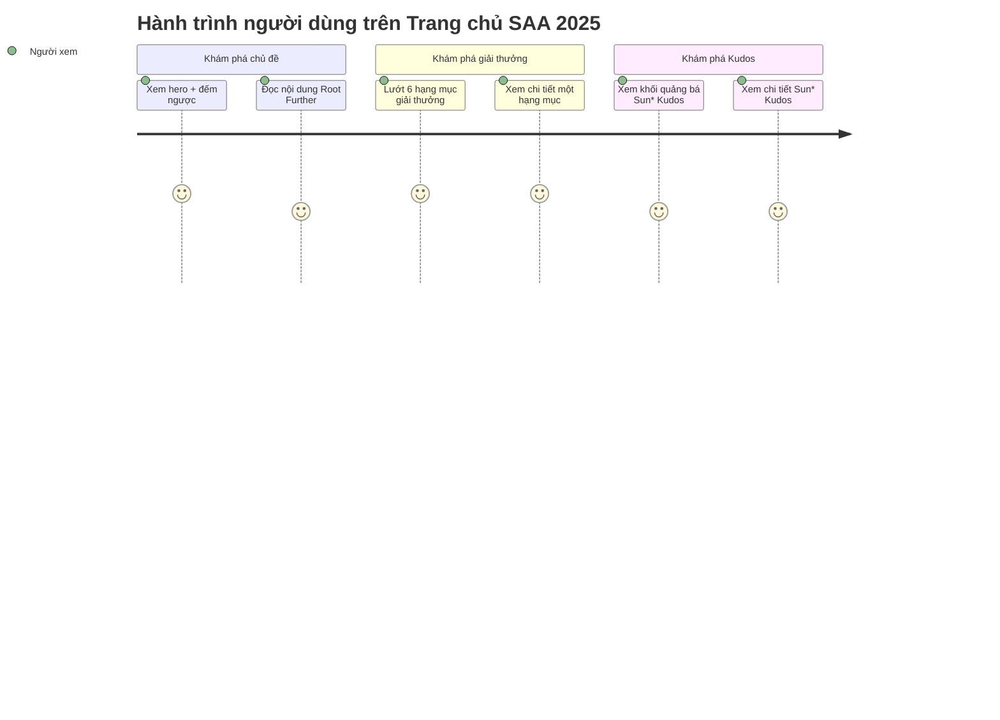

## Screen List

| Screen Name | SCR### | What User Sees | What User Can Do |
|-------------|--------|----------------|------------------|
| Trang chủ SAA 2025 | SCR-homepage (draft — SCR### cấp phát khi promote) | Header sticky (logo, nav, ngôn ngữ, chuông thông báo, tài khoản); hero "ROOT FURTHER" + đếm ngược + thông tin sự kiện + 2 CTA; nội dung Root Further; lưới 6 thẻ giải thưởng; khối quảng bá Sun* Kudos; nút widget nổi; footer | Điều hướng tới trang Giải thưởng hoặc Kudos qua nav/CTA/thẻ giải thưởng/widget; đổi ngôn ngữ VN/EN; xem thông báo và menu tài khoản (nếu đã đăng nhập) |

## User Journey

1. Người dùng mở Trang chủ SAA 2025 và thấy hero "ROOT FURTHER" với đếm ngược sự kiện đang chạy.
2. Người dùng cuộn xuống đọc nội dung chủ đề Root Further và trích dẫn tục ngữ.
3. Người dùng cuộn tiếp tới phần giải thưởng, đọc 6 hạng mục.
4. Người dùng click "Chi tiết" trên một hạng mục — được đưa sang trang thông tin giải thưởng, đúng vị trí hạng mục đó.
5. Người dùng quay lại Trang chủ SAA 2025 (hoặc điều hướng ngang), cuộn tới khối Sun* Kudos, click "Chi tiết" — được đưa sang trang Sun* Kudos.
6. (Người dùng đã đăng nhập) mở menu tài khoản từ Trang chủ SAA 2025 để xem Profile hoặc Đăng xuất; nếu là quản trị viên, thấy thêm lối vào khu quản trị.

