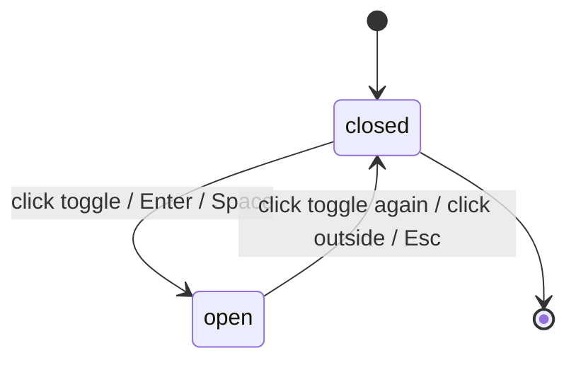

# F000_HomepageSaa

**Priority**: P1
**Type**: ui
**Generated**: 2026-08-18

## Overview

Trang chủ công khai SAA 2025 tại route `/`. Khách truy cập (chưa đăng nhập) hoặc người dùng đã đăng nhập (role `user`/`admin`) xem hero "ROOT FURTHER" kèm đếm ngược sự kiện, đọc nội dung chủ đề Root Further, lướt lưới 6 hạng mục giải thưởng, và điều hướng sang `/awards` hoặc `/kudos`. Không có backend thật ở bước này — phiên đăng nhập là mock client-side, dữ liệu đếm ngược lấy từ biến môi trường `NEXT_PUBLIC_EVENT_START_AT`, và toàn bộ nội dung là tĩnh (không gọi API). Test policy: `e2e-red-first` — một bài E2E cấp màn hình bao toàn bộ hành vi trước khi code UI/behavior được viết.

## Polymorphic Behavior

### DISC-001 — SessionContext.role

| Value | Render | Validation | Persistence |
|-------|--------|------------|-------------|
| `guest` | Ẩn chuông thông báo và menu tài khoản; chỉ hiện nút ngôn ngữ + logo/nav công khai | Không có hành động nào bị chặn (nội dung công khai luôn xem được) | Không có state được lưu — session mặc định `guest` khi chưa có toggle dev/env |
| `user` | Hiện chuông thông báo (kèm badge nếu có unread) + menu tài khoản với "Profile" và "Sign out" | Menu tài khoản không hiện "Admin Dashboard" | Session field `role` giữ nguyên trong suốt phiên trình duyệt (mock, không cần đăng nhập thật) |
| `admin` | Giống `user`, cộng thêm mục "Admin Dashboard" trong menu tài khoản | Không có ràng buộc bổ sung ở màn hình này (route guard cho `/admin` nằm ngoài phạm vi feature này) | Giống `user` |

**Source:** TBD (draft) — chưa có `data-model.md`; giá trị lấy từ Assumption "mock session provider" trong `clarifications.md`.

### Edge Cases

| Variant | Behavior |
|---------|----------|
| `role` không xác định / session provider chưa hydrate | Coi như `guest` cho đến khi client component mount xong (không render sai trạng thái đã đăng nhập) |

## Cross-Cutting Logic

### Requirements

| Code | Description | Endpoint/Handler | Verifiable |
|------|-------------|------------------|------------|
| FR-001 | Dropdown/menu primitive dùng chung: click để mở, click lại để đóng, click ra ngoài để đóng, Enter/Space để mở, Esc để đóng. Áp dụng cho ngôn ngữ, menu tài khoản, panel thông báo, menu widget | Client component (planned: `components/ui/dropdown-menu.tsx`) | yes |
| FR-002 | Cơ chế chuyển ngôn ngữ VN/EN bằng 2 từ điển tĩnh (`vi`, `en`), lựa chọn lưu vào `localStorage`, áp dụng lại toàn bộ copy trang | Client provider (planned: `lib/i18n/locale-provider.tsx`) | yes |
| FR-003 | Session mock client-side phân giải role `guest \| user \| admin` từ dev/env toggle, không có backend auth thật | Client provider (planned: `lib/session/session-provider.tsx`) | yes |

**Source:** TBD (draft) — chưa có code, xem `## Source Walkthrough` cho vị trí file dự kiến.

### Business Rules

#### BR-001_LamTronDemNguoc
**Linked FR:** FR-006
**Source:** TBD (draft)
**Applies to:** Countdown timer (3 ô DAYS/HOURS/MINUTES)
**Rule:** Mỗi giá trị luôn hiển thị 2 chữ số (thêm số 0 phía trước khi < 10), cập nhật mỗi phút.

**Pseudocode:**
```text
days = floor(diffMs / 86400000)
hours = floor((diffMs % 86400000) / 3600000)
minutes = floor((diffMs % 3600000) / 60000)
render pad2(days), pad2(hours), pad2(minutes)
```

#### BR-002_TrangThaiZeroKhiHetHan
**Linked FR:** FR-007
**Source:** TBD (draft)
**Applies to:** Countdown timer + nhãn "Coming soon"
**Rule:** Khi thời điểm hiện tại >= `NEXT_PUBLIC_EVENT_START_AT`, cả 3 ô hiển thị `00`, và nhãn "Coming soon" bị ẩn.

**Pseudocode:**
```text
if now >= eventStartAt:
  days = hours = minutes = "00"
  showComingSoon = false
else:
  showComingSoon = true
```

#### BR-003_FallbackKhiEnvKhongHopLe
**Linked FR:** FR-008
**Source:** TBD (draft)
**Applies to:** Countdown timer khi biến môi trường không hợp lệ
**Rule:** Nếu `NEXT_PUBLIC_EVENT_START_AT` rỗng/không parse được thành ngày hợp lệ, hệ thống hiển thị trạng thái zero-state (như đã hết hạn) mà không throw lỗi hay crash trang.

**Pseudocode:**
```text
parsed = tryParseISO(envValue)
if parsed is invalid:
  treat as BR-002 zero-state (no throw)
```

#### BR-004_LuoiGiaiThuongResponsive
**Linked FR:** FR-012
**Source:** TBD (draft)
**Applies to:** Lưới 6 thẻ giải thưởng
**Rule:** Desktop hiển thị 3 cột, tablet 2 cột, mobile 2 cột (nguồn: frame + TC ID-16 thắng; dòng CSV tiếng Anh "3/2/1" là bản dịch lỗi thời, không áp dụng).

**Pseudocode:**
```text
columns = viewport >= desktopBreakpoint ? 3
        : 2  # tablet and mobile both 2
```

#### BR-005_DieuHuongKhiThieuSlug
**Linked FR:** FR-013
**Source:** TBD (draft)
**Applies to:** Điều hướng thẻ giải thưởng
**Rule:** Nếu thẻ giải thưởng không có slug hợp lệ, điều hướng đến `/awards` không kèm hash và không tự cuộn.

**Pseudocode:**
```text
if card.slug:
  navigate(`/awards#${card.slug}`)
else:
  navigate(`/awards`)  # no scroll
```

#### BR-006_ChiVNvaEN
**Linked FR:** FR-002
**Source:** TBD (draft)
**Applies to:** Menu chọn ngôn ngữ
**Rule:** Chỉ có đúng 2 lựa chọn VN và EN, không thêm ngôn ngữ khác cho đến khi có yêu cầu mở rộng (YAGNI — xem clarifications).

#### BR-007_AnBellVaAccountChoKhach
**Linked FR:** FR-003
**Source:** TBD (draft)
**Applies to:** Header — chuông thông báo + menu tài khoản
**Rule:** Khách (`role: guest`) không thấy chuông thông báo và không thấy menu tài khoản.

#### BR-008_BadgeKhiCoThongBaoChuaDoc
**Linked FR:** FR-016
**Source:** TBD (draft)
**Applies to:** Badge trên chuông thông báo
**Rule:** Badge chỉ hiện khi số thông báo chưa đọc > 0; ẩn khi bằng 0.

### Decision Logic

N/A — no user-facing decision logic beyond DISC-001 Polymorphic Behavior. Các nhánh khác trong tính năng này là toggle dropdown đơn giản (SM-001) hoặc điều kiện một trường (BR-002, BR-005, BR-007) — không đạt ngưỡng đa-predicate/interaction/flow của DEC.

### State Machines

#### SM-001_TrangThaiDropdown
**kind:** ui
**Linked FR:** FR-001
**Source:** TBD (draft)
**States:** closed, open



**Transition rules:**
- `closed → open`: trigger = click nút, hoặc focus + Enter, hoặc focus + Space; side effect = render nội dung menu/panel
- `open → closed`: trigger = click lại nút, click ra ngoài vùng menu, hoặc Esc; side effect = ẩn nội dung, trả focus về nút trigger

Áp dụng cho: menu ngôn ngữ (US005), menu tài khoản (US006), panel thông báo (US006), menu widget thao tác nhanh (US008) — một primitive dùng chung theo quyết định trong `clarifications.md`.

### Algorithms

#### ALG-001_TinhDemNguocSuKien
**Linked FR:** FR-006
**Source:** TBD (draft)
**Input:** `NEXT_PUBLIC_EVENT_START_AT` (chuỗi ISO-8601), thời điểm hiện tại (client clock)
**Output:** `{ days: string(2), hours: string(2), minutes: string(2), isZeroState: boolean }`
**Complexity:** O(1) mỗi lần tick (chạy lại mỗi 60s qua interval)
**Description:** Parse biến môi trường thành `Date`; nếu parse lỗi hoặc `now >= eventStartAt` → trả zero-state (BR-002/BR-003); ngược lại tính days/hours/minutes còn lại và pad 2 chữ số (BR-001).

**Pseudocode:**
```text
function computeCountdown(envValue, now):
  eventStart = tryParseISO(envValue)
  if eventStart is invalid or now >= eventStart:
    return { days: "00", hours: "00", minutes: "00", isZeroState: true }
  diffMs = eventStart - now
  return {
    days: pad2(floor(diffMs / 86400000)),
    hours: pad2(floor((diffMs % 86400000) / 3600000)),
    minutes: pad2(floor((diffMs % 3600000) / 60000)),
    isZeroState: false
  }
```

### External Integrations

None — không có dịch vụ bên thứ ba nào được gọi ở tính năng này (chỉ có `Link` nội bộ tới `/awards`, `/kudos`).

### Verification

- **SC-001** — Trang `/` render đầy đủ header/hero/countdown/root-further/awards/kudos/widget/footer, không lỗi console (covers FR-001 đến FR-019)
- **SC-002** — Đếm ngược tự cập nhật mỗi phút, pad 2 chữ số, về `00/00/00` đúng thời điểm sự kiện, ẩn "Coming soon" (covers FR-006, FR-007, BR-001, BR-002)
- **SC-003** — Biến môi trường không hợp lệ không làm crash trang, hiển thị zero-state (covers FR-008, BR-003)
- **SC-004** — Cả 6 thẻ giải thưởng điều hướng đúng `/awards#<slug>`; thẻ thiếu slug điều hướng `/awards` không cuộn (covers FR-013, FR-014, BR-005)
- **SC-005** — Dropdown ngôn ngữ/tài khoản/panel/widget đều tuân theo SM-001 (toggle, click-outside, Enter, Space, Esc) (covers FR-001, SM-001)

---

**Client behavior:** see
[`behavior-logic.md`](../../docs/system/behavior-logic.md) (client-side patterns — debounce, optimistic UI, polling, upload, realtime),
[`permissions.md`](../../docs/system/permissions.md) (feature flags / experiments / env / locale gates),
[`architecture.md`](../../docs/system/architecture.md) (guards / deep-link state restoration / unsaved-changes protection).

Ghi chú greenfield: cả 3 file trên chưa tồn tại (system docs chưa forward-author cho feature này — không chạm architecture/auth mới, chỉ mock session client-side). Countdown dùng `setInterval` mỗi 60s (không phải debounce/polling API), locale-gate là so sánh `localStorage` value (không phải `process.env`), không có deep-link state restoration hay unsaved-changes guard trên trang này.

## User Stories

### US001_XemTongQuanTrangChu — Xem tổng quan trang chủ SAA 2025 (Priority: P1)

**What happens:** Khách/người dùng mở `/` và thấy header sticky, hero "ROOT FURTHER" với countdown + thông tin sự kiện + 2 nút CTA, và phần nội dung Root Further (2 khối văn bản + trích dẫn tục ngữ) khi cuộn xuống.
**Why this priority:** Đây là màn hình đầu tiên và duy nhất của feature — không hiển thị đúng thì mọi US khác vô nghĩa.
**Independent Test:** Mở `/`, xác nhận hero + countdown + event info + 2 CTA + nội dung Root Further đều render đúng copy từ frame (TC ID-7, ID-13, ID-14).

**Acceptance Scenarios:**

1. **Given** khách chưa đăng nhập mở `/`, **When** trang tải xong, **Then** thấy đầy đủ nội dung công khai: hero, countdown, event info ("Thời gian: 26/12/2025 · Địa điểm: Âu Cơ Art Center · Tường thuật trực tiếp qua sóng Livestream"), 2 CTA, nội dung Root Further.
2. **Given** trang đã tải, **When** cuộn xuống hết trang, **Then** thấy đủ awards grid, Kudos section, footer — không có phần nào bị thiếu (TC ID-59 không có link hỏng).

**Requirements fulfilled:**
- **FR-004** Render hero/keyvisual với tiêu đề "ROOT FURTHER" (outline type) + nhãn "Coming soon" (điều kiện — xem BR-002) — `GET /` via `app/page.tsx` (planned)
  **Source:** TBD (draft)
- **FR-005** Render nội dung Root Further (2 đoạn văn dài + trích dẫn "A tree with deep roots fears no storm" / "Cây sâu bén rễ, bão giông chẳng nề — Ngạn ngữ Anh") — `GET /` via `components/home/root-further-content.tsx` (planned)
  **Source:** TBD (draft)

**Rules enforced:** BR-002 (see Cross-Cutting) — nhãn "Coming soon" ẩn/hiện theo trạng thái countdown ngay trên hero này.

**Verification:**
- **SC-001** (covers FR-004, FR-005)

---

### US002_DemNguocSuKien — Theo dõi đếm ngược sự kiện (Priority: P1)

**What happens:** Người dùng thấy 3 ô DAYS/HOURS/MINUTES đếm ngược tới `NEXT_PUBLIC_EVENT_START_AT`, tự cập nhật mỗi phút, về `00/00/00` khi tới/qua thời điểm sự kiện, và không bị crash nếu biến môi trường sai định dạng.
**Why this priority:** Là nội dung trung tâm của hero, được test nhiều nhất trong 62 TC (ID-12, 39-43, 56, 57, 60) — rủi ro cao nếu sai.
**Independent Test:** Set `NEXT_PUBLIC_EVENT_START_AT` hợp lệ ~90 ngày sau, mở `/`, xác nhận countdown đếm đúng; đổi thành giá trị không hợp lệ, xác nhận về zero-state không lỗi (TC ID-60).

**Acceptance Scenarios:**

1. **Given** `NEXT_PUBLIC_EVENT_START_AT` hợp lệ và còn hạn, **When** trang tải, **Then** 3 ô hiện số 2 chữ số đúng số ngày/giờ/phút còn lại, "Coming soon" hiển thị.
2. **Given** trang đang mở, **When** chờ 1 phút, **Then** giá trị MINUTES giảm 1 (hoặc HOURS/DAYS điều chỉnh theo) (TC ID-39).
3. **Given** thời điểm hiện tại đã qua `NEXT_PUBLIC_EVENT_START_AT`, **When** trang tải/tick, **Then** cả 3 ô hiện `00`, "Coming soon" bị ẩn (TC ID-41, 42).
4. **Given** `NEXT_PUBLIC_EVENT_START_AT` không parse được, **When** trang tải, **Then** countdown hiện zero-state, không crash, không lỗi console (TC ID-60).

**Requirements fulfilled:**
- **FR-006** Tính và render countdown mỗi phút từ ALG-001 — `GET /` via `components/home/countdown-timer.tsx` (planned)
  **Source:** TBD (draft)
- **FR-007** Zero-state khi tới/qua hạn, ẩn "Coming soon" — cùng component
  **Source:** TBD (draft)
- **FR-008** Fallback an toàn khi env không hợp lệ, không throw — cùng component
  **Source:** TBD (draft)

**Rules enforced:** BR-001, BR-002, BR-003 (khai báo ở Cross-Cutting Logic, áp dụng chính cho US này).

**Verification:**
- **SC-002**, **SC-003** (covers FR-006, FR-007, FR-008, BR-001, BR-002, BR-003)

---

### US003_DieuHuongHeaderFooterCTA — Điều hướng qua header, footer, CTA (Priority: P1)

**What happens:** Người dùng click logo (về `/` + cuộn lên đầu), các link nav header ("About SAA 2025" đang chọn, "Award Information" → `/awards`, "Sun* Kudos" → `/kudos`), 2 nút CTA hero ("ABOUT AWARDS" → `/awards`, "ABOUT KUDOS" → `/kudos`), và các link footer tương ứng.
**Why this priority:** Là lối ra duy nhất khỏi trang chủ tới 2 route khác — bắt buộc hoạt động đúng để không có link hỏng (TC ID-59, priority High).
**Independent Test:** Từ trang bất kỳ, click logo → về `/` cuộn top (TC ID-2, ID-18); click từng link header/footer/CTA → đúng đích (TC ID-3, 4, 20-22, 44, 45, 55).

**Acceptance Scenarios:**

1. **Given** người dùng đang ở trang khác, **When** click logo header hoặc footer, **Then** điều hướng về `/` và cuộn lên đầu trang (TC ID-2, ID-18, ID-19).
2. **Given** người dùng ở `/`, **When** click "Award Information" (header hoặc footer) hoặc nút "ABOUT AWARDS", **Then** điều hướng tới `/awards` (TC ID-21, 44, 55).
3. **Given** người dùng ở `/`, **When** click "Sun* Kudos" (header hoặc footer) hoặc nút "ABOUT KUDOS", **Then** điều hướng tới `/kudos` (TC ID-22, 45, 55).
4. **Given** người dùng hover "Award Information", **When** rê chuột qua, **Then** thấy nền sáng nổi bật (TC ID-23); tương tự hover "ABOUT AWARDS" thấy hiệu ứng hover (TC ID-46).

**Requirements fulfilled:**
- **FR-009** Logo header/footer điều hướng `/` + scroll-to-top — `GET /` via `components/layout/site-header.tsx`, `components/layout/site-footer.tsx` (planned)
  **Source:** TBD (draft)
- **FR-010** Link nav header/footer điều hướng `/awards`, `/kudos` — cùng component
  **Source:** TBD (draft)
- **FR-011** 2 nút CTA hero điều hướng `/awards`, `/kudos` — `components/home/hero-cta.tsx` (planned)
  **Source:** TBD (draft)

**Verification:**
- **SC-001** (covers FR-009, FR-010, FR-011)

---

### US004_KhamPhaGiaiThuong — Khám phá hệ thống giải thưởng (Priority: P1)

**What happens:** Người dùng cuộn tới lưới 6 thẻ giải thưởng (Top Talent, Top Project, Top Project Leader, Best Manager, Signature 2025 - Creator, MVP), đọc mô tả rút gọn tối đa 2 dòng, và click ảnh/tiêu đề/"Chi tiết" của thẻ bất kỳ để điều hướng tới `/awards#<slug>` với auto-scroll.
**Why this priority:** Là nội dung chính thứ hai của trang sau hero, có 11 TC riêng (ID-15, 16, 47-52) và gồm cả BR về responsive lẫn điều hướng.
**Independent Test:** Trên desktop xác nhận lưới 3 cột; trên tablet/mobile xác nhận 2 cột (TC ID-15, 16); click từng thẻ xác nhận điều hướng đúng slug + auto-scroll (TC ID-50, 52).

**Acceptance Scenarios:**

1. **Given** viewport desktop, **When** xem phần giải thưởng, **Then** 6 thẻ hiển thị lưới 3 cột, mỗi thẻ có thumbnail + tiêu đề + mô tả tối đa 2 dòng + link "Chi tiết" (TC ID-15).
2. **Given** viewport tablet hoặc mobile, **When** xem phần giải thưởng, **Then** lưới hiển thị 2 cột (TC ID-16, BR-004 — 3/2/2 thắng theo frame + TC, không theo dòng CSV tiếng Anh "3/2/1" đã lỗi thời).
3. **Given** thẻ "Top Talent" có slug `top-talent`, **When** click ảnh, tiêu đề, hoặc "Chi tiết" của thẻ, **Then** điều hướng `/awards#top-talent` và tự cuộn tới đúng section (TC ID-47, 48, 49).
4. **Given** hover một thẻ bất kỳ, **When** rê chuột qua, **Then** thẻ nổi nhẹ với hiệu ứng viền/ánh sáng tăng cường (TC ID-51).

**Requirements fulfilled:**
- **FR-012** Lưới giải thưởng responsive 3/2/2 cột — `GET /` via `components/home/awards-section.tsx` (planned)
  **Source:** TBD (draft)
- **FR-013** Điều hướng thẻ (ảnh/tiêu đề/Chi tiết) → `/awards#<slug>` với auto-scroll — cùng component
  **Source:** TBD (draft)
- **FR-014** Fallback khi thẻ thiếu slug → `/awards` không auto-scroll (TC ID-62) — cùng component
  **Source:** TBD (draft)

**Rules enforced:** BR-004, BR-005 (Cross-Cutting Logic).

**Verification:**
- **SC-004** (covers FR-012, FR-013, FR-014, BR-004, BR-005)

---

### US005_ChuyenDoiNgonNgu — Chuyển đổi ngôn ngữ VN/EN (Priority: P2)

**What happens:** Người dùng click nút ngôn ngữ "VN" ở header, thấy menu mở với 2 lựa chọn VN/EN, chọn EN thì toàn bộ copy trang chuyển sang tiếng Anh và lựa chọn được lưu lại cho lần sau.
**Why this priority:** Quan trọng nhưng không chặn luồng xem nội dung chính — P2 vì trang mặc định đã đúng ngôn ngữ (vi) cho đa số người dùng mục tiêu.
**Independent Test:** Click nút ngôn ngữ, chọn EN, xác nhận copy đổi sang tiếng Anh (TC ID-25); tải lại trang, xác nhận lựa chọn vẫn giữ EN (persist qua `localStorage`).

**Acceptance Scenarios:**

1. **Given** trang đang ở VN, **When** click nút ngôn ngữ rồi chọn EN, **Then** toàn bộ copy chuyển tiếng Anh (TC ID-24, 25).
2. **Given** trang đang ở EN, **When** chọn VN, **Then** copy chuyển lại tiếng Việt (TC ID-26).
3. **Given** menu ngôn ngữ đang mở, **When** xem danh sách lựa chọn, **Then** chỉ thấy đúng 2 mục VN và EN (TC ID-58, BR-006).

**Requirements fulfilled:**
- **FR-015** Menu ngôn ngữ chỉ có 2 lựa chọn VN/EN, áp dụng FR-002 (Cross-Cutting) để đổi dictionary — `lib/i18n/locale-provider.tsx` (planned)
  **Source:** TBD (draft)

**Rules enforced:** BR-006 (Cross-Cutting Logic); SM-001 (see Cross-Cutting) — menu ngôn ngữ dùng chung dropdown primitive (toggle, click-outside, Enter, Space, Esc — TC ID-30-35).

**Verification:**
- **SC-005** (covers FR-001, FR-002, FR-015, SM-001)

---

### US006_XemTheoVaiTro — Xem chuông thông báo & menu tài khoản theo vai trò (Priority: P2)

**What happens:** Người dùng đã đăng nhập thấy chuông thông báo (có badge nếu có thông báo chưa đọc) và menu tài khoản; khách vãng lai không thấy 2 phần tử này; admin thấy thêm mục "Admin Dashboard" trong menu tài khoản.
**Why this priority:** Ảnh hưởng trải nghiệm cá nhân hoá nhưng không chặn nội dung công khai chính — P2.
**Independent Test:** Đăng nhập role `admin`, xác nhận thấy "Admin Dashboard" (TC ID-5, 37); đăng nhập role `user`, xác nhận không thấy mục đó (TC ID-6, 38); guest, xác nhận không thấy chuông/menu tài khoản (TC ID-0 vs ID-1).

**Acceptance Scenarios:**

1. **Given** khách chưa đăng nhập, **When** mở `/`, **Then** không thấy chuông thông báo và không thấy nút tài khoản (BR-007).
2. **Given** người dùng đã đăng nhập role `user`, **When** click nút tài khoản, **Then** menu mở với "Profile" và "Sign out" (TC ID-36, 38).
3. **Given** người dùng role `admin`, **When** click nút tài khoản, **Then** menu mở với "Profile", "Sign out", và "Admin Dashboard" (TC ID-5, 37).
4. **Given** người dùng đã đăng nhập có thông báo chưa đọc, **When** xem chuông, **Then** thấy badge đỏ (TC ID-28); nếu không có thông báo chưa đọc, không thấy badge (TC ID-29).
5. **Given** người dùng click chuông thông báo, **When** panel mở, **Then** thấy tiêu đề panel + trạng thái rỗng "Không có thông báo mới" (TC ID-27; clarifications — không có dữ liệu thông báo thật).

**Requirements fulfilled:**
- **FR-016** Chuông thông báo hiện badge có điều kiện + mở panel rỗng — `components/ui/notification-bell.tsx` (planned)
  **Source:** TBD (draft)
- **FR-017** Menu tài khoản hiện mục theo role (DISC-001) — `components/ui/account-menu.tsx` (planned)
  **Source:** TBD (draft)

**Rules enforced:** BR-007, BR-008 (Cross-Cutting Logic); SM-001 (see US005) — panel thông báo và menu tài khoản dùng chung dropdown primitive.

**Verification:**
- **SC-001**, **SC-005** (covers FR-003, FR-016, FR-017, BR-007, BR-008, DISC-001)

---

### US007_KhamPhaSunKudos — Khám phá Sun* Kudos (Priority: P2)

**What happens:** Người dùng cuộn tới khối quảng bá "Sun* Kudos" (nhãn "Phong trào ghi nhận", tiêu đề, nội dung, nút "Chi tiết"), click "Chi tiết" điều hướng tới `/kudos`.
**Why this priority:** Nội dung phụ trợ, một hành động điều hướng — P2, tương tự mức độ awards nhưng phạm vi nhỏ hơn (1 CTA thay vì 6 thẻ).
**Independent Test:** Cuộn tới section Kudos, click "Chi tiết", xác nhận điều hướng `/kudos` (TC ID-53).

**Acceptance Scenarios:**

1. **Given** người dùng cuộn tới section Kudos, **When** xem nội dung, **Then** thấy nhãn, tiêu đề "Sun* Kudos", nội dung mô tả, nút "Chi tiết", và artwork KUDOS.
2. **Given** section Kudos hiển thị, **When** click "Chi tiết", **Then** điều hướng tới `/kudos` (TC ID-53).

**Requirements fulfilled:**
- **FR-018** Nút "Chi tiết" Kudos điều hướng `/kudos` — `components/home/kudos-section.tsx` (planned)
  **Source:** TBD (draft)

**Verification:**
- **SC-001** (covers FR-018)

---

### US008_MoRongThaoTacNhanh — Sử dụng nút widget thao tác nhanh (Priority: P3)

**What happens:** Người dùng click nút widget nổi (góc phải), menu thao tác nhanh mở với 2 lựa chọn "Viết Kudos" (→ `/kudos`) và "Về SAA 2025" (→ `/awards`), theo đúng 2 icon design thể hiện (bút chì + logo SAA).
**Why this priority:** Tiện ích phụ, không phải luồng chính — P3.
**Independent Test:** Click nút widget, xác nhận menu mở đúng 2 mục, click từng mục xác nhận điều hướng đúng (TC ID-54).

**Acceptance Scenarios:**

1. **Given** người dùng ở bất kỳ vị trí cuộn nào trên `/`, **When** click nút widget góc phải, **Then** menu mở với 2 mục "Viết Kudos" và "Về SAA 2025" (TC ID-54; clarifications — không phát minh thêm lựa chọn ngoài 2 icon design thể hiện).
2. **Given** menu widget đang mở, **When** click "Viết Kudos", **Then** điều hướng `/kudos`; **When** click "Về SAA 2025", **Then** điều hướng `/awards`.

**Requirements fulfilled:**
- **FR-019** Menu widget thao tác nhanh với 2 mục cố định — `components/layout/quick-action-widget.tsx` (planned)
  **Source:** TBD (draft)

**Rules enforced:** SM-001 (see Cross-Cutting Logic) — widget dùng chung dropdown primitive.

**Verification:**
- **SC-001** (covers FR-019, SM-001)

---

### Edge Cases

See edge-cases.md.

## Key Entities

{Greenfield — không có bảng CSDL thật; các "entity" dưới đây là đối tượng dữ liệu ý định (client-side/derived), không phải bảng SQL.}

| Entity | Table | Key Columns | Purpose |
|--------|-------|-------------|---------|
| SessionContext | N/A (client-side mock, không có bảng) | role (`guest\|user\|admin`), unreadNotificationCount | Điều khiển hiển thị chuông thông báo + menu tài khoản theo vai trò (DISC-001) |
| LocalePreference | N/A (lưu `localStorage`) | locale (`vi\|en`) | Điều khiển từ điển copy hiển thị toàn trang (FR-002) |
| EventConfig | N/A (đọc từ biến môi trường build-time) | startAt (ISO-8601, từ `NEXT_PUBLIC_EVENT_START_AT`) | Nguồn tính đếm ngược (ALG-001) |
| AwardCard | N/A (dữ liệu tĩnh trong code, không phải DB) | slug, title, description, thumbnailUrl | 6 thẻ giải thưởng hiển thị + điều hướng hash-anchor (FR-013) |

## Artifact References

| Artifact | File | Codes Used | Reviewed |
|----------|------|------------|----------|
| System Overview | [system-overview.md](../../docs/system/system-overview.md) | — | [ ] |
| Architecture | [architecture.md](../../docs/system/architecture.md) | — | [ ] |
| Feature List | [feature-list.md](../feature-list.md) | F001 (provisional) | [ ] |
| API Map | [api-map.md](../../docs/generated/api-map.md) | TBD (draft) | [ ] |
| Entities | [entities.md](../../docs/generated/entities.md) | TBD (draft) | [ ] |
| Screens | [screens.md](screens.md) | SCR-homepage (draft) | [ ] |
| Behavior Logic | [behavior-logic.md](../../docs/system/behavior-logic.md) | TBD (draft) | [ ] |
| Permissions Matrix | [permissions-matrix.md](../../docs/generated/permissions-matrix.md) | TBD (draft) | [ ] |
| User Stories | [user-stories.md](../../docs/generated/user-stories.md) | TBD (draft) | [ ] |

**Rule:** Đây là feature đơn (SINGLE mode) — không có `feature-list.md` được tạo cho lần chạy này (xem `spec-authoring-contract.md` § Minimal-Spec Rule: feature-list chỉ sinh ra khi có nhiều feature). `F001` là mã tạm thời sẽ được cấp phát chính thức khi promote.

## Assumptions

- Session đăng nhập là mock client-side (không có backend auth thật) — role `guest|user|admin` lấy từ dev/env toggle, có thể thay bằng auth thật sau này mà không đổi hợp đồng UI (clarifications, Q auth).
- i18n dùng 2 từ điển tĩnh viết tay (`vi`, `en`) thay vì thư viện `next-intl` — chỉ nâng cấp khi có thêm ngôn ngữ (YAGNI, clarifications).
- `/awards` và `/kudos` chỉ là route placeholder (stub) trong lần chạy này — nội dung 2 trang đó ngoài phạm vi feature homepage.
- Copy và layout lấy từ frame đã render (`design/homepage-saa-full.png`); hành vi/logic lấy từ 62 test case + các dòng CSV spec — theo đúng nguyên tắc ưu tiên đã thống nhất trong `clarifications.md`.
- Dữ liệu 6 thẻ giải thưởng, hero keyvisual, và các icon là nội dung tĩnh nhúng trong code (không có API/CMS) — lấy từ 35 media node MoMorph, không dùng ảnh placeholder.
- Panel thông báo không có dữ liệu thông báo thật ở lần build này — chỉ có trạng thái rỗng cố định (clarifications).

## Source Code References

Chưa có code nào được viết cho tính năng này (greenfield). Vị trí file dự kiến được liệt kê dưới dạng "planned" trong từng khối FR/US ở trên (ví dụ `app/page.tsx`, `components/home/countdown-timer.tsx`, `components/home/awards-section.tsx`, `lib/i18n/locale-provider.tsx`, `lib/session/session-provider.tsx`) và trong `## Source Walkthrough` bên dưới. Không có `**Source:** path:N-M` nào được bịa cho code chưa tồn tại.

## Unresolved Questions

1. **Định dạng clamp mô tả thẻ giải thưởng**: mô tả "tối đa 2 dòng" (TC ID-15) — chưa xác định cơ chế cụ thể (CSS `line-clamp: 2` hay giới hạn số ký tự cứng); không chặn implement vì cả 2 cách đều thoả yêu cầu hiển thị, quyết định kỹ thuật để lại cho lúc code.
2. **Danh sách đầy đủ mục "Admin Dashboard"**: TC ID-5/37 chỉ xác nhận mục này xuất hiện trong menu, không có đặc tả đích đến `/admin` (route đó ngoài phạm vi feature này — chỉ cần link tồn tại, không cần trang thật).

## Source Walkthrough

{Thứ tự đọc dự kiến khi bắt đầu implement — các file dưới đây CHƯA tồn tại (greenfield), chỉ là lộ trình lập kế hoạch, không phải trích dẫn code đã có.}

1. **File:** `lib/session/session-provider.tsx` (planned) — bắt đầu ở đây vì role (DISC-001) chi phối phần lớn render có điều kiện của header.
2. **File:** `lib/i18n/locale-provider.tsx` (planned) — kế tiếp: cơ chế đổi dictionary bọc toàn bộ cây component.
3. **File:** `app/page.tsx` (planned) — điểm vào route `/`, ráp các section theo `## Screen Layout` trong screen spec.
4. **File:** `components/home/countdown-timer.tsx` (planned) — hiện thực ALG-001 + BR-001/002/003.
5. **File:** `components/home/awards-section.tsx` (planned) — hiện thực BR-004/005 + FR-012/013/014.
6. **File:** `components/ui/dropdown-menu.tsx` (planned) — primitive dùng chung SM-001 cho ngôn ngữ/tài khoản/thông báo/widget.

### Call Hierarchy

```text
app/page.tsx
  -> SessionProvider (lib/session/session-provider.tsx)
  -> LocaleProvider (lib/i18n/locale-provider.tsx)
    -> Header (logo, nav, dropdown-menu x2: language + account)
    -> HeroSection (CountdownTimer, EventInfo, HeroCTAs)
    -> RootFurtherSection (static copy)
    -> AwardsGrid (6x AwardCard)
    -> KudosPromo
    -> QuickActionWidget (dropdown-menu)
    -> Footer
```

**Related files:** xem `## Source Code References` ở trên — mọi đường dẫn ở đó đều là "planned", chưa tồn tại trong repo.

## DB Impact per Event

N/A — read-only feature, no DB writes. Toàn bộ state (session mock, locale, countdown) là client-side (React state + `localStorage`), không có backend/CSDL nào được ghi ở tính năng này.
