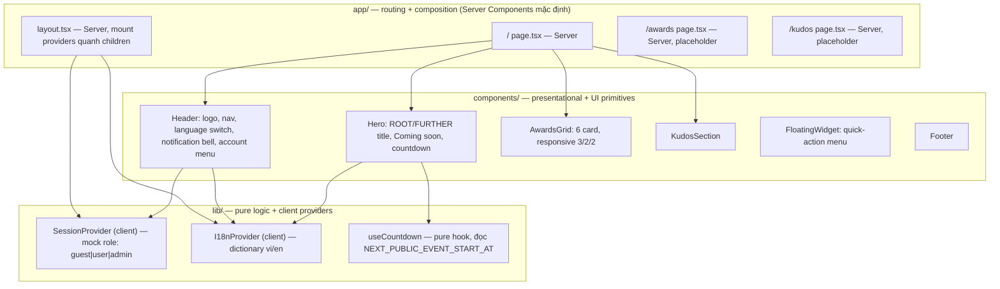

# Architecture — Homepage SAA 2025 (Draft)

> Bản nháp plan-local. Chưa có dòng code nào được viết. Tài liệu này mô tả kiến trúc SẼ có sau
> khi implement, không mô tả trạng thái hiện tại (repo hiện chỉ là `create-next-app` scaffold
> trơn — `app/{layout,page,globals.css}`, không có `components/`, `lib/`, provider nào).
> Được promote vào `docs/system/architecture.md` tại implement-start; Core pass sẽ reconcile
> lại theo as-built code sau khi forge.

## Baseline hiện có (xác nhận, không suy đoán)

Đọc trực tiếp từ `package.json`, `next.config.ts`, `tsconfig.json`, `app/layout.tsx`,
`app/globals.css`, `eslint.config.mjs`:

| Hạng mục | Giá trị |
|---|---|
| Framework | Next.js 16.3.1, App Router (`app/`), không có `pages/` |
| UI runtime | React 19.2.8 / react-dom 19.2.8 |
| Ngôn ngữ | TypeScript 5, `strict: true` |
| Styling | Tailwind CSS v4, CSS-first — `@import "tailwindcss"` + `@theme inline` trong `app/globals.css`, KHÔNG có `tailwind.config.ts` |
| Path alias | `@/*` → `./*` (tsconfig `paths`) |
| Package manager | npm (có `package-lock.json` ngầm định qua scripts chuẩn) |
| Lint | ESLint 9 flat config (`eslint.config.mjs`) — `eslint-config-next/core-web-vitals` + `/typescript` |
| Fonts | `next/font/google` (Geist, Geist_Mono) đã wired trong `app/layout.tsx` |

Next 16.3.1 có một số breaking-change so với thế hệ 15 liên quan trực tiếp đến bản build này
(nguồn: `plans/260818-0936-homepage-saa/research/researcher-01-nextjs16-conventions.md`, đọc từ
`node_modules/next/dist/docs/` — xem § Asset Strategy và § Routing bên dưới).

## System Layering

**Quy tắc giữ `app/layout.tsx` là Server Component trong khi vẫn mount client provider**: provider
(`SessionProvider`, `I18nProvider`) là các file `"use client"` RIÊNG BIỆT, export component bọc
`children`; `layout.tsx` import và render `<SessionProvider><I18nProvider>{children}</I18nProvider></SessionProvider>`
mà KHÔNG tự thêm `"use client"` vào chính nó. Chỉ phần cây con thật sự cần state/context mới
xuống client — phần tĩnh (metadata, `<html>/<body>`, font) vẫn được Next tối ưu như Server
Component. Đây là khuyến nghị trực tiếp từ Next docs ("render providers as deep as possible in
the tree" — xem researcher-01 §7), không phải suy đoán riêng của bản nháp này.

Lý do 3 lớp (`app/` → `components/` → `lib/`): tách routing/composition (app/) khỏi trình bày
thuần (components/) khỏi logic không phụ thuộc UI (lib/) — cho phép test `useCountdown` độc lập,
và cho phép `momorph-ui-implementer` (Track A) sở hữu `components/` trong khi `implementer`
(Track B) sở hữu `lib/` mà không đụng file nhau.

## Client Providers — tạm thời, khai báo rõ

Cả hai đều là **interim, không phải kiến trúc lâu dài** — quyết định trong `clarifications.md`
phiên 2026-08-18:

| Provider | Trách nhiệm | Vị trí mount | Vì sao tạm thời |
|---|---|---|---|
| `SessionProvider` | Giữ role hiện tại (`guest \| user \| admin`), seed từ dev/env toggle, không có backend auth | `app/layout.tsx`, bọc `{children}` | Mock session client-side — KHÔNG phải security boundary thật (xem `permissions.md` § Security Caveat). Sẽ thay bằng auth thật sau. |
| `I18nProvider` | Dictionary `vi`/`en` cho copy trang chủ, chọn ngôn ngữ lưu `localStorage` | `app/layout.tsx`, bọc `{children}`, dưới `SessionProvider` hoặc cùng cấp | Hand-rolled dictionary được chọn thay `next-intl` theo KISS/YAGNI (chỉ 2 locale, không cần routing i18n). Nâng cấp lên `next-intl` chỉ khi có thêm locale. |

Ranh giới trách nhiệm: `SessionProvider` không biết gì về ngôn ngữ; `I18nProvider` không biết
gì về role. Component tiêu thụ cả hai qua hook riêng (`useSession()`, `useI18n()`), không đọc
context trực tiếp — giữ component test được độc lập.

Quyết định kiến trúc và lý do đầy đủ: → ADR TBD (draft) — chưa có `docs/decisions/ADR-*.md`
nào trong repo (greenfield, `docs/` chưa tồn tại). Nên tạo `docs/decisions/ADR-001-mock-session-and-hand-rolled-i18n.md`
khi promote.

## Configuration

`NEXT_PUBLIC_EVENT_START_AT` — chuỗi ISO-8601, ví dụ `.env.example`: `2026-12-19T18:30:00+07:00`.

- **Vì sao client-exposed**: countdown chạy trên client (interval `setInterval` + `useState`),
  cần đọc giá trị này trong browser để tính lại mỗi giây mà không round-trip server — bắt buộc
  prefix `NEXT_PUBLIC_` (nguồn: researcher-01 §2, `node_modules/next/dist/docs/01-app/02-guides/environment-variables.md`).
- **Đóng băng tại build-time**: giá trị `NEXT_PUBLIC_*` được inline lúc `next build`/lúc server
  process khởi động — không đổi được giữa chừng khi đang chạy. Đây là lý do bộ E2E dùng 2
  `webServer` trên 2 port khác nhau (xem § Testing Topology) thay vì 1 server đổi env giữa các
  test.
- **Fallback bắt buộc khi giá trị không parse được** (TC ID-60): KHÔNG được crash / không hiện
  error boundary. `useCountdown` phải bắt lỗi parse và trả về trạng thái zero
  (`00d 00h 00m 00s`), tương đương trạng thái sự kiện đã bắt đầu. Không phân biệt UI giữa
  "invalid input" và "event đã bắt đầu" — cả hai đều render cùng trạng thái zero, giữ component
  đơn giản (KISS).

## Asset Strategy

Toàn bộ 35 media node từ MoMorph (hero key visual, typography ROOT/FURTHER, 6 thumbnail award,
logo, icon) tải về `public/`, tham chiếu bằng root-relative path qua `next/image`. Không dùng
ảnh placeholder/stock.

Next 16 cụ thể cần lưu ý khi code (nguồn: researcher-01 §3, §8):

- **`priority` deprecated → dùng `preload`**. Scaffold `app/page.tsx` hiện tại còn dùng `priority`
  kiểu Next-15 — sẽ bị thay khi file này được viết lại cho Homepage SAA.
- **SVG tự động `unoptimized`** khi `src` kết thúc bằng `.svg` — không cần cấu hình gì thêm cho
  icon/logo dạng SVG lấy từ `public/`.
- **`images.qualities` mặc định hẹp còn `[75]`** kể từ v16 — nếu thiết kế cần quality khác 75 cho
  bất kỳ ảnh nào, phải khai báo rõ `images.qualities` trong `next.config.ts`; nếu không mọi
  `quality` prop sẽ bị ép về giá trị `75` gần nhất.
- **`images.localPatterns[].search` bắt buộc nếu URL ảnh local có query string** (vd cache-busting
  `?v=1`) — mặc định Next 16 chặn (400) query string trên ảnh local không khai báo pattern này.
  Nếu asset tải từ MoMorph không có query string thì không cần cấu hình.

## Routing

| Route | File | Nội dung |
|---|---|---|
| `/` | `app/page.tsx` | Trang chủ Homepage SAA đầy đủ (Header, Hero, Countdown, AwardsGrid, KudosSection, FloatingWidget, Footer) |
| `/awards` | `app/awards/page.tsx` | **Placeholder có chủ đích** — chỉ chứa 6 section neo `#slug` (`top-talent`, `top-project`, `top-project-leader`, `best-manager`, `signature-2025-creator`, `mvp`) để hash-anchor có đích thật; KHÔNG có nội dung Awards Information đầy đủ (ngoài phạm vi run này) |
| `/kudos` | `app/kudos/page.tsx` | **Placeholder có chủ đích** — route tồn tại, nội dung Sun* Kudos đầy đủ ngoài phạm vi run này |

Hash-anchor scroll (`/awards#top-talent` từ card/CTA/nav) yêu cầu
`data-scroll-behavior="smooth"` trên thẻ `<html>` trong `app/layout.tsx` — Next 16 đã bỏ việc tự
động ép `scroll-behavior: smooth` khi chuyển trang SPA (breaking change so với 15); thiếu
attribute này thì `<Link href="/awards#top-talent">` vẫn nhảy đúng section nhưng KHÔNG smooth
(nguồn: researcher-01 §4, §8, "Scroll Behavior Override").

## Testing Topology

`@playwright/test` làm E2E runner (chưa cài, recipe đầy đủ tại
`plans/260818-0936-homepage-saa/research/researcher-02-playwright-e2e-setup.md`):

- `testDir: './e2e'`, hai Playwright **projects** (`chromium` port 3000 env hợp lệ,
  `invalid-env` port 3100 env không parse được) — mỗi project một `webServer` riêng chạy
  `next dev --port <N>` vì giá trị `NEXT_PUBLIC_EVENT_START_AT` bị đóng băng lúc server khởi
  động, không đổi giữa chừng được.
- Trạng thái "sự kiện đã qua" dùng Playwright Clock API trên CÙNG server port 3000 (fast-forward
  thời gian), không cần server thứ ba.
- `next dev` được chọn thay `next build && next start` cho vòng lặp RED→GREEN (tốc độ compile
  lần đầu + Turbopack HMR); revisit `next build && next start` cho gate pre-merge cuối cùng.

## Ngoài phạm vi (explicit — tránh suy diễn quá xa)

Bản nháp kiến trúc này KHÔNG bao gồm:

- Không có backend / API layer thật — mọi dữ liệu (role, session) là mock client-side.
- Không có database.
- Không có hệ thống auth thật — `SessionProvider` là seed dev/env toggle, không xác thực gì.
- Không có nội dung thật cho `/awards` và `/kudos` — chỉ route + section neo tồn tại.
- Không có CI pipeline định nghĩa ở đây — chỉ recipe local cho `tester`.

## Cross-references

- Quyết định nguồn: `plans/260818-0936-homepage-saa/clarifications.md` (phiên 2026-08-18).
- Nghiên cứu nền tảng: `plans/260818-0936-homepage-saa/research/researcher-01-nextjs16-conventions.md`,
  `plans/260818-0936-homepage-saa/research/researcher-02-playwright-e2e-setup.md`.
- Đặc tả tính năng: `plans/260818-0936-homepage-saa/spec/homepage-saa/technical-spec.md` (F000_HomepageSaa, draft).
