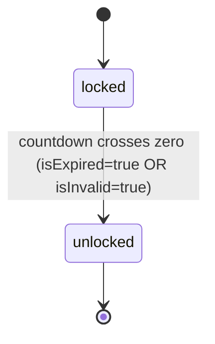

# Technical Spec — F010_PrelaunchCountdownGate (provisional)

**Priority**: P0
**Type**: ui
**Generated**: 2026-08-19

## Overview

Cổng chặn điều hướng toàn ứng dụng cho tới thời điểm sự kiện SAA 2025 bắt đầu, hiện ra dưới
dạng route mới `/prelaunch` — full-viewport, chỉ có nền ảnh sự kiện + đếm ngược DAYS/HOURS/MINUTES.
Áp dụng cho mọi actor (guest/user/admin không phân biệt — đây là gate theo thời gian, không phải
gate theo quyền): trong lúc đếm ngược còn > 0, mọi route khác bị chặn và đưa về `/prelaunch`; khi
về 0, chiều ngược lại mở khóa và `/prelaunch` tự đưa actor về `/`. Dùng lại nguyên trạng hàm tính
`lib/countdown.ts` đã có (không đổi), chỉ thêm tick 1 giây (thay vì 60 giây của trang chủ) vì gate
cần mở khóa trong vòng 1 giây kể từ mốc 0 — không phải chờ tới 59 giây như tick cũ.

## Polymorphic Behavior

N/A — no discriminator fields in Key Entities. Cả 3 entity ở `## Key Entities` bên dưới đều không
có field kiểu enum ≥2 giá trị đặt tên riêng biệt; trạng thái khóa/mở suy ra từ một cờ boolean
(`isExpired`/`isInvalid` của `CountdownResult`, đã có sẵn), nên xếp vào Business Rules, không phải
DISC (theo ranh giới DISC-vs-DEC: boolean flag → Business Rule, không phải DISC).

## Cross-Cutting Logic

### Requirements

| Code | Description | Endpoint/Handler | Verifiable |
|------|-------------|------------------|------------|
| FR-002 | Cổng điều hướng phía server: khi gate còn khóa, mọi route khác `/prelaunch` bị chặn và đưa về `/prelaunch`; khi gate đã mở, chính `/prelaunch` bị đưa về `/` | request-interception layer mới (xem `spec/system/architecture.md`) | yes |

Chưa có `**Source:**` vì file thực thi (dự kiến `middleware.ts`) chưa được viết — xem
`## Source Code References`.

### Business Rules

#### BR-001_LamTronDemNguoc
**Áp dụng cho:** 3 ô DAYS/HOURS/MINUTES trên màn Prelaunch
**Quy tắc:** Mỗi giá trị luôn hiển thị đủ 2 chữ số (thêm số 0 phía trước khi < 10).
**Ghi chú:** dùng lại nguyên trạng hàm `pad2`/`computeCountdown` đã có sẵn trong repo
(`lib/countdown.ts`, đã có unit test) — không viết logic tính toán mới cho quy tắc này.

**Pseudocode:**
```text
render pad2(days), pad2(hours), pad2(minutes)
```

#### BR-002_TrangThaiZeroKhiVeMoc
**Áp dụng cho:** 3 ô đếm ngược khi thời điểm hiện tại >= thời điểm sự kiện
**Quy tắc:** Cả 3 ô hiển thị `00` khi đã tới hoặc qua giờ sự kiện.
**Ghi chú:** cùng hành vi `zeroState`/`isExpired` đã có sẵn trong `lib/countdown.ts` — tái dùng,
không phải logic mới.

#### BR-003_FallbackKhiEnvKhongHopLe
**Áp dụng cho:** Toàn màn Prelaunch khi `NEXT_PUBLIC_EVENT_START_AT` rỗng/không parse được
**Quy tắc:** Không throw lỗi — coi như trạng thái zero-state (giống BR-002), tái dùng hành vi có
sẵn của `computeCountdown`.

#### BR-004_KhoaDieuHuongToanUngDung
**Áp dụng cho:** Mọi route ngoài `/prelaunch` trong toàn ứng dụng
**Quy tắc:** Khi gate còn khóa (đếm ngược chưa hết), bất kỳ request nào tới route khác
`/prelaunch` đều bị chặn và đưa về `/prelaunch` trước khi trang đó kịp render — không có "flash"
nội dung bị khóa.
**Nguồn thiết kế:** `clarifications.md` Session 2026-08-19, câu hỏi 1–2. Cơ chế rẽ nhánh cụ thể
xem DEC-001 bên dưới.

#### BR-005_MoKhoaVaChuyenHuongVeHome
**Áp dụng cho:** Route `/prelaunch`, sau khi gate đã mở
**Quy tắc:** Một khi đếm ngược đã về 0 (không còn khóa), truy cập `/prelaunch` bị đưa về `/` thay
vì hiển thị lại màn đếm ngược.
**Nguồn thiết kế:** `clarifications.md` Session 2026-08-19, câu hỏi 1. Cơ chế rẽ nhánh xem DEC-001.

#### BR-006_ChuyenHuongPhiaClientKhiDangXem
**Áp dụng cho:** Actor đang mở sẵn `/prelaunch` đúng lúc đếm ngược chạm mốc 0
**Quy tắc:** Ngoài cổng phía server (BR-004/BR-005, chỉ chặn ở lần request mới), màn Prelaunch tự
theo dõi tick và chuyển hướng actor sang `/` ngay trong tick đó — không cần actor tải lại trang.
**Lý do bắt buộc cả hai:** chỉ có cổng phía server thì actor đang xem sẽ bị "kẹt" ở `00 00 00` cho
tới khi tự tải lại — đúng lúc trang này tồn tại để phục vụ.

#### BR-007_TocDoCapNhat1Giay
**Áp dụng cho:** Riêng màn Prelaunch (không áp dụng cho đếm ngược trang chủ, vẫn giữ 60 giây)
**Quy tắc:** Tick mỗi 1 giây, không phải 60 giây như `components/home/countdown-timer.tsx`. Lý do:
phút phải lăn đúng ranh giới, và mở khóa điều hướng phải xảy ra trong vòng 1 giây thay vì trễ tới
59 giây.

#### BR-008_HoursMinutesKhongTheVuotBien
**Áp dụng cho:** Giá trị giờ (00–23) và phút (00–59) hiển thị
**Quy tắc:** Giờ/phút không bao giờ vượt biên (`-1`, `25`, `60`, …) vì được suy ra bằng phép chia
lấy dư (`modulo`) từ một khoảng dương — các test case đòi hỏi input ngoài khoảng đọc như thể viết
cho một ô nhập tay, không áp dụng được cho một bộ đếm tính toán. Đã ghi nhận trong
`clarifications.md` mục "Design defects" #4; không cần logic clamp riêng.

### Decision Logic

**Subtypes:** flow

---

#### DEC-001_DieuHuongTheoTrangThaiCong
**subtype:** flow
**Triggers in:** mọi route của ứng dụng, tại thời điểm request tới request-interception layer
(xem `spec/system/architecture.md`) — không riêng một SCR nào vì đây là gate toàn ứng dụng
**Involved entities:** `CountdownResult.isExpired`, `CountdownResult.isInvalid`, đường dẫn request
hiện tại (`pathname`)
**user_visible_outcome:** quyết định actor có được xem route họ vừa gõ/click hay bị đưa thẳng về
`/prelaunch` (hoặc ngược lại, về `/`)
**Source:** TBD (draft) — request-interception layer chưa được viết; xem
`clarifications.md` Session 2026-08-19.

```pseudo
locked = !countdown.isExpired AND !countdown.isInvalid   // BR-008 nói riêng, xem Unresolved Questions
if locked AND pathname !== '/prelaunch':
  redirect to '/prelaunch'
else if NOT locked AND pathname === '/prelaunch':
  redirect to '/'
else:
  pass through unchanged
```

(Không có DEC-### thứ hai — mọi rẽ nhánh khác của feature này đã nằm trong khối trên hoặc là
BR-006 phía client, vốn chỉ là cùng một điều kiện `locked` áp dụng lại trên client.)

### State Machines

#### SM-001_TrangThaiCong
**kind:** ui
**States:** locked, unlocked



**Transition rules:**
- `locked → unlocked`: một chiều, không có đường quay lại (thời gian không chạy ngược). Guard =
  `countdown.isExpired OR countdown.isInvalid`; side effect = mọi route mở ra bình thường,
  `/prelaunch` tự chuyển sang `/`.
- Không có state thứ 3 — không có "tạm khóa"/"bảo trì" nào khác được đặc tả.

### Algorithms

None — phép tính đếm ngược đã có sẵn (`lib/countdown.ts`, tái dùng nguyên trạng, không cần thuật
toán mới). Duy nhất phần mới là vòng lặp tick 1 giây (BR-007), không đủ phức tạp để cần một khối
ALG riêng.

### External Integrations

None.

### Verification

- **SC-001** — Mọi route ngoài `/prelaunch` trả về nội dung `/prelaunch` (qua redirect) trong lúc
  đếm ngược còn > 0 (covers FR-002, BR-004)
- **SC-002** — `/prelaunch` tự chuyển sang `/` trong vòng 1 giây kể từ mốc đếm ngược về 0, kể cả
  khi actor đang mở sẵn trang (covers BR-005, BR-006, BR-007)

---

**Client behavior:** see
[`architecture.md`](../system/architecture.md) (request-interception layer, guard/redirect logic),
[`clarifications.md`](../../clarifications.md) (design values, resolved decisions — không có
`behavior-logic.md`/`permissions.md` riêng cho feature này vì chưa có pass rebuild-spec nào chạy).

## User Stories

### US001_XemManHinhDemNguoc — Xem màn hình đếm ngược khi trang bị khóa (Priority: P0)

**What happens:** Actor cố truy cập site trước giờ sự kiện, bị đưa tới `/prelaunch` và thấy nền
ảnh sự kiện + tiêu đề "Sự kiện sẽ bắt đầu sau" + 3 ô DAYS/HOURS/MINUTES tự cập nhật mỗi giây,
zero-padded 2 chữ số.
**Why this priority:** Đây là màn hình duy nhất actor thấy được trong suốt thời gian trước sự
kiện — không có nó, gate chỉ là một trang trắng.
**Independent Test:** Mở `/prelaunch` trực tiếp với `NEXT_PUBLIC_EVENT_START_AT` ở tương lai; xác
nhận cả 3 ô hiển thị giá trị 2 chữ số và tự giảm sau 1 giây.

**Acceptance Scenarios:**

1. **Given** đếm ngược còn 5 ngày 3 giờ 9 phút, **When** actor mở `/prelaunch`, **Then** 3 ô hiện
   `05`, `03`, `09`.
2. **Given** actor đang xem `/prelaunch`, **When** 1 giây trôi qua và phút chưa lăn, **Then** ô
   phút không đổi cho tới đúng ranh giới phút kế tiếp.

**Requirements fulfilled:**
- **FR-001** Render `/prelaunch` full-viewport: nền ảnh sự kiện (node `2268:35129`) + overlay
  gradient (node `2268:35130`) + tiêu đề + 3 ô đếm ngược, giá trị lấy từ
  `NEXT_PUBLIC_EVENT_START_AT` qua hàm tính có sẵn — chưa có handler thật, xem
  `## Source Code References`.

**Rules enforced:** BR-001, BR-002, BR-003, BR-007, BR-008

**Verification:**
- **SC-003** — Digit box hiển thị đúng giá trị design values table (`clarifications.md` §
  Extracted design values) tại mọi mốc thời gian test (covers FR-001, BR-001)

---

### US002_ChanDieuHuongKhiConDemNguoc — Bị chặn điều hướng trong lúc đếm ngược còn > 0 (Priority: P0)

**What happens:** Actor gõ thẳng URL hoặc click liên kết bất kỳ (`/`, `/awards`, `/kudos`,
`/profile`, `/admin`) trong lúc gate còn khóa; request bị chặn và actor thấy `/prelaunch` thay vì
route họ nhắm tới, không có khoảnh khắc nào nội dung route kia lộ ra.
**Why this priority:** Đây chính là điều khoản "khóa toàn bộ điều hướng" mà spec item 1 (Days) ghi
nhận — không có nó, `/prelaunch` chỉ là một trang phụ, không phải một gate thật.
**Independent Test:** Với env đặt tương lai, gọi trực tiếp `/awards` (không qua UI) và xác nhận
response cuối cùng là nội dung `/prelaunch`, không phải `/awards`.

**Acceptance Scenarios:**

1. **Given** đếm ngược còn > 0, **When** actor mở `/awards`, **Then** actor thấy `/prelaunch`.
2. **Given** đếm ngược còn > 0, **When** actor mở `/prelaunch` trực tiếp, **Then** actor thấy đúng
   `/prelaunch` (không bị redirect vòng lặp).

**Requirements fulfilled:** FR-002 (see Cross-Cutting Logic)

**Rules enforced:** BR-004 (nguồn), DEC-001 (cơ chế rẽ nhánh)

**Verification:**
- **SC-004** — Gọi lần lượt cả 5 route không phải `/prelaunch` trong lúc còn khóa, tất cả đều kết
  thúc tại `/prelaunch` (covers FR-002, BR-004)

---

### US003_TuDongMoKhoaKhiVeMoc — Tự động mở khóa và điều hướng khi đếm ngược về 0 (Priority: P0)

**What happens:** Ngay khi đếm ngược chạm mốc 0 (hoặc env không hợp lệ — xem Unresolved
Questions), gate mở: request mới tới bất kỳ route nào đi thẳng tới đích, còn `/prelaunch` tự đưa
về `/`; đồng thời actor đang mở sẵn `/prelaunch` được đưa về `/` ngay trong tick đó mà không cần
tải lại.
**Why this priority:** Không có nhánh mở khóa, actor xem trước sự kiện sẽ kẹt vĩnh viễn ở
`/prelaunch` — hỏng chính mục đích của trang.
**Independent Test:** Dùng Playwright Clock API đẩy thời gian qua mốc sự kiện trong khi actor đang
mở sẵn `/prelaunch`; xác nhận actor được đưa về `/` mà không cần `reload()`.

**Acceptance Scenarios:**

1. **Given** actor đang mở `/prelaunch`, **When** đồng hồ chạm mốc sự kiện, **Then** actor được
   đưa về `/` trong vòng 1 giây, không cần thao tác gì.
2. **Given** đếm ngược đã về 0, **When** actor mở `/prelaunch` (request mới), **Then** actor được
   đưa thẳng về `/`.

**Requirements fulfilled:**
- **FR-003** Chuyển hướng phía client (`router.replace('/')`) trong tick mà `computeCountdown` lần
  đầu trả `isExpired: true` (hoặc `isInvalid: true`) — chưa có handler thật, xem
  `## Source Code References`.

**Rules enforced:** BR-005 (nguồn), BR-006 (client redirect), DEC-001

**State transitions:** SM-001 (`locked → unlocked`)

**Verification:**
- **SC-002** (see Cross-Cutting Logic)

---

### Edge Cases

| Scenario | Behavior |
|----------|----------|
| Đếm ngược về đúng 0 trong lúc actor đang đứng ở `/prelaunch` | Tự động chuyển sang `/` trong tick kế tiếp (≤1 giây), không tải lại trang |
| Actor gõ thẳng URL khác trong lúc còn khóa | Request bị chặn từ trước khi trang đích render, đưa về `/prelaunch` |
| `NEXT_PUBLIC_EVENT_START_AT` thiếu/không hợp lệ | Gate coi như đã mở (fail-open) — không khóa vĩnh viễn vì lỗi cấu hình, xem Unresolved Questions |
| Actor cố vào lại `/prelaunch` sau khi sự kiện đã bắt đầu | Bị đưa về `/` ngay lập tức |

## Key Entities

Greenfield — không có bảng CSDL thật (site tĩnh, không backend, kế thừa từ kiến trúc hiện có).

| Entity | Table | Key Columns | Purpose |
|--------|-------|-------------|---------|
| CountdownResult (non-entity, computed, tái dùng) | N/A (đã có sẵn `lib/countdown.ts`, không đổi) | days, hours, minutes, isExpired, isInvalid | Nguồn số liệu duy nhất cho cả hiển thị đếm ngược lẫn quyết định khóa/mở gate |
| NavigationGateState (non-entity, derived, mới) | N/A (không lưu trữ — tính lại mỗi request từ `CountdownResult.isExpired`/`isInvalid`, xem DEC-001) | locked (boolean, suy ra) | Cơ sở để request-interception layer quyết định redirect |
| EventStartAt (config value, tái dùng) | N/A (biến môi trường build-time `.env.example`, không phải bảng CSDL) | `NEXT_PUBLIC_EVENT_START_AT` (chuỗi ISO-8601) | Nguồn target instant duy nhất, dùng chung với đếm ngược trang chủ (không được phép lệch nhau) |

## Artifact References

| Artifact | File | Codes Used | Reviewed |
|----------|------|------------|----------|
| System Overview | [overview.md](../../../../docs/vi/system/overview.md) | — | [ ] |
| Architecture | [architecture.md](../system/architecture.md) (forward-draft delta, plan-local) | — | [ ] |
| Feature List | [feature-list.md](../../../../docs/vi/generated/feature-list.md) | F010 (provisional) | [ ] |
| API Map | TBD (draft) | TBD (draft) | [ ] |
| Entities | TBD (draft) | TBD (draft) | [ ] |
| Screens | [screens.md](screens.md) | SCR-Prelaunch (draft) | [ ] |
| Behavior Logic | TBD (draft) | TBD (draft) | [ ] |
| Permissions Matrix | TBD (draft) | N/A — công khai cho mọi actor, gate theo thời gian không phải theo quyền | [ ] |
| User Stories | (local, này chính là tài liệu này) | US001–US003 (local, draft) | [ ] |

**Rule:** F010 là mã tạm thời (provisional) — mã thật + đăng ký vào
`docs/vi/generated/feature-list.md` chỉ xảy ra lúc promote (implement-start), theo
`spec-authoring-contract.md` § State-Registration Handoff.

## Assumptions

- `lib/countdown.ts` tái dùng nguyên trạng, không sửa — cả hiển thị đếm ngược lẫn quyết định
  khóa/mở gate đều đọc cùng một `CountdownResult` để trang chủ và Prelaunch không bao giờ lệch giá
  trị nhau.
- Gate suy ra "khóa" từ đúng 2 cờ đã có sẵn (`isExpired`, `isInvalid`) — không cần thêm state hay
  cấu hình mới nào để biết lúc nào mở khóa.
- Request-interception layer (dự kiến `middleware.ts`) phải loại trừ tài nguyên tĩnh nội bộ của
  Next.js (`_next/static`, `_next/image`, favicon, v.v.) khỏi việc redirect — nếu không, chính
  `/prelaunch` cũng vỡ vì CSS/JS/ảnh của nó bị chặn theo. Đây là quy ước kỹ thuật chuẩn của
  Next.js middleware, không phải điều gì được đặc tả riêng cho feature này.
- Tick 1 giây chỉ áp dụng cho `/prelaunch`; đếm ngược trang chủ giữ nguyên 60 giây (đã quyết trong
  `clarifications.md`) — hai nơi đọc cùng một `CountdownResult` nên không lệch giá trị, chỉ lệch
  độ trễ hiển thị.

## Source Code References

Chưa có code mới nào được viết cho feature này. Route `/prelaunch`, request-interception layer, và
mọi component hiển thị đếm ngược trên màn đó đều chưa tồn tại trong cây nguồn. Duy nhất
`lib/countdown.ts` (đã có sẵn, có unit test, không đổi) được tái dùng — xem prose trong
`## Assumptions` và `## Cross-Cutting Logic` thay vì một bảng path:line ở đây.

## Unresolved Questions

1. **Hành vi gate khi env không hợp lệ**: giả định fail-open (mở khóa) khi
   `NEXT_PUBLIC_EVENT_START_AT` thiếu/sai định dạng — nhất quán với `BR-003` đã có (coi invalid
   giống hệt expired), và tránh site bị khóa vĩnh viễn vì lỗi cấu hình. Chưa được design owner xác
   nhận tường minh cho riêng trường hợp gate (chỉ có cho riêng hiển thị đếm ngược).
2. **Danh sách loại trừ chính xác của request-interception layer** (matcher): những gì ngoài
   `_next/static`/`_next/image`/favicon cần loại trừ (vd API route nếu sau này có) chưa được liệt
   kê đầy đủ — sẽ xác nhận lúc implement.
3. **Font "Digital Numbers"** cho digit glyph chưa được cung cấp — đã ghi ở `clarifications.md`,
   nhắc lại ở đây vì ảnh hưởng trực tiếp `## Screen Layout` của `screens.md`.
4. **Responsive dưới 1512px** là suy diễn, không phải được đặc tả — nhắc lại từ `clarifications.md`.
