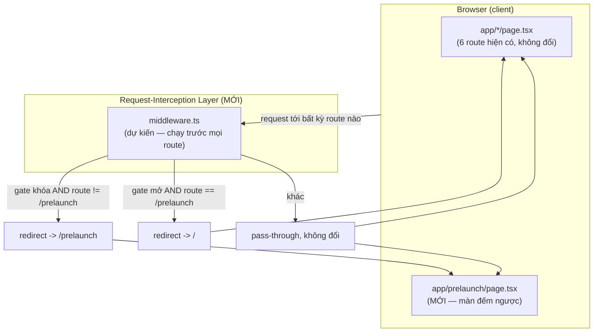

# Architecture — Delta cho F010_PrelaunchCountdownGate (provisional)

Đây là **delta phẫu thuật** (surgical delta) so với `docs/vi/system/architecture.md` đã có —
KHÔNG viết lại toàn bộ tài liệu đó. Chỉ mô tả một tầng mới: request-interception layer
(`middleware.ts`, dự kiến). Mọi phần khác của architecture.md hiện có (Tech Stack, Layering,
Component composition, Cross-cutting concerns, Asset Strategy…) giữ nguyên không đổi.

**Không phải auth.** Layer này là một gate theo THỜI GIAN (launch-timing), không phải một biên
giới ủy quyền (authorization boundary). Nó không đọc `role`/`SessionState` của
`lib/session/session-provider.tsx` — vốn đã tự ghi rõ là mock, không phải access control (xem
architecture.md hiện có § Cross-cutting concerns). Ai đọc tài liệu này không nên nhầm nó với một
cơ chế phân quyền: mọi actor (guest/user/admin) đều bị/được cùng một quyết định khóa/mở như nhau.

## Tầng mới: Request-Interception Layer

**Vị trí trong request path:** chèn giữa Browser và các route hiện có (`app/*/page.tsx`) — chạy
TRƯỚC khi bất kỳ page nào trong số 6 route hiện tại (`/`, `/awards`, `/kudos`, `/profile`,
`/admin`, và route mới `/prelaunch`) được render.

**So với architecture.md hiện có:** dòng đầu tài liệu đó ghi rõ "không có `middleware.ts`" (xác
nhận tại scout-report.md thời điểm homepage-saa). Delta này đảo lại xác nhận đó — layer mới thêm
vào, mọi phần khác giữ nguyên.

## Nguồn dữ liệu quyết định khóa/mở

Không có state mới, không có bảng CSDL mới. Layer đọc cùng một `NEXT_PUBLIC_EVENT_START_AT` đã có
sẵn (biến môi trường build-time, đã dùng cho đếm ngược trang chủ) và tính lại cùng công thức đã có
trong `lib/countdown.ts` (`isExpired`/`isInvalid`) để suy ra "khóa" hay "mở" — xem
`../countdown-prelaunch/technical-spec.md` § DEC-001. Vì `middleware.ts` chạy trên Edge runtime
(không có `localStorage`, không có DOM), quyết định này KHÔNG đọc `saa.mock-role`/`saa.locale` hay
bất kỳ state phía client nào khác — chỉ một biến môi trường + đồng hồ server.

## Routing — bổ sung

| Route | File | Nội dung |
|---|---|---|
| `/prelaunch` | `app/prelaunch/page.tsx` (MỚI, dự kiến) | Màn đếm ngược full-viewport — xem `../countdown-prelaunch/screens/SCR-Prelaunch/spec.md` |

5 route hiện có (`/`, `/awards`, `/kudos`, `/profile`, `/admin`) không đổi file, chỉ đổi hành vi
khi nào chúng được phép render (qua layer mới ở trên).

## Mã chưa được cấp (TBD)

Theo quy tắc forward-authored system doc: KHÔNG được đoán mã thật. Mọi `PERM###`/`SCR###`/`ROUTE###`
liên quan tới layer này đều là `TBD (draft)` — cấp mã thật xảy ra lúc reconcile (post-forge), không
phải ở bước author này.

## Chưa quyết / ngoài phạm vi tài liệu này

- Danh sách matcher loại trừ chính xác (`_next/static`, `_next/image`, favicon, …) — quy ước kỹ
  thuật chuẩn của Next.js middleware, sẽ xác nhận lúc implement, không phải một quyết định thiết kế
  cần ghi ở đây.
- Rationale đầy đủ ("vì sao gate ở tầng middleware thay vì ở từng page") thuộc về một ADR riêng
  (`docs/decisions/`), không phải tài liệu narrative này — theo đúng ranh giới
  narrative-vs-rationale của spec-authoring-contract.
