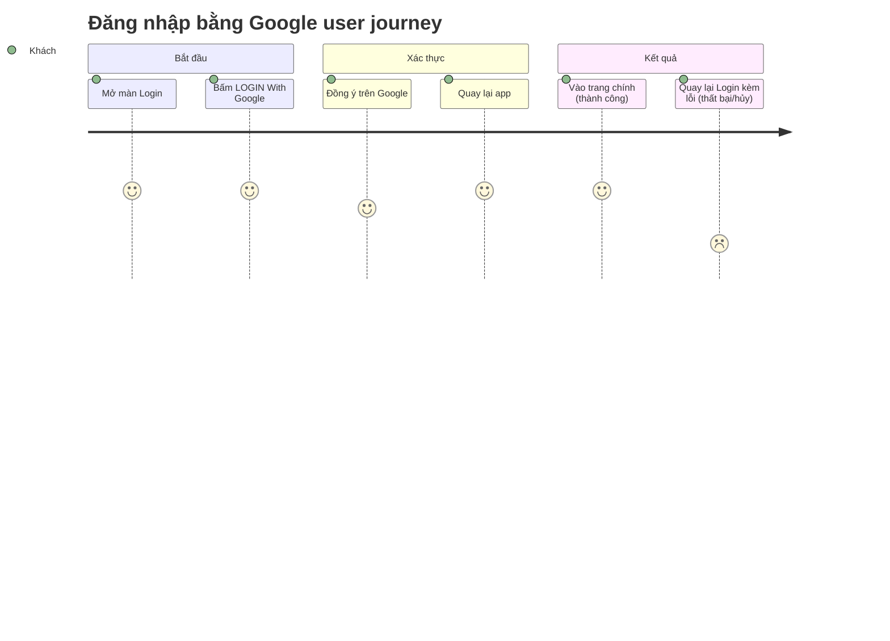

# Screens — Login qua Google OAuth (Supabase)

## Screen List

| Screen Name | SCR### | What User Sees | What User Can Do |
|-------------|--------|----------------|------------------|
| Login | TBD (draft) — cấp lúc promote | Header (logo + language selector), hero (wave key visual + logo ROOT FURTHER), title/subtitle/tagline, nút "LOGIN With Google", footer bản quyền căn giữa | Đổi ngôn ngữ; bấm nút để bắt đầu đăng nhập Google; xem thông báo lỗi nếu đăng nhập thất bại |

## User Journey

1. Khách chưa đăng nhập mở Login và thấy tiêu đề sự kiện cùng nút "LOGIN With Google".
2. Khách bấm nút — được đưa sang màn xác nhận của Google (cùng tab).
3. Khách đồng ý bằng tài khoản Google — được đưa tới trang chính của sự kiện với phiên đăng
   nhập đã thiết lập.
4. Nếu khách hủy hoặc gặp lỗi giữa chừng, khách được đưa trở lại Login kèm thông báo lỗi, có
   thể bấm nút để thử lại.
5. Khách đã đăng nhập mà lỡ mở lại Login được đưa thẳng tới trang chính, không thấy lại màn
   Login.

