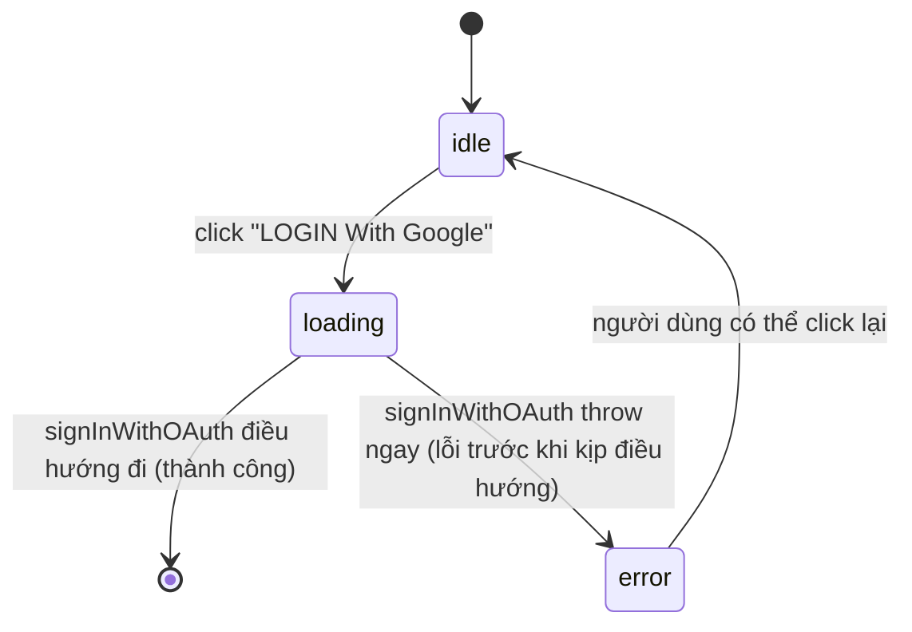

# Technical Spec — Login qua Google OAuth (Supabase) [mã F### cấp lúc promote]

**Priority**: P0
**Type**: mixed
**Generated**: 2026-08-19

## Overview

Route `/login` mới cho SAA 2025: header (logo + language selector) + hero (wave key visual +
tiêu đề ROOT FURTHER) + khối giới thiệu (title/subtitle/tagline) + một nút "LOGIN With Google"
duy nhất + footer bản quyền căn giữa. Xác thực đi qua một **Supabase local project** thật
(`@supabase/supabase-js` + `@supabase/ssr`): click nút → `signInWithOAuth` → Supabase
`/auth/v1/authorize` → Google → `/auth/callback` (route handler mới) → `exchangeCodeForSession`
→ redirect `/`. Đây là lần đầu tiên hệ thống có một ranh giới xác thực THẬT — tồn tại song
song, không thay thế, mock session hiện có (`lib/session/session-provider.tsx`). Phạm vi dừng ở
màn Login + phiên đăng nhập; bảo vệ các route khác và thay mock session là việc của lượt sau
(xem `clarifications.md` § Next Steps).

## Polymorphic Behavior

N/A — no discriminator fields in Key Entities. Không entity nào ở `## Key Entities` bên dưới có
field kiểu enum ≥2 giá trị đặt tên riêng biệt; trạng thái loading/error của nút là UI state
(xem SM-001), không phải discriminator dữ liệu.

## Cross-Cutting Logic

### Requirements

| Code | Description | Endpoint/Handler | Verifiable |
|------|-------------|------------------|------------|
| FR-001 | Render `/login`: header (logo tĩnh + language selector), hero (wave key visual nền + logo ROOT FURTHER ảnh có sẵn), khối title/subtitle/tagline, 1 nút "LOGIN With Google", footer bản quyền căn giữa | `(page) /login` — dự kiến `app/login/page.tsx` (chưa viết) | yes |
| FR-002 | Click nút → gọi `supabase.auth.signInWithOAuth({ provider: 'google', options: { redirectTo: <origin>/auth/callback } })`, chuyển hướng cùng-tab (không mở tab/popup mới — quyết định thiết kế #5) tới Supabase `/auth/v1/authorize` rồi Google | dự kiến `app/login/page.tsx` (client handler, chưa viết) | yes |
| FR-003 | `/auth/callback` (route handler mới) nhận `code` từ Google/Supabase, gọi `exchangeCodeForSession(code)` qua Supabase server client (`@supabase/ssr`), ghi session cookie, rồi redirect `/` khi thành công hoặc redirect lại `/login` kèm cờ lỗi khi thất bại | dự kiến `app/auth/callback/route.ts` (chưa viết) | yes |
| FR-004 | Khi `/login` được mở và đã có Supabase session hợp lệ (đọc qua server client trong Server Component/layout của route), redirect ngay tới `/` — form Login không render | dự kiến `app/login/page.tsx` (server check, chưa viết) | yes |
| FR-005 | `/login` và `/auth/callback` được thêm vào allowlist của cổng đếm-ngược-trước-khi-mở-site trong `proxy.ts`, để cả hai luôn tới được bất kể trạng thái đếm ngược | `proxy.ts` (đã tồn tại, sẽ sửa `lib/prelaunch/gate.ts` allowlist) | yes |

Không có trích dẫn file:dòng nào ở đây — chưa có dòng code nào được viết cho feature này
(xem `## Source Code References`).

### Business Rules

#### BR-001_NutDisableVaLoaderKhiDangXacThuc
**Áp dụng cho:** Nút "LOGIN With Google" trên `/login`
**Quy tắc:** Ngay khi click, nút chuyển sang trạng thái disabled + hiển thị loading indicator,
giữ nguyên trạng thái đó cho tới khi trình duyệt điều hướng đi (thành công) hoặc lỗi được phát
hiện (thất bại/hủy) đưa nút về trạng thái ban đầu.
**Nguồn:** TBD (draft) — chưa viết code; dự kiến state cục bộ trong `app/login/page.tsx`.

#### BR-002_ThongBaoLoiKhiDangNhapThatBai
**Áp dụng cho:** Kết quả xác thực Google thất bại hoặc bị người dùng hủy
**Quy tắc:** Hiển thị đúng chuỗi *"Đăng nhập không thành công. Vui lòng thử lại."* trong một
vùng `role="alert"` ngay dưới nút Login, để trình đọc màn hình công bố ngay và test có thể
assert được. Không có vùng lỗi nào được vẽ trong design gốc (khiếm khuyết thiết kế #2) — vị trí
này là quyết định lúc triển khai.
**Nguồn:** TBD (draft) — chưa viết code.

#### BR-003_RedirectVeTrangChuKhiThanhCong
**Áp dụng cho:** `/auth/callback` sau khi `exchangeCodeForSession` trả về thành công
**Quy tắc:** Redirect người dùng về `/` (không phải `/todo` như spec gốc ghi — khiếm khuyết
thiết kế #1, đã quyết định dùng `/` vì khớp câu chữ test case *"redirected to the main
application page"*).
**Nguồn:** TBD (draft) — chưa viết code.

#### BR-004_MienTruQuaCongDemNguoc
**Áp dụng cho:** `proxy.ts` (cổng đếm-ngược-trước-khi-mở-site, xem `architecture.md` §
Request-Interception Layer)
**Quy tắc:** `/login` và `/auth/callback` luôn pass-through, bất kể `NEXT_PUBLIC_EVENT_START_AT`
còn khóa hay đã mở — cùng cơ chế allowlist đang áp dụng cho `/prelaunch`. Đây là quyết định
launch-timing, không phải nới lỏng authorization cho route nào khác.
**Nguồn:** TBD (draft) — sẽ sửa `lib/prelaunch/gate.ts` (file đã tồn tại, logic mới chưa viết).

#### BR-005_PhienDangNhapTonTaiQuaReload
**Áp dụng cho:** Người dùng đã đăng nhập Google thành công
**Quy tắc:** Phiên Supabase còn hiệu lực sau khi tải lại trang (session cookie do
`@supabase/ssr` quản lý) — không cần đăng nhập lại mỗi lần reload.
**Nguồn:** TBD (draft) — hành vi mặc định của `@supabase/ssr`, chưa có wiring code trong repo
này.

#### BR-006_TaiSuDungBoChonNgonNgu
**Áp dụng cho:** Language selector trên `/login`
**Quy tắc:** Dùng lại nguyên `components/ui/language-switcher.tsx` và key `saa.locale` trong
`localStorage` — không tạo cơ chế persist ngôn ngữ thứ hai (`NEXT_LOCALE` cookie mà spec gốc
ghi là khiếm khuyết thiết kế #3, đã quyết định bỏ).
**Nguồn:** `components/ui/language-switcher.tsx` (component đã tồn tại, tái dùng nguyên trạng).

### Decision Logic

**Subtypes:** flow

---

#### DEC-001_RedirectKhiDaDangNhap
**subtype:** flow
**Triggers in:** mount của route `/login` (server-side, trước khi render)
**Involved entities:** SupabaseSession (có tồn tại hay không)
**user_visible_outcome:** người dùng đã đăng nhập không bao giờ thấy lại form Login — được đưa
thẳng về `/`
**Source:** TBD (draft) — chưa viết code, dự kiến `app/login/page.tsx`

```pseudo
if supabaseSession exists:
  redirect to '/'
else:
  render Login form
```

---

#### DEC-002_RedirectTheoKetQuaExchange
**subtype:** flow
**Triggers in:** `/auth/callback` xử lý xong `exchangeCodeForSession`
**Involved entities:** kết quả exchange (success/error), `code`/`error` query param từ Google
**user_visible_outcome:** thành công → vào thẳng `/`; thất bại/hủy → quay lại `/login` kèm cờ để
hiển thị thông báo lỗi
**Source:** TBD (draft) — chưa viết code, dự kiến `app/auth/callback/route.ts`

```pseudo
if google returned error OR exchangeCodeForSession fails:
  redirect to '/login?error=1'
else:
  redirect to '/'
```

---

### State Machines

#### SM-001_TrangThaiNutLogin
**kind:** ui
**States:** idle, loading, error



**Transition rules:**
- `idle → loading`: guard = không có; side effect = disable nút + hiện loader (BR-001).
- `loading → [*]`: trình duyệt điều hướng hẳn sang Supabase/Google, component unmount — không
  có state "loading xong" trong SPA vì đây là full-page redirect.
- `loading → error`: guard = `signInWithOAuth` reject/throw trước khi điều hướng kịp xảy ra;
  side effect = hiện thông báo lỗi (BR-002), nút về lại nhấn-được.
- Trường hợp lỗi xảy ra ở `/auth/callback` (sau khi đã rời `/login`) không đi qua state machine
  này — nó quay lại `/login` như một request mới, tự khởi tạo `idle` với cờ lỗi hiển thị ngay
  (xem DEC-002).

### Algorithms

None.

### External Integrations

#### INT-001_SupabaseGoogleOAuth
**Linked FR:** FR-002, FR-003
**Source:** TBD (draft) — chưa viết code
**Type:** api-call (redirect-based OAuth, không phải call đồng bộ chờ response)
**Target:** Supabase local project (`/auth/v1/authorize`) → Google OAuth consent → Supabase
callback nội bộ → app `/auth/callback`
**Trigger:** click nút "LOGIN With Google"
**Payload:** `provider: 'google'`, `redirectTo: <origin>/auth/callback` — không có secret nào
trong payload phía client; `SUPABASE_AUTH_EXTERNAL_GOOGLE_CLIENT_ID`/`..._SECRET` chỉ tồn tại
phía server (`supabase/config.toml`, đọc từ env, không commit)
**Failure handling:** người dùng hủy ở màn Google → Google trả về `/auth/callback` kèm
`error` param → DEC-002 đưa về `/login` kèm thông báo lỗi; không có retry tự động, không có
queue/DLQ (đây là luồng tương tác người dùng, không phải job nền)

```pseudo
onClick():
  setLoading(true)
  supabase.auth.signInWithOAuth({ provider: 'google', options: { redirectTo: callbackUrl } })
  # trình duyệt điều hướng đi ngay khi Supabase trả redirect URL — không có "await" chờ kết quả
  # đăng nhập ở đây, kết quả xảy ra ở /auth/callback (request mới, DEC-002)
```

### Verification

- **SC-001** — `/login` render đủ 5 khối theo `## Extracted design values` của
  `clarifications.md` (covers FR-001)
- **SC-002** — Click nút dẫn tới một request `/auth/v1/authorize` của Supabase (không phải
  popup/tab mới — covers FR-002, khiếm khuyết thiết kế #5)
- **SC-003** — Nút disabled + có loader trong khoảng thời gian giữa click và khi trình duyệt
  rời trang (covers BR-001, SM-001)
- **SC-004** — Một phiên Supabase hợp lệ được thiết lập trực tiếp (test bootstrap session) rồi
  mở `/login` → redirect `/` không render lại form (covers FR-004, DEC-001)
- **SC-005** — `/login` và `/auth/callback` vẫn tới được khi `NEXT_PUBLIC_EVENT_START_AT` còn
  ở tương lai (gate khóa) (covers FR-005, BR-004)

---

**Client behavior:** see
[`behavior-logic.md`](../../../../docs/vi/generated/behavior-logic.md) (client-side patterns —
debounce, optimistic UI, polling, upload, realtime — không phát sinh pattern mới nào cho feature
này ngoài SM-001 đã mô tả ở trên),
[`permissions.md`](../system/permissions.md) (bản nháp cập nhật — ranh giới auth Supabase mới),
[`screen-flow.md`](../../../../docs/vi/generated/screen-flow.md) (guard logic — DEC-001/DEC-002
sẽ trở thành GUARD-### thật lúc reconcile).

## User Stories

### US001_XemManHinhLogin — Xem màn hình Login khi chưa đăng nhập (Priority: P0)

**What happens:** Khách truy cập `/login` khi chưa có phiên Supabase, thấy đủ header (logo +
language selector), hero (wave key visual + logo ROOT FURTHER), title/subtitle/tagline, nút
"LOGIN With Google", và footer bản quyền — không có nội dung nào khác.
**Why this priority:** Không có màn hình này thì không ai bắt đầu được luồng đăng nhập — đây là
điều kiện tiên quyết của mọi US khác.
**Independent Test:** Mở `/login` trực tiếp (không có session) và xác nhận 5 khối bố cục theo
`clarifications.md` § Extracted design values đều hiện diện.

**Acceptance Scenarios:**

1. **Given** chưa có phiên Supabase, **When** khách mở `/login`, **Then** màn hình Login hiện
   ra đầy đủ 5 khối, không redirect.
2. **Given** đang ở `/login`, **When** khách quan sát header, **Then** logo không tương tác,
   language selector mặc định hiện `VN`.

**Requirements fulfilled:**
- **FR-001** Render `/login` đầy đủ header/hero/intro/nút/footer — dự kiến `app/login/page.tsx`
  (chưa viết)

**Rules enforced:** BR-006 (tái dùng language selector)

**Verification:**
- **SC-001** (covers FR-001)

---

### US002_DangNhapBangGoogleThanhCong — Đăng nhập bằng Google thành công (Priority: P0)

**What happens:** Khách click "LOGIN With Google", được đưa qua Supabase rồi Google để xác thực
tài khoản Google thật, sau khi đồng ý thì quay lại app qua `/auth/callback` và được đưa thẳng
vào `/` với phiên đăng nhập đã thiết lập.
**Why this priority:** Đây là toàn bộ lý do màn hình này tồn tại — không có luồng này thành công,
tính năng không có giá trị.
**Independent Test:** Click nút, xác nhận request điều hướng tới Supabase `/auth/v1/authorize`
kèm đúng `provider=google` và `redirect_to` trỏ về `/auth/callback` của app.

**Acceptance Scenarios:**

1. **Given** khách chưa đăng nhập, **When** click "LOGIN With Google" và hoàn tất xác thực
   Google hợp lệ, **Then** khách được đưa về `/` và có thông tin người dùng.
2. **Given** đang xác thực (giữa lúc click và khi trình duyệt điều hướng đi), **When** quan sát
   nút, **Then** nút disabled + hiện loader (BR-001).

**Requirements fulfilled:**
- **FR-002** Khởi tạo `signInWithOAuth` cùng-tab — dự kiến `app/login/page.tsx` (chưa viết)
- **FR-003** `/auth/callback` exchange code thành session — dự kiến `app/auth/callback/route.ts`
  (chưa viết)

**Rules enforced:** BR-001, BR-003, BR-005

**State transitions:** SM-001 (`idle → loading → [*]`)

**Verification:**
- **SC-002**, **SC-003** (covers FR-002, BR-001)

---

### US003_DangNhapThatBaiHoacHuy — Đăng nhập thất bại hoặc bị hủy (Priority: P1)

**What happens:** Khách hủy ở màn đồng ý của Google, hoặc quá trình exchange code thất bại;
khách quay lại `/login` và thấy dòng chữ *"Đăng nhập không thành công. Vui lòng thử lại."* ngay
dưới nút, có thể click lại để thử lần nữa.
**Why this priority:** Không xử lý ca này, người dùng hủy/gặp lỗi sẽ thấy trang trắng hoặc màn
hình treo — không phải chặn tính năng chính (P0) nhưng bắt buộc để tính năng dùng được thật.
**Independent Test:** Giả lập `exchangeCodeForSession` thất bại (code không hợp lệ/hết hạn), xác
nhận `/login` hiện đúng chuỗi lỗi trong một phần tử `role="alert"`.

**Acceptance Scenarios:**

1. **Given** khách hủy ở màn đồng ý Google, **When** quay lại app, **Then** `/login` hiện thông
   báo lỗi, nút Login về lại trạng thái nhấn-được.
2. **Given** `exchangeCodeForSession` trả lỗi, **When** `/auth/callback` xử lý xong, **Then**
   khách được đưa về `/login` kèm thông báo lỗi, không phải một trang lỗi chung của Next.js.

**Requirements fulfilled:**
- **FR-003** (see US002 — nhánh lỗi)

**Rules enforced:** BR-002

**State transitions:** SM-001 (`loading → error → idle`)

**Verification:**
- Không có SC riêng — bao phủ bởi acceptance scenarios trên; ứng viên cho lượt viết test case kế
  tiếp (xem `edge-cases.md`).

---

### US004_ChanTruyCapLoginKhiDaDangNhap — Chặn truy cập Login khi đã đăng nhập (Priority: P1)

**What happens:** Người dùng đã có phiên Supabase hợp lệ, cố mở `/login` (gõ URL trực tiếp hoặc
back button), bị đưa thẳng về `/` — không thấy lại form Login.
**Why this priority:** Ngăn một hành vi khó hiểu (đăng nhập lại dù đã đăng nhập); không chặn
được luồng chính nếu thiếu, nhưng test case `f62b0c97` yêu cầu tường minh.
**Independent Test:** Thiết lập một phiên Supabase hợp lệ trực tiếp (test bootstrap, không qua
UI), mở `/login`, xác nhận response cuối cùng là `/`.

**Acceptance Scenarios:**

1. **Given** đã có phiên Supabase hợp lệ, **When** người dùng mở `/login`, **Then** hệ thống
   redirect ngay về `/`, không render form Login.

**Requirements fulfilled:**
- **FR-004** — dự kiến `app/login/page.tsx` (server check, chưa viết)

**Rules enforced:** (none riêng — xem DEC-001)

**State transitions:** — (đây là routing decision, không phải UI state machine)

**Verification:**
- **SC-004** (covers FR-004, DEC-001)

---

### US005_DoiNgonNguTrenManLogin — Đổi ngôn ngữ trên màn Login (Priority: P2)

**What happens:** Khách click language selector trên `/login`, chọn ngôn ngữ khác, toàn bộ copy
màn Login (và phần còn lại của app khi điều hướng tiếp) đổi theo ngay lập tức, lựa chọn được
lưu lại cho lần sau.
**Why this priority:** Không phải luồng lõi của tính năng đăng nhập; đã có sẵn ở mọi màn hình
khác, chỉ cần tái dùng đúng component trên màn mới này.
**Independent Test:** Click language selector trên `/login`, chọn EN, xác nhận copy đổi và
`localStorage['saa.locale']` được ghi `en`.

**Acceptance Scenarios:**

1. **Given** đang ở `/login` với ngôn ngữ mặc định VN, **When** khách chọn EN từ dropdown,
   **Then** toàn bộ copy trên `/login` đổi sang tiếng Anh ngay lập tức.

**Requirements fulfilled:**
- (không có FR riêng — hành vi kế thừa nguyên trạng từ `components/ui/language-switcher.tsx`,
  xem BR-006)

**Rules enforced:** BR-006

**Verification:**
- Không có SC riêng cho US này — hành vi đã được `homepage-saa`/`countdown-prelaunch` bao phủ ở
  màn hình khác; chỉ cần xác nhận component được mount đúng trên `/login`.

---

### Edge Cases

See [edge-cases.md](edge-cases.md).

## Key Entities

Greenfield — không có bảng CSDL do app này tự định nghĩa cho phiên đăng nhập; schema
`auth.users`/session do chính Supabase quản lý nội bộ.

| Entity | Table | Key Columns | Purpose |
|--------|-------|-------------|---------|
| SupabaseSession (Supabase-managed, không phải model của app) | N/A (session cookie do `@supabase/ssr` quản lý, không phải bảng do app định nghĩa) | access_token, refresh_token, user | Nguồn xác định "đã đăng nhập hay chưa" cho DEC-001/FR-004 |
| SupabaseUser (Supabase-managed) | N/A (`auth.users` — schema nội bộ của Supabase, app không viết migration cho nó) | id, email, user_metadata (tên/avatar Google) | Thông tin người dùng trả về sau khi exchange code thành công (US002) |
| PrelaunchGateAllowlist (cấu hình, không phải entity CSDL) | N/A (mảng string trong `lib/prelaunch/gate.ts`) | pathname được miễn trừ | Quyết định `/login`/`/auth/callback` có bị `proxy.ts` chặn hay không (FR-005, BR-004) |

## Artifact References

| Artifact | File | Codes Used | Reviewed |
|----------|------|------------|----------|
| System Overview | [overview.md](../../../../docs/vi/system/overview.md) | — | [ ] |
| Architecture | [architecture.md draft](../system/architecture.md) | TBD (draft) | [ ] |
| Feature List | [feature-list.md](../../../../docs/vi/generated/feature-list.md) | TBD (draft) — chưa cấp F###, cấp lúc promote | [ ] |
| API Map | [api-map.md](../../../../docs/vi/generated/api-map.md) | TBD (draft) — route `/auth/callback` chưa tồn tại | [ ] |
| Entities | [entities.md](../../../../docs/vi/generated/entities.md) | N/A — không có model do app định nghĩa | [ ] |
| Screens | [screens.md](screens.md) | TBD (draft) — SCR### cấp lúc promote | [ ] |
| Screen Flow | [screen-flow.md](../../../../docs/vi/generated/screen-flow.md) | TBD (draft) — DEC-001/DEC-002 sẽ thành GUARD-### | [ ] |
| Permissions Matrix | [permissions-matrix.md](../../../../docs/vi/generated/permissions-matrix.md) | N/A — feature này không thêm PERM### mới (gating theo role không đổi); ranh giới auth mới là Supabase session, không phải role | [ ] |
| User Stories | (local, tài liệu này) | US001–US005 | [x] |

## Assumptions

- Supabase local project (`supabase start`) tự quản lý schema `auth.users` — app không viết
  migration hay bảng riêng cho user/session ở lượt này.
- `NEXT_PUBLIC_SUPABASE_URL` / `NEXT_PUBLIC_SUPABASE_ANON_KEY` lấy từ output của
  `supabase start`, đặt trong `.env.local`; `SUPABASE_AUTH_EXTERNAL_GOOGLE_CLIENT_ID` /
  `..._SECRET` đọc từ env vào `supabase/config.toml`, không commit vào repo.
- Redirect URL callback là same-origin `/auth/callback` — phải được đăng ký trong
  `supabase/config.toml` (`auth.external.google.redirect_uri` hoặc tương đương) khớp với giá trị
  truyền vào `signInWithOAuth`.
- Việc lưu trữ/refresh session hoàn toàn do `@supabase/ssr` cookie helper đảm nhiệm — không viết
  logic quản lý token thủ công.
- Mock session (`lib/session/session-provider.tsx`) giữ nguyên không đổi; phiên Supabase và mock
  session tồn tại song song, không cái nào điều khiển cái kia ở lượt này (quyết định phạm vi đã
  chốt trong `clarifications.md`).
- `/auth/callback` là Route Handler (`app/auth/callback/route.ts`), không phải Server Action —
  vì đây là target redirect của bên thứ ba (Google/Supabase), cần một URL GET thật.

## Source Code References

Chưa có dòng code nào được viết cho feature này — toàn bộ file dưới đây là **dự kiến**, không
phải đã tồn tại. Không có trích dẫn file:dòng nào trong tài liệu này (xem `## User Stories` để
biết endpoint dự kiến).

Dự kiến tạo mới: `app/login/page.tsx`, `app/auth/callback/route.ts`,
`components/login/login-header.tsx`, `components/login/login-footer.tsx`,
`components/login/login-button.tsx`, `lib/supabase/client.ts`, `lib/supabase/server.ts`,
`supabase/config.toml`.

Dự kiến sửa: `lib/prelaunch/gate.ts` (thêm `/login`, `/auth/callback` vào allowlist),
`package.json` (thêm `@supabase/supabase-js`, `@supabase/ssr`), `.env.example` (thêm 4 biến
Supabase/Google), i18n dictionaries (`lib/i18n/dictionaries/vi.ts`, `.../en.ts` — thêm key
`login.*`).

Tái dùng nguyên trạng, không sửa: `components/ui/language-switcher.tsx`,
`components/ui/dropdown-menu.tsx`, `public/saa/Root_Further_Logo.png`.

## Unresolved Questions

1. **Chưa có Google OAuth client ID/secret.** Người dùng đã nhận trách nhiệm cung cấp; cho tới
   khi có trong `.env.local`, vòng round-trip OAuth thật không thể chạy hết — strict E2E chỉ
   assert được tới điểm redirect sang Supabase `/auth/v1/authorize`, cộng với hành vi
   session-và-redirect dựng qua một session Supabase test tự thiết lập trực tiếp.
2. **Docker/colima phải chạy** để `supabase start` hoạt động — nằm ngoài khả năng của agent
   triển khai, cần người dùng tự bật trước.
3. **Đích sau đăng nhập** (quyết định là `/`) nên được xác nhận lại với chủ sở hữu thiết kế —
   `/todo` trong spec gốc không tồn tại trong app này (khiếm khuyết thiết kế #1).
4. **Vị trí/style vùng thông báo lỗi** dưới nút Login là quyết định triển khai, chưa được
   design owner xác nhận (khiếm khuyết thiết kế #2).
5. **Responsive dưới 1440px là suy diễn**, chưa có frame nào khác được cung cấp (khiếm khuyết
   thiết kế #6, cùng dạng gap đã có ở `countdown-prelaunch`).
