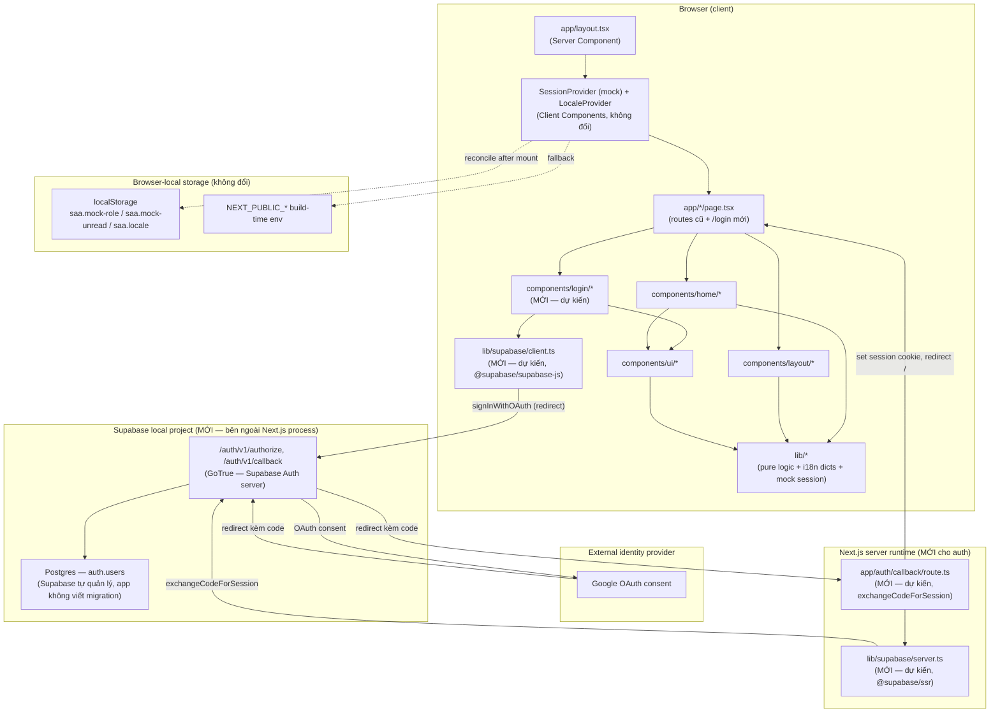

# Architecture (bản nháp — bổ sung lớp Supabase auth)

> **Bản nháp forward-drafted.** Tài liệu này là bản cập nhật DỰ KIẾN của
> `docs/vi/system/architecture.md` sau khi feature Login qua Google OAuth (Supabase) được
> triển khai. Nó KHÔNG ghi đè file đó — việc đó xảy ra lúc promote/reconcile. Phần chưa đổi so
> với bản hiện có được giữ nguyên; phần mới được đánh dấu rõ.

## System Architecture

Giữ nguyên mô tả hiện có: ứng dụng là Next.js App Router, không có tầng backend truyền thống
(không `app/api/**/route.ts` kiểu CRUD, không database/ORM/queue). **Điểm mới của lượt này**:
lần đầu tiên có một route handler thật (`app/auth/callback/route.ts`, dự kiến — chưa viết) và
một tích hợp bên ngoài thật (Supabase local project) — không còn đúng nữa câu "không có API
route nào" theo nghĩa tuyệt đối, dù vẫn không có database riêng của app (Supabase tự quản lý
schema `auth.users` của nó).

`proxy.ts` (cổng đếm-ngược-trước-khi-mở-site) được cập nhật allowlist để `/login` và
`/auth/callback` luôn pass-through — xem § Request-Interception Layer bên dưới (không đổi cơ chế
launch-timing, chỉ thêm 2 path vào danh sách miễn trừ).

Không thêm "API Gateway"/"Services"/"Data Layer" chung cho toàn app — Supabase là một tích hợp
bên ngoài dành riêng cho auth, không phải một tầng backend nội bộ mới cho các tính năng khác.

## Tech Stack

| Layer | Technology | Version |
|-------|------------|---------|
| Framework | Next.js (App Router) | 16.3.1 |
| UI library | React / react-dom | 19.2.8 |
| Language | TypeScript | ^5 |
| Styling | Tailwind CSS | ^4 |
| Lint | ESLint (flat config) | ^9 / 16.3.1 |
| E2E test runner | Playwright (`@playwright/test`) | ^1.62.1 |
| Unit test runner | Playwright (`playwright.unit.config.ts`) | ^1.62.1 |
| Package manager | npm | — |
| Backend | none cho phần còn lại của app; **MỚI** — Supabase local project chỉ cho auth | not-applicable (app-owned) |
| Database | none do app tự định nghĩa; **MỚI** — Postgres nội bộ của Supabase (`auth.users`, app không viết migration) | Supabase local (Docker) |
| Auth | **MỚI** — Supabase Auth (GoTrue) + Google OAuth provider, qua `@supabase/supabase-js` + `@supabase/ssr` | TBD (draft) — phiên bản cấp lúc triển khai thật |
| Cache | none | not-applicable |
| Queue | none | not-applicable |

## Cross-cutting concerns (bổ sung)

- **Hai ranh giới "trạng thái người dùng" giờ tồn tại song song, KHÔNG hợp nhất ở lượt này:**
  - `lib/session/session-provider.tsx` — mock role, vẫn y nguyên, vẫn không phải security
    boundary (xem comment gốc trong file).
  - **MỚI** — Supabase session (qua `@supabase/ssr` cookie) — đây LÀ một ranh giới xác thực
    THẬT: chỉ người đã hoàn tất OAuth với Google (qua Supabase) mới có session hợp lệ; không ai
    tự đặt được nó từ DevTools như mock role.
  - Hai cái này KHÔNG đọc lẫn nhau ở lượt này: role hiển thị UI vẫn hoàn toàn do mock session
    quyết định; Supabase session chỉ quyết định một việc duy nhất — có được xem `/login` hay bị
    đưa về `/`. Việc hợp nhất (Supabase session → xác định `role` thật, bảo vệ route khác) là
    việc của lượt sau, xem `docs/vi/features/login-supabase-auth/technical-spec.md` § Unresolved
    Questions (đường dẫn sẽ đúng sau khi promote).
- **Route handler đầu tiên của app**: `app/auth/callback/route.ts` (dự kiến) là file đầu tiên
  trong `app/api` hoặc dạng route handler thật của codebase này — cần lưu ý khi review vì mọi
  quy ước hiện có (`proxy.ts`, các `page.tsx`) đều không có tiền lệ cho dạng file này.

## Request-Interception Layer (cập nhật allowlist)

Giữ nguyên toàn bộ cơ chế `resolveGateRedirect` hiện có (xem bản gốc). **Thay đổi duy nhất**:
`/login` và `/auth/callback` được thêm vào cùng danh sách miễn trừ mà `/prelaunch` đang có —
route matcher/allowlist trong `lib/prelaunch/gate.ts` cần liệt kê thêm 2 path này. Đây là quyết
định launch-timing (cùng trục với việc miễn trừ `/prelaunch`), không phải nới lỏng authorization
— rationale đầy đủ nên được ghi vào một ADR mới lúc promote (chưa tạo ở bản nháp này, tránh cấp
số ADR giả).

## Configuration (biến MỚI)

| Biến | Nguồn | Vì sao |
|---|---|---|
| `NEXT_PUBLIC_SUPABASE_URL` | Output của `supabase start` (local) | Supabase client cần biết endpoint local để gọi `/auth/v1/*` |
| `NEXT_PUBLIC_SUPABASE_ANON_KEY` | Output của `supabase start` (local) | Key công khai cho browser client, theo đúng mô hình Supabase |
| `SUPABASE_AUTH_EXTERNAL_GOOGLE_CLIENT_ID` | Người dùng cung cấp (Google Cloud Console), đặt trong `.env.local` | `supabase/config.toml` đọc biến này để bật provider Google |
| `SUPABASE_AUTH_EXTERNAL_GOOGLE_SECRET` | Người dùng cung cấp, đặt trong `.env.local`, KHÔNG commit | Cùng lý do trên — secret, không có tiền tố `NEXT_PUBLIC_` |

## Unresolved / out of scope for this artifact

- Chưa xác minh runtime thực tế của tích hợp Supabase (không chạy `supabase start`/OAuth thật
  trong tác vụ nghiên cứu này) — sơ đồ trên dựa trên tài liệu Supabase công khai + cấu trúc mã
  đã quyết định trong `clarifications.md`, không phải một lần kiểm thử hành vi.
- Việc bảo vệ các route còn lại (`/`, `/awards`, `/kudos`, `/profile`, `/admin`) bằng Supabase
  session, và việc thay `lib/session/session-provider.tsx` bằng session thật, nằm ngoài phạm vi
  bản nháp này — xem `clarifications.md` § Next Steps.
