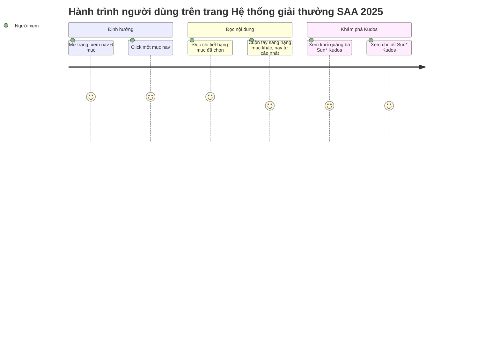

# Screens — Hệ thống giải thưởng SAA 2025 (Award System Page)

## Screen List

| Screen Name | SCR### | What User Sees | What User Can Do |
|-------------|--------|----------------|------------------|
| Hệ thống giải thưởng SAA 2025 | TBD (draft) — cấp lúc promote | Header dùng chung (mục "Award Information" đang chọn); hero thu nhỏ; khối tiêu đề (phụ đề + tiêu đề vàng); nav danh mục dính bên trái (6 mục); 6 khối chi tiết giải thưởng xen kẽ ảnh/nội dung (ảnh 336×336 + mô tả dài + số lượng + giá trị); khối quảng bá Sun* Kudos; footer dùng chung | Click một mục nav để cuộn nhanh tới đúng hạng mục; cuộn tay qua các hạng mục với mục nav tự cập nhật theo; click "Chi tiết" ở khối Kudos để sang trang Sun* Kudos |

## User Journey

1. Người dùng mở trang Hệ thống giải thưởng SAA 2025 (từ header, từ một thẻ ở trang chủ, hoặc gõ
   thẳng URL) và thấy khối tiêu đề cùng nav 6 mục bên trái.
2. Người dùng click một mục trong nav — được cuộn thẳng tới đúng hạng mục giải thưởng, mục đó sáng
   lên trong nav.
3. Người dùng đọc mô tả, số lượng và giá trị của hạng mục đang xem, rồi tự cuộn tay sang các hạng
   mục khác — mục sáng trong nav tự đổi theo mà không cần thao tác thêm.
4. Người dùng cuộn hết 6 hạng mục, tới khối quảng bá Sun* Kudos, click "Chi tiết" — được đưa sang
   trang Sun* Kudos.

