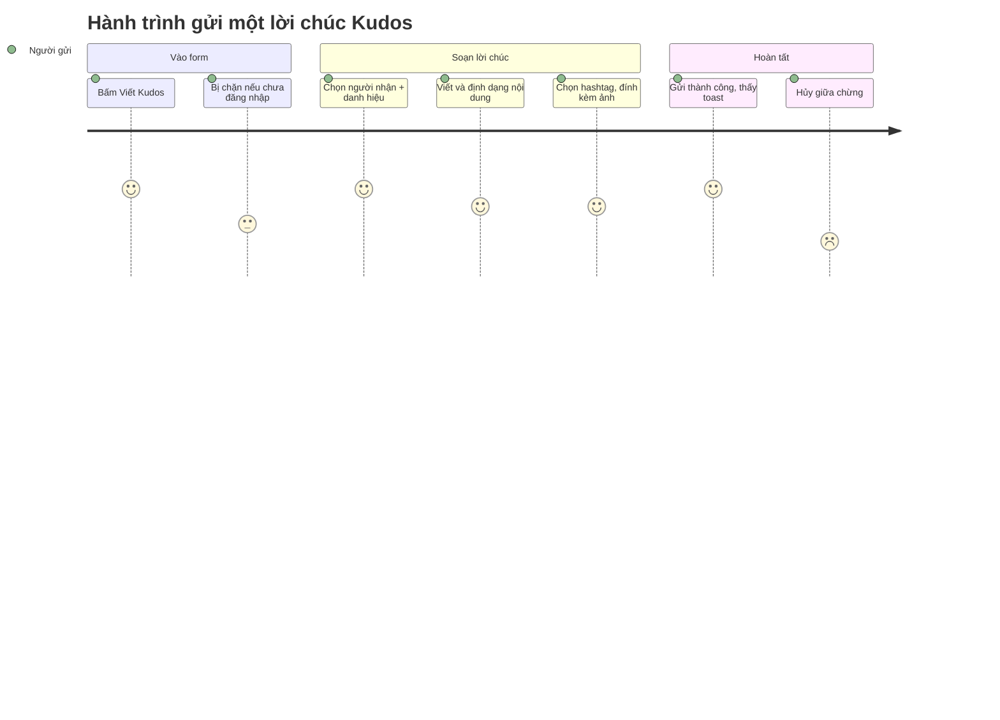

## Screen List

| Screen Name | SCR### | What User Sees | What User Can Do |
|-------------|--------|----------------|------------------|
| Gửi lời chúc Kudos (`/kudos/send`) | TBD (draft) | Form soạn Kudo: ô Người nhận (autocomplete), Danh hiệu, textarea nội dung có toolbar 6 nút định dạng + liên kết "Tiêu chuẩn cộng đồng", dropdown Hashtag (8 giá trị, chọn 1–5), vùng đính kèm tối đa 5 ảnh, checkbox "Ẩn danh" + trường Nickname ẩn danh khi bật, footer với nút Hủy và Gửi | Tìm và chọn người nhận; đặt danh hiệu; viết và định dạng nội dung lời chúc; chọn/gỡ hashtag; thêm/gỡ ảnh; bật/tắt gửi ẩn danh; Hủy (bỏ hết, không lưu) hoặc Gửi (khi đủ trường bắt buộc) |
| Đăng nhập (`/login`, đã có sẵn từ F011) | — (ngoài phạm vi lượt này) | Màn đăng nhập Google hiện có | Đăng nhập; sau khi thành công quay lại `/kudos/send` nếu đó là điểm vào ban đầu |
| Sun* Kudos - Live board (`/kudos`, đã có sẵn từ F013) | SCR008_KudosLiveBoard | Board Kudos hiện có (không đổi bởi lượt này) | Là đích chuyển hướng sau khi Hủy hoặc Gửi thành công; hiển thị toast xác nhận khi tới từ Gửi thành công |

## User Journey

1. Người dùng bấm mục "Viết Kudos" ở widget quick-action (trỏ tới `/kudos/send`, thay cho pill
   trên `/kudos` trước đây chỉ mở dialog placeholder).
2. Nếu chưa đăng nhập, hệ thống đưa họ tới màn Đăng nhập trước; đăng nhập xong quay lại form Gửi
   lời chúc Kudos.
3. Người dùng chọn Người nhận, đặt Danh hiệu, viết nội dung (có thể dùng toolbar định dạng),
   chọn 1–5 Hashtag, tuỳ chọn đính kèm ảnh và/hoặc bật gửi ẩn danh.
4. Người dùng bấm Gửi khi đã đủ trường bắt buộc — nếu thiếu, hệ thống chỉ rõ đúng (các) trường
   còn thiếu và không chuyển trang.
5. Gửi thành công đưa người dùng trở lại Sun* Kudos - Live board kèm toast xác nhận. Bấm Hủy ở
   bất kỳ thời điểm nào cũng đưa họ trở lại Sun* Kudos - Live board, nhưng không lưu gì.

