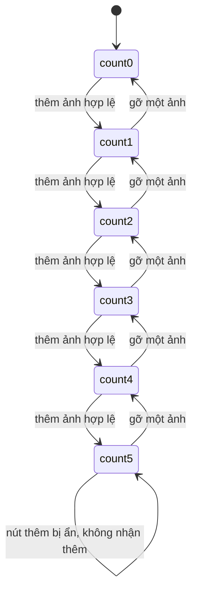

# F000_SendKudosWishes

**Priority**: P1
**Type**: ui
**Generated**: 2026-08-24

## Overview

Route mới `/kudos/send` (frame MoMorph `JsTvi8KVQA`, hành vi lấy từ frame con `ihQ26W78P2`
"Viết Kudo" — 26 spec, 57 test case, vì `JsTvi8KVQA` tự nó `spec_status: none`), cho một
Sunner đã đăng nhập THẬT bằng Supabase (không phải mock session ở
`lib/session/session-provider.tsx`) soạn và gửi một lời chúc Kudos: chọn Người nhận
(autocomplete trên bảng `profiles` seed sẵn), đặt Danh hiệu (trường mới không có spec ở bất kỳ
frame nào, quyết định tại `clarifications.md`), viết nội dung bằng textarea markdown-lite có 6
nút định dạng, chọn 1–5 Hashtag trong 8 giá trị cố định (`hashtags` seed, gồm cả lỗi chính tả
gốc `#High-perorming` chép nguyên văn), đính kèm tối đa 5 ảnh `.jpg`/`.png` tải lên Supabase
Storage, và tuỳ chọn gửi ẩn danh kèm nickname. Đây là tính năng ĐẦU TIÊN của repo có bảng ứng
dụng thật (`kudos`, `hashtags`, `profiles`, cộng hai bảng nối) và route ĐẦU TIÊN có auth gate
thật ở server — hai hệ thống danh tính (mock `session-provider.tsx` cho header/UI, phiên
Supabase thật cho route này) cùng tồn tại song song, không hợp nhất ở lượt này. Gửi thành công
ghi một dòng vào `kudos`, KHÔNG hiển thị ở đâu trên `/kudos` (board vẫn đọc `lib/kudos/` tĩnh —
quyết định 1, `clarifications.md`), rồi chuyển hướng `/kudos` kèm toast thành công (tái dùng
`components/kudos/kudos-toast.tsx`). `testPolicy: e2e-red-first` vì màn hình có nhiều chuyển
trạng thái thật: validate theo trường, toggle hashtag, thêm/gỡ ảnh, reveal nickname, và redirect
có điều kiện theo phiên đăng nhập.

**Chưa có một dòng mã nào được viết cho tính năng này** — bản nháp này đi trước implementation.

## Polymorphic Behavior

N/A — no discriminator fields in Key Entities. `kudos.is_anonymous` là một boolean hai trạng
thái (không phải enum ≥2 giá trị đặt tên riêng), xử lý bằng Business Rule (`BR-006`) chứ không
đủ ngưỡng để thành DISC.

## Cross-Cutting Logic

### Requirements

None. — mọi FR-### đặt dưới `**Requirements fulfilled:**` của đúng một US bên dưới; không FR
nào áp dụng ngang hàng cho ≥2 US.

### Business Rules

#### BR-001_ChiSunnerDaDangNhapMoiVaoDuocForm
**Linked FR:** FR-001
**Applies to:** Toàn bộ route `/kudos/send`
**Rule:** Trang chỉ render form khi có phiên Supabase hợp lệ (`getUser()`, không phải
`getSession()` — cùng tiền lệ `app/login/page.tsx`); không có phiên → redirect `/login` trước
khi render bất kỳ nội dung nào. Danh tính người gửi lấy từ `auth.users`/`auth.uid()`, không bao
giờ đọc `role`/`userId` của mock session.
**Source:** clarifications.md — quyết định 3; MoMorph `ihQ26W78P2` TC ID-0 (có phiên → form
mở), ID-1 (không phiên → redirect `/login`).

#### BR-002_DanhHieuBatBuocToiDa100KyTu
**Linked FR:** FR-003
**Applies to:** Trường "Danh hiệu"
**Rule:** Bắt buộc nhập, tối đa 100 ký tự. Placeholder "Dành tặng một danh hiệu cho đồng đội",
hai dòng helper "Ví dụ: Người truyền động lực cho tôi." và "Danh hiệu sẽ hiển thị làm tiêu đề
Kudos của bạn." — chép nguyên văn từ frame, không đổi. Trường này KHÔNG bị ràng buộc vào 4 hạng
huy hiệu của `lib/kudos/star-tiers.ts` — là một câu tự do người gửi đặt.
**Source:** clarifications.md — quyết định 6 (không có spec row nào định nghĩa trường này; độ
dài 100 là quyết định lấy tại đây, không phải sự thật thiết kế).

#### BR-003_NoiDungLoiChucGioiHan1000KyTu
**Linked FR:** FR-004
**Applies to:** Textarea nội dung lời chúc
**Rule:** Bắt buộc nhập, chặn cứng ở 1.000 ký tự — bộ đếm hiển thị dạng `n/1.000`.
**Source:** clarifications.md — quyết định "design defect #4" (spec D.1 có bộ đếm nhưng để
trống `maxLength`; `1.000` chỉ là con số vẽ trên ảnh khung, không có spec row backing).

#### BR-004_HashtagToiThieuMotToiDaNam
**Linked FR:** FR-007
**Applies to:** Dropdown Hashtag
**Rule:** Chọn bằng cách bật/tắt (toggle) một trong 8 giá trị cố định seed sẵn — không gõ tự
do. Bắt buộc ≥1, tối đa 5. Khi đã chọn đủ 5, mọi hàng chưa chọn chuyển sang trạng thái vô hiệu
(disabled) cho tới khi gỡ bớt.
**Source:** MoMorph `ihQ26W78P2` row E (min 1/max 5), `p9zO-c4a4x` (8 giá trị + rule disable ở
5); clarifications.md — "design defect #6" (row E gốc mô tả gõ-tạo-chip, bị `p9zO-c4a4x` ghi đè
vì cụ thể hơn).

**Pseudocode:**
```text
selected = set()
onToggleHashtag(tag):
  if tag in selected: selected.remove(tag)
  elif len(selected) < 5: selected.add(tag)
  # else: hàng đó đã disabled, không nhận toggle
renderRow(tag):
  disabled = (len(selected) >= 5) and (tag not in selected)
```

#### BR-005_AnhToiDaNamChiNhanJpgPng
**Linked FR:** FR-008
**Applies to:** Vùng đính kèm ảnh
**Rule:** Ảnh KHÔNG bắt buộc. Nhận `.jpg`/`.png`; từ chối `.pdf`/`.mp4`/`.txt` (và mọi định
dạng khác) kèm thông báo lỗi định dạng. Tối đa 5 ảnh; nút thêm ẩn khi đủ 5 (xem `SM-001`), hiện
lại ngay khi gỡ bớt một ảnh. Không có giới hạn dung lượng byte nào được đặc tả (xem `##
Unresolved Questions`).
**Source:** MoMorph `ihQ26W78P2` row F (`required: false`, F.5); clarifications.md — quyết định
4, TC ID-21/ID-22 (chấp nhận), ID-23/ID-24/ID-55 (từ chối).

#### BR-006_AnDanhMacDinhTatVaYeuCauNickname
**Linked FR:** FR-009
**Applies to:** Checkbox "Ẩn danh" + trường "Nickname ẩn danh"
**Rule:** Checkbox mặc định KHÔNG chọn. Chọn → hiện trường Nickname, trở thành bắt buộc. Bỏ
chọn → ẩn trường, không còn bắt buộc, giá trị đã nhập bị bỏ qua khi submit.
**Source:** MoMorph `ihQ26W78P2` row G (`required: false` cho chính checkbox), TC ID-6 (mặc
định tắt), ID-43/ID-44 (reveal/hide theo toggle).

**Pseudocode:**
```text
if isAnonymous:
  show(nicknameField); nicknameField.required = true
else:
  hide(nicknameField); nicknameField.required = false; nicknameField.value = null
```

#### BR-007_GuiVoHieuHoaChoDenKhiDuTruongBatBuoc
**Linked FR:** FR-010, FR-011
**Applies to:** Nút "Gửi"
**Rule:** Vô hiệu hoá (disabled) cho tới khi Người nhận, Danh hiệu, nội dung lời chúc, và ≥1
Hashtag đều có giá trị (xem `DEC-001`). Nếu người dùng cố submit khi còn trường bắt buộc trống,
mỗi trường thiếu hiện viền đỏ + thông báo "Không được để trống", và không có gì được gửi đi.
**Source:** MoMorph `ihQ26W78P2` row H.2, TC ID-48/ID-49 (disabled cho tới đủ trường), ID-50…
ID-56 (lỗi từng trường khi submit thiếu).

#### BR-008_HuyLuonKhaDungKhongLuuGi
**Linked FR:** FR-012
**Applies to:** Nút "Hủy"
**Rule:** Luôn khả dụng (không phụ thuộc trạng thái các trường khác). Bấm vào huỷ toàn bộ nội
dung đã nhập, không ghi gì vào CSDL, không tải ảnh nào lên Storage.
**Source:** MoMorph `ihQ26W78P2` row H.1, TC ID-45.

### Decision Logic

#### DEC-001_KichHoatNutGuiKhiDuTruongBatBuoc
**subtype:** render
**Triggers in:** SCR_GuiLoiChucKudos — bất kỳ thay đổi nào trên Người nhận, Danh hiệu, nội
dung, hoặc danh sách Hashtag đã chọn
**Involved entities:** `recipientId`, `title`, `message`, `selectedHashtags[]` (draft form
state, chưa phải bảng CSDL)
**user_visible_outcome:** Nút "Gửi" chỉ chuyển từ mờ/không bấm được sang khả dụng khi CẢ BỐN
điều kiện cùng đúng — không phải bốn nút bật/tắt độc lập.
**Source:** MoMorph `ihQ26W78P2` row H.2, TC ID-48/ID-49.

```pseudo
canSubmit = isNonEmpty(recipientId)
  and isNonEmpty(title)
  and isNonEmpty(message)
  and selectedHashtags.length >= 1
render SubmitButton(disabled = !canSubmit)
```

### State Machines

**`kind` values:**
- `entity` — theo dõi vòng đời một domain object, được persist.
- `ui` — theo dõi trạng thái view-layer, không persist ngoài phiên hiện tại.

#### SM-001_SoLuongAnhDinhKem
**kind:** ui
**Linked FR:** FR-008
**Source:** MoMorph `ihQ26W78P2` row F.5, TC ID-19, ID-38, ID-40.
**States:** count0 .. count5 (6 trạng thái theo số ảnh đã thêm, 0 ≤ count ≤ 5).



**Transition rules:**
- `countK → countK+1`: guard = `K < 5` VÀ ảnh mới đúng định dạng `.jpg`/`.png`; side effect =
  hiện thumbnail 80×80 + badge gỡ.
- `countK → countK-1`: guard = bấm gỡ trên một thumbnail đã có; side effect = ẩn thumbnail đó.
- Tại `count5`, nút "thêm ảnh" bị ẩn hoàn toàn (không chỉ disable) — bất kỳ transition lùi nào
  đưa số đếm xuống dưới 5 làm nút hiện lại ngay.

### Algorithms

#### ALG-001_ApDungDinhDangMarkdownVaoVungChon
**Linked FR:** FR-005
**Source:** MoMorph `ihQ26W78P2` row C.1–C.6, TC ID-27…ID-32; clarifications.md quyết định 5
("Markdown-lite với toolbar thật").

**Rule:** Mỗi trong 6 nút định dạng (đậm, nghiêng, gạch ngang, danh sách số, liên kết, trích
dẫn) bọc vùng văn bản đang được chọn trong textarea bằng đúng một cú pháp markdown; nếu không
có vùng chọn, chèn cặp ký hiệu tại vị trí con trỏ. Giá trị lưu luôn là plain text markdown — Không
có HTML được sinh ra, nên không có bề mặt cần sanitize.

**Pseudocode:**
```text
onToolbarClick(kind, selectionStart, selectionEnd, text):
  selected = text[selectionStart:selectionEnd] or ""
  wrapped = switch kind:
    bold        -> "**" + selected + "**"
    italic      -> "*" + selected + "*"
    strike      -> "~~" + selected + "~~"      # spec C.3 gọi nhầm là "others/decorative"
    numberedList-> "1. " + selected
    link        -> "[" + selected + "](url)"
    quote       -> "> " + selected
  replaceRange(text, selectionStart, selectionEnd, wrapped)
```

### External Integrations

#### INT-001_GhiKudosQuaSupabaseClient
**Linked FR:** FR-013
**Applies to:** Submit thành công
**Rule:** Ghi một dòng vào bảng `kudos` (planned) qua Supabase JS client, `sender_id` lấy từ
`auth.uid()` phía server — không nhận `sender_id` từ payload client. RLS chặn ghi hộ người
khác (`FR-014`).
**Source:** clarifications.md — quyết định 1, 3; MoMorph `ihQ26W78P2` TC ID-46, ID-47.

#### INT-002_TaiAnhLenSupabaseStorage
**Linked FR:** FR-008, FR-013
**Applies to:** Ảnh đính kèm hợp lệ tại thời điểm submit
**Rule:** Ảnh tải lên một bucket Supabase Storage mới (planned) khi submit (không tải ngay lúc
chọn); đường dẫn trả về lưu vào bảng nối ảnh của dòng `kudos` vừa tạo. Bucket cụ thể/quyền truy
cập (public hay signed URL) chưa được quyết định — xem `## Unresolved Questions`.
**Source:** clarifications.md — quyết định 4.

### Verification

- **SC-001** — Mở `/kudos/send` khi có phiên Supabase → form render đủ 26 nhóm control theo
  đúng thứ tự frame; mở khi không có phiên → redirect `/login` (covers FR-001, BR-001)
- **SC-002** — Gõ vào ô Người nhận lọc đúng danh sách `profiles`, giá trị trim trước khi lọc,
  chỉ chọn được Sunner có thật (covers FR-002)
- **SC-003** — Danh hiệu bắt buộc ≤100 ký tự, nội dung bắt buộc ≤1.000 ký tự với bộ đếm đúng
  (covers FR-003, FR-004, BR-002, BR-003)
- **SC-004** — 6 nút toolbar bọc đúng cú pháp markdown quanh vùng chọn (covers FR-005, ALG-001)
- **SC-005** — Chọn 1–5 Hashtag bằng toggle, hàng thứ 9 trở lên (khi đã đủ 5) bị disable, chip
  gỡ được (covers FR-007, BR-004)
- **SC-006** — Ảnh `.jpg`/`.png` được nhận, `.pdf`/`.mp4`/`.txt` bị từ chối kèm lỗi định dạng,
  nút thêm ẩn ở ảnh thứ 5 và hiện lại khi gỡ (covers FR-008, BR-005, SM-001)
- **SC-007** — Bật "Ẩn danh" hiện trường Nickname bắt buộc; tắt lại ẩn trường và bỏ yêu cầu
  (covers FR-009, BR-006)
- **SC-008** — Gửi disabled cho tới đủ 4 trường bắt buộc; submit thiếu trường hiện đúng viền đỏ
  + "Không được để trống"; Hủy luôn khả dụng và không lưu gì (covers FR-010, FR-011, FR-012,
  BR-007, BR-008, DEC-001)
- **SC-009** — Submit hợp lệ ghi đúng 1 dòng `kudos` với `sender_id = auth.uid()`, ảnh (nếu có)
  lên Storage, redirect `/kudos` kèm toast; một request giả mạo `sender_id` khác bị RLS chặn
  (covers FR-013, FR-014, INT-001, INT-002)

---

**Client behavior:** see
[`behavior-logic.md`](../../generated/behavior-logic.md) (client-side patterns — upload progress
áp dụng cho ảnh đính kèm; chưa có pattern polling/realtime nào ở tính năng này),
[`permissions.md`](../../../../docs/vi/system/permissions.md) (route `/kudos/send` là ranh giới
auth THẬT đầu tiên ngoài `/login` — cập nhật cần thiết ở lượt promote, chưa forward-author trong
bản nháp này),
[`screen-flow.md`](../../generated/screen-flow.md) (guard mới: không phiên → `/login`; không có
deep-link state nào khác `/kudos/send` chính nó).
_(3 link trên trỏ theo vị trí docs/ sau khi promote; trong bản nháp này các file đích có thể
chưa phản ánh nội dung ở trên.)_

## User Stories

### US001_DangNhapMoiMoDuocForm — Đăng nhập mới mở được form (Priority: P1)

**What happens:** Người dùng mở `/kudos/send`. Nếu đã có phiên Supabase hợp lệ (đăng nhập Google
qua `/login`), form Viết Kudo render đầy đủ. Nếu chưa, họ bị chuyển hướng ngay tới `/login`
trước khi thấy bất kỳ nội dung nào của form.
**Why this priority:** Đây là ranh giới bảo mật đầu tiên của cả route — sai ở đây nghĩa là ai
cũng ghi được kudos giả mạo danh tính người khác.
**Independent Test:** Mở `/kudos/send` bằng một trình duyệt chưa đăng nhập, xác nhận redirect
`/login`; đăng nhập xong quay lại, xác nhận form mở đầy đủ.

**Acceptance Scenarios:**

1. **Given** người dùng có phiên Supabase hợp lệ, **When** mở `/kudos/send`, **Then** form Viết
   Kudo render đầy đủ, không có yêu cầu đăng nhập nào chèn thêm.
2. **Given** người dùng chưa đăng nhập, **When** mở `/kudos/send`, **Then** bị chuyển hướng
   `/login`, không thấy một phần nào của form.

**Requirements fulfilled:**
- **FR-001** Server Component kiểm tra `getUser()` trước khi render; không có phiên → redirect
  `/login` (planned: `app/kudos/send/page.tsx`, cùng khuôn mẫu `app/login/page.tsx`)

**Rules enforced:** BR-001.

**Verification:**
- **SC-001**

---

### US002_ChonNguoiNhan — Chọn Người nhận (Priority: P1)

**What happens:** Người dùng gõ vào ô Người nhận (514×56px, viền `#998C5F`, placeholder "Tìm
kiếm"); danh sách gợi ý lọc dần theo `profiles` đã seed khi gõ, giá trị được trim trước khi lọc.
Chỉ chọn được một Sunner có thật trong danh sách — không gõ tự do được lưu làm người nhận.
**Why this priority:** Không có người nhận hợp lệ thì không có gì để ghi vào CSDL — đây là
trường bắt buộc đầu tiên trong luồng.
**Independent Test:** Gõ một phần tên có khoảng trắng đầu/cuối, xác nhận danh sách lọc đúng theo
giá trị đã trim; chọn một tên, xác nhận ô nhận đúng giá trị đó.

**Acceptance Scenarios:**

1. **Given** form đang mở, **When** gõ một phần tên vào ô Người nhận, **Then** danh sách gợi ý
   lọc còn đúng các Sunner khớp, giá trị nhập được trim trước khi so khớp.
2. **Given** danh sách gợi ý đang hiện, **When** chọn một dòng, **Then** ô nhận giá trị Sunner
   đó và đóng danh sách gợi ý.

**Requirements fulfilled:**
- **FR-002** Autocomplete Người nhận trên bảng `profiles`, input trimmed trước khi lọc (planned:
  `components/kudos/send/recipient-field.tsx`, `lib/kudos/send/*`)

**Verification:**
- **SC-002**

---

### US003_DatDanhHieuVaVietLoiChuc — Đặt Danh hiệu và viết nội dung lời chúc (Priority: P1)

**What happens:** Người dùng nhập một Danh hiệu (bắt buộc, tối đa 100 ký tự, placeholder "Dành
tặng một danh hiệu cho đồng đội") và nội dung lời chúc vào textarea (bắt buộc, chặn cứng ở 1.000
ký tự, bộ đếm `n/1.000`).
**Why this priority:** Đây là nội dung chính của cả lời chúc — thiếu một trong hai thì không có
gì đáng để gửi.
**Independent Test:** Gõ quá 100 ký tự vào Danh hiệu, xác nhận không nhận thêm; gõ quá 1.000 ký
tự vào nội dung, xác nhận bộ đếm dừng ở 1.000 và không nhận thêm ký tự.

**Acceptance Scenarios:**

1. **Given** form đang mở, **When** gõ Danh hiệu vượt 100 ký tự, **Then** ký tự thứ 101 trở đi
   không được nhận thêm.
2. **Given** form đang mở, **When** gõ nội dung lời chúc vượt 1.000 ký tự, **Then** bộ đếm dừng
   ở `1.000/1.000` và không nhận thêm ký tự.
3. **Given** cả hai trường còn trống, **When** bấm Gửi, **Then** cả hai hiện viền đỏ +
   "Không được để trống" (xem US008).

**Requirements fulfilled:**
- **FR-003** Trường Danh hiệu bắt buộc, tối đa 100 ký tự, copy nguyên văn từ frame (planned:
  `components/kudos/send/title-field.tsx`)
- **FR-004** Textarea nội dung bắt buộc, chặn cứng 1.000 ký tự, bộ đếm (planned:
  `components/kudos/send/message-editor.tsx`)

**Rules enforced:** BR-002, BR-003.

**Verification:**
- **SC-003**

---

### US004_DinhDangVanBanBangToolbar — Định dạng văn bản bằng toolbar (Priority: P2)

**What happens:** Người dùng chọn một đoạn văn bản trong textarea và bấm một trong 6 nút toolbar
(đậm, nghiêng, gạch ngang, danh sách số, liên kết, trích dẫn); đoạn được chọn bọc lại thành cú
pháp markdown tương ứng. Liên kết "Tiêu chuẩn cộng đồng" cạnh toolbar render như một link nhận
được focus, nhưng đích của nó chưa được xác định (không có frame web nào định nghĩa).
**Why this priority:** Là tiện ích soạn thảo phụ trợ — lời chúc vẫn gửi được ở dạng plain text
nếu người dùng không dùng tới toolbar.
**Independent Test:** Bôi đen một cụm từ, bấm nút đậm, xác nhận cụm đó được bọc `**...**` trong
giá trị textarea; Tab tới "Tiêu chuẩn cộng đồng", xác nhận nhận được focus nhưng không điều
hướng đi đâu khi kích hoạt.

**Acceptance Scenarios:**

1. **Given** một đoạn đang được chọn trong textarea, **When** bấm nút đậm/nghiêng/gạch
   ngang/danh sách số/liên kết/trích dẫn, **Then** đoạn đó được bọc đúng cú pháp markdown tương
   ứng của nút đã bấm.
2. **Given** không có đoạn nào được chọn, **When** bấm một nút toolbar, **Then** cặp ký hiệu
   markdown được chèn tại vị trí con trỏ.
3. **Given** người dùng gõ `@` theo sau một tên, **When** xem textarea, **Then** không có gợi ý
   mention nào bật lên — tính năng này bị hoãn ở lượt này (xem `## Unresolved Questions`).

**Requirements fulfilled:**
- **FR-005** 6 nút toolbar bọc vùng chọn thành markdown (planned:
  `components/kudos/send/message-toolbar.tsx`, logic `ALG-001`)
- **FR-006** Liên kết "Tiêu chuẩn cộng đồng" render + focusable, đích hoãn (planned: cùng file
  trên)

**Rules enforced:** ALG-001.

**Verification:**
- **SC-004**

---

### US005_ChonHashtag — Chọn Hashtag (Priority: P1)

**What happens:** Người dùng mở dropdown Hashtag, thấy 8 giá trị cố định (kể cả
`#High-perorming` sai chính tả), bật/tắt từng dòng bằng icon check. Tối thiểu 1, tối đa 5; khi
đã chọn đủ 5, các dòng chưa chọn chuyển sang disabled. Mỗi lựa chọn hiện thành một chip có nút
gỡ.
**Why this priority:** Là trường bắt buộc thứ tư và cuối cùng điều khiển nút Gửi — không có
hashtag thì không gửi được.
**Independent Test:** Chọn đủ 5 hashtag, xác nhận 3 hàng còn lại disabled; gỡ một chip, xác nhận
hàng tương ứng khả dụng trở lại.

**Acceptance Scenarios:**

1. **Given** dropdown đang mở, **When** bấm chọn một hashtag, **Then** hashtag đó hiện thành chip
   và dòng tương ứng đổi trạng thái đã chọn.
2. **Given** đã chọn đủ 5 hashtag, **When** mở lại dropdown, **Then** 3 hàng chưa chọn ở trạng
   thái disabled, không nhận click.
3. **Given** một chip đang hiển thị, **When** bấm nút gỡ trên chip đó, **Then** hashtag đó bị bỏ
   chọn và dòng tương ứng trong dropdown khả dụng trở lại.

**Requirements fulfilled:**
- **FR-007** Dropdown 8 giá trị cố định, toggle chọn, min 1/max 5, disable ở 5 (planned:
  `components/kudos/send/hashtag-picker.tsx`)

**Rules enforced:** BR-004.

**Verification:**
- **SC-005**

---

### US006_DinhKemHinhAnh — Đính kèm hình ảnh (Priority: P2)

**What happens:** Người dùng bấm nút thêm ảnh, chọn tệp `.jpg`/`.png`; ảnh hợp lệ hiện thành
thumbnail 80×80 kèm badge gỡ. Tệp `.pdf`/`.mp4`/`.txt` bị từ chối kèm thông báo lỗi định dạng.
Tối đa 5 ảnh — nút thêm ẩn khi đủ 5, hiện lại ngay khi gỡ bớt một ảnh.
**Why this priority:** Ảnh không bắt buộc — là tiện ích minh hoạ thêm cho lời chúc.
**Independent Test:** Thêm 5 ảnh hợp lệ, xác nhận nút thêm biến mất; gỡ 1 ảnh, xác nhận nút thêm
hiện lại; thử thêm một file `.pdf`, xác nhận bị từ chối kèm lỗi định dạng.

**Acceptance Scenarios:**

1. **Given** chưa có ảnh nào, **When** thêm một ảnh `.jpg` hoặc `.png`, **Then** ảnh hiện thành
   thumbnail 80×80 kèm badge gỡ.
2. **Given** một tệp `.pdf`/`.mp4`/`.txt` được chọn, **When** hệ thống kiểm tra định dạng,
   **Then** tệp bị từ chối kèm thông báo lỗi định dạng, không thêm vào danh sách.
3. **Given** đã có đúng 5 ảnh, **When** xem vùng đính kèm, **Then** nút thêm ảnh không còn hiển
   thị; gỡ một ảnh bất kỳ làm nút hiện lại ngay.

**Requirements fulfilled:**
- **FR-008** Thêm/gỡ ảnh, validate định dạng, giới hạn 5, ẩn/hiện nút thêm (planned:
  `components/kudos/send/image-attachments.tsx`)

**Rules enforced:** BR-005.

**State transitions:** SM-001 (`count0 ↔ count1 ↔ ... ↔ count5`).

**Verification:**
- **SC-006**

---

### US007_GuiAnDanhVoiNickname — Gửi ẩn danh kèm Nickname (Priority: P2)

**What happens:** Người dùng bật checkbox "Ẩn danh" (mặc định tắt); một trường "Nickname ẩn
danh" hiện ra và trở thành bắt buộc. Tắt lại checkbox thì trường biến mất và không còn bắt buộc.
**Why this priority:** Là một tuỳ chọn phụ trên luồng chính — không ảnh hưởng tới việc gửi được
hay không nếu người dùng không bật nó.
**Independent Test:** Bật checkbox, xác nhận trường Nickname hiện và không submit được nếu để
trống; tắt lại, xác nhận trường biến mất và không còn cản trở submit.

**Acceptance Scenarios:**

1. **Given** checkbox "Ẩn danh" đang tắt (mặc định), **When** form mở, **Then** không có trường
   Nickname nào hiển thị.
2. **Given** checkbox vừa được bật, **When** xem form, **Then** trường Nickname ẩn danh hiện ra
   và trở thành bắt buộc.
3. **Given** checkbox đang bật kèm Nickname đã nhập, **When** tắt checkbox lại, **Then** trường
   Nickname biến mất và giá trị đã nhập không còn được yêu cầu.

**Requirements fulfilled:**
- **FR-009** Checkbox ẩn danh mặc định tắt, reveal/hide trường Nickname bắt buộc theo trạng thái
  (planned: `components/kudos/send/anonymous-toggle.tsx`)

**Rules enforced:** BR-006.

**Verification:**
- **SC-007**

---

### US008_ValidateVaGuiHoacHuy — Validate rồi Gửi, hoặc Hủy (Priority: P1)

**What happens:** Nút "Gửi" chỉ khả dụng khi Người nhận, Danh hiệu, nội dung, và ≥1 Hashtag đều
đã có giá trị. Nếu người dùng cố submit khi còn thiếu, mỗi trường thiếu hiện viền đỏ +
"Không được để trống", không có gì được gửi. Nút "Hủy" luôn khả dụng; bấm vào bỏ hết nội dung đã
nhập, không lưu gì.
**Why this priority:** Là cổng kiểm soát cuối cùng trước khi ghi dữ liệu thật vào CSDL — sai ở
đây có thể tạo ra những dòng `kudos` rỗng hoặc thiếu thông tin.
**Independent Test:** Để trống toàn bộ form rồi bấm Gửi, xác nhận cả 4 trường bắt buộc hiện lỗi
và không có request nào được gửi; điền đủ 4 trường, xác nhận Gửi chuyển sang khả dụng; bấm Hủy
giữa chừng, xác nhận không có gì được lưu.

**Acceptance Scenarios:**

1. **Given** một trong bốn trường bắt buộc còn trống, **When** xem nút Gửi, **Then** nút ở trạng
   thái disabled, không nhận click.
2. **Given** đủ cả bốn trường bắt buộc, **When** xem nút Gửi, **Then** nút chuyển sang khả dụng.
3. **Given** người dùng cố bấm Gửi khi Người nhận/Danh hiệu/nội dung/Hashtag còn trống, **When**
   submit, **Then** đúng (các) trường thiếu hiện viền đỏ + "Không được để trống", không có gì
   được gửi.
4. **Given** người dùng đã nhập một phần nội dung, **When** bấm "Hủy", **Then** toàn bộ nội dung
   bị bỏ, không có bản ghi nào được tạo trong CSDL.

**Requirements fulfilled:**
- **FR-010** Gửi disabled cho tới đủ 4 trường bắt buộc (planned:
  `components/kudos/send/kudos-send-form.tsx`)
- **FR-011** Submit thiếu trường hiện viền đỏ + "Không được để trống" trên đúng trường (planned:
  cùng file trên)
- **FR-012** Hủy luôn khả dụng, không lưu gì (planned: cùng file trên)

**Rules enforced:** BR-007, BR-008.

**Decision Logic:** DEC-001.

**Verification:**
- **SC-008**

---

### US009_LuuKudosThanhCongVaChuyenHuong — Lưu Kudos thành công và chuyển hướng (Priority: P1)

**What happens:** Khi submit hợp lệ, hệ thống ghi một dòng vào bảng `kudos` với `sender_id` lấy
từ `auth.uid()`, tải mọi ảnh đính kèm (nếu có) lên Supabase Storage rồi lưu đường dẫn, sau đó
chuyển hướng về `/kudos` kèm một toast xác nhận thành công (tái dùng
`components/kudos/kudos-toast.tsx`, vì đây là trang chứ không phải modal để "đóng"). Một yêu cầu
ghi gán `sender_id` khác `auth.uid()` của chính người gọi bị Row Level Security chặn.
**Why this priority:** Là hành động cốt lõi biện minh cho toàn bộ tính năng — không ghi được
đúng, đủ, và an toàn thì mọi validate ở trên vô nghĩa.
**Independent Test:** Điền đủ form, submit, xác nhận có đúng 1 dòng mới trong `kudos` với
`sender_id` đúng người đang đăng nhập, trang chuyển về `/kudos` kèm toast; thử gọi API ghi với
`sender_id` giả mạo, xác nhận bị RLS từ chối.

**Acceptance Scenarios:**

1. **Given** form hợp lệ đã điền đủ, **When** bấm Gửi, **Then** một dòng mới xuất hiện trong
   `kudos` với `sender_id = auth.uid()` của người gửi hiện tại.
2. **Given** form có ảnh đính kèm hợp lệ, **When** submit thành công, **Then** ảnh được tải lên
   Supabase Storage và đường dẫn được lưu gắn với dòng `kudos` vừa tạo.
3. **Given** submit thành công, **When** trang xử lý xong, **Then** người dùng được chuyển hướng
   về `/kudos` và thấy toast xác nhận — không có trạng thái xác nhận nào hiện ngay trên
   `/kudos/send`.
4. **Given** một request ghi trực tiếp cố gán `sender_id` khác danh tính đang đăng nhập, **When**
   Postgres áp policy RLS, **Then** request bị từ chối.

**Requirements fulfilled:**
- **FR-013** Ghi `kudos` + upload ảnh Storage + redirect kèm toast (planned:
  `lib/kudos/send/submit-kudos.ts`, `supabase/migrations/*`)
- **FR-014** RLS chặn ghi hộ danh tính khác (planned: `supabase/migrations/*` — policy
  `insert ... with check (sender_id = auth.uid())`)

**Verification:**
- **SC-009**

---

### Edge Cases

See [edge-cases.md](edge-cases.md).

## Key Entities

Tính năng ĐẦU TIÊN của repo có bảng ứng dụng thật — mọi bảng dưới đây là **planned**, chưa có
migration nào được viết.

| Entity | Table | Key Columns | Purpose |
|--------|-------|-------------|---------|
| Profile | `profiles` (planned) | id (text, tái dùng slug đã có trong `lib/kudos/kudos-records.ts`, vd `'nguyen-ba-chuc'`), display_name, department | Danh sách Sunner có thể chọn làm Người nhận — seed từ tên thật đã transcribe trong `lib/kudos/` (quyết định 6, clarifications.md). KHÔNG phải cùng bảng với danh tính người gửi (xem `## Assumptions`) |
| Hashtag | `hashtags` (planned) | id (text = chính chuỗi hashtag, vd `'#High-perorming'`) | 8 giá trị cố định từ `p9zO-c4a4x`, seed nguyên văn kể cả lỗi chính tả |
| Kudos | `kudos` (planned) | id, sender_id (uuid, FK `auth.users`), recipient_id (FK `profiles`), title, message, is_anonymous, nickname, created_at | Một lời chúc đã gửi — bản ghi CSDL thật đầu tiên của repo |
| KudosHashtag | `kudos_hashtags` (planned, bảng nối) | kudos_id (FK `kudos`), hashtag_id (FK `hashtags`) | Quan hệ nhiều-nhiều giữa một kudos và 1–5 hashtag đã chọn |
| KudosImage | `kudos_images` (planned) | id, kudos_id (FK `kudos`), storage_path, original_filename | Tối đa 5 ảnh mỗi kudos, đường dẫn trỏ vào bucket Supabase Storage (planned, tên bucket chưa chốt) |
| Supabase Session | N/A (Supabase tự quản lý `auth.users`) | `auth.uid()` | Danh tính người gửi thật — không phải mock `SessionState` của `lib/session/session-provider.tsx` |

## Artifact References

| Artifact | File | Codes Used | Reviewed |
|----------|------|------------|----------|
| System Overview | [overview.md](../../../../docs/vi/system/overview.md) | — | [ ] |
| Architecture | [architecture.md](../../../../docs/vi/system/architecture.md) | — | [ ] |
| Feature List | [feature-list.md](../../generated/feature-list.md) | TBD (draft) — F### chưa cấp, cấp thật lúc promote | [ ] |
| API Map | [api-map.md](../../generated/api-map.md) | TBD (draft) — không có route API mới, chỉ có Supabase client call trực tiếp từ Server Action/route handler (chưa quyết định hình dạng chính xác) | [ ] |
| Entities | [entities.md](../../generated/entities.md) | TBD (draft) — 5 bảng planned ở `## Key Entities`, chưa migrate | [ ] |
| Screens | [screens.md](screens.md) | TBD (draft) — SCR### chưa cấp | [ ] |
| Behavior Logic | [behavior-logic.md](../../generated/behavior-logic.md) | TBD (draft) | [ ] |
| Permissions Matrix | [permissions-matrix.md](../../generated/permissions-matrix.md) | TBD (draft) — PERM mới cho `/kudos/send` chưa cấp | [ ] |
| User Stories | (local, tài liệu này) | US001–US009 | [x] |

**Rule:** Mọi mã trong cột Codes Used PHẢI tồn tại trong artifact nguồn của nó khi được cấp thật
ở lúc promote. Không mã nào ở trên được bịa trước — toàn bộ dòng `TBD (draft)` phản ánh đúng
thực trạng: chưa có gì được build.

## Assumptions

- Người nhận (`profiles`) và người gửi (`auth.users`) sống ở hai không gian danh tính khác nhau
  — một Sunner đăng nhập không tự động có mặt trong `profiles` trừ khi tên họ đã có trong
  `lib/kudos/`. Tự-kudos (sender trùng recipient) không bị chặn ở lượt này (xem Unresolved #3).
- Ràng buộc min 1/max 5 hashtag xử lý ở tầng ứng dụng, không phải constraint/trigger CSDL — giữ
  migration đơn giản (YAGNI) cho lượt đầu có bảng thật.
- Tên bucket Supabase Storage và chính sách truy cập (public vs signed URL) chưa chốt — ảnh chưa
  hiển thị ở đâu trong UI khác ngoài chính form gửi, nên độ ưu tiên công khai hoá thấp.
- Đích chính xác của "Hủy" suy luận là quay lại `/kudos` (cùng đích với luồng gửi thành công) vì
  không có spec nào định nghĩa riêng — cần xác nhận lại khi implement.
- "Tiêu chuẩn cộng đồng" chưa có đích — giữ nguyên như một link focusable, theo đúng tiền lệ
  "trigger thật, đích hoãn" của F013.
- Mention autocomplete (`@name`) bị hoãn theo quyết định 5; nội dung lưu vẫn plain text, không
  có renderer markdown nào được build trong lượt này (board không hiển thị kudos đã gửi).

## Source Code References

Chưa có mã nguồn nào được viết cho tính năng này — đây là bản nháp trước khi triển khai
(`status: draft`). Bề mặt dự kiến (không phải trích dẫn code đã tồn tại):

- Route: `app/kudos/send/page.tsx` (mới)
- Components: `components/kudos/send/*` (mới — recipient field, title field, message editor +
  toolbar, hashtag picker, image attachments, anonymous toggle, form shell)
- Logic: `lib/kudos/send/*` (mới — validation, submit)
- Migrations: `supabase/migrations/*` (mới — `profiles`, `hashtags`, `kudos`, `kudos_hashtags`,
  `kudos_images`, RLS, storage bucket)
- Seed: `supabase/seed.sql` (bổ sung — 8 hashtag + profiles từ tên trong `lib/kudos/`, idempotent)
- Sửa: `components/kudos/kudos-action-bar.tsx` (pill → link tới `/kudos/send`, gỡ
  `aria-haspopup="dialog"`), `components/layout/quick-action-widget.tsx` (mục "Viết Kudos" trỏ
  `/kudos/send` thay vì `/kudos`)

Xem `## User Stories` ở trên để biết bề mặt dự kiến chi tiết theo từng US.

## Unresolved Questions

1. Mention autocomplete (`@name`) bị hoãn — TC ID-12, ID-13, ID-33 không assert được ở lượt này
   (clarifications.md).
2. "Tiêu chuẩn cộng đồng" chỉ có frame iOS (`xms7csmDhD`), chưa có frame web — đích vẫn hoãn.
3. Không có spec nào định nghĩa hành vi khi Người nhận trùng chính người gửi (tự-kudos) — không
   bị chặn, không được xác nhận là cho phép.
4. Không có giới hạn dung lượng byte nào cho ảnh đính kèm — chỉ có kiểm tra định dạng.
5. Frame "Chúc mừng" (`SOzErYSp_S`) chưa được scope vào lượt này — có thể là trạng thái xác nhận
   dự định thay vì toast (quyết định 8).
6. Tên bucket Storage và chính sách công khai/riêng tư chưa được quyết định — cần chốt trước khi
   viết migration thật.
7. Đích chính xác của "Hủy" (quay lại `/kudos` hay lịch sử trình duyệt) chưa có spec — suy luận ở
   `## Assumptions`.

## Source Walkthrough

Toàn bộ danh sách dưới đây là **thứ tự đọc dự kiến sau khi code được viết** — hiện tại chưa có
file nào tồn tại, nên không có `path:line` thật để trích.

1. **File:** `supabase/migrations/*` (planned) — bắt đầu từ đây vì đây là tính năng đầu tiên
   định nghĩa data model thật; đọc migration trước cho biết chính xác cột nào tồn tại trước khi
   đọc bất kỳ component nào.
2. **File:** `app/kudos/send/page.tsx` (planned) — entry point, nơi auth gate (`BR-001`) chạy
   trước khi bất kỳ component con nào render.
3. **File:** `components/kudos/send/kudos-send-form.tsx` (planned) — client shell giữ toàn bộ
   form state (`DEC-001`), compose các field con.
4. **File:** `lib/kudos/send/submit-kudos.ts` (planned) — logic ghi CSDL + upload Storage
   (`INT-001`, `INT-002`), nơi validate cuối cùng chạy trước khi gọi Supabase client.

### Call Hierarchy

```text
app/kudos/send/page.tsx (Server, auth gate)
  -> components/kudos/send/kudos-send-form.tsx (Client, form state + DEC-001)
       -> components/kudos/send/{recipient-field,title-field,message-editor,
          message-toolbar,hashtag-picker,image-attachments,anonymous-toggle}.tsx
       -> lib/kudos/send/submit-kudos.ts (on valid submit)
            -> Supabase Storage upload (INT-002, planned)
            -> Supabase client insert vào `kudos`/`kudos_hashtags`/`kudos_images` (INT-001, planned)
            -> redirect('/kudos') + toast
```

**Related files:** see `## Source Code References` above.

## DB Impact per Event

| Event/Endpoint | Table | Columns | Operation | Value Derivation | Source |
|-----------------|-------|---------|-----------|-------------------|--------|
| Submit form hợp lệ | `kudos` | sender_id, recipient_id, title, message, is_anonymous, nickname | INSERT | `sender_id` từ `auth.uid()` phía server; các cột còn lại từ form state đã validate | planned — chưa có file nào để trích |
| Submit form hợp lệ | `kudos_hashtags` | kudos_id, hashtag_id | INSERT (1–5 dòng) | `kudos_id` của dòng vừa tạo; `hashtag_id` cho mỗi hashtag đã chọn | planned — chưa có file nào để trích |
| Submit form hợp lệ, có ảnh | `kudos_images` | kudos_id, storage_path, original_filename | INSERT (0–5 dòng) | `storage_path` là kết quả trả về từ upload Supabase Storage | planned — chưa có file nào để trích |
