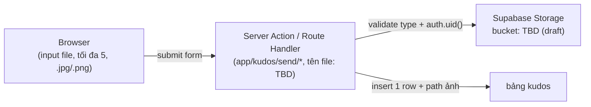

# Architecture — Delta: Gửi lời chúc Kudos (`/kudos/send`)

> **Bản nháp forward-author (Stage 1.5, takumi).** Đây là DELTA nối vào
> `docs/vi/system/architecture.md` hiện có — không phải bản viết lại toàn bộ tài liệu đó.
> Được promote khi implement bắt đầu, rồi RECONCILE về as-built bởi pha Core hậu-forge.
> Trigger: tính năng này thêm service/layer/data-store mới (persistence + storage) —
> theo Trigger Mapping của `subagent-patterns.md` § Documentation.

**Nguồn**: `plans/260824-0912-send-kudos-wishes/clarifications.md` (8 quyết định, Session
2026-08-24) + `evidence/study-context.json`. MoMorph: fileKey `9ypp4enmFmdK3YAFJLIu6C`,
screenId `JsTvi8KVQA` (hành vi thật lấy từ component `ihQ26W78P2`, xem clarifications.md).

## 1. Tầng persistence mới — LẦN ĐẦU TIÊN app có bảng riêng

`docs/vi/generated/entities.md` hiện ghi "Total Entities: 1 (`MODEL001_Award`)" và mô tả
đúng một persistence tier không do app sở hữu: `auth.users` của Supabase Auth (Supabase tự
quản schema đó, app không viết migration nào cho nó — xem file đó § Supabase Session).
Tính năng này thêm tier THỨ HAI, lần đầu do chính app định nghĩa:

| Đối tượng | Loại | Vai trò | Mã |
|---|---|---|---|
| `profiles` | Bảng Postgres (migration mới) | Danh sách Sunner hợp lệ để chọn làm người nhận; seed từ tên đã transcribe sẵn trong `lib/kudos/` | TBD (draft) — mã `MODEL###` chưa được cấp |
| `hashtags` | Bảng Postgres (migration mới) | 8 giá trị hashtag cố định (bao gồm `#High-perorming` seed verbatim, giữ nguyên lỗi chính tả theo clarifications.md), FK từ `kudos` | TBD (draft) |
| `kudos` | Bảng Postgres (migration mới) | Một hàng mỗi lần gửi thành công; `sender` suy từ `auth.uid()` (không nhận từ input client), FK tới `profiles` (recipient) và `hashtags` (1–5 hàng liên kết) | TBD (draft) |
| Bucket ảnh kudos | Supabase Storage bucket mới | Lưu file `.jpg`/`.png` đính kèm; `kudos` row lưu path, không lưu binary | TBD (draft) |

Việc cấp mã `MODEL###` thật (và ghi vào `docs/generated/entities.md`/`data-model.md`) diễn
ra ở bước reconcile của pha Core hậu-forge — không phải ở bản nháp này. Không mã nào ở trên
là số bịa; tất cả giữ nguyên `TBD (draft)` theo đúng quy tắc "NEVER fabricate codes".

## 2. Hai tầng dữ liệu song song — một seam có chủ đích, không phải khiếm khuyết

Quyết định 1 trong clarifications.md dựng nên trạng thái sau, ghi lại ở đây làm hệ quả kiến
trúc thay vì để nó ẩn trong lịch sử quyết định:

- Toàn bộ mặt đọc hiện có của app (`/`, `/awards`, `/kudos`, `/profile`, `/admin`) tiếp tục
  đọc y nguyên các static module trong `lib/` — không đổi file, không đổi hành vi.
- `/kudos/send` là đường ghi DUY NHẤT vào 3 bảng Supabase mới ở lượt này. Trang có thể đọc
  lại CHÍNH bản ghi nó vừa tạo (id trả về sau insert) để dựng trạng thái thành công — không
  đọc lại toàn bảng để hiển thị danh sách.
- `/kudos` (board) KHÔNG được rewire sang đọc bảng mới ở lượt này — nó vẫn 100% static data.
  **Hệ quả trực tiếp, đã biết trước**: một kudos gửi từ `/kudos/send` sẽ KHÔNG xuất hiện ở
  highlight carousel, spotlight cloud, leaderboard, hay feed "ALL KUDOS" của `/kudos`. Kiểm
  chứng một submission chỉ làm được qua truy vấn DB trực tiếp (`psql`/Supabase Studio) hoặc
  qua chính response/redirect của lần submit đó.
- Rewire `/kudos` sang đọc bảng mới là "Next Steps" đã ghi rõ trong clarifications.md —
  KHÔNG thuộc phạm vi lượt này, và không nên bị coi là một việc "quên làm".

## 3. Migrations trở thành mối quan tâm thật — lần đầu tiên

`supabase/config.toml` đã sẵn `[db.migrations] enabled = true` và
`[db.seed] sql_paths = ["./seed.sql"]` từ trước lượt này — nhưng thư mục
`supabase/migrations/` **chưa tồn tại** (xác nhận trực tiếp bằng `ls`, không suy đoán).
`supabase/seed.sql` hiện tại chỉ seed một user cho fixture e2e đăng nhập
(`e2e-login@example.com`), idempotent qua `on conflict (id) do nothing`.

Lượt này là lần đầu:
- `supabase/migrations/*.sql` được tạo — DDL cho `profiles`, `hashtags`, `kudos`, RLS
  policies (chi tiết ở `permissions.md`), và bucket + bucket policies.
- `supabase/seed.sql` mở rộng — thêm seed `profiles` (tên Sunner thật, đã có sẵn trong
  `lib/kudos/`) và 8 hàng `hashtags` cố định. Phải giữ tính idempotent như dòng seed hiện
  có, vì file này chạy lại ở mỗi `supabase db reset` và được `[db.seed] enabled = true`
  nạp lại tự động.

Không có mã `BL###` nào được cấp cho DDL/seed tĩnh này — đây không phải business logic
runtime theo định nghĩa hiện có trong `docs/vi/generated/behavior-logic.md`.

## 4. Đường tải ảnh lên (browser → server → Storage)

- Kiểu file chấp nhận: `.jpg`/`.png` (test case ID-21, ID-22). Từ chối `.pdf`/`.mp4`/`.txt`
  với lỗi định dạng (ID-23, ID-24, ID-55). Validate cả ở client (UX tức thời) LẪN server
  (an toàn thật — validate client luôn vượt qua được bằng DevTools hoặc gọi thẳng API).
- Không byte-size cap nào được spec hoá (clarifications.md § Unresolved #4) — một giới hạn
  thực dụng, nếu có, là quyết định ở bước implement, không phải một fact rút ra từ design.
- Ảnh upload tại thời điểm Gửi (không có luồng upload-nháp trước khi bấm nút) — khớp với
  việc nút Gửi bị disable cho tới khi toàn bộ trường bắt buộc hợp lệ (H.2), nên không tồn
  tại trạng thái "đã upload ảnh nhưng submit dở dang".
- Tên bucket, tên migration, tên route/server-action thật: TBD (draft) — chưa viết code.
  Không có `**Source:** path:N-M` nào được trích ở tài liệu này cho code chưa tồn tại,
  theo đúng Minimal-Spec Rule của contract.

## Tech Stack — bổ sung so với bảng hiện có trong `docs/vi/system/architecture.md`

| Layer | Technology | Version | Ghi chú |
|---|---|---|---|
| Database (app-owned) | Postgres qua Supabase migrations | Supabase CLI local (Docker), `major_version = 17` (`supabase/config.toml`) | LẦN ĐẦU app viết migration — trước lượt này chỉ Supabase Auth tự quản `auth.users`, app không đụng vào |
| Object storage | Supabase Storage | `storage.enabled = true`, `file_size_limit = "50MiB"` (giới hạn của server, không phải giới hạn ứng dụng — xem § 4 ở trên) | LẦN ĐẦU dùng; bucket + policies cụ thể: TBD (draft) |

## Unresolved / out of scope cho delta này

- Tên bucket, tên file migration, tên route/server-action thật: TBD (draft) — quyết định ở
  bước implement, không phải ở bản nháp system-level này.
- Không có giới hạn dung lượng byte cho ảnh đính kèm — xem clarifications.md § Unresolved #4.
- Rewire `/kudos` board sang đọc bảng mới: ngoài phạm vi lượt này (clarifications.md
  § Next Steps) — xem § 2 ở trên.
- Rationale đầy đủ cho các quyết định kiến trúc trên (vì sao write-only thay vì rewire ngay,
  vì sao seed cố định thay vì free-text/dynamic) thuộc về một ADR — bản nháp này KHÔNG chứa
  rationale, chỉ chứa quyết định + hệ quả, theo đúng contract "Design RATIONALE goes in
  `docs/decisions/ADR-*.md`, NOT the draft". Chưa có ADR nào được viết cho tính năng này ở
  thời điểm forward-draft; một ADR có thể được thêm ở bước implement hoặc reconcile.
