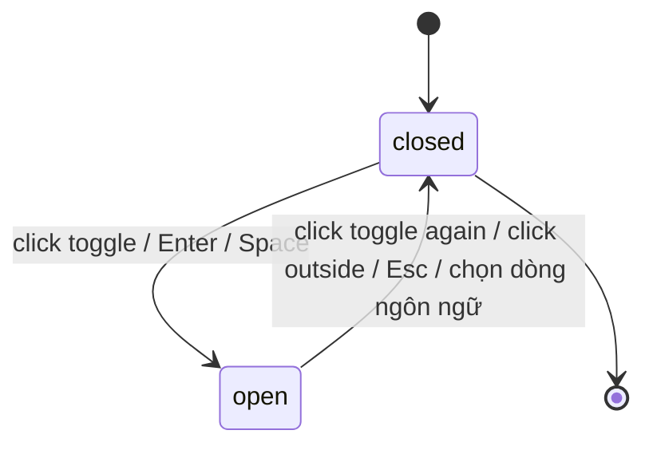

# F005_LanguageSwitching

## Overview

Đây là spec **revision thiết kế** cho tính năng chuyển ngôn ngữ VN/EN đã implement và đã test xanh (không phải xây mới). Mục tiêu: đưa phần trình bày (panel, dòng menu, icon cờ, trạng thái chọn, trigger) khớp với thiết kế MoMorph frame `Dropdown-ngôn ngữ` (`hUyaaugye2` / node `721:4942`, file `9ypp4enmFmdK3YAFJLIu6C`, revision `33b849680cdef15298c122effb920fd4`).

**KHÔNG đổi trong revision này:**
- Hành vi mở/đóng dropdown dùng chung (SM-001): toggle, click-outside, Enter, Space, Esc — `components/ui/dropdown-menu.tsx`.
- Cơ chế chuyển locale (FR-002): 2 dictionary tĩnh `vi`/`en`, ghi `localStorage.saa.locale`, áp dụng lại copy toàn trang — `lib/i18n/locale-provider.tsx`.
- Đúng 2 locale `vi`/`en` (BR-006) — không thêm ngôn ngữ thứ 3.
- 3 dropdown khác dùng chung primitive (`account-menu.tsx`, `notification-bell.tsx`, `quick-action-widget.tsx`) — không có design reference nên KHÔNG bị restyle.
- Coverage E2E hiện có (`e2e/homepage-dropdown-menus.spec.ts`, ID-24/25/30-35/58) phải tiếp tục xanh.

**Đổi (trình bày + 1 asset thiếu):** panel chrome, kích thước/bo góc dòng, icon cờ 20×15 cạnh label (VN + EN — EN hiện chưa có), nền dòng đang chọn, typography label, và trigger đồng bộ với dòng + có cờ khi locale=en.

## Polymorphic Behavior

Không áp dụng — tính năng này không có nhánh hiển thị theo vai trò (`guest`/`user`/`admin`); dropdown ngôn ngữ hiển thị giống nhau cho mọi role, kể cả trên header trang chủ lẫn header trang login.

## Cross-Cutting Logic
### Requirements

| Code | Description | Endpoint/Handler | Verifiable |
|------|-------------|------------------|------------|
| FR-001 *(giữ nguyên)* | Toggle mở/đóng, click-outside đóng, Enter/Space mở, Esc đóng — không đổi trong revision này | `components/ui/dropdown-menu.tsx:41-115` | yes — `e2e/homepage-dropdown-menus.spec.ts` |
| FR-002 *(giữ nguyên)* | Cơ chế đổi locale vi/en qua 2 dictionary tĩnh, lưu `localStorage.saa.locale` — không đổi | `lib/i18n/locale-provider.tsx:47-75` | yes — `e2e/homepage-dropdown-menus.spec.ts` |
| FR-020 | Panel mở của `LanguageSwitcher`: nền `#00070C`, viền `1px solid #998C5F`, `border-radius: 8px`, `padding: 6px` — áp dụng CHỈ cho language switcher qua prop `menuClassName` mới trên `DropdownMenu` | `components/ui/dropdown-menu.tsx` (prop mới), `components/ui/language-switcher.tsx` | yes |
| FR-021 | Mỗi dòng trong panel: `110×56px`, `border-radius: 2px`, nội dung (icon+label) căn giữa quang học trong dòng, `gap: 4px` giữa icon và label | `components/ui/language-switcher.tsx` | yes |
| FR-022 | Icon cờ `20×15px` cạnh label — ở CẢ mỗi dòng lẫn trigger: VN dùng `/saa/Flag_VN.svg` (đã có), EN dùng `/saa/Flag_EN.svg` (mới, hand-author Union Flag cùng viewBox/bảng màu với `Flag_VN.svg`) | `components/ui/language-switcher.tsx`, `public/saa/Flag_EN.svg` (file mới) | yes |
| FR-023 | Dòng đang chọn có nền `rgba(255,234,158,0.2)` — bổ sung style thật, thay vì chỉ dựa vào `aria-current` (không kèm style) như hiện tại | `components/ui/language-switcher.tsx` | yes |
| FR-024 | Hover dòng đổi nền sang `rgba(255,234,158,0.1)` (token `--secondary-button-bg` có sẵn) — [ASSUMPTION, xem `## Assumptions`] | `components/ui/language-switcher.tsx`, `app/globals.css:27` | yes |
| FR-025 | Label mỗi dòng: Montserrat 700, `font-size: 16px`, `line-height: 24px`, `letter-spacing: 0.15px`, màu `#FFFFFF`, `text-align: center` | `components/ui/language-switcher.tsx` | yes |
| FR-026 | Trigger (nút đóng/mở) đồng bộ bảng màu/kiểu chữ với dòng, và hiện cờ Union Flag khi `locale === 'en'` (hiện tại trigger EN không có cờ nào) | `components/ui/language-switcher.tsx:24-50` | yes |

**Source:** giá trị thiết kế lấy từ `plans/260826-0932-language-dropdown/design/momorph-hUyaaugye2-node-values.md` (authoritative, từ `get_node`, không giá trị nào bị đoán). FR-020/FR-021 → mục "A — mms_A_Dropdown-List" và "Row content" (dòng 10-48). FR-022 → mục "Icon slot" (dòng 50-57). FR-023 → mục "A.1 — selected row" (dòng 21-28). FR-025 → mục "Label" (dòng 59-70).

### Business Rules

#### BR-006_ChiVNvaEN *(giữ nguyên)*
**Linked FR:** FR-002
**Source:** `components/ui/language-switcher.tsx:14-17`
**Applies to:** Menu chọn ngôn ngữ
**Rule:** Chỉ có đúng 2 lựa chọn VN và EN, không thêm ngôn ngữ khác cho đến khi có yêu cầu mở rộng — không đổi trong revision này.

#### BR-009_DongChonPhaiPhanBiet
**Linked FR:** FR-023
**Source:** `design/momorph-hUyaaugye2-node-values.md` § A.1 (dòng 21-28)
**Applies to:** Dòng đang chọn trong menu ngôn ngữ
**Rule:** Dòng đang chọn phải có nền phân biệt trực quan với dòng chưa chọn (`rgba(255,234,158,0.2)`) — không chỉ dựa vào `aria-current` (thuộc tính a11y không kèm style).

#### BR-010_CoTriggerKhopLocale
**Linked FR:** FR-022, FR-026
**Source:** `design/momorph-hUyaaugye2-node-values.md` § Icon slot (dòng 50-57)
**Applies to:** Trigger đóng/mở của `LanguageSwitcher`
**Rule:** Cờ hiển thị trên trigger phải khớp với locale đang active — cờ VN khi `locale === 'vi'`, Union Flag khi `locale === 'en'`.

### Decision Logic

Không áp dụng — không có logic rẽ nhánh đa điều kiện. Duy nhất một điều kiện đơn trường (dòng nào là dòng đang chọn: `option.code === locale`), không đạt ngưỡng interaction/flow của DEC — giống kết luận đã ghi trong `docs/vi/features/homepage-saa/technical-spec.md` § Decision Logic.

### State Machines

#### SM-001_TrangThaiDropdown *(giữ nguyên, dùng chung)*
**kind:** ui
**Linked FR:** FR-001
**Source:** `components/ui/dropdown-menu.tsx:41-115`
**States:** closed, open



**Transition đặc thù F005:** `open → closed` khi chọn dòng VN/EN có side effect `setLocale(code)` → `localStorage.setItem('saa.locale', code)` (`lib/i18n/locale-provider.tsx:63-66`, kích hoạt từ `components/ui/language-switcher.tsx:59-62`). Hành vi này ĐÃ tồn tại và đã test xanh — liệt kê lại ở đây để mô hình trạng thái của F005 đầy đủ, không phải thay đổi mới.

### Algorithms

Không có — không có thuật toán tính toán nào trong tính năng này (chỉ là lookup 2 dictionary tĩnh theo key `locale`).

### External Integrations

Không có — không gọi API/dịch vụ bên thứ ba nào (chỉ đọc/ghi `localStorage` phía client).

### Verification

Test policy: **`e2e-red-first`** (đã chọn trong `clarifications.md` — specs mô tả state transition "Click: mở/đóng menu", "Chọn 'EN'/'VN': cập nhật và đóng menu", dự án có sẵn runner `@playwright/test`).

- **SC-005** *(giữ nguyên, đã xanh)* — Dropdown ngôn ngữ tuân theo SM-001 (toggle, click-outside, Enter, Space, Esc) — `e2e/homepage-dropdown-menus.spec.ts`.
- **SC-006** — Panel/dòng/trigger của `LanguageSwitcher` khớp giá trị thiết kế (FR-020..FR-026): panel chrome, kích thước dòng, icon cờ VN+EN, nền dòng chọn, typography label, cờ trên trigger khi `en` — RED-first: viết assertion mới trong `e2e/homepage-dropdown-menus.spec.ts` (hoặc file cạnh đó) trước khi sửa code, chạy RED thật, rồi implement tới GREEN.

**Lệnh thực thi:** `npm run test:e2e` (Playwright), `npm run lint` (ESLint), `npm run build` (`next build`, bắt lỗi type/compile).

**Client behavior:** see behavior-logic.md, permissions.md, screen-flow.md

## User Stories

Feature này map với **`US010_SwitchInterfaceLanguage`** (`docs/vi/generated/user-stories.md:424-459`) — không tạo user story mới. 4 acceptance criteria gốc (mở dropdown chọn VN/EN, đổi copy toàn trang + đóng dropdown, persist `localStorage.saa.locale`, `aria-current="true"` trên mục đang chọn) giữ nguyên và đã có coverage E2E xanh. Revision này chỉ bổ sung yêu cầu trình bày (FR-020..FR-026, BR-009, BR-010 ở trên) cho cùng user story — không phải AC hành vi mới.

### Edge Cases

See edge-cases.md.

## Key Entities

| Entity | Kiểu | Cấu trúc | Nguồn |
|---|---|---|---|
| `Locale` | union type | `'vi' \| 'en'` | `lib/i18n/locale-provider.tsx:11` |
| Dictionary record | `Record<DictionaryKey, string>` | 2 instance `vi`/`en`, cùng khoá `language.optionVi`/`language.optionEn` cho label dòng | `lib/i18n/dictionaries/vi.ts:20-21`, `lib/i18n/dictionaries/en.ts:9-10` |
| `saa.locale` | `localStorage` key | string, giá trị hợp lệ `'vi'` \| `'en'` (kiểm bằng `isLocale`) | `lib/i18n/locale-provider.tsx:19,24-26,30-31` |

## Artifact References

- Design values (authoritative, từ `get_node`): `plans/260826-0932-language-dropdown/design/momorph-hUyaaugye2-node-values.md`
- Specs CSV (MoMorph, 3 dòng A/A.1/A.2): `plans/260826-0932-language-dropdown/design/momorph-hUyaaugye2-specs.csv`
- Quyết định đã chốt với user: `plans/260826-0932-language-dropdown/clarifications.md`
- User story gốc: `docs/vi/generated/user-stories.md:424-459` (`US010_SwitchInterfaceLanguage`)
- Spec kỹ thuật gộp hiện có (nơi FR-002/BR-006/SM-001 được định nghĩa lần đầu): `docs/vi/features/homepage-saa/technical-spec.md`

## Assumptions

- **Màu hover.** Specs yêu cầu "hover hiển thị highlight" nhưng không có variant Figma nào ghi giá trị hover. Dùng token có sẵn `--secondary-button-bg` (`rgba(255,234,158,0.1)` — đúng bằng phân nửa alpha của nền dòng chọn `0.2`) để hover đọc như một bậc nhạt hơn của cùng highlight. Xem lại nếu thiết kế sau này công bố variant hover riêng.
- **Token màu dòng chọn.** `rgba(255,234,158,0.2)` chưa tồn tại trong `app/globals.css`; thêm thành token mới thay vì hard-code inline, khớp cách mọi màu thiết kế khác trong dự án được xử lý.

## Source Code References

| Order | File:Lines | Vai trò |
|---|---|---|
| 1 | `lib/i18n/locale-provider.tsx:11-79` | `Locale` type, `LOCALE_STORAGE_KEY`, cơ chế persist — không đổi |
| 2 | `lib/i18n/dictionaries/vi.ts:20-21`, `lib/i18n/dictionaries/en.ts:9-10` | Nhãn `VN`/`EN` hiện có |
| 3 | `components/ui/dropdown-menu.tsx:31-115` | Primitive SM-001 dùng chung — cần thêm prop `menuClassName` |
| 4 | `components/ui/language-switcher.tsx:1-73` | Component chính bị sửa: thêm flag mỗi dòng, nền dòng chọn, trigger đồng bộ + cờ EN |
| 5 | `public/saa/Flag_VN.svg:1-18` | Mẫu viewBox/palette để hand-author `Flag_EN.svg` |
| 6 | `app/globals.css:20-50` | Token màu hiện có (`--secondary-button-bg`, `--border-accent`, `--header-bg`) + nơi thêm token nền dòng chọn mới |
| 7 | `components/login/login-header.tsx:1-24` | Nơi render thứ 2 của `LanguageSwitcher` (header trang login) |
| 8 | `components/layout/site-header.tsx:16,70` | Nơi render chính trên `SCR001_Home` |
| 9 | `e2e/homepage-dropdown-menus.spec.ts:1-101` | Coverage hành vi hiện có phải giữ xanh; nơi thêm assertion RED mới cho phần visual |

## Unresolved Questions

- ~~Khoảng cách dọc giữa 2 dòng trong panel~~ — **ĐÃ GIẢI QUYẾT.** `get_node` trả về toạ độ trực tiếp: A.1 `startY: 96 → endY: 152`, A.2 `startY: 152 → endY: 208`. Hai dòng liền kề nhau, mép dưới A.1 trùng mép trên A.2 → **gap = `0px`**, xác nhận từ dữ liệu chứ không phải suy ra. Container panel không đặt `gap`.
- `node-values.md` chỉ ghi `border-radius: 8px` chung cho panel A, không có biến thể riêng khi panel đang mở animation hoặc khi hover panel (ngoài hover từng dòng) — không có giá trị nào khác để dùng, giữ nguyên `8px` cho mọi trạng thái panel.

## Source Walkthrough

Thứ tự đọc để hiểu đủ bối cảnh trước khi sửa code:

1. **File:** `lib/i18n/locale-provider.tsx:11-79` — hiểu `Locale`, cách persist `localStorage` (không đổi trong revision này, nhưng là nền cho mọi phần khác).
2. **File:** `lib/i18n/dictionaries/vi.ts:20-21` và `lib/i18n/dictionaries/en.ts:9-10` — 2 khoá copy dùng cho label mỗi dòng.
3. **File:** `components/ui/dropdown-menu.tsx:31-115` — primitive SM-001 dùng chung; đọc để biết chỗ thêm `menuClassName` mà không phá 3 dropdown khác.
4. **File:** `components/ui/language-switcher.tsx:1-73` — component chính cần sửa: cấu trúc `options`, render trigger, render mỗi dòng.
5. **File:** `public/saa/Flag_VN.svg:1-18` — mẫu geometry/viewBox/palette bắt buộc phải khớp khi hand-author `Flag_EN.svg`.
6. **File:** `app/globals.css:20-50` — nơi các token màu hiện có được khai báo, và nơi thêm token nền dòng chọn mới.

### Call Hierarchy

```text
site-header.tsx (SCR001_Home) hoặc login-header.tsx (/login)
  -> LanguageSwitcher
    -> DropdownMenu (render prop trigger + render prop children, SM-001)
      -> click dòng VN/EN
        -> setLocale(code)  [lib/i18n/locale-provider.tsx]
          -> localStorage.setItem('saa.locale', code)
          -> re-render toàn trang qua useI18n().t(key)
        -> close()  [đóng dropdown, side effect của SM-001]
```

**Related files:** see `## Source Code References` above (Order column added there — F15 DRY, one table not two).

## DB Impact per Event

Không có sự kiện nào của tính năng này ghi vào cơ sở dữ liệu — toàn bộ trạng thái chỉ nằm ở `localStorage` phía client, không có backend/API nào tham gia.

| Event/Endpoint | Table | Columns | Operation | Value Derivation | Source |
|-----------------|-------|---------|-----------|-------------------|--------|
| Chọn ngôn ngữ (click dòng VN/EN) | không có | không có | không có | Không ghi CSDL — chỉ ghi `localStorage` (`saa.locale`) phía client | `lib/i18n/locale-provider.tsx:63-66` |
